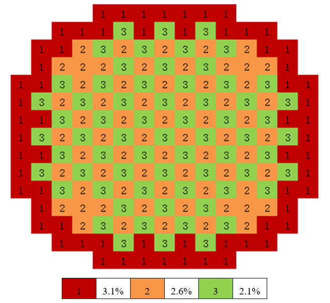

.. _section_eng_burnup:

Burnup Calculations
====================

.. _section_eng_burn_intro:

Overview of Monte Carlo Burnup Calculation
------------------------------------------

The Burnup Calculation is an integrated coupling of Monte Carlo criticality calculation and depletion calculation. 
Traditional Monte Carlo burnup programs (such as MCBurn, MCODE) generally use third-party interfaces, employing external 
coupling to iteratively call Monte Carlo transport codes (such as MCNP) and point burnup codes (such as ORIGEN-2).

In the RMC code, there is an embedded, independently developed point burnup calculation module called DEPTH.
DEPTH uses the matrix exponential method, capable of accurately and efficiently handling detailed burnup chains
involving approximately 1,500 nuclides. The basic process of RMC burnup calculation is as follows: first,
the criticality calculation (continuous energy) module obtains data such as neutron flux and single-group reaction
cross-sections, which are then passed to the DEPTH module; DEPTH completes the point burnup calculation and provides
updated nuclide densities, which are then passed back to the RMC criticality calculation module. This back-and-forth data
transfer completes the entire burnup calculation process.

Compared to traditional Monte Carlo burnup programs (such as MCBurn and MCODE), the RMC burnup calculation has the following key features:

(1)It includes an internally coupled burnup calculation module capable of handling detailed burnup chains with approximately 
1,500 nuclides. It integrates the latest point burnup databases from ORIGEN-S and ORIGEN-2.

(2)It supports burnup calculations for structures with repetitive components without requiring users to specify different initial 
materials for each burnup region, significantly reducing user input.

(3)It supports "parallel criticality + parallel point burnup" calculations for large-scale burnup regions. In parallel point burnup 
calculation mode, burnup regions are evenly distributed across multiple processes, each independently completing the point burnup calculation.

.. _section_eng_burn_cards:

Burnup Module Input Card
-------------------------

Burnup Module Input Card includes the following:

.. code-block:: none

    BURNUP
    BurnCell < cell_1 cell_2 cell_3 ... >
    ActivationCell < cell_1 cell_2 cell_3 ... >
    TimeStep <time_1 time_2 ... time_n>
    BurnupStep <burnup_1 burnup_2 ... burnup_n>
    Power <power_1 power_2 ... power_n>
    PowerDen <powerden_1 powerden_2 ... powerden_n>
    SourceIntensity <source_1 source_2 ... source_n>
    SubStep <sub_num>
    Inherent <fraction>
    AceLib <lib_1 lib_2 ... lib_n>
    DepthLib <lib_path>
    Strategy [type=<flag>] [substep=<flag>]
    Normalization [mode=<flag>] [nuclide=<nuc_1 nuc_2 ... nuc_n>] 
                  [fissionq=q_1 q_2 ... q_n] [captureq=q_1 q_2 ... q_n]
                  [mattally=mat_1 mat_2 ... mat_n]
    Solver <flag>
    Parallel <flag>
    DepleteMode <flag>
    Xeequilibrium [Skip = <params>] [Batchsize = <params>] [Powermode = <params>] [Minratio = <params>]
    OutputCell <cell_vector>
    VaryMat <step = s1 mat = m1_1 m1_2 ... m1_n newmat = new1_1 new1_2 ... new1_n
             step = s2 mat = m2_1 m2_2 ... m2_n newmat = new2_1 new2_2 ... new2_n
             ...>
    VarySurf <step = s1 surf = s1_1 s1_2 ... s1_n newsurf = news1_1 news1_2 ... news1_n
             step = s2 surf = s2_1 s2_2 ... s2_n newsurf = news2_1 news2_2 ... news2_n
             ...>
    MERGE <level=l> <univ=u_1 u_2 ...>
    SUCCESSION [Singlestep = <flag>] [ReadNuc = <flag>] [WriteNuc = <flag>]
               [FMF = <param>] [CumulativeTime = <param>] [CumulativeBurnup = <param>]
               [CellCmltvBurnup = <flag>]
    NAECF <energy>
    IMPNUC < nuc_1 nuc_2 ... nuc_n>
    FIXEDNUC <nuc_num>
    Reactions <nuclide=nuc1 mts=mt_1 mt_2 ... mt_n
              nuclide=nuc2 mts=mt_1 mt_2 ... mt_n
              ...>
    DecaySource  [Type=<flag>]  [Cell=<cell_1 cell_2 ... cell_n>]  [Energy= e_1 e_2 ... e_n]  
                 [SecondSourceStartStep=<step_1 step_2 ... step_n>]    
    DecayData  [radioactivity=<flag>] [decayheat=<flag>] [Cell=<cell_1 cell_2 ... cell_n>]
    SU <Maxnuc = s1>

Among them,

-  **BURNUP** \  is the keyword for the burnup module.

-  **BurnCell** \  option specifies the burnable cells.
   \ *The option parameter is a simple cell number cell_i (not a vector form of hierarchical cells)*\ .
   The module will automatically search for all bottom-level cells with cell_i as the cell vector and treat them as independent burnup zones. 
   Each burnable cell will automatically generate independent filling materials, even if their initial materials are the same. 
   The function of automatically expanding independent burnup zones is essential for burnup calculations containing repetitive structures, 
   significantly reducing the user's input burden. By default, burnable cells use constant power mode for burnup calculations.

-  **ActivationCell** \  option specifies activation cells. The real neutron flux of activation cells is calculated through the power distribution 
   process of the burnup and uses constant flux mode for irradiation calculations.

-  **TimeStep** \  option specifies the time step length for each burnup step (days). Note that the option here is stepwise time, not cumulative time.

-  **BurnupStep** \  option specifies the burnup depth for each burnup step (MWd/tU). Note that the option here is the burnup depth for each step, 
   not the cumulative burnup depth. The BurnupStep option cannot be used simultaneously with the TimeStep option card.

-  **Power** \  option specifies the total power for each burnup step (MW). Note that the Power option card cannot be used simultaneously with 
   the PowerDen option card.

-  **PowerDen** \  option specifies the total power density for each burnup step (W/gHM). The module will calculate the actual total power based on the 
   initial heavy metal mass and obtain the actual power for each burnup cell based on the power distribution for each burnup step. 
   To calculate the initial heavy metal mass and power distribution, users should specify the correct volume for burnable cells.

-  **SourceIntensity** \  option specifies the neutron source intensity for each burnup step (n/cm²s). The module will calculate the 
   actual neutron flux for each burnup cell under this source intensity according to the neutron flux distribution from Monte Carlo statistics and 
   perform constant flux irradiation calculations.

-  **SubStep** \  option specifies the number of sub-steps for point burnup calculations (range 1-9999), with a default value of 10 sub-steps. 
   It is generally not recommended for ordinary users to modify this default parameter.

-  **Inherent** \  option specifies the absorption fraction and mass fraction for inheriting important nuclides, with default values of 0.9999 and 0.999, 
   respectively. Point burnup calculations need to handle about 1500 nuclides, but critical calculations can (and only need to) inherit a part of these 
   important nuclides. The inheritance method is: first, the nuclides input in the material card are always inherited; then, the remaining nuclides are 
   inherited from high to low according to their proportion in the total absorption rate and total mass until the total fraction of inherited nuclides 
   reaches the user-specified fraction. If users need to pay special attention to certain important nuclides, it is recommended to write them in the material 
   card to ensure these nuclides are always inherited. The more nuclides inherited, the more accurate the calculation results will be, but it will also 
   consume more time and memory. Note that if only one number is input, it is considered the absorption fraction. The input value should be between 0.9 and 1.0.

-  **AceLib** \  option specifies the database used for inherited nuclides at each burnup step, such as "AceLib = .30c .71c ...". For nuclides input in the material card, 
   the original database is inherited. To ensure the accuracy of burnup calculations, users should specify the ACE database that matches the cell temperature 
   and ensure that the database at that temperature point contains a complete list of nuclides. During calculations, new nuclides generated during burnup 
   will only be added to the cell material and used for the next transport calculation if there is corresponding data in the ACE database; otherwise, 
   they will be filtered out. In burnup calculations with temperature changes across burnup steps, users specify the temperature of the burnup cells for 
   each burnup step through this option card. Note: Considering that N burnup steps correspond to N+1 state points, the number of temperature points input 
   needs to be one more than the number of burnup steps.

-  **DepthLib** \  option specifies the absolute path of the burnup database used for burnup calculations.

-  **Strategy** \  is the keyword for specifies the neutronics-depletion coupling scheme.

   -  **Type** \  option specifies the type of neutronics-depletion coupling scheme.\ **Type = 0** \  (default value) indicates the use of the BOS(Beginning of Step) coupling scheme.
      \ **Type = 1** \  indicates the use of the PC-N predictor-corrector coupling scheme based on nuclide density in burnup calculations.
      \ **Type = 2** \  indicates the use of the PC-RR predictor-corrector coupling scheme based on Reaction Rate(neutron flux and single-group cross-section)of each nuclide 
      in each burnup cell during burnup calculations. This method is similar in effect to Type = 1 but has different correction parameters.
      \ **Type = 3** \  indicates the use of the high-order predictor-corrector coupling scheme(H-PC). This coupling scheme can be combined with sub-step methods to form a high-order 
      sub-step method(HSPC), usually providing good calculation accuracy with a larger burnup step and improving burnup calculation efficiency.
      \ **Type = 4** \  indicates the use of an extended predictor-corrector coupling scheme(E-PC), an improved version of the predictor-corrector coupling scheme with higher calculation 
      accuracy under similar calculation efficiency.
      \ **Type = 5** \  indicates the use of the explicit linear sub-step method(ELS). This method combines the advantages of multiple coupling schemes and has good calculation accuracy. 
      This method will automatically invoke the sub-step method.
      \ **Type = 6** \  indicates the use of the implicit linear sub-step method(ILS), which is a coupling scheme based on the implicit Euler method. It can significantly improve the 
      numerical stability of the calculation results and has high calculation accuracy. This method will automatically invoke the sub-step method.

   -  **Substep** \  specifies whether to use the sub-step method. \ **Substep = 0** \  (default value) indicates not to use the sub-step method.
      \ **Substep = 1** \  indicates the use of the sub-step method.
   
   -  **SubstepNumber** \  specifies the number of sub-steps to use when the sub-step method is employed (range 2 - 100), with a default of 10. Based on theory and experience, 
      it is recommended to use 10 sub-steps \ **SubstepNumber = 10** \  ,which can achieve good accuracy while considering calculation efficiency. It is also recommended to combine this 
      with the high-order predictor-corrector coupling scheme \ **Type = 3** \   to form a high-order sub-step method(HSPC).
      
   -  **InnerIterNumber** \  specifies the number of inner iterations for correction steps when using the implicit linear sub-step method(ILS) (range 2 - 10), with a default of 2. 
      This option must be used in combination with \ **Type = 6** \  scheme, and increasing the number of inner iterations can improve numerical stability.

-  **Normalization** \  specifies the power normalization process in burnup calculation.

   -  **mode** \  specifies the power normalization mode.
      \ **mode = 0** \  (default) indicates the use of user-defined nuclide - fission energy - capture energy.
      \ **mode = 1** \   indicates the use of fission energy and capture energy from the ENDF evaluated nuclear database for power normalization.
      \ **mode = 2** \  indicates the use of energy deposition tallies from the transport process for power normalization.

   -  **nuclide** \  specifies user-defined nuclide index, using the nuclide indexes from the burnup module, such as 922350 (U235), 922351 (U235m1), etc.

   -  **fissionq** \  specifies the fission energy corresponding to user-defined nuclides, in units of MeV.

   -  **captureq** \  specifies the capture energy corresponding to user-defined nuclides, in units of MeV.

   -  **mattally** \  specifies the consideration of energy deposition in structural materials and moderators during power normalization. The user only needs to provide the corresponding 
      material ID, and the module will automatically create the corresponding material tallies.

   .. note:: When ``mode=0``, if the user does not define the fission and capture energies for a nuclide via the ``nuclide``, ``fissionq``, and ``captureq`` options, 
      the program uses the built-in defaults for power normalization. When the fission and capture energies of nuclides are customised by the user, the fission energy 
      of fissionable nuclides other than those already defined defaults to 200 MeV, and the capture energy defaults to 5 MeV.

   .. important:: The ``nuclide``, ``fissionq`` and ``captureq`` tabs are limited to ``mode=0``.
      The ``mattally`` tab is limited to use with ``mode=2``.

   .. caution:: Users defining the fission and capture energies of nuclides using the ``nuclide``, ``fissionq`` and ``captureq`` options need to ensure that the nuclides in the 
      three options correspond to each other, for example:

   .. code-block:: c
      
      Normalization mode=0 nuclide= 922350 922380 fissionq= 180 180 captureq= 5 5   

-  **Solver** \ specifies the method of solving the depletion equation. **Solver = 1** indicates Transmutation Trajectory Analysis(TTA), **Solver = 2** (default) indicates 
   the Chebyshev rational approximation method(CRAM), **Solver = 3** indicates the Quadrature Rational Approximation Method(QRAM), **Solver = 4** indicates the Laguerre 
   Polynomial Approximation Method(LPAM). For general users, it is recommended to use the default parameters.

-  **Parallel** \  specifies whether or not to use parallel burnup calculations during parallel critical calculations; this option is available only for the RMC parallel 
   version. \ **Parallel = 0** \  (default) indicates that parallel burnup calculations are not used, \ **Parallel = 1** \  indicates use of parallel burnup calculations.
   In parallel burnup calculation mode, the burnable zone is divided equally among the processes, each of which performs point burnup calculations independently. For large-scale
   burnup calculation (including large amount of burnable cells), the use of parallel burnup calculations significantly reduces the calculation time.

-   **Xeequilibrium** \  is the keyword for specifies the use of xenon equilibrium. The xenon equilibrium function is primarily used to address numerical xenon oscillation issues 
    in Monte Carlo burnup calculations. When using the xenon equilibrium function, it is recommended to divide the burnup regions into a sufficient number and to make reasonable and 
    relatively regular divisions of these regions.

   -  **Skip** \  specifies the number of generations before the xenon concentration begins updating.

   -  **Batchsize** \  specifies the number of generations period \ **L** \ for updating the xenon concentration. Xenon concentration is updated every \ **L** \ generation.
      The default value is 1 and automatically adjustable within the module.

   -  **Powermode** \  specifies the power mode. \ **Powermode = 1** \   (default) for constant power, \ **Powermode = 2** \  for variable power。

   -  **Minratio** \  specifies the minimum percentage of non-zero scores for the xenon-related tallies in the xenon equilibrium calculation.
      The xenon equilibrium batchsize is automatically adjusted according to this ratio, with the default value as 0.96 (0.96 is an empirical setting).

-  **Outputcell** \  is used to output the nuclide density of a specified cells in a file with the suffix ".den".
   In addition, the RMC will output the total atomic density by default, in a file with the suffix ".den_tot".

-  **VaryMat** \  used to replace the material of the specified burnup step in the burnup calculation.
   
   -  **step** \  option specifies the burnup step number of the material to be replaced, starting at 0. 

   -  **mat** \  option specifies the material number to be replaced. The user can enter more than one material number. 

   -  **newmat** \  option specifies the new material index to be replaced the previous material. The user can enter more than one material ID.
      The quantity of the new material needs to match the quantity of material entered in the \ **mat** \  option.
   
   The user can follow the above options and enter multiple sets of data to enable the specification of materials to be replaced for multiple burnup steps. For example:

   .. code-block:: c
      
       VaryMat step = 1 mat = 4 5 newmat = 21 31
               step = 2 mat = 4 5 newmat = 22 32
               step = 3 mat = 4 5 newmat = 23 33
               step = 4 mat = 4 5 newmat = 24 34

   Indicates that in the first step (burnup step starting from 0) materials 4 and 5 are replaced with materials 21 and 31 respectively.
   In second step materials 4 and 5 are replaced with materials 22 and 32 respectively. In thrid step materials 4 and 5 are replaced with materials 23 and 33 respectively.
   In step 4 materials 4 and 5 are replaced with materials 23 and 33 respectively.
   Note that information on the original material will be completely lost when it is replaced.

-  **VarySurf** \  is used to replace surface in a burnup calculation before the specified burnup step is calculated. For example, if step=1, 
   the module will change the surface at the end of the first burnup calculation. It is important to note that the surface change function should be used with care 
   and the user should make sure that the new surface is in the model to avoid missing particles due to non-closure of the model surface.
   
   -  **step** \  option specifies the burnup step number of the surface to be replaced, starting at 0.

   -  **surf** \  option specifies the surface to be replaced. User can specifies more than one surface.

   -  **newsurf** \  option specifies the number of the new surface to be replaced. The user can enter more than one surface index,
      The number of new surfaces needs to match the number of surfaces entered in the \ **surf** \  option. Also, it is important to note that the the parameters such as 
      the type of the new surface and the replaced surface need to be consistent.
   
   The user can follow the above options and enter multiple sets of data, thus enabling the specification of multiple faces to be replaced for multiple burnup steps. For example:

   .. code-block:: c
      
       VarySurf step = 1 surf = 4 5 newsurf = 21 31
                step = 2 surf = 4 5 newsurf = 22 32
                step = 3 surf = 4 5 newsurf = 23 33
                step = 4 surf = 4 5 newsurf = 24 34

   Indicates that in the first step (the burnup step starts from 0) the surfaces 4 and 5 are replaced with surfaces 21 and 31 respectively.
   In the second step surfaces 4 and 5 are replaced with surfaces 22 and 32 respectively.
   In the thrid step surfaces 4 and 5 are replaced with surfaces 23 and 33 respectively.
   In the fourth step surfaces 4 and 5 are replaced with surfaces 24 and 34 respectively.
   Note that the information on the original surfaces will be completely lost when it is replaced.

-  **MERGE** \  specifies the geometric level of the space <universe> where the burnup zone merge is to take place.
   and the space number <univ> that specifies the burnup zone merge to be performed.
   Note: "Universe 0" space corresponds to geometry level = 0, and so on. The burnup zone merge function can
   For ordinary pressurised water reactors and stochastic media models. the MERGE function can only merge multiple Universes of the same geometric level.

-  **DEPLETEMODE** \  is used to specify the mode of calculation of the burnup zone,\ **DEPLETEMODE = 0** \  indicates decay mode. \ **DEPLETEMODE = 1** \  for constant flux mode.
   \ **DEPLETEMODE = 2** \  (default) for constant power mode. Note that in the coupled transport-burnup-activation calculations, the burnup zone defaults 
   to use the constant power mode, and the activation zone defaults to use the constant flux mode.

-  **SUCCESSION** \  All options under this keyword are advanced options for controlling the burnup succession calculation, automatically generated by the RMC code, 
   or automatically processed by a script, manual input by the user is not recommended.

   -  **Singlestep** \  indicates whether only one \ **criticality +  burnup** \  calculation will be completed. This option is used for burnup succession calculation, when it is turned on,
      even if the user inputs multiple burnup steps, RMC will only complete the critical and depletion calculation of step 0. 

   -  **ReadNuc** \  is used to read the density of nuclides from the depletion calculation generated by the previous burnup step calculation. 
      0 indicates do not read (default value) and 1 indicates read. In the current version, only after the nuclide density of the depletion calculation of the previous burnup step has 
      been output to the **.State.h5** \  file (enabled by \ **Print** \  in \*inpfile** \ ), i.e., the function \ **WriteNuc** \  has been turned on in the previous step, 
      the current burnup step is able to read the relevant information.

   -  **WriteNuc** \  used to output the density of nuclides (all nuclides in the burnup database) generated by the current burnup step calculation to the .State.h5 file. 
      0 indicates not to output (default value), 1 indicates output. This function is only recommended to be enabled when the user needs to use the burnup succession calculation function and also 
      needs to read all the burnup nuclides. It should be noted that the current burnup succession function is not compatible with the refuelling function.

   -  **FMF** \  Flux (power) multiplication factor, equal to the actual power or Monte Carlo statistical energy deposition. Used in the succession calculation of fuel consumption when switching on 
      the xenon equilibrium model. This value is calculated by the RMC code when generating the succession calculation input card.

   -  **CUMULATIVETIME** \  used to calculate the burnup succession when the xenon equilibrium model is switched on, indicating the total time that has been burned before the current burnup step.
      This value is calculated by the RMC code when generating the succession calculation input card.

   -  **CUMULATIVEBURNUP** \   used for single-step burnup succession calculations to indicate the burnup depth that has been consumed prior to the current burnup step.
      This value is calculated by the RMC code when generating the succession calculation input card.

   -  **CELLCMLTVBURNUP** \  used in single-step burnup successive calculations to control the reading of burnup cell information output from the previous burnup step in the 
      inp.State.h5 file. 0 (default value) indicates do not read, 1 indicates read. This function is automatically controlled by the code in single cycle succession calculations. 
      It should be noted that there is a compatibility problem between the current burnup succession function and the refuelling function, so the user needs to manually set this option 
      in the succession file to 0 in the refuelling calculation.

-  **NAECF** \  is used to specify the neutron mean energy for all burnup cell. 0 (default) indicates that the neutron mean energy for all burnup cell uses the result of the 
   critical calculation tally. -1 indicates that the average neutron energy of all burnup call is forced to be 0.0253eV, -2 indicates that the average neutron energy of all burnup 
   cell is forced to be 2MeV, and -3 indicates that the average neutron energy of all burnup cell is 14MeV. If the value entered by the user is greater than 0, it means 
   that the average neutron energy of all burnup cell is the input specified by the user. Note: The average neutron energy is mainly used to adjust the fission product yield.

-  **IMPNUC** \  is used to select the nuclides for the burnup calculations during the coupling of the depletion calculations and the criticality calculations, the nuclide ID is the nuclide ID 
   for the burnup calculations, e.g., 922350, and all nuclides located in the card are forced to be select into the material for the criticality calculation.

-  **FIXEDNUC** \  is used to control the number of nuclides selected into the criticality calculation during the coupling of the depletion calculation and the criticality calculation. 
   During the selection process, the code will select the nuclides based on the absorption reaction rate or the nuclide density (refer to the \ **Inherent** \  card), which discards 
   the remaining nuclides after a specified number has been reached to increase the efficiency of the criticality calculation.    

-  **Reactions** \  indicates the reaction channels of certain nuclides which are required to score. In the burnup calculation, six reaction channel cross sections including (n,g), 
   (n,2n), (n,3n), (n,f), (n,a), (n,p) are scored by default, while in the activation calculation, due to the existence of more important reaction channels for certain nuclides, 
   such as the (n,t) reaction of Li6, the reaction of this kind of nuclide needs to be scored separately.

   - **Nuclide** \  indicates the nuclide index, e.g. 92235, 1001.

   - **Mts** \  indicates the reaction channel index, e.g. 18((n,f)), 102((n,g)), 103((n,p)), 105((n,t)), etc.

   The user can enter multiple nuclides and their corresponding reaction types according to the above options, thus realising the function of cross-section statistics for multiple 
   reaction channels of different nuclides. For example:

   .. code-block:: c
      
       Reactions nuclide=92235 mts=102 16 17 18
                 nuclide=3006  mts=102 16 107 103 105
   
   .. note:: The user-specified nuclides and reaction channels to be scored via the ``Reactions`` option apply to all burnup cells.
       As the number of reaction channels to be scored increases, the computation time of the code will increase accordingly, so it should be used with caution.

-  **DecaySource** \  indicates the decay source strength and energy spectrum to be scored, the results will be output to the .Result.h5 file.

   -  **Type** \  indicates the type of decay source to be counted, default is 1. At present, only the decay gamma spectrum is supported, i.e. type=1.

   -  **Cell** \  indicates the cell number, \ **the input parameter is a user-defined simple cell number cell_i, instead of the vector form of hierarchical cell** \ ,
      the programme will automatically expand and output the decay source spectrum and intensity of the corresponding cell according to the input number. It should be noted that the 
      cells set must be burnup cells or activation cells.

   -  **Energy** \  indicates the discrete energy in MeV, which is user-defined. 

     .. caution:: The user-defined discrete energy must be an increasing series, otherwise the calculation result will be wrong.

   -  **SecondSourceStartStep** \  indicates the burnup step at which the secondary source strength calculation is performed. The decay source in each cell at each burnup depth is scored, and  
      used as the initial source in the fixed source mode, and this module requires the user to additionally write the \ **FixedSource** \  control module to the criticality-depletion 
      Calculation Input card, as well as the required \ **Physics** \  card, and invoke the calculation through the python module, the code will generate the initial source in the fixed source 
      mode from the decay sources scored in the critical mode, and carry out the subsequent secondary source strength distribution calculation.

     .. important:: The C++ module does not support the reading of ``SecondSourceStartStep`` cards, so if you want to use the two-step method to calculate the secondary source strengths, 
      you have to use the python module of RMC.

   The user can follow the above options to score the decay sources and perform calculations such as secondary neutron source strengths by specifying a secondary fixed source calculation mode.

-  **DecayData**\  indicates the decay data that needs to be collected, supporting the statistics of radioactive activity and decay heat. The statistical results will be output to .Result.h5 file.

   - **Cell**\ refers to the lattice cell ID. \ *The input parameter is a user-defined simple lattice cell number cell_i (rather than the vector form of hierarchical cells).* \ .
     RMC will automatically expand and output the corresponding decay data for the specified cell number. It is important to note that the specified cell must be a burnup cell or an activation cell.

   - **Radioactivity**\ indicates the statistics for the radioactive activity of burnup/activation regions, measured in curies (Ci). The default value is 0 (indicating it is turned off). Setting 
     it to 1 means that the total radioactive activity for each burnup step in the cell will be collected, while setting it to 2 means that in addition to the total radioactive activity, the radioactive 
     activity for each nuclide will also be output.
   
   - **DecayHeat**\   indicates the statistics for decay heat data in burnup/activation regions, measured in watts (W). The default value is 0 (indicating it is turned off). Setting it to 1 means 
     that the total decay heat for each burnup step in the cell will be collected, while setting it to 2 means that in addition to the total decay heat, the decay heat for each nuclide will also be output.

-  **SU** \  is used to enable uncertainty analyses in the burnup calculations. For this option, there is no need to add the Adjoint input card, and by default the nuclide and reaction types for 
   which sensitivity and uncertainty analyses are available are read from the covariance database during the calculations. The **Maxnuc** option allows you to set the maximum number of 
   nuclides that can be analysed in the SU analysis for each burnup step, for each burnup zone, and the code will select the most important s1 nuclides for the uncertainty 
   calculations after the depletion calculation. The uncertainty of keff for each burnup step is output in the .Uncertainty file at the end of the calculation, and the uncertainty
   of nuclide density for each burnup step is output in the burn.den.unc file.

RMC burnup calculation time term supports burnup step and time step input, power term supports total power and power density input in two ways, time term and power term 
can be used in conjunction with each other (but burnup step and time step, total power and power density can not be used at the same time respectively). For application, the input 
method of burnup step + total power is more suitable for the reactor full reactor multi-cycle calculation.

.. caution:: In burnup calculations, when using the input method of burnup depth plus total power, the program will automatically calculate the time length for each burnup step, given by the formula:
   :math:`T = \frac{B \cdot U}{P}` .Here, :math:`T` is the time length, :math:`B` is the burnup depth, :math:`U` is the amount of fuel in the system, and :math:`P` is the total power. In this case, 
   the total power input by the user cannot be zero. However, in actual full-core load-following calculations, it is often necessary to consider the zero-power decay process of materials in 
   the core during the fuel exchange process between cycles. In such cases, if the user inputs a total power of zero, the program will default to interpreting the corresponding ``Burnupstep`` as 
   the decay time step.

It should be pointed out that, for burnup calculations, the process of Monte Carlo criticality calculations is time-consuming due to scoring a large number of reaction rates. 
For large-scale burnup calculations (more than thousands or even tens of thousands of burnup zones), the depletion calculations themselves are also very time-consuming. Therefore, 
it is recommended that users use the parallel version of RMC to calculate burnup problems, and turn on the parallel burnup mode (\ **Parallel = 1** \ ) if necessary.

Theoretically, the RMC burnup calculation supports any number of burnup zones, but it is normally limited by the computer hardware conditions. Measurements have shown that a burnup 
calculation with 10,000 burnup zones consumes approximately 1.5GB of memory, and for every additional 10,000 burnup zones beyond that, approximately 1GB of memory is added.

.. _section_eng_burn_merge:

Burnup Region Merging Input Card (for Criticality Calculations)
----------------------------------------------------------------

If ordinary users wish to use the burnup region merging function in burnup calculation mode, it is recommended to use the **MERGE** card under the general burnup calculation **BURNUP** module.

This burnup region merging input card is primarily used for critical calculations at a specific burnup point after performing a burnup continuation calculation (which utilizes the merge function) 
to ensure compatibility with merge information during critical calculations. There are two ways to use this card:

1. For burnup continuation calculations, the card is automatically generated by the RMC program in the input card for the last burnup step. It retains the geometric information of the merged burnup 
regions along with their corresponding material information, allowing the input card output from the last step of the burnup continuation calculation to be directly used for critical calculations.

2. If a user requires a separate critical calculation for any burnup point after completing the burnup continuation calculation, they need to manually modify the input card for that burnup step. 
This involves rewriting the information from the MERGE card under the BURNUP module into the BURNUPMERGE card and deleting the BURNUP module. After this operation, RMC can recognize the material 
information corresponding to the merged burnup regions from previous calculations for separate critical calculations.

.. caution:: The **BURNUPMERGE** card is not compatible with the burnup mode **BURNUP**.

.. code-block:: none

    BURNUPMERGE
    MERGE <level=l> <univ=u_1 u_2 ...>

Where:

-  **BURNUPMERGE**\ is the keyword for identifying merged burnup regions and their corresponding materials in critical mode. All options under this keyword are advanced options for post-processing 
   after burnup continuation calculations.

-  **MERGE**\  card has a format consistent with that of the **MERGE** card under the general burnup calculation **BURNUP** module. It is used to specify the geometric hierarchy <level> of space <universe> 
   for merging burnup regions, as well as to specify the universe numbers <univ> for merging.

.. caution:: Note: "Universe 0" corresponds to geometric hierarchy level = 0, and so on. The burnup region merging function can be applied to both ordinary pressurized water reactors and random medium models. 
   The MERGE function can only merge multiple Universes at the same hierarchy level.

.. _section_eng_burn_example:

Burnup Module Input Example
---------------------------

PWR Pin Cell Burnup Calculation Example
~~~~~~~~~~~~~~~~~~~~~~~~~~~~~~~~~~~~~~~

The PWR pin cell burnup calculation example contains only one burnup zone, namely fuel assembly 3, at a temperature of 293.6K. The burnup history includes a 
total of 72 burnup steps, each with a power density of 30W/gHM. The burnup step lengths are "3.333333 13.333333 16.666667 33.333333*69" days, corresponding to 
cumulative burnup depths of "0.1 0.5 1.0 2.0 ... 70.0" MWD/KgHM.

|

.. code-block:: c
  :caption: PWR Pin Cell Burnup Calculation Example
  :name: pwrpin_burn_input_eng

  ////// Burnup calculation of PWR pin. SHE Ding 2012-07-01 //////
  UNIVERSE 0
  cell 3 -1 mat = 1 vol = 1.0        // Fuel
  cell 4 1 & -2 mat = 3              // Air
  cell 5 2 & -3 mat = 4              // Zr
  cell 6 3 & 4 & -5 & 6 & -7 mat = 5 // water

  SURFACE
  surf 1 cz 0.4096
  surf 2 cz 0.4178
  surf 3 cz 0.4750
  surf 4 px -0.63 bc = 1
  surf 5 px 0.63  bc = 1
  surf 6 py -0.63 bc = 1
  surf 7 py 0.63  bc = 1

  MATERIAL
  mat 1 -10.196
      92235.30c 6.9100E-03
      92238.30c 2.2062E-01
      8016.30c 4.5510E-01
      34079.30c 1.0E-25 36083.30c 1.0E-25 36085.30c 1.0E-25
      38089.30c 1.0E-25 38090.30c 1.0E-25 39091.30c 1.0E-25
      40093.30c 1.0E-25 40094.30c 1.0E-25 40095.30c 1.0E-25
      40096.30c 1.0E-25 42095.30c 1.0E-25 42098.30c 1.0E-25
      42099.30c 1.0E-25 42100.30c 1.0E-25 43099.30c 1.0E-25
      44101.30c 1.0E-25 44102.30c 1.0E-25 44103.30c 1.0E-25
      44105.30c 1.0E-25 44106.30c 1.0E-25 45103.30c 1.0E-25
      45105.30c 1.0E-25 47109.30c 1.0E-25 47510.30c 1.0E-25
      47111.30c 1.0E-25 50126.30c 1.0E-25 51125.30c 1.0E-25
      51126.30c 1.0E-25 52527.30c 1.0E-25 52529.30c 1.0E-25
      53127.30c 1.0E-25 53129.30c 1.0E-25 53131.30c 1.0E-25
      53135.30c 1.0E-25 54131.30c 1.0E-25 54133.30c 1.0E-25
      54134.30c 1.0E-25 54135.30c 1.0E-25 54136.30c 1.0E-25
      55133.30c 1.0E-25 55134.30c 1.0E-25 55135.30c 1.0E-25
      55136.30c 1.0E-25 55137.30c 1.0E-25 56138.30c 1.0E-25
      56140.30c 1.0E-25 57139.30c 1.0E-25 57140.30c 1.0E-25
      58141.30c 1.0E-25 58142.30c 1.0E-25 58143.30c 1.0E-25
      58144.30c 1.0E-25 59143.30c 1.0E-25 60143.30c 1.0E-25
      60144.30c 1.0E-25 60145.30c 1.0E-25 60147.30c 1.0E-25
      60148.30c 1.0E-25 61147.30c 1.0E-25 61148.30c 1.0E-25
      61548.30c 1.0E-25 61149.30c 1.0E-25 62147.30c 1.0E-25
      62148.30c 1.0E-25 62149.30c 1.0E-25 62150.30c 1.0E-25
      62151.30c 1.0E-25 62152.30c 1.0E-25 63153.30c 1.0E-25
      63154.30c 1.0E-25 63155.30c 1.0E-25 63156.30c 1.0E-25
      64155.30c 1.0E-25 64157.30c 1.0E-25 92234.30c 1.0E-25
      92236.30c 1.0E-25 92237.30c 1.0E-25 92239.30c 1.0E-25
      92240.30c 1.0E-25 93236.30c 1.0E-25 93237.30c 1.0E-25
      93238.30c 1.0E-25 93239.30c 1.0E-25 94238.30c 1.0E-25
      94239.30c 1.0E-25 94240.30c 1.0E-25 94241.30c 1.0E-25
      94242.30c 1.0E-25 94243.30c 1.0E-25 94244.30c 1.0E-25
      95241.30c 1.0E-25 95242.30c 1.0E-25 95642.30c 1.0E-25
      95243.30c 1.0E-25 95244.30c 1.0E-25 96242.30c 1.0E-25
      96243.30c 1.0E-25 96244.30c 1.0E-25 96245.30c 1.0E-25
      96246.30c 1.0E-25 96247.30c 1.0E-25 96248.30c 1.0E-25
      96249.30c 1.0E-25 97249.30c 1.0E-25 97250.30c 1.0E-25
      98249.30c 1.0E-25 98250.30c 1.0E-25 98251.30c 1.0E-25
  mat 3 -0.001
      8016.30c 3.76622E-5
  mat 4 -6.550
      40000.60c -98.2
      50000.42c -1.5
      26000.55c -0.12
      24000.50c -0.1
      28000.50c -0.05
      8016.30c -0.13
  mat 5 9.9977E-02
      1001.30c 6.6643E-02
      8016.30c 3.3334E-02
  sab 5 lwtr.60t

  CRITICALITY
  PowerIter population = 5000 30 230 // keff0 = 1.0
  InitSrc point = 0 0 0

  BURNUP
  BurnCell 3
  TimeStep 3.333333 13.333333 16.666667 33.333333*69
  PowerDen 30*72
  Substep 10
  Inherent 0.9999
  AceLib .30c
  outputcell 3

PWR Fuel Assembly Burnup Calculation Example
~~~~~~~~~~~~~~~~~~~~~~~~~~~~~~~~~~~~~~~~~~~~

:numref:`pwrassem_burn_input_eng` This is a PWR 17×17 assembly burnup calculation example, containing 264 burnup zones. It employs a parallel burnup calculation mode
(effective when parallel execution is invoked). The nuclide densities in the fuel assemblies at four corner positions are output. This example requires a significant 
amount of computational resources, so it is recommended to use parallel computing to complete the calculation.

|

.. code-block:: c
  :caption: PWR Fuel Assembly Burnup Input
  :name: pwrassem_burn_input_eng

  ////// Burnup calculation of PWR 17\*17 assembly. SHE Ding 2012-07-01 //////
  UNIVERSE 0
  CELL 1 6 & -7 & 8 & -9 mat = 0 Fill = 8 // Assembly inside
  CELL 2 -6 : 7 : -8 : 9 mat = 0 void = 1 // Assembly outside

  UNIVERSE 8 lat = 1 pitch = 1.26 1.26 1 scope = 17 17 1 fill =
             1 1 1 1 1 1 1 1 1 1 1 1 1 1 1 1 1
             1 1 1 1 1 1 1 1 1 1 1 1 1 1 1 1 1
             1 1 1 1 1 5 1 1 5 1 1 5 1 1 1 1 1
             1 1 1 5 1 1 1 1 1 1 1 1 1 5 1 1 1
             1 1 1 1 1 1 1 1 1 1 1 1 1 1 1 1 1
             1 1 5 1 1 5 1 1 5 1 1 5 1 1 5 1 1
             1 1 1 1 1 1 1 1 1 1 1 1 1 1 1 1 1
             1 1 1 1 1 1 1 1 1 1 1 1 1 1 1 1 1
             1 1 5 1 1 5 1 1 5 1 1 5 1 1 5 1 1
             1 1 1 1 1 1 1 1 1 1 1 1 1 1 1 1 1
             1 1 1 1 1 1 1 1 1 1 1 1 1 1 1 1 1
             1 1 5 1 1 5 1 1 5 1 1 5 1 1 5 1 1
             1 1 1 1 1 1 1 1 1 1 1 1 1 1 1 1 1
             1 1 1 5 1 1 1 1 1 1 1 1 1 5 1 1 1
             1 1 1 1 1 5 1 1 5 1 1 5 1 1 1 1 1
             1 1 1 1 1 1 1 1 1 1 1 1 1 1 1 1 1
             1 1 1 1 1 1 1 1 1 1 1 1 1 1 1 1 1

  UNIVERSE 1 move = 0.63 0.63 0 // Fuel rod
  cell 3 -1 mat = 1 inner = 1 tmp = 300 // Fuel
  cell 4 1 & -2 mat = 3 inner = 1 // Air
  cell 5 2 & -3 mat = 4 inner = 1 // Zr
  cell 6 3 mat = 5 // water

  UNIVERSE 5 move = 0.63 0.63 0 // Guide tube
  cell 7 -4 mat = 5 inner = 1 // water
  cell 8 4 & -5 mat = 4 inner = 1 // Air
  cell 9 5 mat = 5 // water

  SURFACE
  surf 1 cz 0.4096
  surf 2 cz 0.4178
  surf 3 cz 0.4750
  surf 4 cz 0.5690
  surf 5 cz 0.6147
  surf 6 px 0 bc = 1
  surf 7 px 21.42 bc = 1
  surf 8 py 0 bc = 1
  surf 9 py 21.42 bc = 1

  MATERIAL
  mat 1 -10.196
      92235.30c 6.9100E-03
      92238.30c 2.2062E-01
      8016.30c 4.5510E-01
      34079.30c 1.0E-25 36083.30c 1.0E-25 36085.30c 1.0E-25
      38089.30c 1.0E-25 38090.30c 1.0E-25 39091.30c 1.0E-25
      40093.30c 1.0E-25 40094.30c 1.0E-25 40095.30c 1.0E-25
      40096.30c 1.0E-25 42095.30c 1.0E-25 42098.30c 1.0E-25
      42099.30c 1.0E-25 42100.30c 1.0E-25 43099.30c 1.0E-25
      44101.30c 1.0E-25 44102.30c 1.0E-25 44103.30c 1.0E-25
      44105.30c 1.0E-25 44106.30c 1.0E-25 45103.30c 1.0E-25
      45105.30c 1.0E-25 47109.30c 1.0E-25 47510.30c 1.0E-25
      47111.30c 1.0E-25 50126.30c 1.0E-25 51125.30c 1.0E-25
      51126.30c 1.0E-25 52527.30c 1.0E-25 52529.30c 1.0E-25
      53127.30c 1.0E-25 53129.30c 1.0E-25 53131.30c 1.0E-25
      53135.30c 1.0E-25 54131.30c 1.0E-25 54133.30c 1.0E-25
      54134.30c 1.0E-25 54135.30c 1.0E-25 54136.30c 1.0E-25
      55133.30c 1.0E-25 55134.30c 1.0E-25 55135.30c 1.0E-25
      55136.30c 1.0E-25 55137.30c 1.0E-25 56138.30c 1.0E-25
      56140.30c 1.0E-25 57139.30c 1.0E-25 57140.30c 1.0E-25
      58141.30c 1.0E-25 58142.30c 1.0E-25 58143.30c 1.0E-25
      58144.30c 1.0E-25 59143.30c 1.0E-25 60143.30c 1.0E-25
      60144.30c 1.0E-25 60145.30c 1.0E-25 60147.30c 1.0E-25
      60148.30c 1.0E-25 61147.30c 1.0E-25 61148.30c 1.0E-25
      61548.30c 1.0E-25 61149.30c 1.0E-25 62147.30c 1.0E-25
      62148.30c 1.0E-25 62149.30c 1.0E-25 62150.30c 1.0E-25
      62151.30c 1.0E-25 62152.30c 1.0E-25 63153.30c 1.0E-25
      63154.30c 1.0E-25 63155.30c 1.0E-25 63156.30c 1.0E-25
      64155.30c 1.0E-25 64157.30c 1.0E-25 92234.30c 1.0E-25
      92236.30c 1.0E-25 92237.30c 1.0E-25 92239.30c 1.0E-25
      92240.30c 1.0E-25 93236.30c 1.0E-25 93237.30c 1.0E-25
      93238.30c 1.0E-25 93239.30c 1.0E-25 94238.30c 1.0E-25
      94239.30c 1.0E-25 94240.30c 1.0E-25 94241.30c 1.0E-25
      94242.30c 1.0E-25 94243.30c 1.0E-25 94244.30c 1.0E-25
      95241.30c 1.0E-25 95242.30c 1.0E-25 95642.30c 1.0E-25
      95243.30c 1.0E-25 95244.30c 1.0E-25 96242.30c 1.0E-25
      96243.30c 1.0E-25 96244.30c 1.0E-25 96245.30c 1.0E-25
      96246.30c 1.0E-25 96247.30c 1.0E-25 96248.30c 1.0E-25
      96249.30c 1.0E-25 97249.30c 1.0E-25 97250.30c 1.0E-25
      98249.30c 1.0E-25 98250.30c 1.0E-25 98251.30c 1.0E-25
  mat 3 -0.001
      8016.30c 3.76622E-5
  mat 4 -6.550
      40000.60c -98.2
  mat 5 9.9977E-02
      1001.30c 6.6643E-02
      8016.30c 3.3334E-02
  sab 5 lwtr.60t

  CRITICALITY
  PowerIter population = 2000 50 300 // keff0 = 1.0
  InitSrc point = 0.63 0.63 0

  BURNUP
  BurnCell 3
  TimeStep 3.333333 13.333333 16.666667 33.333333*69
  PowerDen 30*72
  Substep 10
  Inherent 0.9999
  AceLib .30c
  Strategy type=0
  Parallel 1
  Solver 2
  outputcell 1 > 1 > 3
             1 > 17 > 3
             1 > 273 > 3
             1 > 289 > 3

  PRINT
  mat 0
  csTally 0

PWR Core Burnup Calculation Example
~~~~~~~~~~~~~~~~~~~~~~~~~~~~~~~~~~~

   PWR Core Layout Diagram

The two-dimensional PWR core includes 193 fuel assemblies, surrounded by a water reflector layer. The core radius (including the reflector) is 187.6 cm. 
The fuel assemblies have a 17×17 structure, containing 264 fuel rods and 25 water channels. Based on the different UO\ :sub:`2`\  fuel enrichment levels, the fuel 
assemblies are divided into three types: 3.1%, 2.6%, and 2.1%. The fuel assemblies within the core are arranged symmetrically, as shown in Figure :numref:`burnup_core_fig_eng` .
The burnup history includes a total of 41 burnup steps, each with a power density of 30W/gHM, and a cumulative burnup depth of 20 MWD/KgHM.

|

.. code-block:: c
  :caption: PWR Core Burnup Input
  :name: pwr_core_burn_input_eng

  /////// PWR core burnup calculation SHE Ding 2013-07-01 /////////////
  Universe 0
  cell 1 -9 fill = 11 //core inside
  cell 2 9 mat=0 void = 1 //core outside

  UNIVERSE 11 move= -224.91 -224.91 0 lat=1 pitch=21.42 21.42 1 scope=21 21 1 fill=
      8 8 8 8 8 8 8 8 8 8 8 8 8 8 8 8 8 8 8 8 8
      8 8 8 8 8 8 8 8 8 8 8 8 8 8 8 8 8 8 8 8 8
      8 8 8 8 8 8 8 8 8 8 8 8 8 8 8 8 8 8 8 8 8
      8 8 8 8 8 8 8 1 1 1 1 1 1 1 8 8 8 8 8 8 8
      8 8 8 8 8 1 1 1 3 1 3 1 3 1 1 1 8 8 8 8 8
      8 8 8 8 1 1 2 3 2 3 2 3 2 3 2 1 1 8 8 8 8
      8 8 8 8 1 2 2 2 3 2 3 2 3 2 2 2 1 8 8 8 8
      8 8 8 1 1 3 2 3 2 3 2 3 2 3 2 3 1 1 8 8 8
      8 8 8 1 3 2 3 2 3 2 3 2 3 2 3 2 3 1 8 8 8
      8 8 8 1 1 3 2 3 2 3 2 3 2 3 2 3 1 1 8 8 8
      8 8 8 1 3 2 3 2 3 2 3 2 3 2 3 2 3 1 8 8 8
      8 8 8 1 1 3 2 3 2 3 2 3 2 3 2 3 1 1 8 8 8
      8 8 8 1 3 2 3 2 3 2 3 2 3 2 3 2 3 1 8 8 8
      8 8 8 1 1 3 2 3 2 3 2 3 2 3 2 3 1 1 8 8 8
      8 8 8 8 1 2 2 2 3 2 3 2 3 2 2 2 1 8 8 8 8
      8 8 8 8 1 1 2 3 2 3 2 3 2 3 2 1 1 8 8 8 8
      8 8 8 8 8 1 1 1 3 1 3 1 3 1 1 1 8 8 8 8 8
      8 8 8 8 8 8 8 1 1 1 1 1 1 1 8 8 8 8 8 8 8
      8 8 8 8 8 8 8 8 8 8 8 8 8 8 8 8 8 8 8 8 8
      8 8 8 8 8 8 8 8 8 8 8 8 8 8 8 8 8 8 8 8 8
      8 8 8 8 8 8 8 8 8 8 8 8 8 8 8 8 8 8 8 8 8

  UNIVERSE 1 lat=1 pitch=1.26 1.26 1 scope=17 17 1 fill=
      10 10 10 10 10 10 10 10 10 10 10 10 10 10 10 10 10
      10 10 10 10 10 10 10 10 10 10 10 10 10 10 10 10 10
      10 10 10 10 10 40 10 10 40 10 10 40 10 10 10 10 10
      10 10 10 40 10 10 10 10 10 10 10 10 10 40 10 10 10
      10 10 10 10 10 10 10 10 10 10 10 10 10 10 10 10 10
      10 10 40 10 10 40 10 10 40 10 10 40 10 10 40 10 10
      10 10 10 10 10 10 10 10 10 10 10 10 10 10 10 10 10
      10 10 10 10 10 10 10 10 10 10 10 10 10 10 10 10 10
      10 10 40 10 10 40 10 10 40 10 10 40 10 10 40 10 10
      10 10 10 10 10 10 10 10 10 10 10 10 10 10 10 10 10
      10 10 10 10 10 10 10 10 10 10 10 10 10 10 10 10 10
      10 10 40 10 10 40 10 10 40 10 10 40 10 10 40 10 10
      10 10 10 10 10 10 10 10 10 10 10 10 10 10 10 10 10
      10 10 10 40 10 10 10 10 10 10 10 10 10 40 10 10 10
      10 10 10 10 10 40 10 10 40 10 10 40 10 10 10 10 10
      10 10 10 10 10 10 10 10 10 10 10 10 10 10 10 10 10
      10 10 10 10 10 10 10 10 10 10 10 10 10 10 10 10 10

  UNIVERSE 2 lat=1 pitch=1.26 1.26 1 scope=17 17 1 fill=
      20 20 20 20 20 20 20 20 20 20 20 20 20 20 20 20 20
      20 20 20 20 20 20 20 20 20 20 20 20 20 20 20 20 20
      20 20 20 20 20 40 20 20 40 20 20 40 20 20 20 20 20
      20 20 20 40 20 20 20 20 20 20 20 20 20 40 20 20 20
      20 20 20 20 20 20 20 20 20 20 20 20 20 20 20 20 20
      20 20 40 20 20 40 20 20 40 20 20 40 20 20 40 20 20
      20 20 20 20 20 20 20 20 20 20 20 20 20 20 20 20 20
      20 20 20 20 20 20 20 20 20 20 20 20 20 20 20 20 20
      20 20 40 20 20 40 20 20 40 20 20 40 20 20 40 20 20
      20 20 20 20 20 20 20 20 20 20 20 20 20 20 20 20 20
      20 20 20 20 20 20 20 20 20 20 20 20 20 20 20 20 20
      20 20 40 20 20 40 20 20 40 20 20 40 20 20 40 20 20
      20 20 20 20 20 20 20 20 20 20 20 20 20 20 20 20 20
      20 20 20 40 20 20 20 20 20 20 20 20 20 40 20 20 20
      20 20 20 20 20 40 20 20 40 20 20 40 20 20 20 20 20
      20 20 20 20 20 20 20 20 20 20 20 20 20 20 20 20 20
      20 20 20 20 20 20 20 20 20 20 20 20 20 20 20 20 20

  UNIVERSE 3 lat=1 pitch=1.26 1.26 1 scope=17 17 1 fill=
      30 30 30 30 30 30 30 30 30 30 30 30 30 30 30 30 30
      30 30 30 30 30 30 30 30 30 30 30 30 30 30 30 30 30
      30 30 30 30 30 40 30 30 40 30 30 40 30 30 30 30 30
      30 30 30 40 30 30 30 30 30 30 30 30 30 40 30 30 30
      30 30 30 30 30 30 30 30 30 30 30 30 30 30 30 30 30
      30 30 40 30 30 40 30 30 40 30 30 40 30 30 40 30 30
      30 30 30 30 30 30 30 30 30 30 30 30 30 30 30 30 30
      30 30 30 30 30 30 30 30 30 30 30 30 30 30 30 30 30
      30 30 40 30 30 40 30 30 40 30 30 40 30 30 40 30 30
      30 30 30 30 30 30 30 30 30 30 30 30 30 30 30 30 30
      30 30 30 30 30 30 30 30 30 30 30 30 30 30 30 30 30
      30 30 40 30 30 40 30 30 40 30 30 40 30 30 40 30 30
      30 30 30 30 30 30 30 30 30 30 30 30 30 30 30 30 30
      30 30 30 40 30 30 30 30 30 30 30 30 30 40 30 30 30
      30 30 30 30 30 40 30 30 40 30 30 40 30 30 30 30 30
      30 30 30 30 30 30 30 30 30 30 30 30 30 30 30 30 30
      30 30 30 30 30 30 30 30 30 30 30 30 30 30 30 30 30

  UNIVERSE 8
  cell 3 -6 mat = 5 tmp = 300
  cell 4 6 mat = 5 tmp = 300

  UNIVERSE 10 move = 0.63 0.63 0          // 3.1% Fuel rod
  cell 13 -1 mat = 10 inner = 1 tmp = 300 // Fuel
  cell 14 1 & -2 mat = 3 inner = 1        // Air
  cell 15 2 & -3 mat = 4 inner = 1        // Zr
  cell 16 3 mat = 5 tmp = 300             // water

  UNIVERSE 20 move = 0.63 0.63 0          // 2.6% Fuel rod
  cell 23 -1 mat = 20 inner = 1 tmp = 300 // Fuel
  cell 24 1 & -2 mat = 3 inner = 1        // Air
  cell 25 2 & -3 mat = 4 inner = 1        // Zr
  cell 26 3 mat = 5 tmp = 300             // water

  UNIVERSE 30 move = 0.63 0.63 0          // 2.1% Fuel rod
  cell 33 -1 mat = 30 inner = 1 tmp = 300 // Fuel
  cell 34 1 & -2 mat = 3 inner = 1        // Air
  cell 35 2 & -3 mat = 4 inner = 1        // Zr
  cell 36 3 mat = 5 tmp = 300             // water

  UNIVERSE 40 move = 0.63 0.63 0          // Guide tube
  cell 7 -4 mat = 5 inner = 1 tmp = 300   // water
  cell 8 4 & -5 mat = 4 inner = 1         // Air
  cell 9 5 mat = 5 tmp = 300              // water

  Surface
  surf 1 cz 0.4096
  surf 2 cz 0.4178
  surf 3 cz 0.4750
  surf 4 cz 0.5690
  surf 5 cz 0.6147
  surf 6 cz 900
  surf 9 cz 187.6 bc = 1

  Material
  mat 10 -10.2                            // 3.1%
      92235.30c 7.1421E-04
      92238.30c 2.2044E-02
      8016.30c 4.5515E-02
      54134.30c 1.0E-25
      54135.30c 1.0E-25
      54136.30c 1.0E-25
  mat 20 -10.2                            // 2.6%
      92235.30c 5.9902E-04
      92238.30c 2.2157E-02
      8016.30c 4.5513E-02
      54134.30c 1.0E-25
      54135.30c 1.0E-25
      54136.30c 1.0E-25
  mat 30 -10.2                            // 2.1 %
      92235.30c 4.8383E-04
      92238.30c 2.2271E-02
      8016.30c 4.5510E-02
      54134.30c 1.0E-25
      54135.30c 1.0E-25
      54136.30c 1.0E-25
  mat 3 -0.001
      8016.30c 3.76622E-5
  mat 4 -6.550
      40000.60c -98.2
  mat 5 -1.0034
      1001.30c 6.66E-02
      8016.30c 3.33E-02
  sab 5 lwtr.60t

  Criticality
  poweriter keff0=1.0 population = 500000 200 500 batch = 10
  initsrc cyl/z = 0 0 166 -1 1

  BURNUP
  BurnCell 13 23 33
  TimeStep 3.333333 13.333333 16.666667*39
  PowerDen 30 *41
  Substep 2
  Inherent 0.999 0.999
  AceLib .30c
  Strategy type=1
  Parallel 1
  Solver 2

  PRINT
  cstally 0
  mat 0

|

Stochastic Media Lattice Burnup Calculation Example
~~~~~~~~~~~~~~~~~~~~~~~~~~~~~~~~~~~~~~~~~~~~~~~~~~~

The stochastic media lattice burnup calculation example builds upon the foundation of  :numref:`explicit_model_eng` to further calculate burnup. The additional burnup-related
input cards that need to be added are as follows:

.. code-block:: c
  :caption: Stochastic Media Lattice Burnup Calculation Example
  :name: implicit_model_eng

    ///////////// Array15 Implicit Model PF=0.32 /////////////
    BURNUP
    BurnCell    60
    TimeStep    1 4 5 10*4 30*5 50*4 150*6
    PowerDen       31.9713*22
    Substep     10
    Inherent    0.9999
    AceLib      .30c
    Strategy    type=0
    Parallel    1
    Solver      2
    MERGE       level = 2 univ = 5

