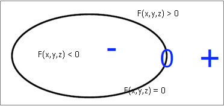
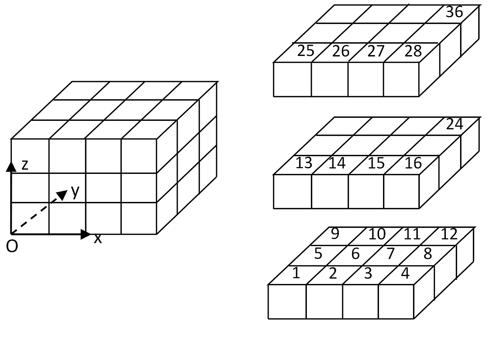
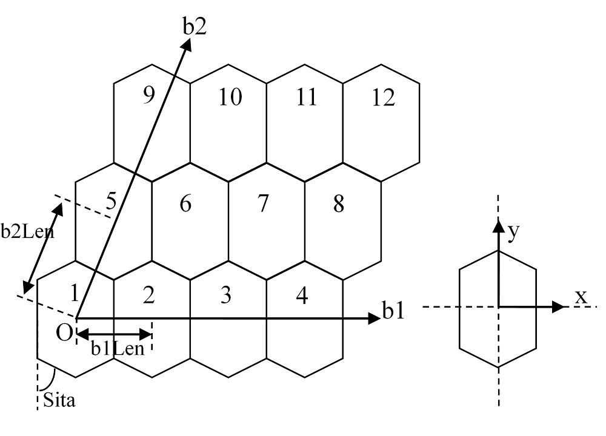
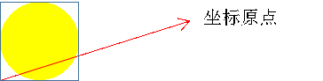
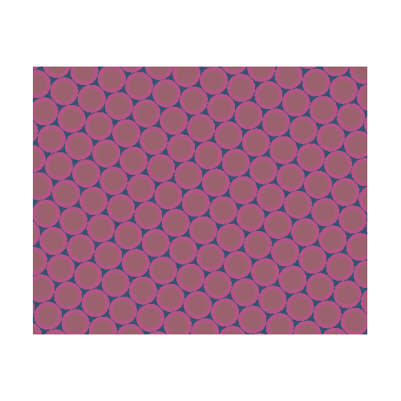
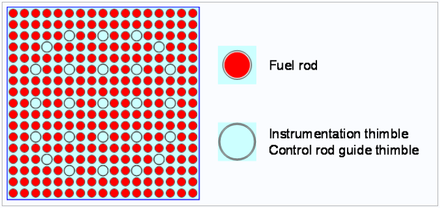
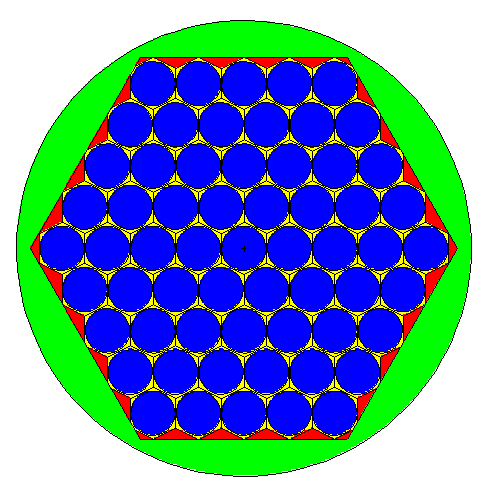
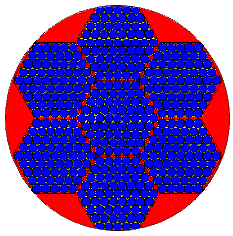
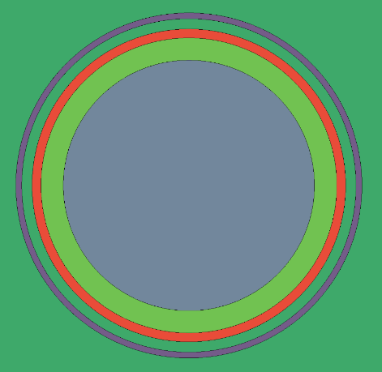
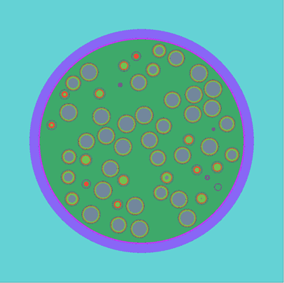

.. _section_eng_geometry:

Geometry
==========

Complex geometry description is one of the main advantages of Monte Carlo programs over deterministic programs. Similar
to most other Monte Carlo programs worldwide, RMC is compatible with CAD-based geometry and CSG geometry. CSG geometry
utilizes a universe-based geometry system.

RMC's CSG geometry description system includes three basic geometry description units; namely, Surface, Cell and
Universe. Generally, a physical system is defined by multiple or single hierarchical universes, where each hierarchical
universe comprises of a certain number of cells. In turn, these cells are defined by the intersection and union of surfaces
(sense). RMC geometry input modules typically follow the format as shown below:

.. code-block::none

  UNIVERSE 0 // Describes the uppermost level (universe) in the Universe module
  Cell …     // Describes the first cell in the Universe unit
  Cell …     // Describes the second cell in the Universe unit
  ...

  UNIVERSE 1 // Describes the Universe module used for filling
  ...

  SURFACE    // Describes the surface module
  Surf ...   // Describes the first surface
  Surf ...   // Describes the second surface
  ...

.. _section_eng_geometry_surface:

Surface
-------------------

Surfaces are the base unit for describing geometry in RMC. To account for the wide range of MCNP users, RMC utilizes
the same surface definition method as MCNP. The definition of the Surface input option is：

.. code-block:: none

  Surf <id> <type> {params} [bc = <flag>] [Move = Mx My Mz] [Rotate =Cx'x Cx'y Cx'z Cy'x Cy'y Cy'z Cz'x Cz'y Cz'z ] 
                            [RotateAngle = \alpha \beta \gamma] [pair = <pair surf>] 
                            [value=<v1 v2 ... vn>] [time=<t1 t2 ... tn>]

where,

-  **Surf** is the keyword for the Surface input card.

-  **id** is the Surface ID. The number representing ID must be a positive integer and cannot be duplicated（or redefined).

-  **type** refers to the keyword representing the surface type，and **params** refers to the surface parameters
   required to fully describe the surface. :numref:`surftypes_table_eng` lists the different surface types and their
   corresponding surface equations and their parameters.

-  **bc** is the boundary condition applied to the surface. bc = 0（default）indicates a void boundary condition,
   bc = 1 indicates a total reflection boundary condition, bc = 2 indicates a white boundary condition，bc = 3 indicates
   a periodic boundary condition.

-  **Move** is the Surface translation vector. The expression of translational transformation is:

.. math::

    \mathbf{r'} = \mathbf{r} + \mathbf{m}

where, :math:`\mathbf{r}=(r_x,r_y,r_z)` and :math:`\mathbf{r}=(r_x',r_y',r_z')` are the positional coordinates of
any point in space before and after the transformation, while :math:`\mathbf{m}=(m_x,m_y,m_z)` represents the
translational transformation vector.

RMC supports two different input formats of rotational transformation matrix, which is **Rotate** and **RotateAngle** .

-  **Rotate** keyword is the first input format, where the parameters defining the rotation transformation matrix are directly provided
   In actuality, RMC requires the user to input the transposed matrix of the rotational transformation matrix
   :math:`\mathbf{R}^T`, whose parameters are defined as follows: Given a cartesian coordinate system :math:`(x,y,z)`,
   after the rotational transformation, a new coordinate system is obtained :math:`(x',y',z')`, where :math:`\mathbf{R}^T`
   can be expressed as

.. math::

    \mathbf{R}^T = \begin{bmatrix} C_{x'x} & C_{x'y} &C_{x'z} \\ C_{y'x}
    & C_{y'y} &C_{y'z} \\ C_{z'x} & C_{z'y} &C_{z'z} \end{bmatrix}

where, :math:`C_{x'x}` represents the cosine of the angle between the :math:`x` and :math:`x'` axes, and so on.

-  **RotateAngle** keyword is the second input format, where the following three angles are provided, in the units of degrees:
   :math:`\alpha, \beta, \gamma` (referred to as pitch angle, yaw angle, and roll angle. Please refer to the
   definition of Euler angles for more details), whereby the program can automatically generate a rotation matrix.

.. note:: When performing rotation and translation operations on a surface, the order is rotation first, followed by translation.  

.. note:: Note that the program does not support rotation for surfaces containing a torus (TX/TY/TZ), and the 
  **Rotate** and **RotateAngle** keywords cannot be used simultaneously.  

.. important:: If using the **Rotate** and **RotateAngle** rotation and translation functions for RMC surfaces, the RMC 
   Python module must be used for calculations. The program requires the Python module to perform surface rotation operations 
   before modeling computations. For instructions on using RMC with Python, refer to :ref:`section_eng_run_exe` , **Python Invocation of RMC Execution** section for setup.  

-  **pair** The second surface of a pair of surfaces used in the periodic boundary condition, where <pair surf> refers
   to the periodic surface paired to the primary surface.

   In addition, the periodic boundary condition has the following restrictions:

      - Under the periodic boundary condition, the surface type can only be a plane surface, such as P/ PX/ PY/ PZ
      - The periodic boundary condition can only be applied to the outermost surface, whereby one side of the surface
        with the periodic boundary condition applied must be attached to a Cell of zeroth importance
      - Paired surfaces must be parallel to each other, and the surface types must be the same as each other

-  The **value** input option and **time** input option are used in combination to describe the changes in the value of the
   final parameter with respect to time. The number of parameters defined in both input options are identical, indicating that
   when the time exceeds the final time parameter t_i, the corresponding value parameter will be v_i

.. table:: Surface Types
   :name: surftypes_table_eng

   +---------------------+---------+------------------------+------------------------------------------------+----------------------------+
   | Surface Type        | Keyword | Description            | Equation                                       | Surface Equation Parameters|
   +=====================+=========+========================+================================================+============================+
   | PLANE               | **P**   | General                | :math:`Ax+By+Cz-D=0`                           |:math:`A,B,C,D`             |
   +---------------------+---------+------------------------+------------------------------------------------+----------------------------+
   |                     | **PX**  | Parallel to x-axis     | :math:`x-D=0`                                  |:math:`D`                   |
   +---------------------+---------+------------------------+------------------------------------------------+----------------------------+
   |                     | **PY**  | Parallel to y-axis     | :math:`y-D=0`                                  |:math:`D`                   |
   +---------------------+---------+------------------------+------------------------------------------------+----------------------------+
   |                     | **PZ**  | Parallel to z-axis     | :math:`z-D=0`                                  |:math:`D`                   |
   +---------------------+---------+------------------------+------------------------------------------------+----------------------------+
   | SPHERICAL           | **SO**  | Sphere center at origin| :math:`x^2+y^2+z^2-R^2=0`                      |:math:`R`                   |
   +---------------------+---------+------------------------+------------------------------------------------+----------------------------+
   |                     | **S**   | General                | :math:`(x-x_0)^2+(y-y_0)^2+(z-z_0)^2-R^2=0`    |:math:`x_0,y_0,z_0,R`       |
   +---------------------+---------+------------------------+------------------------------------------------+----------------------------+
   |                     | **SX**  | Sphere center on x-axis| :math:`(x-x_0)^2+y^2+z^2-R^2=0`                |:math:`x_0,R`               |
   +---------------------+---------+------------------------+------------------------------------------------+----------------------------+
   |                     | **SY**  | Sphere center on y-axis| :math:`x^2+(y-y_0)^2+z^2-R^2=0`                |:math:`y_0,R`               |
   +---------------------+---------+------------------------+------------------------------------------------+----------------------------+
   |                     | **SZ**  | Sphere center on z-axis| :math:`x^2+y^2+(z-z_0)^2-R^2=0`                |:math:`z_0,R`               |
   +---------------------+---------+------------------------+------------------------------------------------+----------------------------+
   | CYLINDRICAL         | **C/X** | Parallel to x-axis     | :math:`(y-y_0)^2+(z-z_0)^2-R^2=0`              |:math:`y_0,z_0,R`           |
   +---------------------+---------+------------------------+------------------------------------------------+----------------------------+
   |                     | **C/Y** | Parallel to y-axis     | :math:`(x-x_0)^2+(z-z_0)^2-R^2=0`              |:math:`x_0,z_0,R`           |
   +---------------------+---------+------------------------+------------------------------------------------+----------------------------+
   |                     | **C/Z** | Parallel to z-axis     | :math:`(x-x_0)^2+(y-y_0)^2-R^2=0`              |:math:`x_0,y_0,R`           |
   +---------------------+---------+------------------------+------------------------------------------------+----------------------------+
   |                     | **CX**  | Axis is along x-axis   | :math:`y^2+z^2-R^2=0`                          |:math:`R`                   |
   +---------------------+---------+------------------------+------------------------------------------------+----------------------------+
   |                     | **CY**  | Axis is along y-axis   | :math:`x^2+z^2-R^2=0`                          |:math:`R`                   |
   +---------------------+---------+------------------------+------------------------------------------------+----------------------------+
   |                     | **CZ**  | Axis is along z-axis   | :math:`x^2+y^2-R^2=0`                          |:math:`R`                   |
   +---------------------+---------+------------------------+------------------------------------------------+----------------------------+
   | CONICAL             | **K/X** | Parallel to x-axis     | :math:`\sqrt{(y-y_0)^2+(z-z_0)^2}=\pm t(x-x_0)`|:math:`x_0,y_0,z_0,t^2,\pm1`|
   +---------------------+---------+------------------------+------------------------------------------------+----------------------------+
   |                     | **K/Y** | Parallel to y-axis     | :math:`\sqrt{(x-x_0)^2+(z-z_0)^2}=\pm t(y-y_0)`|:math:`x_0,y_0,z_0,t^2,\pm1`|
   +---------------------+---------+------------------------+------------------------------------------------+----------------------------+
   |                     | **K/Z** | Parallel to z-axis     | :math:`\sqrt{(x-x_0)^2+(y-y_0)^2}=\pm t(z-z_0)`|:math:`x_0,y_0,z_0,t^2,\pm1`|
   +---------------------+---------+------------------------+------------------------------------------------+----------------------------+
   |                     | **KX**  | Axis is along x-axis   | :math:`\sqrt{y^2+z^2}=\pm t(x-x_0)`            |:math:`x_0,t^2,\pm1`        |
   +---------------------+---------+------------------------+------------------------------------------------+----------------------------+
   |                     | **KY**  | Axis is along y-axis   | :math:`\sqrt{x^2+z^2}=\pm t(y-y_0)`            |:math:`y_0,t^2,\pm1`        |
   +---------------------+---------+------------------------+------------------------------------------------+----------------------------+
   |                     | **KZ**  | Axis is along z-axis   | :math:`\sqrt{x^2+y^2}=\pm t(z-z_0)`            |:math:`z_0,t^2,\pm1`        |
   +---------------------+---------+------------------------+------------------------------------------------+----------------------------+
   | ELLIPSOID/          | **SQ**  | Parallel to x/y/z axis |   :math:`A(x-x_0)^2+B(y-y_0)^2+C(z-z_0)^2      |:math:`A,B,C,D,E,F,G,x_0,y_0|
   | HYPERBOLOID/        |         |                        |   +2D(x-x_0)+2E(y-y_0)+2F(z-z_0)+G=0`          |,z_0`                       |
   | PARABOLOID          |         |                        |                                                |                            |
   +---------------------+---------+------------------------+------------------------------------------------+----------------------------+
   | CYLINDRICAL/        | **GQ**  | Non-parallel to x/y/z  | :math:`Ax^2+By^2+Cz^2+Dxy+Eyz+Fzx+Gx+Hy+Jz+K=0`|:math:`A,B,C,D,E,F,G,H,J,K` |
   | CONICAL/            |         | axis                   |                                                |                            |
   | ELLIPSOIDAL/        |         |                        |                                                |                            |
   | HYPERBOLOID/        |         |                        |                                                |                            |
   | PARABOLOID SURFACE  |         |                        |                                                |                            |
   +---------------------+---------+------------------------+------------------------------------------------+----------------------------+
   | ELLIPTICAL/         | **TX**  | Parallel to x-axis     | :math:`(x-x_0)^2/B^2+                          |:math:`x_0,y_0,z_0,A,B,C`   |
   | CIRCULAR TORUS      |         |                        | (\sqrt{(y-y_0)^2+(z-z_0)^2}-A)^2/C^2-1=0`      |                            |
   +---------------------+---------+------------------------+------------------------------------------------+----------------------------+
   |                     | **TY**  | Parallel to y-axis     | :math:`(y-y_0)^2/B^2+                          |:math:`x_0,y_0,z_0,A,B,C`   |
   |                     |         |                        | (\sqrt{(x-x_0)^2+(z-z_0)^2}-A)^2/C^2-1=0`      |                            |
   +---------------------+---------+------------------------+------------------------------------------------+----------------------------+
   |                     | **TZ**  | Parallel to z-axis     | :math:`(z-z_0)^2/B^2+                          |:math:`x_0,y_0,z_0,A,B,C`   |
   |                     |         |                        | (\sqrt{(x-x_0)^2+(y-y_0)^2}-A)^2/C^2-1=0`      |                            |
   +---------------------+---------+------------------------+------------------------------------------------+----------------------------+

**Surface Rotation Example**

.. code-block:: none

  // A plane perpendicular to the x-axis at x=50, multiplied by the identity rotation matrix, remains unchanged after rotation
  Surf 1 px 50 rotate=1 0 0 0 1 0 0 0 1

  //A plane perpendicular to the x-axis at x=50, multiplied by a rotation matrix, rotated 90 degrees around the y-axis.
  Surf 2 px  50 rotate=0 0 1   0 1 0   -1 0 0  

  // A plane perpendicular to the y-axis at y=-50, rotated by 60 degrees pitch and 30 degrees yaw
  Surf 3 py -50 rotateangle = 60 30 0

.. _section_eng_geometry_macrobody:

Macrobody （Enterprise Version Only）
-------------------------------------------

While surfaces are the base unit for describing geometry in RMC, macrobody modelling can be used to replace surface
modelling. The definition of the Macrobody input option is:

.. code-block:: none

 Body <id> <type> {params} [Move = Mx My Mz] [Rotate =Cx'x Cx'y Cx'z Cy'x Cy'y Cy'z Cz'x Cz'y Cz'z ] [RotateAngle = \alpha \beta \gamma]

where,

-  **Body** is the keyword for the Macrobody input card

-  **id** is the Macrobody ID. The ID is a positive, non-repeating integer.

-  **type** refers to the keyword representing the macrobody type，and **params** refers to the macrobody parameters
   required to fully describe the macrobody. :numref:`bodytypes_table_eng` lists the different macrobody types supported by
   RMC

-  **Move** is the macrobody's translation vector, and it follows the same definition as the surface translation in the previous section. 

-  **Rotate** is the macrobody's rotation matrix, and it follows the same definition as the surface rotation in the previous section. 

-  **RotateAngle** is the macrobody's rotation angle, and it follows the same definition as the surface rotation in the previous section. 

.. note:: When performing rotation and translation operations on macrobody, the order is rotation first, followed by translation.  

.. note:: Note that the program does not support rotation for macro-bodies containing a torus (Torus).  

.. important:: RMC's macrobody modeling function requires the RMC Python module for computation. For instructions on using RMC 
  with Python module, refer to :ref:`section_eng_run_exe` , **Python Invocation of RMC Execution** section for setup.  

.. list-table:: Macrobody Types
   :name: bodytypes_table_eng
   :widths: 15 20 50
   :header-rows: 1

   *   - Keyword
       - Description of Macrobody
       - Macrobody Parameters
   *   - RPP
       - Cuboidal body in any direction; surfaces do not necessarily have to be parallel to either the x/y/z axes
       - :math:`X_min`, :math:`X_max` : The smallest and largest boundary surfaces perpendicular to the x-axis
   *   -
       -
       - :math:`Y_min`, :math:`Y_max` : The smallest and largest boundary surfaces perpendicular to the y-axis
   *   -
       -
       - :math:`Z_min`, :math:`Z_max` : The smallest and largest boundary surfaces perpendicular to the z-axis
   *   - BOX
       - Cuboidal body in any direction; surfaces do not necessarily have to be parallel to either the x/y/z axes
       - :math:`V_x`, :math:`V_y`, :math:`V_z`: Coordinates of a vertice that belongs to the cuboid
   *   -
       -
       - :math:`a1_x`, :math:`a1_y`, :math:`a1_z`: Vector from the specified vertex coordinates to the first edge of the
         cuboid
   *   -
       -
       - :math:`a2_x`, :math:`a2_y`, :math:`a2_z`: Vector from the specified vertex coordinates to the second edge of the
         cuboid
   *   -
       -
       - :math:`a3_x`, :math:`a3_y`, :math:`a3_z`: Vector from the specified vertex coordinates to the third edge of the
         cuboid
   *   - SPH
       - Spherical body
       - :math:`V_x`, :math:`V_y`, :math:`V_z`: Center coordinates of the sphere
   *   -
       -
       - :math:`r`: Sphere radius
   *   - RCC
       - Cylindrical body
       - :math:`V_x`, :math:`V_y`, :math:`V_z`: Center coordinates of the bottom circular surface of the cylinder
   *   -
       -
       - :math:`h_x`, :math:`h_y`, :math:`h_z`: Vector representing the height of the cylinder
   *   -
       -
       - :math:`r`: Cylindrical radius
   *   - RHP or HEX
       - Hexagonal prism
       - :math:`V_x`, :math:`V_y`, :math:`V_z`: Center coordinates of the bottom hexagonal surface of the hexagonal
         prism
   *   -
       -
       - :math:`h_1`, :math:`h_2`, :math:`h_3`: Vector representing the height of the hexagonal prism
   *   -
       -
       - :math:`r_1`, :math:`r_2`, :math:`r_3`: Vector from the specified center coordinates to the first edge of the
         hexagonal prism
   *   -
       -
       - :math:`s_1`, :math:`s_2`, :math:`s_3`: Vector from the specified center coordinates to the second edge of the
         hexagonal prism
   *   -
       -
       - :math:`t_1`, :math:`t_2`, :math:`t_3`: Vector from the specified center coordinates to the third edge of the
         hexagonal prism
   *   -
       -
       - It should be noted that for a regular hexagonal prism, only one of the three vectors to the surface is
         required, that is, only the values for :math:`r_1`, :math:`r_2`, :math:`r_3` are required in the input option.
   *   - REC
       - Elliptical cylinder
       - :math:`V_x`, :math:`V_y`, :math:`V_z`: Center coordinates of the bottom surface of the elliptical cylinder
   *   -
       -
       - :math:`h_1`, :math:`h_2`, :math:`h_3`: Vector representing the cylindrical axes of the elliptical cylinder
   *   -
       -
       - :math:`V1_x`, :math:`V1_y`, :math:`V1_z`: Vector representing the major axes of the ellipse
   *   -
       -
       - :math:`V1_x`, :math:`V1_y`, :math:`V1_z`: Vector representing the minor axes of the ellipse. This vector is
         optional, and the user can also directly define the length of the minor axis. This is because the direction
         of the minor axis can be determined by the axial and major axis directions.
   *   - TRC
       - Frustum (of cone)
       - :math:`V_x`, :math:`V_y`, :math:`V_z`: Center coordinates of the bottom surface of the frustum
   *   -
       -
       - :math:`h_x`, :math:`h_y`, :math:`h_z`: Vector representing the axes of the cone
   *   -
       -
       - :math:`r_1`: Radius of bottom surface of the frustum
   *   -
       -
       - :math:`r_2`: Radius of top surface of the frustum. Note that :math:`r_1` > :math:`r_2`
   *   - ELL
       - Ellipsoid
       - :math:`V1_x`, :math:`V1_y`, :math:`V1_z`: If :math:`r` > 0, the values represent the coordinates of the first
         focal point. If :math:`r` < 0, the values represent the coordinates of the ellipsoid center point
   *   -
       -
       - :math:`V2_x`, :math:`V2_y`, :math:`V1_z`: If :math:`r` > 0, the values represent the coordinates of the second
         focal point. If :math:`r` < 0, the values represent the major semi-axial vector of the ellipsoid
   *   -
       -
       - If :math:`r` > 0, :math:`r` represents the length of the major semi-axis. If :math:`r` < 0, :math:`r`
         represents the length of the minor semi-axis
   *   - WED
       - Triangular prism
       - :math:`V_x`, :math:`V_y`, :math:`V_z`: Coordinates of a vertice that belongs to the bottom face of the prism
         :math:`V1_x`, :math:`V1_y`, :math:`V1_z`: Starting from the vertex defined by the top face, these values
         represent a vector representing the first edge of the bottom triangle.
   *   -
       -
       - :math:`V1_x`, :math:`V1_y`, :math:`V1_z`: Starting from the vertex defined by the top face, these values
         represent a vector representing the first edge of the bottom triangle. :math:`h_x`, :math:`h_y`, :math:`h_z`:
         Axial vector of the triangular prism
   *   - Torus
       - Torus
       - :math:`u`, :math:`v`, :math:`w`: Torus directional vector，divided into the :math:`x`, :math:`y`, and :math:`z`
         directions. :math:`V_x`, :math:`V_y`, :math:`V_z` represent the center coordinates of the torus in the radial
         direction.
   *   -
       -
       - :math:`r_1`: Radius of torus (radial direction)  :math:`r_2`: Radius of torus (cross-section) When
         :math:`r_1 < 2 * r_2`, to obtain the outer surface, the non-zero value in the directional vector is defined as
         1, and to obtain the inner surface, the non-zero value in the directional vector is -1.
   *   - SEC
       - Cylindrical sector
       - :math:`V_x`, :math:`V_y`, :math:`V_z`: Center coordinates of the bottom circular surface of the cylinder.
         :math:`h_x`, :math:`h_y`, :math:`h_z`: Vector representing the height of the cylinder. :math:`r_1`: Inner
         radius.  :math:`r_2`: Outer radius.
   *   -
       -
       - When the axial direction of the cylindrical sector is along the z-axis, :math:`theta` is expressed as the angle
         between the cylindrical sector and the positive x-axis. When the axial direction of the cylindrical sector is
         along the y-axis, :math:`theta` is expressed as the angle between the cylindrical sector and the positive
         z-axis. When the axial direction of the cylindrical sector is along the x-axis, :math:`theta` is expressed as
         the angle between the cylindrical sector and the positive y-axis.
   *   -
       -
       - :math:`theta_1`: The angle between one side of the cylindrical sector and the coordinate axis.
         :math:`theta_2`: The angle between the other side of the cylindrical sector and the coordinate axis.
         :math:`theta_2 > theta_1`, and :math:`theta_2 - theta_1 < 180` degrees

Note: The order of parameters in each macro body is the order of parameters as shown in the table above

.. table:: Macrobody Surfaces
   :name: bodysurf_table_eng

   +------------------+------+-------------------------------------------------------------------------------------+
   |Macrobody keyword |Serial|Description                                                                          |
   +==================+======+=====================================================================================+
   |RPP               |1     |Plane at :math:`X_max`                                                               |
   +------------------+------+-------------------------------------------------------------------------------------+
   |                  |2     |Plane at :math:`X_min`                                                               |
   +------------------+------+-------------------------------------------------------------------------------------+
   |                  |3     |Plane at :math:`Y_max`                                                               |
   +------------------+------+-------------------------------------------------------------------------------------+
   |                  |4     |Plane at :math:`Y_min`                                                               |
   +------------------+------+-------------------------------------------------------------------------------------+
   |                  |5     |Plane at :math:`Z_max`                                                               |
   +------------------+------+-------------------------------------------------------------------------------------+
   |                  |6     |Plane at :math:`Z_min`                                                               |
   +------------------+------+-------------------------------------------------------------------------------------+
   |BOX               |1     |Plane at the endpoint of the vectors :math:`a1_x`, :math:`a1_y`, :math:`a1_z`        |
   +------------------+------+-------------------------------------------------------------------------------------+
   |                  |2     |Plane at the startpoint of the vectors :math:`a1_x`, :math:`a1_y`, :math:`a1_z`      |
   +------------------+------+-------------------------------------------------------------------------------------+
   |                  |3     |Plane at the endpoint of the vectors :math:`a2_x`, :math:`a2_y`, :math:`a2_z`        |
   +------------------+------+-------------------------------------------------------------------------------------+
   |                  |4     |Plane at the startpoint of the vectors :math:`a2_x`, :math:`a2_y`, :math:`a2_z`      |
   +------------------+------+-------------------------------------------------------------------------------------+
   |                  |5     |Plane at the endpoint of the vectors :math:`a3_x`, :math:`a3_y`, :math:`a3_z`        |
   +------------------+------+-------------------------------------------------------------------------------------+
   |                  |6     |Plane at the startpoint of the vectors :math:`a3_x`, :math:`a3_y`, :math:`a3_z`      |
   +------------------+------+-------------------------------------------------------------------------------------+
   |SPH               |      |Regular surface                                                                      |
   +------------------+------+-------------------------------------------------------------------------------------+
   |RCC               |1     |Cylindrical surface (circular)                                                       |
   +------------------+------+-------------------------------------------------------------------------------------+
   |                  |2     |Top surface of cylinder                                                              |
   +------------------+------+-------------------------------------------------------------------------------------+
   |                  |3     |Bottom surface of cylinder                                                           |
   +------------------+------+-------------------------------------------------------------------------------------+
   |RHP or HEX        |1     |Plane at the endpoint of the vectors :math:`r_1`, :math:`r_2`, :math:`r_3`           |
   +------------------+------+-------------------------------------------------------------------------------------+
   |                  |2     |Plane at the startpoint of the vectors :math:`r_1`, :math:`r_2`, :math:`r_3`         |
   +------------------+------+-------------------------------------------------------------------------------------+
   |                  |3     |Plane at the endpoint of the vectors :math:`s_1`, :math:`s_2`, :math:`s_3`           |
   +------------------+------+-------------------------------------------------------------------------------------+
   |                  |4     |Plane at the startpoint of the vectors :math:`s_1`, :math:`s_2`, :math:`s_3`         |
   +------------------+------+-------------------------------------------------------------------------------------+
   |                  |5     |Plane at the endpoint of the vectors :math:`t_1`, :math:`t_2`, :math:`t_3`           |
   +------------------+------+-------------------------------------------------------------------------------------+
   |                  |6     |Plane at the startpoint of the vectors :math:`t_1`, :math:`t_2`, :math:`t_3`         |
   +------------------+------+-------------------------------------------------------------------------------------+
   |                  |7     |Top surface of hexagonal prism                                                       |
   +------------------+------+-------------------------------------------------------------------------------------+
   |                  |8     |Bottom surface of hexagonal prism                                                    |
   +------------------+------+-------------------------------------------------------------------------------------+
   |REC               |1     |Elliptical Cylindrical surface                                                       |
   +------------------+------+-------------------------------------------------------------------------------------+
   |                  |2     |Top surface of elliptical cylinder                                                   |
   +------------------+------+-------------------------------------------------------------------------------------+
   |                  |3     |Bottom surface of elliptical cylinder                                                |
   +------------------+------+-------------------------------------------------------------------------------------+
   |TRC               |1     |Frustum surface                                                                      |
   +------------------+------+-------------------------------------------------------------------------------------+
   |                  |2     |Top surface of frustum                                                               |
   +------------------+------+-------------------------------------------------------------------------------------+
   |                  |3     |Bottom surface of frustum                                                            |
   +------------------+------+-------------------------------------------------------------------------------------+
   |ELL               |      |Regular surface                                                                      |
   +------------------+------+-------------------------------------------------------------------------------------+
   |WED               |1     |Bevel surface that includes the top and bottom bevels                                |
   +------------------+------+-------------------------------------------------------------------------------------+
   |                  |2     |Surface that includes vectors :math:`V_2` and :math:`V_3`                            |
   +------------------+------+-------------------------------------------------------------------------------------+
   |                  |3     |Surface that includes vectors :math:`V_1` and :math:`V_3`                            |
   +------------------+------+-------------------------------------------------------------------------------------+
   |                  |4     |Top surface of triangular prism                                                      |
   +------------------+------+-------------------------------------------------------------------------------------+
   |                  |5     |Bottom surface of triangular prism                                                   |
   +------------------+------+-------------------------------------------------------------------------------------+
   |Torus             |      |Regular Surface                                                                      |
   +------------------+------+-------------------------------------------------------------------------------------+
   |SEC               |1     |Bottom surface of cylindrical sector                                                 |
   +------------------+------+-------------------------------------------------------------------------------------+
   |                  |2     |Top surface of cylindrical sector                                                    |
   +------------------+------+-------------------------------------------------------------------------------------+
   |                  |3     |Inner cylindrical surface                                                            |
   +------------------+------+-------------------------------------------------------------------------------------+
   |                  |4     |Outer cylindrical surface                                                            |
   +------------------+------+-------------------------------------------------------------------------------------+
   |                  |5     |Surface where the angle to the coordinate axis is smaller                            |
   +------------------+------+-------------------------------------------------------------------------------------+
   |                  |6     |Surface where the angle to the coordinate axis is larger                             |
   +------------------+------+-------------------------------------------------------------------------------------+

Note: For a regular hexagonal prism, since there is only one vector (:math:`r_1, r_2, r_3`), surface 3 represents the
surface corresponding to a 60-degree clockwise rotation of (:math:`r_1, r_2, r_3`), while surface 4 is on the opposite
of surface 3. Surface 5 represents the surface corresponding to a 60-degree counterclockwise rotation of
(:math:`r_1, r_2, r_3`), while surface 6 is on the opposite of surface 5.

.. code-block:: c

    /////// PWR pin: defined in single universe /////////////
    Universe 0
    cell 1 -10      mat = 1   // Fuel Pin
    cell 2 !1 & -11 mat = 2                // Air
    cell 3 11 & -12 mat = 3                // cladding
    cell 4 12 & -17 mat= 4 // water
    cell 5 17 void = 1    // outside

    Macrobody
    Body 10 rcc 0 0 -1 0 0 2 0.4096
    Body 11 rcc 0 0 -1 0 0 2 0.4178
    Body 12 rcc 0 0 -1 0 0 2 0.4750
    Body 17 rpp -0.63 0.63 -0.63 0.63 -2 2

    EXTERNALSOURCE
    Source 1 particle = 1 Surface = 12.2 energy = 1 Position = 0 0 1 radius = 1

    Tally
    Surftally 1 Particle = 1 type = 1 surf = 10.1 11.2 12.3 17.4

    Binaryout
    WrtSurfSrc write = 1 surf = 10.2

    PTRAC NEU = 1 SUR = 1 FILE = 1 SURFACE = 10.1 12.1 17.1

.. _section_eng_geometry_cell:

Cell
----------------

The definition of the Cell input card is：

.. code-block:: none

  Cell <id> {surf_bool_definition} {cell_info}

where，

-  **Cell** is the keyword for the Cell input card

-  **id** is the Cell ID. The number representing ID must be a positive integer and cannot be duplicated（or redefined).

-  **surf_bool_definition** refers to the surface Boolean definition of a cell, which consists of a directional surface
   and Boolean operators, and is used to define the cell area. **cell_info** defines other relevant information of the
   cell, which are further explained below.

Cell surface boolean definition
~~~~~~~~~~~~~~~~~~~~~~~~~~~~~~~

The surface Boolean definition of a cell consists of a series of surfaces and Boolean operators, as follows:

.. code-block:: none

  <±surf> <boolean> <±surf> <boolean> <±surf> …

The surface direction (sense) is defined as follows: if the calculated value of a point (x, y, z) on a surface
equation f ( x, y, z ) is f ( x, y, z ) > 0, then the point is positive for this particular surface; if the
calculated value is f ( x, y, z ) < 0, then the point is negative; if the calculated value is f ( x, y, z ) = 0, then
the point is on the surface. :numref:`surfsense_fig_eng` shows the area corresponding to the direction
of a quadratic surface:

   Schematic diagram of Surface Direction

RMC's Boolean operators include Intersection (&), Union (:), and Complement (!), and support parentheses to adjust
the operation priority. \ *The priority of complement is higher than that of intersection and union*\; \ *intersection
and union have the same priority*\, and logical operations are performed in the order of definition; \ *parentheses
have the highest priority*\, and multiple layers of parentheses can be nested, similar to arithmetic operations.
Assuming that the geometric descriptions of Cells 1 and 2 are:

.. code-block:: none

  Cell 1： (1 & -2) : 3

  Cell 2： 4 & -5 : !1

The geometric area represented by Cell 1 is: (Positive direction of Surface 1 ∩ Negative direction of Surface 2) ∪
Positive direction of Surface 3

The geometric area represented by Cell 2 is: (Positive direction of Surface 4 ∩ Negative direction of surface 5) ∪
non-Cell 1. Another equivalent description of Cell 2 is: 4 & 5 : !( (1 & -2) : 3). It should be noted that
if a number is followed by "!", it means a non-cell; if there are brackets after "!", it means a non-surface.

Cell Information Input Card
~~~~~~~~~~~~~~~~~~~~~~~~~~~~~~

The Cell Information Input Card consists of a series of cards, which are mainly used to describe the physical and
geometric parameters of the cell, including material, volume, temperature, layer filling information,
geometric transformation, etc.

.. code-block:: none

    Cell … [Mat = <id>] [Vol = <vol>] [Tmp = <tmp>]
    [Dens = <dens>] [Void = <flag>] [Fill = <id>] [Inner = <flag>]
    [Move = <params>] [Rotate = <params>] [RotateAngle = <params>]
    [Noburn = <flag>] [FillMove = <params>] [FillRotate = <params>]
    [FillRotateAngle = <params>] [PWT = <params>]

where,

-  **Mat** defines the filling material of the cell, with the default value being **Mat = 0 (vacuum)**;

-  **Vol** defines the volume of the cell, with the units in cm\ :sup:`3`\, and the default value being
   **Vol = 1.0** cm\ :sup:`3`\;

-  **Tmp** defines the temperature of the cell. The user can enter a natural number greater than 0, or an integer
   less than 0. When the input value is greater than 0, it means that the temperature of the cell has been
   entered in K (Kelvin); when the input value is less than 0, it indicates that the temperature for the cell
   has been defined (see the Mesh section for details), in K; when the user does not provide any input, the
   temperature corresponding to the cell filling material is used by default. When the user wants to use the
   broadening function, the cell temperature (it must be noted that the cell temperature is different from the
   temperature of the material filled in the cell) needs to be set. In this case, if the user does not specify
   any on-the-fly broadening options, the program will make a simple correction to the nuclide cross section
   thermal zone; if the user specifies an on-the-fly broadening option, on-the-fly Doppler broadening or
   on-the-fly interpolation will be performed according to the user-specified option;

-  **Dens** defines the density of the cell. Users can enter a natural number greater than 0, or an integer less
   than 0. When the input value is greater than 0, it means that the atomic density of the cell has been inputted,
   where the units are 10\ :sup:`24`\ atoms/cm\ :sup:`3`\; when the input value is less than 0, it means that
   the user has entered the density mesh of the cell (see the Mesh section for details), with the units
   being g/cm\ :sup:`3`\; when the user does not provide any input, the density of the filled material becomes
   equivalent with the default user-entered density. It should be noted that the current version of the
   program does not support the use of this option for burnup cells;

-  **Void** specifies whether to stop tracking after the neutron enters the cell. It is mainly used to describe
   the area outside the vacuum boundary. If Void = 0 (default value), tracking of the neutron continues
   after entering the area; if Void = 1 , tracking of the neutron stops after entering the area;

-  **Fill** defines the universe filled inside the cell. Please refer to the subsequent chapters for further details.

-  **Inner** specifies if the cell is an interior cell, that is, one that is not split by an outer boundary
   during the material filling process. Inner = 0 (default) indicates a non-interior cell, and Inner = 1
   indicates an interior cell. Specifying interior cells can speed up geometry processing, but incorrectly
   specifying interior cells can cause geometry tracking errors, so this is only recommended for advanced users.

-  **Move** defines the translation vector of the cell, and the **Rotate** and **RotateAngle** input options
   define the transpose of the rotation matrix that defines the geometric transformation of this cell, which
   are similar to the Move, Rotate, and RotateAngle cards in 3.4.3 Geometric Transformation. When
   performing geometric transformation on a cell, the cell is rotated first and then translated. For filled cells,
   the entire transformation is performed together with its internal filling structure. Please note that
   rotation of torus (TX/TY/TZ) is currently not supported in RMC.

-  **FillMove** defines the displacement vector of the internal filling universe of the cell. **FillRotate** and
   **FillRotateAngle** define the transpose of the rotation matrix that defines the internal filling universe of the cell,
   which are similar to the Move, Rotate, and Rotateangle cards in 3.4.3 Geometric Transformation.
   These three input options are only effective when the internal filling universe has been filled into the cell.

-  **Noburn** defines whether the cell is used in the burnup calculations. **Noburn = 0** (default value)
   defines that the cell is not utilized in the burnup calculations, and **Noburn = 1** means that the cell
   is used in the burnup calculations.

-  **PWT** defines the parameter for calculating the photon relative weight threshold w in this cell.
   **w>0** the weight threshold is w. **w<0** the weight threshold is
   -w×w\ :sub:`s`\×I\ :sub:`s`\/I\ :sub:`k`\. I\ :sub:`s`\  and I\ :sub:`k`\  are the neutron importance
   of the source and collision cells. w\ :sub:`s`\  is the starting weight of the neutron for the history
   being followed. Only neutron-induced photons with weights greater than weight threshold are produced;
   otherwise, Russian roulette is played. **w=0** one photon will be produced at each neutron collision
   in this cell, provided that photon production is possible. **w=-1.0e6** photon production in this
   cell is turned off. **PWT = -1** (default).

.. _section_eng_geometry_universe:

Universe
--------------------

Single-layer Universe
~~~~~~~~~~~~~~~~~~~~~

A universe comprises of a series of cells, and there *cannot be any overlap or undefined areas between these cells*.
The format of a single-layer universe input option is:

.. code-block:: none

  UNIVERSE <id> [options]

where, **id** refers to the universe ID. **options** are options related to geometric
transformation and repeating structure of the universe. They are shown below, and will be described in detail
in later sections.

.. code-block:: none

  [Move = <params>] [Rotate = <params>] [Lat = <params>] [DISP = <params>]
  [Pitch = <params>] [Scope = <params>] [Sita = <param>] [Fill = <params>]

For any physical system, at least one universe is required to describe it, which is defined in the input file as
Universe 0. For example, the following input file represents the geometry of a common Pressurized Water Reactor
fuel pin. In this instance, Cell 1 is rotated 90° clockwise.

.. code-block:: c

    /////// PWR pin: defined in single universe /////////////
    Universe 0
    cell 1 -10      mat = 1   move=0 0 0 rotate=0 -1 0 1 0 0 0 0 1// Fuel Pin
    cell 2 !1 & -11 mat = 2                // Air
    cell 3 11 & -12 mat = 3                // cladding
    cell 4 12 & 13 & -14 & 15 & -16 mat= 4 // water
    cell 5 -13 : 14 : -15 : 16 void = 1    // outside

    Surface
    surf 10 cz 0.4096
    surf 11 cz 0.4178
    surf 12 cz 0.4750
    surf 13 px -0.63 bc = 1
    surf 14 px 0.63 bc = 1
    surf 15 py -0.63 bc = 1
    surf 16 py 0.63 bc = 1

If this single-layer universe is used to fill the repeating structure in the upper layer via with the Random Mesh
Perturbation Method, the DISP keyword is required to perturb the center coordinates of the random particle.
The specific method and input are described in Section 3.4.3.

Multi-layer Universe
~~~~~~~~~~~~~~~~~~~~

For complex physical systems, it may be necessary to use a universe filling description method, that is, to use a
universe to fill a cell of another universe. *Note that the filling universe should cover the entire cell area to be
filled*, otherwise there will be undefined blank areas with the cell areas, causing particle tracking errors.

The Universe Filling Input Option is embedded in the Cell Input card (please refer to 3.2.2):

.. code-block:: none

  Cell ... [Fill = <universe>]

For the PWR cell in the previous example, we can use universe filling to describe it equivalently, as shown in the
example below. Firstly, the fuel rod and moderator regions (Universe 1) are defined, and they are then filled
into the corresponding cell (cell 102).

.. code-block:: c

  /////// PWR pin: defined in multilevel universe /////////////
  Universe 0
  cell 101 13 & -14 & 15 & -16 Fill = 1 // define a cell filled by a universe
  cell 102 -13 : 14 : -15 : 16 void = 1 // outside the box

  Universe 1
  cell 1 -10      mat = 1 // Fuel Pin
  cell 2 10 & -11 mat = 2 // Air
  cell 3 11 & -12 mat = 3 // cladding
  cell 4 12       mat = 4 // water

  Surface
  surf 10 cz 0.4096
  surf 11 cz 0.4178
  surf 12 cz 0.4750
  surf 13 px -0.63 bc = 1
  surf 14 px 0.63  bc = 1
  surf 15 py -0.63 bc = 1
  surf 16 py 0.63  bc = 1

Geometric Transformation
~~~~~~~~~~~~~~~~~~~~~~~~

RMC supports the translational transformation, rotational transformation and/or random perturbation of the universe
(in the form of center coordinates of random spherical particle arrangements). The geometric transformation input
option is embedded in the universe input card:

.. code-block:: none

  Universe ... [Move = Mx My Mz]
  [Rotate =Cx'x Cx'y Cx'z Cy'x Cy'y Cy'z Cz'x Cz'y Cz'z ]
  [RotateAngle = \alpha \beta \gamma]

The expression of translational transformation is:

.. math::

    \mathbf{r'} = \mathbf{r} + \mathbf{m}

where, :math:`\mathbf{r}=(r_x,r_y,r_z)` and :math:`\mathbf{r}=(r_x',r_y',r_z')` are the positional coordinates of
any point in space before and after the transformation, while :math:`\mathbf{m}=(m_x,m_y,m_z)` represents the
translational transformation vector.

The rotation transformation can be performed around any axis, and its expression is:

.. math::

    \mathbf{r'} = \mathbf{R} \cdot \mathbf{r}

where, :math:`\mathbf{R}` is the rotational transformation matrix.

RMC supports two different input formats of rotational transformation matrix.

The first input format is a direct input of the rotation transformation matrix using the **Rotate** keyword.
In actuality, RMC requires the user to input the transposed matrix of the rotational transformation matrix
:math:`\mathbf{R}^T`, whose parameters are defined as follows: Given a cartesian coordinate system :math:`(x,y,z)`,
after the rotational transformation, a new coordinate system is obtained :math:`(x',y',z')`, where :math:`\mathbf{R}^T`
can be expressed as

.. math::

    \mathbf{R}^T = \begin{bmatrix} C_{x'x} & C_{x'y} &C_{x'z} \\ C_{y'x}
    & C_{y'y} &C_{y'z} \\ C_{z'x} & C_{z'y} &C_{z'z} \end{bmatrix}

where, :math:`C_{x'x}` represents the cosine of the angle between the :math:`x` and :math:`x'` axes, and so on.

The second input format is to use the **RotateAngle** keyword to input the following three angles in degrees:
:math:`\alpha, \beta, \gamma` (referred to as pitch angle, yaw angle, and roll angle. Please refer to the
definition of Euler angles for more details), whereby the program can automatically generate a rotation matrix.

*Note that if you want to perform both rotational and translational transformations on a universe, you should
rotate it first and then translate it. For multi-layer universes, the geometric transformation of a universe
is always performed as a whole along with its internal filling structure. In addition, Universe 0 is the
reference universe, so geometric transformations are not allowed on Universe 0.*

*Note that when using the Rotate keyword to input the rotation matrix, you need to check the input
accuracy to ensure modeling correctness.*

*Note that the Rotate keyword and the RotateAngle keyword cannot be used at the same time.*

Using geometric transformation, we redefine the PWR mesh cell as shown below. The fuel rod and moderator
region (Universe 1) is defined to be parallel to the x-axis and filled into the mesh cell (Cell 102)
by translation (move = 0.5 0.5 0) and rotation (rotate = 0 0 -1 0 1 0 1 0 0).

.. code-block:: c

  // PWR pin: defined in multilevel universe with coordinate transformation //
  Universe 0
  cell 101 13 & -14 & 15 & -16 Fill = 1 // define a cell filled by a universe
  cell 102 -13 : 14 : -15 : 16 void = 1 // outside the box

  Universe 1 move = 0.5 0.5 0 rotate = 0 0 -1 0 1 0 1 0 0
  cell 1 -10      mat = 1 // Fuel Pin
  cell 2 10 & -11 mat = 2 // Air
  cell 3 11 & -12 mat = 3 // cladding
  cell 4 12       mat = 4 // water

  Surface
  surf 10 c/x -0.5 -0.5 0.4096
  surf 11 c/x -0.5 -0.5 0.4178
  surf 12 c/x -0.5 -0.5 0.4750
  surf 13 px -0.63 bc = 1
  surf 14 px 0.63 bc = 1
  surf 15 py -0.63 bc = 1
  surf 16 py 0.63 bc = 1

For the random mesh perturbation method, the DISP parameter is used to fill the single-layer universe of the
repeated geometric structure, and the perturbation equation for the coordinates of sphere centers is:

.. math::

    x& =x'+(2\xi_{1}-1) \times \delta_{x} \\
    y& =y'+(2\xi_{2}-1) \times \delta_{y} \\
    z& =z'+(2\xi_{3}-1) \times \delta_{z}

where, :math:`\xi_i` is a random number between (0,1), :math:`\delta_i` is the perturbation amplitude in the
direction of the corresponding coordinate axis.

**Note: The amplitude of random perturbation of coordinate transformation cannot exceed the boundaries of the mesh.**

The following is an example input card for the Random Mesh Perturbation Method:

.. code-block:: c

    ////////  HTR 5*5*5 lattice, liu-sc, 2014-10-28 ////////
    UNIVERSE 2 lat = 1  pitch = 0.1982 0.1982 0.1982    scope = 5  5  1  fill =
      1 1 1 1 1
      1 1 1 1 1
      1 1 1 1 1
      1 1 1 1 1
      1 1 1 1 1

    UNIVERSE 1 move = 0.0991 0.0991 0.0991      Disp=0.0536 0.0536 0.0536
    cell  3   -1       mat = 3   //fuel
    cell  4   1 & -2   mat = 1     //1.1C
    cell  5   2 & -3   mat = 4     //1.9C
    cell  6   3 & -4   mat = 2     //SiC
    cell  7   4 & -5   mat = 4    //1.1C
    cell  8   5        mat = 4    //1.1C

.. _section_eng_geometry_lattice:

Repeating Structure（lattice）
-----------------------------------

A repeating structure is a special type of universe that consists of regularly arranged meshes. RMC supports
commonly used quadrilateral repeating structures and hexagonal repeating structures, which are most common in
reactor core calculation analysis. Quadrilateral repeating structures can be established in 1D, 2D planes or
3D universes, and hexagonal repeating structures are established in 2D planes.

At the same time, in order to describe the random model of the dispersed fuel medium, RMC adds two special
options in the repeated structure input option, namely the implicit modelling method and the explicit modelling method.
**(Note: The random medium function of RMC is only available in the enterprise version)** The RMC implicit method
uses the Chord Length Sampling method (CLS) to determine the position of the fuel particles in the stochastic media
through on-the-fly sampling of the probability distribution function. Its characteristic is that it does not require
explicitly construction of the positions of multiple fuel particles, hence there is no strict restriction
on the particle packing fraction. Its disadvantage is that the calculation accuracy is worse than that of
explicit modelling, and when the particle packing fraction is high, there is a difference between the actual packing
fraction and the target packing fraction, and the accuracy needs to be improved via correction. The explicit method
of RMC uses the Random Sequential Addition method (RSA) or the Optimized Dropping and Rolling method (ODR),
which explicitly determines the spatial position of each fuel particle in the dispersion fuel
prior to the transport calculations, so the actual packing fraction is the target packing fraction.
However, due to the inherent characteristics of the method, the packing fraction should not be too high,
with the upper limit being 38%. The closer to the upper limit, the longer it takes to generate particles distributions. 
RMC also supports the Discrete Element Method (DEM) to be used with RSA or ODR, to obtain high packing fraction stochastic 
media. DEM can be coupled with RSA normally, or in the form of the Iterative RSA-DEM Method (ITERRSADEM). Similarly, 
DEM can be coupled with ODR normally, or in the form of the Iterative ODR-DEM Method (ITERODRDEM).

The Repeating Structure input option is embedded in the Universe input card:

.. code-block:: none

  Universe … [Lat = <type>]

Among them, **Lat = 1** represents a quadrilateral repeating structure, **Lat = 2** represents a hexagonal repeating
structure, **Lat = 3** represents a stochastic media using the Chord Length Sampling method, **Lat = 4**
represents a stochastic media using the explicit modelling method, and **Lat = 5** represents a repeating
geometry structure using a tetrahedral arrangement of small spheres. The following describes each of these
repeating structure types.

Quadrilateral Repeating Structure
~~~~~~~~~~~~~~~~~~~~~~~~~~~~~~~~~

:numref:`lattice_mesh_fig_eng` shows a schematic diagram of a quadrilateral repeating structure.
*The quadrilateral repeating mesh is established in the xyz coordinate system, and the coordinate origin O is
established at the lower left corner of the first mesh cell (numbered 1 as shown in the image below).*

   Schematic diagram of quadrilateral repeating structure

The input options for the quadrilateral repeating structure are:

.. code-block:: none

  Universe … [Lat = 1] [Scope = <xNum yNum zNum>]
  [Pitch = <xLen yLen zLen>] [Fill = <U1 U2 … UM>]

where,

-  **Lat = 1** indicates that the repeating structure type is quadrilateral;

-  **Scope** defines the number of repeating mesh cells in the x, y, and z directions. In particular, a
   parameter of 1 means that there is only one mesh layer in a particular direction. For example, the
   repeating mesh of a 2D PWR component is represented by **Scope = 17 17 1**. It should be noted that although
   the program supports the direct definition of 3D quadrilateral repeating structures, it is recommended that
   users generate 3D repeating structures by filling 2D repeating structures and 1D repeating structures;

-  **Pitch** defines the width of the repeated mesh in the x, y, and z directions. The parameter must be positive.
   If there is only one mesh layer in a certain direction, the corresponding parameter in the **Pitch** input
   option has no actual meaning;

-  **Fill** defines the serial number of the universe to be filled into the mesh. The filling order of the Fill tab is:
   The x direction is filled in first, then the y direction is filled in, and finally the z direction is filled in.
   :numref:`lattice_mesh_fig_eng` shows the numbering method for the index subscripts of the quadrilateral repeating
   structure, which corresponds to the filling order of the Fill option, and also corresponds to the serial number of the
   repeating structure counter.

When using the Random Mesh Perturbation method, it is necessary to add the **DISP** option to the universe filled via
quadrilateral repeating structures. For details, please refer to the second half of 3.3.3.

Hexagonal Repeating Structure
~~~~~~~~~~~~~~~~~~~~~~~~~~~~~

   Schematic diagram of hexagonal repeating structure

The arrangement of the hexagonal repeating mesh is shown in :numref:`lattice_hex_fig_eng`. It can be seen that the
centers of the hexagons are arranged in the form of a parallelogram. The direction vectors b1 and b2 corresponding
to the two sides of the parallelogram are located in the xy plane, and b1 coincides with the x direction.

The input options for the hexagonal repeating structure are:

.. code-block:: none

  Universe … [Lat = 2] [Scope = <b1Num b2Num>] [Sita = <sita>]
  [Pitch = <b1Len b2Len>] [Fill = <U1 U2 … Um]

where,

-  **Lat = 2** indicates that the repeating structure type is hexagonal;

-  **Scope** defines the number of times the mesh is repeated in the b\ :sub:`1`\  and b\ :sub:`2`\  directions;

-  **Pitch** defines the width of each repeated mesh in the b\ :sub:`1`\  and b\ :sub:`2`\  directions;

-  **Sita** defines the angle between a pair of adjacent sides of the hexagonal mesh (as shown in the figure) in
   degrees°;

-  **Fill** defines the serial number of the universe to be filled into the mesh. The filling order of the Fill option is:
   firstly, the :math:`M = b_1`  direction, that is, the x direction is filled in. Next, the :math:`M = b_2`
   direction is filled in. The specific filling order is shown by the serial numbers as described in
   :numref:`lattice_hex_fig_eng`.

It should be noted that, **unlike the quadrilateral repeating structure, the hexagonal repeating structure is
always built on the xy plane, with the origin O being located at the center of the first repeating
hexagon (numbered 1). It can be transformed to other planes through translational and rotational transformations.**

Chord Length Sampling Random Geometry (Enterprise Version Only)
~~~~~~~~~~~~~~~~~~~~~~~~~~~~~~~~~~~~~~~~~~~~~~~~~~~~~~~~~~~~~~~

The input options for Chord Length Sampling Random Geometry are:

.. code-block:: none

    Universe … [Lat = 3] [MATRIC = <UM>] [PARTICLE = <U1 U2 … UP>]
    [PF = <pf1 pf2 … pfp>] [RAD = <rad1 rad2 … radp>]
    [TYPE = <1/2/3>] [SIZE = <size>] [PFCORRECT] [CLSTRACK] [HISTORYNUM]

where,

-  **Lat = 3** indicates random geometry generated via Chord Length Sampling;

-  **MATRIC** defines the serial number of the universe in which the matrix is located in;

-  **PARTICLE** defines the serial number of the universe the particle(s) comprises of. Different types of fuel
   particles are distinguished by the Ui identifier (to be defined later), and each fuel corresponds to a
   single universe serial number;

-  **PF** defines the volumetric fraction that a particle occupies in the geometry it fills, or the particle packing
   fraction;

-  **RAD** defines the radius of the particles;

-  **PFCORRECT** indicates if the auto-correction for the implicit method is utilized. If this mode is selected,
   the particle packing fraction rate will be automatically corrected before the criticality calculation. A value of 0
   indicates that no correction method is used, which is the default option. A value of 1 indicates that the
   automatic correction mode is turned on. (Note 1: **When auto-correction for the implicit method is turned on,
   due to the usage of celltally for auto-correction, the user has to include a celltally in the input card**)
   (Note 2: **The particle packing fraction derived from the auto-correction mode for the implicit method
   is not compatible with the Fixed Source Method**)

-  **CLSTRACK**\ indicates if the CLS method utilizes neutron flight-path and particle history tracking for
   stochastic media modelling. If the method is used, the Dynamic Inclusion Sphere method is turned on, and the CLS
   method will thus consider previous neutron flight-path and particle positions during the generation of new particles.
   A value of 0 (default value) indicates that the method is not used and history is not tracked, and a value of 1
   indicates that the method is used and history is being tracked. (Note 1: **The CLSTRACK method is not compatible with
   the PFCORRECT method, as history tracking will interfere with the accuracy of the automatic correction mode. Hence, if
   CLSTRACK = 1, PFCORRECT cannot be equal to 1, otherwise an error will be reported.**) (Note 2: **The CLSTRACK
   method is currently incompatible with the Fixed Souce Mode.**)

-  **HISTORYNUM** indicates the number of histories to be tracked using the CLSTRACK method, with a default value of 10.
   The user may input any positive integer. Take note that the larger the number, the longer the computational time.

Note: **When using the implicit method, due to the characteristics of on-the-fly sampling, the actual geometrical model
cannot be drawn. If you want to utilize the RMC drawing function, please use the explicit method**.

Explicit Modelling Method Random Geometry (Enterprise Version Only)
~~~~~~~~~~~~~~~~~~~~~~~~~~~~~~~~~~~~~~~~~~~~~~~~~~~~~~~~~~~~~~~~~~~

The input options for the Explicit Modeling Stochastic Geometry are:

.. code-block:: none

    Universe … [Lat = 4] [MATRIC = <UM>] [PARTICLE = <U1 U2 … UP>]
    [PF = <pf1 pf2 … pfp>] [RAD = <rad1 rad2 … radp>]
    [RSA = <0/1>] [ODR = <0/1>] [TYPE = <1/2/3/4>] [SIZE = <size>]
    [DEM = <0/1>] [ITERRSADEM = <0/1>] [ITERODRDEM = <0/1>] [TIME = <time>]
    [STEP = <step>]

where,

-  **Lat = 4** indicates random geometry generated via explicit modeling;

-  **MATRIC** defines the serial number of the universe in which the matrix is located in;

-  **PARTICLE** defines the serial number of the universe the particle(s) comprises of. Different types of fuel
   particles are distinguished by the Ui identifier (to be defined later), and each fuel corresponds to a
   single universe serial number;

-  **PF** defines the volumetric fraction that a particle occupies in the geometry it fills, or the particle packing
   fraction;

-  **RAD** defines the radius of the particles;

-  **RSA** defines how random particles are generated. RSA = 1 means that the particle coordinates are generated
   by the program using the RSA method, and a .txt file is generated to store the particle positions, named
   "random_geometry_[current universe number (Lat=4)]"; RSA = 0 means that the particle positions are read from an
   external file. The name of the external file has to follow the format
   "random_geometry_[current universe number (Lat=4)]";

   **Note**: The format of the generated file containing the particle coordinates is:

   x-coordinate | y-coordinate | z-coordinate | Particle outermost radius | Particle universe serial | (User Serial)

   **Example** :

   -1.67308E+00  2.92296E-01  1.07829E+00  4.55000E-02 1

   In this example, the units of coordinates and radius are in cm, the coordinates indicate the positional
   coordinates of the particle center, and the corresponding origin of the coordinate system is the center of the
   random medium area.

-  **ODR** indicates that the particles are generated by the Optimized Dropping and Rolling (ODR) Method. ODR = 1 means
   that the particle coordinates are generated by the program using the ODR method, and a .txt file is generated
   to store the particle positions, named "random_geometry_[current universe number (Lat=4)]"; ODR = 0 means that the
   ODR method is not in use. Do take note that the RSA and ODR options are not compatible, and if both of them are used
   simultaneously, RMC will produce an error message to prompt the user to choose only one option.

-  **TYPE** defines the shape of the particle-filled geometry. TYPE = 1 indicates that the particle-filled
   shape is a sphere, TYPE = 2 indicates that the particle-filled shape is a cylinder, TYPE = 3 indicates that
   the particle-filled shape is a cuboid, and TYPE = 4 indicates that the particle-filled shape is a annulus.

-  **SIZE** defines the size of the geometry to be filled with particles. When TYPE = 1, please provide the radius of
   the sphere (one parameter), when TYPE = 2, please provide the radius and height of the cylinder (two parameters),
   when TYPE = 3, please provide the length, width and height of the cuboid (three parameters: x, y, z), when
   TYPE = 4, please provide the inner radius, outer radius and height of the annulus (three parameters).

-  **DEM** indicates if the DEM method is being used to generate random particles to obtain a higher filling rate.
   DEM = 1 means that the particle coordinates are generated using the DEM method, and a .txt file is generated to
   store the particle positions, with the name also being "random_geometry_[current universe number (Lat=4)]".
   At this time, the coordinate system is the random medium area center coordinate system, where the origin is located
   at the center of the random medium area. This file can be directly read by RMC for calculation;
   DEM = 0 indicates that the DEM method is not used to generate particles. **It should be noted that when the DEM
   method is selected to obtain a higher particle packing fraction, RSA or ODR calculations must be performed first,
   the RSA or ODR input option must be 1, and the relevant input options must be filled in completely**.

-  **ITERRSADEM** selects whether to use the iterative RSA-DEM method to generate random particles to obtain a higher
   particle packing fraction. ITERRSADEM = 1 means that the particle coordinates are generated using the iterative
   RSA-DEM method, and a .txt file is generated to store the particle positions, with the name also
   being "random_geometry_[current universe number (Lat=4)]". At this time, the coordinate system is the random medium
   area center coordinate system, where the origin is located at the center of the random medium area. This file
   can be directly read by RMC for calculation; ITERRSADEM = 0 or leaving it blank means that the iterative
   RSA-DEM method is not used to generate particles. **It should be noted that when the ITERRSADEM method is selected to
   obtain a higher particle packing fraction, RSA and DEM calculations must be performed, and the RSA input option
   must be 1, the DEM input option must also be 1, and the relevant input options must also be filled in completely.** 
   Currently, RMC does not support using the ITERRSADEM option for random media that contain two or more types of particles.

-  **ITERODRDEM** selects whether to use the iterative ODR-DEM method to generate random particles to obtain a higher
   particle packing fraction. ITERODRDEM = 1 means that the particle coordinates are generated using the iterative
   ODR-DEM method, and a .txt file is generated to store the particle positions, with the name also
   being "random_geometry_[current universe number (Lat=4)]". At this time, the coordinate system is the random medium
   area center coordinate system, where the origin is located at the center of the random medium area. This file
   can be directly read by RMC for calculation; ITERODRDEM = 0 or leaving it blank means that the iterative
   ODR-DEM method is not used to generate particles. **It should be noted that when the ITERODRDEM method is selected to
   obtain a higher particle packing fraction, ODR and DEM calculations must be performed, and the ODR input option
   must be 1, the DEM input option must also be 1, and the relevant input options must also be filled in completely.**
   Currently, RMC only supports using the ITERODRDEM option for cylindrically shaped stochastic media.

-  **TIME** defines the falling time (free-fall time) of the particles generated by the DEM method, in seconds (s).
   It is generally recommended that the time be set to twice the time required for the particle to fall from
   twice the geometric height. As :math:`h=1/2gt^2` is the formula for the acceleration due to gravity,
   :math:`2h=1/2gt^2` is used here, where 2h is twice the height of the position where the particle begins to fall,
   i.e. the filling height, and t is defined as "the time required for the particle to fall twice the geometric
   height". It is generally recommended to set the time here to 2t. For example, when the geometric height is 1 metre,
   it is recommended to set the time to 1s. When using the iterative RSA-DEM method (option ITERRSADEM = 1)
   or the iterative ODR-DEM method (option ITERODRDEM = 1), the time can be set to lower than 2t, as the
   spheres will be generated directly into the random medium.

-  **STEP** is a time interval step parameter in the calculation formula for the DEM method. The cycle time interval
   of the DEM method is calculated through this parameter. It is generally not recommended to modify it. The default
   value of 0.02 is sufficient. Increasing this value can increase the time interval and shorten the calculation time,
   but it may cause failure. The maximum value is not recommended to exceed 0.2.

It should be noted that **the coordinate origin of the universe where the Lattice of the explicit modeling method is
located is not in the geometric center of the sphere, cylinder, or cuboid, but in the mesh that locates the position
of the particles. The coordinate origin is the lower left corner of the mesh, as shown in the following figure:**

   Explicit modeling method coordinate origin

**When filling the cell in the universe where the lattice of the explicit modeling method is located, the necessary
coordinate translation should be performed according to the coordinate origin of the filled cell. The particle universe
definition recommends that the center of the sphere be located at the origin, that is, the "so" type surface should
be selected.**

In addition, it should be noted that the RSA method has an upper limit on the particle packing fraction (38.4%),
and it is recommended to use the DEM method for models with a particle packing fraction exceeding 38%. The upper limit
of the ODR method is approximately 50-60% depending on the size of the particulate and the configuration/shape of the
stochastic media, hence it is also recommended that the DEM method is used for models with a high particle packing fraction.

Poisson Box Sampling Random Geometry (Enterprise Version Only)
~~~~~~~~~~~~~~~~~~~~~~~~~~~~~~~~~~~~~~~~~~~~~~~~~~~~~~~~~~~~~~~

The input options for Poisson Box Sampling Random Geometry are:

.. code-block:: none

    Universe … [Lat = 6] [MATRIC = <UM>] [POISSONBOX = <U1 U2 … UP>] [PF = <pf1 pf2 … pfp>] 
    [POISSONINTENSITY = <poissonintensity1 poissonintensity2 … poissonintensityP>]
    [PBSTRACK] [HISTORYNUM] [OVERWRITEPREVIOUSBOX]

where,

-  **Lat = 6** indicates random geometry generated via Poisson Box Sampling;

-  **MATRIC** defines the serial number of the universe in which the matrix is located in;

-  **POISSONBOX** defines the serial number of the universe the box(es) comprises of. Different types of boxes 
   are distinguished by the Ui identifier (to be defined later), and each box corresponds to a
   single universe serial number;

-  **PF** defines the volumetric fraction that a box occupies in the geometry it fills, or the box packing
   fraction;

-  **POISSONINTENSITY** defines the intensity of the Poisson boxes, \Lambda. Intensity refers to the average 
   number of points (events) occurring per unit volume, area, or time. Hence, the intensity refers to the overall average chord length, 
   and not the individual intensity for each box type. For more information on how intensity is calculated, 
   please refer to the theory guidebook.

-  **PBSTRACK**\ indicates if the PBS method utilizes box tracking for stochastic media modelling. 
   If the method is used, the Dynamic Inclusion Sphere method is turned on, and the PBS
   method will thus consider previous boxes during the generation of new boxes.
   A value of 0 (default value) indicates that the method is not used and history is not tracked, and a value of 1
   indicates that the method is used and history is being tracked. (Note 1: **The PBSTRACK
   method is currently incompatible with the Burnup Mode.**)

-  **HISTORYNUM** indicates the number of box histories to be tracked using the PBSTRACK method, with a default value of 10.
   The user may input any positive integer. Take note that the larger the number, the longer the computational time.

-  **OVERWRITEPREVIOUSBOX** determines whether previously generated boxes are overwritten 
   and removed from memory when newly generated boxes overlap with previously generated boxes

Note: **When using the implicit method, due to the characteristics of on-the-fly sampling, the actual geometrical model
cannot be drawn. If you want to utilize the RMC drawing function, please use the explicit method**.

Repeating geometric structure of small spheres arranged in regular tetrahedrons
~~~~~~~~~~~~~~~~~~~~~~~~~~~~~~~~~~~~~~~~~~~~~~~~~~~~~~~~~~~~~~~~~~~~~~~~~~~~~~~

:numref:`lattice_tetrahedron_fig_eng` shows a schematic diagram of the repeated geometric structure of small spheres
arranged in regular tetrahedrons. The mesh of the repeated geometric structure of small spheres arranged in regular
tetrahedrons is established in the xyz coordinate system, and the coordinate origin O is established at the lower
left corner of the first mesh (numbered 1) .

   Schematic diagram of the repeated geometric structure of the small spheres arranged in a regular tetrahedron

The input options for the repeating geometric structure of the tetrahedral arrangement of small spheres are:

.. code-block:: none

    Universe ... Lat=5 Length=numLen Radius=numR BallUni=Ui IntervalUni=Uj [max=10000]

where,

-  **Lat = 5** indicates that the repeating structure type is a surface-centered cuboid array of spheres;

-  **Length** defines the distance between the centers of the spheres in the surface-centered cuboid array of spheres;

-  **Radius** defines the radius of the spheres in the surface-centered cuboid array of spheres;

-  **BallUni** defines the serial number of the universe the spheres in the surface-centered cuboid array of spheres
   comprises of;

-  **IntervalUni** defines the serial number of the universe between the spheres in the surface-centered
   cuboid array of spheres comprises of. It is recommended that the universe be filled with the same material;

-  **max** defines the maximum number of spheres filled on an edge of a surface-centered cuboid array of spheres. The
   default value is 10000, hence the user should make confirmations on the max value before use.

It should be pointed out that the **close-packed surface of the surface-centered cuboid array of spheres is always
built on a plane with a normal of (1,1,1). It can be transformed to other planes through translational and rotational
transformations.**

Migration of geometry based on CAD (BREP) geometry (Enterprise Version only)
----------------------------------------------------------------------------

Through DAGMC (Direct Accelerated Geometry Monte Carlo), the migration function based on CAD geometry is
supported. The criticality calculation, fixed source calculation functions and drawing functions have been verified,
while the other functions are currently not in supported. To use this function, you need to prepare in advance a
geometry mesh file that meets the DAGMC requirements, and title the file "dagmc.h5m". The use process of the
BREP geometry transport function is as follows:

Preparation of dagmc.h5m file
~~~~~~~~~~~~~~~~~~~~~~~~~~~~~
Users can purchase or apply for the educational version of Cubit software
<https://coreform.com/products/coreform-cubit/> and install the DAGMC plug-in
<https://github.com/svalinn/Cubit-plugin> to use the software to generate a dagmc.h5m file.
The specific steps are as follows:

-  Open Cubit software and import CAD models in common formats such as .stp, .sat, .stl, etc.

-  In the command line window that comes with Cubit, use the following command to assign materials
   (mat, no default value), photon importance (impn, impp, impe, all default to 1), gate temperature
   (Temp, in K) and other information to each body (volume):

   .. code-block:: sh

       group "mat:1" add vol 3 //In the cell(s) with ID 3, the user number of the material is 1, which is the serial number in the material card.
       group "temp:300" add vol 2 to 1000 //The temperature of cells with IDs from 2 to 1000 is 300K.
       group "impn:24" add vol 56 //In the cell(s) with ID 56, the neutron importance is 24

-  Use the following command to assign boundary conditions to a surface. The default boundary condition is vacuum.
   Reflection boundary conditions can be assigned. Other boundary conditions are currently not supported:

   .. code-block:: sh

       group "boundary:reflective" add surf 35 //The boundary condition on the surface with ID 35 is a reflection boundary condition.

-  Add a Graveyard, which is a geometry that completely wraps around the model. Outside the Graveyard, particles will
   be killed directly. In Cubit's built-in command line window, you can use the following command to set up the
   Graveyard and add a material to the Graveyard:

   .. code-block:: sh

       create brick x 4000  // Assume that the cell id is 9
       create brick x 4005  // Assume that the cell id is 10
       subtract vol 9 from vol 10  // The Graveyard is a complement 10 and 9, and the id of the Graveyard is 11
       group "mat:Graveyard" add volume 11 // Assign the material Graveyard to this geometry

-  Assign material to the fill universe, which is the empty universe between the geometric bodies inside the Graveyard.
   The ID of the fill universe is the ID of the Graveyard + 1:

   .. code-block:: sh

       group "mat:4" add volume 12 // The id of the filled universe is the id of the graveyard + 1

-  To imprint and merge the coincident surfaces and points of the geometry, use the following commands:

   .. code-block:: sh

       imprint body all
       merge body all

-  Export the DAGMC mesh file and check the watertightness using the following command, where **faceting_tolerance**
   refers to the discrete precision of the mesh. You need to select an appropriate discrete precision to ensure
   that the calculation results are accurate and reliable. However, a smaller discrete precision will result
   in a larger geometry mesh file and a longer export and import time.

   .. code-block:: sh

       export dagmc "dagmc.h5m" faceting_tolerance 1.e-1 make_watertight

By following the steps above, you can obtain the dagmc.h5m mesh file.

Preparing input cards (other than geometry)
~~~~~~~~~~~~~~~~~~~~~~~~~~~~~~~~~~~~~~~~~~~
Aside from the geometry card, users need to prepare other input cards. The **Universe** and **Surface** modules
need not be written on the input card, but the **DAGMC** keyword must be declared.

.. code-block:: none

    DAGMC

The input card needs to contain the Material input option, Criticality input option, Fixedsource input option,
counter, weight window, source description and other necessary contents. You can refer to the user manual of the
corresponding module to fill in the details.

Perform calculations
~~~~~~~~~~~~~~~~~~~~
If the DAGMC mesh file and other input cards are placed inside the execution directory, the user can use the following
command to perform calculations:

.. code-block:: sh

    mpiexec -n [Number of Parallel Threads] ./RMC [Other Input Card Name]

Geometry Module Input Example
-----------------------------

PWR Assembly
~~~~~~~~~~~~~

:numref:`pwr_assembly_input_eng` is an input example of a PWR 17×17 assembly (:numref:`pwr_assembly_fig_eng`). Universe 1 and
Universe 3 are fuel cells and pipeline cells respectively, with the center coordinates at (0, 0, 0).
Universe 8 is a quadrilateral repeating structure. Because the lower corner point of the quadrilateral repeating
structure is always established at (0, 0, 0), the center point position of the first mesh of Universe 8 is
(0.63, 0.63, 0). After translating Universe 1 and Universe 3 according to the vector (0.63, 0.63, 0), they are used to
fill the first mesh cell of Universe 8, and then repeatedly assembled according to the requirements of the quadrilateral
repeated structure of Universe 8.

   PWR 17×17 Assembly

|

.. code-block:: c
  :caption: 17x17 Assembly Geometry Input Example
  :name: pwr_assembly_input_eng

  // STANDARD WESTINGHOUSE 17*17 ASSEMBLY MODEL. SHE DING : 2012-03-08 //
  UNIVERSE 0
  CELL 1 6 & -7 & 8 & -9 mat = 0 Fill = 8 // Assembly inside
  CELL 2 -6 : 7 : -8 : 9 mat = 0 void = 1 // Assembly outside

  UNIVERSE 8 lat = 1 pitch = 1.26 1.26 1 scope = 17 17 1 fill =
      1 1 1 1 1 1 1 1 1 1 1 1 1 1 1 1 1
      1 1 1 1 1 1 1 1 1 1 1 1 1 1 1 1 1
      1 1 1 1 1 3 1 1 3 1 1 3 1 1 1 1 1
      1 1 1 3 1 1 1 1 1 1 1 1 1 3 1 1 1
      1 1 1 1 1 1 1 1 1 1 1 1 1 1 1 1 1
      1 1 3 1 1 3 1 1 3 1 1 3 1 1 3 1 1
      1 1 1 1 1 1 1 1 1 1 1 1 1 1 1 1 1
      1 1 1 1 1 1 1 1 1 1 1 1 1 1 1 1 1
      1 1 3 1 1 3 1 1 3 1 1 3 1 1 3 1 1
      1 1 1 1 1 1 1 1 1 1 1 1 1 1 1 1 1
      1 1 1 1 1 1 1 1 1 1 1 1 1 1 1 1 1
      1 1 3 1 1 3 1 1 3 1 1 3 1 1 3 1 1
      1 1 1 1 1 1 1 1 1 1 1 1 1 1 1 1 1
      1 1 1 3 1 1 1 1 1 1 1 1 1 3 1 1 1
      1 1 1 1 1 3 1 1 3 1 1 3 1 1 1 1 1
      1 1 1 1 1 1 1 1 1 1 1 1 1 1 1 1 1
      1 1 1 1 1 1 1 1 1 1 1 1 1 1 1 1 1

  UNIVERSE 1 move = 0.63 0.63 0   // Fuel rod
  cell 3 -1     mat = 1 inner = 1 // Fuel
  cell 4 1 & -2 mat = 3 inner = 1 // Air
  cell 5 2 & -3 mat = 4 inner = 1 // Zr
  cell 6 3      mat = 5           // water

  UNIVERSE 3 move = 0.63 0.63 0 // Guide tube
  cell 11 -4     mat = 5 inner = 1 // water
  cell 12 4 & -5 mat = 4 inner = 1 // Air
  cell 13 5      mat = 5           // water

  SURFACE
  surf 1 cz 0.4096
  surf 2 cz 0.4178
  surf 3 cz 0.4750
  surf 4 cz 0.5690
  surf 5 cz 0.6147
  surf 6 px 0     bc = 1
  surf 7 px 21.42 bc = 1
  surf 8 py 0     bc = 1
  surf 9 py 21.42 bc = 1

  MATERIAL
  mat 1 -10.196
      92235.30c 6.9100E-03
      92238.30c 2.2062E-01
      8016.30c 4.5510E-01
  mat 3 -0.001
      8016.30c 3.76622E-5
  mat 4 -6.550
      40000.60c -98.2
  mat 5 9.9977E-02
      1001.30c 6.6643E-02
      8016.30c 3.3334E-02
  sab 5 lwtr.60t

  CRITICALITY
  PowerIter population = 10000 50 300 // keff0 = 1.0
  InitSrc point = 0.63 0.63 0

PWR Core
~~~~~~~~~~~~~

:numref:`pwr_core_input_eng` is an input example of the PWR core geometry module. For simplicity, the core input file
contains only a single type of component. The core (Cell 1) is filled with a 21×21 quadrilateral repeating structure
(Universe 1), which includes a component mesh and a reflective layer mesh. The component (Universe 3) is a 17×17
quadrilateral repeating structure, filled with fuel cells (Universe 6) and pipeline cells (Universe 7).

.. code-block:: c
  :caption: PWR Core Geometry Input Example
  :name: pwr_core_input_eng

  ////////// PWR core. SHE Ding 2012-07-01 ////////////
  UNIVERSE 0
  CELL 1 -10 mat = 0 Fill = 1 // Core inside
  CELL 2 10 mat = 0 void = 1 // Core outside

  UNIVERSE 1 lat = 1 pitch = 21.42 21.42 1 scope = 21 21 1 Fill = // core lattice zone
      2 2 2 2 2 2 2 2 2 2 2 2 2 2 2 2 2 2 2 2 2
      2 2 2 2 2 2 2 2 2 2 2 2 2 2 2 2 2 2 2 2 2
      2 2 2 2 2 2 2 3 3 3 3 3 3 3 2 2 2 2 2 2 2
      2 2 2 2 2 3 3 3 3 3 3 3 3 3 3 3 2 2 2 2 2
      2 2 2 2 3 3 3 3 3 3 3 3 3 3 3 3 3 2 2 2 2
      2 2 2 3 3 3 3 3 3 3 3 3 3 3 3 3 3 3 2 2 2
      2 2 2 3 3 3 3 3 3 3 3 3 3 3 3 3 3 3 2 2 2
      2 2 3 3 3 3 3 3 3 3 3 3 3 3 3 3 3 3 3 2 2
      2 2 3 3 3 3 3 3 3 3 3 3 3 3 3 3 3 3 3 2 2
      2 2 3 3 3 3 3 3 3 3 3 3 3 3 3 3 3 3 3 2 2
      2 2 3 3 3 3 3 3 3 3 3 3 3 3 3 3 3 3 3 2 2
      2 2 3 3 3 3 3 3 3 3 3 3 3 3 3 3 3 3 3 2 2
      2 2 3 3 3 3 3 3 3 3 3 3 3 3 3 3 3 3 3 2 2
      2 2 3 3 3 3 3 3 3 3 3 3 3 3 3 3 3 3 3 2 2
      2 2 2 3 3 3 3 3 3 3 3 3 3 3 3 3 3 3 2 2 2
      2 2 2 3 3 3 3 3 3 3 3 3 3 3 3 3 3 3 2 2 2
      2 2 2 2 3 3 3 3 3 3 3 3 3 3 3 3 3 2 2 2 2
      2 2 2 2 2 3 3 3 3 3 3 3 3 3 3 3 2 2 2 2 2
      2 2 2 2 2 2 2 3 3 3 3 3 3 3 2 2 2 2 2 2 2
      2 2 2 2 2 2 2 2 2 2 2 2 2 2 2 2 2 2 2 2 2
      2 2 2 2 2 2 2 2 2 2 2 2 2 2 2 2 2 2 2 2 2

  UNIVERSE 2 // reflector
  cell 21 1 mat = 5
  cell 22 -1 mat = 5

  UNIVERSE 3 lat = 1 pitch = 1.26 1.26 1 scope = 17 17 1 fill = // assembly
      6 6 6 6 6 6 6 6 6 6 6 6 6 6 6 6 6
      6 6 6 6 6 6 6 6 6 6 6 6 6 6 6 6 6
      6 6 6 6 6 7 6 6 7 6 6 7 6 6 6 6 6
      6 6 6 7 6 6 6 6 6 6 6 6 6 7 6 6 6
      6 6 6 6 6 6 6 6 6 6 6 6 6 6 6 6 6
      6 6 7 6 6 7 6 6 7 6 6 7 6 6 7 6 6
      6 6 6 6 6 6 6 6 6 6 6 6 6 6 6 6 6
      6 6 6 6 6 6 6 6 6 6 6 6 6 6 6 6 6
      6 6 7 6 6 7 6 6 7 6 6 7 6 6 7 6 6
      6 6 6 6 6 6 6 6 6 6 6 6 6 6 6 6 6
      6 6 6 6 6 6 6 6 6 6 6 6 6 6 6 6 6
      6 6 7 6 6 7 6 6 7 6 6 7 6 6 7 6 6
      6 6 6 6 6 6 6 6 6 6 6 6 6 6 6 6 6
      6 6 6 7 6 6 6 6 6 6 6 6 6 7 6 6 6
      6 6 6 6 6 7 6 6 7 6 6 7 6 6 6 6 6
      6 6 6 6 6 6 6 6 6 6 6 6 6 6 6 6 6
      6 6 6 6 6 6 6 6 6 6 6 6 6 6 6 6 6

  UNIVERSE 6 move = 0.63 0.63 0   // Fuel rod
  cell 3 -1     mat = 1 inner = 1 // Fuel
  cell 4 1 & -2 mat = 3 inner = 1 // Air
  cell 5 2 & -3 mat = 4 inner = 1 // Zr
  cell 6 3      mat = 5           // water

  UNIVERSE 7 move = 0.63 0.63 0    // Guide tube
  cell 11 -4     mat = 5 inner = 1 // water
  cell 12 4 & -5 mat = 4 inner = 1 // Air
  cell 13 5      mat = 5           // water

  SURFACE
  surf 1 cz 0.4096
  surf 2 cz 0.4178
  surf 3 cz 0.4750
  surf 4 cz 0.5690
  surf 5 cz 0.6147
  surf 10 c/z 224.91 224.91 209 bc = 1 // container

  MATERIAL
  mat 1 -10.196
      92235.30c 6.9100E-03
      92238.30c 2.2062E-01
      8016.30c 4.5510E-01
  mat 3 -0.001
      8016.30c 3.76622E-5
  mat 4 -6.550
      40000.60c -98.2
  mat 5 9.9977E-02
      1001.30c 6.6643E-02
      8016.30c 3.3334E-02
  sab 5 lwtr.60t

  CRITICALITY
  PowerIter population = 100000 250 500 // keff0 = 1.0
  InitSrc point = 224.91 226.17 0

Hexagonal assembly
~~~~~~~~~~~~~~~~~~

   Simplified schematic diagram of hexagonal assembly

:numref:`lattice_hex_assembly_input_eng` is a simplified input example of a hexagonal assembly, containing 61 hexagonal
fuel cells. Within :numref:`lattice_hex_assembly_fig_eng`, blue represents the fuel, yellow represents the winding
coils, red represents the coolant, and green represents the reflective layer. Universe 1 is a hexagonal repeating
assembly, of which Universe 2 and Universe 3 are coolant cells and fuel cells respectively. From the
arrangement of the hexagons in :numref:`lattice_hex_fig_eng`, it can be seen that the origin point of the hexagonal repeating
structure is in the center of the hexagon in the lower left corner. As such, Universe 1 needs to move -15 and -9.05 in
the x and y directions respectively, so that the center of Universe 1 coincides with the center of Cell 1.

|

.. code-block:: c
  :caption: Hexagonal Assembly Input Example
  :name: lattice_hex_assembly_input_eng

  ///////////// MFR ASSEMBLY. FAN Xiao 2012-09-17 /////////////
  Universe 0
  cell 1 -1 & -2 & -3 & 4 & -5 & -6 & 7 & -8 mat = 0 fill = 1 //Assembly inside
  cell 2 16 : -17 : 18 mat = 0 void = 1 //Assembly outside
  cell 3 -16 & 17 & -18 & (1 : 2 : 3 : -4 : 5 : 6 : -7 : 8) mat = 5 //reflector

  niverse 1 move=-15 -9.05 0 lat=2 pitch=2 2.06787 scope=11 11 sita=63.435 fill=
      2 2 2 2 2 2 2 2 2 2 2
      2 2 2 2 2 3 3 3 3 3 2
      2 2 2 2 3 3 3 3 3 3 2
      2 2 2 3 3 3 3 3 3 3 2
      2 2 3 3 3 3 3 3 3 3 2
      2 3 3 3 3 3 3 3 3 3 2
      2 3 3 3 3 3 3 3 3 2 2
      2 3 3 3 3 3 3 3 2 2 2
      2 3 3 3 3 3 3 2 2 2 2
      2 3 3 3 3 3 2 2 2 2 2
      2 2 2 2 2 2 2 2 2 2 2

  Universe 2
  cell 21 -15 mat = 1
  cell 22 15 mat = 1

  Universe 3
  cell 31 -15 mat = 2
  cell 32 15 mat = 3

  Surface
  surf 1 py 8.4
  surf 2 p 1.732 1 0 16.3
  surf 3 p 1.732 -1 0 16.3
  surf 4 py -8.4
  surf 5 p -1.732 -1 0 16.3
  surf 6 p -1.732 1 0 16.3
  surf 7 pz -30
  surf 8 pz 30
  surf 15 cz 0.975
  surf 16 cz 30
  surf 17 pz -35
  surf 18 pz 35

  Material
  mat 1 -0.8139 // Na
      11023.30c 1.0
  mat 2 -10.41 // UO2
      92235.30c -56.5 92238.30c -31.1 8016.30c -12.3 13027.30c -0.02
      20000.60c -0.02 12000.60c -0.02 26000.55c -0.02 14000.60c -0.02
  mat 3 -0.8355 // wiry
      11023.30c 2.132E+0 28000.50c 3.223E-3
      24000.50c 4.759E-3 26000.55c 1.634E-2
  mat 5 0.1236 // Be9
      4009.30c 1

  Criticality
  PowerIter keff0 = 1.0 population = 2000 50 300
  InitSrc point = 0 0 0

Hexagonal core
~~~~~~~~~~~~~~

   Simplified schematic diagram of hexagonal core assembly

:numref:`lattice_hex_core_input_eng` is a simplified input example of a hexagonal core geometry module.
Within :numref:`lattice_hex_core_fig_eng`, blue represents the fuel, yellow represents the winding coils, and red represents
the coolant. For simplicity, the core input file contains only 7 fuel cells of the same type, whereby in an
actual core simulation, other components can be added. This example serves to highlight the geometric transformation
filling process. Universe 1 is a hexagonal repeating assembly, while Universe 2 represents the coolant, and Universe 3
represents the hexagonal fuel assembly. Furthermore, Universe 3 also contains a fuel mesh arranged in a hexagonal
repeating assembly (similar to the description in :numref:`lattice_hex_assembly_input_eng`), that is, the entire system
uses a two-layer nested hexagonal repeating structure. When describing the geometry, the fuel and coolant (Universe 4
and Universe 5 respectively) are first filled into the hexagonal cell repeating structure (Universe 3); then,
the repeating hexagonal mesh assembly (Universe 3) is rotated 90° counterclockwise in the x-y plane
(rotate = 0 1 0 -1 0 0 0 0 1). Afterwards, Universe 3 is translated (move = 9.05, -15, 0), and used to fill the repeating
hexagonal assembly (Universe 1); the repeating hexagonal assembly is then translated (Universe 1)
(move = -50.4 -27.942 0) to the center of the core (i.e. Cell 1) and used to fill Cell 1. It should be noted that when
users perform geometric transformations, they should first perform rotation prior to translation.

|

.. code-block:: c
  :caption: Hexagonal Core Geometry Input Example
  :name: lattice_hex_core_input_eng

  //// MFR CORE.FAN Xiao 2012-09-17 ////
  Universe 0
  cell 1 -21&7&-8 mat=0 fill=1
  cell 2 21:-7:8 mat=0 void=1

  Universe 1 move=-50.4 -27.942 0 lat=2 pitch=16.8 16.302 scope=5 5 sita=60 fill=
      2 2 2 2 2
      2 2 3 3 2
      2 3 3 3 2
      2 3 3 2 2
      2 2 2 2 2

  Universe 2
  cell 21 -15 mat=1
  cell 22 15 mat=1

  Universe 3 move=9.05 -15 0 rotate=0 1 0 -1 0 0 0 0 1
  lat=2 pitch=2 2.06787 scope=11 11 sita=63.435 fill=
      4 4 4 4 4 4 4 4 4 4 4
      4 4 4 4 4 5 5 5 5 5 4
      4 4 4 4 5 5 5 5 5 5 4
      4 4 4 5 5 5 5 5 5 5 4
      4 4 5 5 5 5 5 5 5 5 4
      4 5 5 5 5 5 5 5 5 5 4
      4 5 5 5 5 5 5 5 5 4 4
      4 5 5 5 5 5 5 5 4 4 4
      4 5 5 5 5 5 5 4 4 4 4
      4 5 5 5 5 5 4 4 4 4 4
      4 4 4 4 4 4 4 4 4 4 4

  Universe 4
  cell 41 -15 mat=1
  cell 42 15 mat=1

  Universe 5
  cell 51 -15 mat=2
  cell 52 15 mat=3

  Surface
  surf 5 p 1 1.6632 0 46.474
  surf 2 p 1 -1.6632 0 46.474
  surf 3 p -1 -1.6632 0 46.474
  surf 6 p -1 1.6632 0 46.474
  surf 1 px 27.942
  surf 4 px -27.942
  surf 7 pz -30
  surf 8 pz 30
  surf 15 cz 0.975
  surf 21 cz 25

  Material
  mat 1 -0.8139 // Na
      11023.30c 1.0
  mat 2 -10.41 // UO2
      92235.30c -56.5 92238.30c -31.1 8016.30c -12.3 13027.30c -0.02
      20000.60c -0.02 12000.60c -0.02 26000.55c -0.02 14000.60c -0.02
  mat 3 -0.8355 // wiry
      11023.30c 2.132 28000.50c 3.223E-3 24000.50c 4.759E-3 26000.55c 1.634E-2

  Criticality
  PowerIter keff0=1.0 population = 50000 200 1000
  InitSrc point=0 0 0

|

Stochastic Media Model
~~~~~~~~~~~~~~~~~~~~~~

:numref:`explicit_model_eng` is a single-rod stochastic media model (explicit modelling method), where the volumetric
fraction of fuel particles in the stochastic media is 0.32. For this single-rod model, the surrounding medium is water,
the radius of the outer surface of the fuel rod cladding, the radius of the inner surface of the fuel rod cladding, and
the radius of the fuel rod are 0.7116, 0.6546, respectively.

The following table provides the geometrical information of a TRISO particle.

.. table:: TRISO Particle Dimensions
   :name: triso_sizes_eng

  +-------------+-----------+----------------+----------+
  | Layer       | Radius/cm | Density/ g/cm3 | Material |
  +=============+===========+================+==========+
  | **Layer1**  | 0.0450    | 12.95          | UC       |
  +-------------+-----------+----------------+----------+
  | **Layer2**  | 0.0525    | 1.05           | C        |
  +-------------+-----------+----------------+----------+
  | **Layer3**  | 0.0555    | 1.9            | C`       |
  +-------------+-----------+----------------+----------+
  | **Layer4**  | 0.0590    | 3.18           | SiC      |
  +-------------+-----------+----------------+----------+
  | **Layer5**  | 0.0610    | 1.9            | C        |
  +-------------+-----------+----------------+----------+
  | **Outside** |           | 3.18           | SiC      |
  +-------------+-----------+----------------+----------+

|

.. code-block:: c
  :caption: Stochastic Media Singular Rod Model (Explicit Modelling)
  :name: explicit_model_eng

    ///////////// SingleRod Explicit Model PF=0.32 /////////////
    Universe 0
    cell 1 -13:14:-15:16:-17:18 mat=0 void=1                           // Outside the Assembly
    cell 3 13&-14&15&-16&17&-18  fill=2                                // Inside the Assembly

    Universe 2                        //Fuel Rods
    cell 21 -30&17&-18    fill=5
    cell 22 30&-31&17&-18  mat=2      // Helium Fill
    cell 27 31&-32&17&-18  mat=3      // Cladding FeCrAl
    cell 23 32&17&-18      mat=4

    // TRISO Particles distribution using explicit model
    Universe 5   lat = 4  MATRIC = 7 move = -0.6461 -0.6461 -176.5
                 PARTICLE = 12
                 PF = 0.32
                 RSA = 1
                 RAD = 0.061
                 TYPE = 2
                 SIZE = 0.6461 353

    Universe 7
    cell 66 -49    mat = 7

    Universe 12
    cell 60 -44 mat=1  vol=0.000381704      tmp=900
    cell 61 44&-45 mat= 5    tmp=900
    cell 62 45&-46 mat= 6    tmp=900
    cell 63 46&-47 mat= 7    tmp=900
    cell 64 47&-48 mat= 8    tmp=900
    cell 65 48 mat=7         tmp=900

    Surface
    surf 30 cz 0.6461
    surf 31 cz 0.6546
    surf 32 cz 0.7116
    surf 13 py  -0.90                   bc=1
    surf 14 py   0.90                   bc=1
    surf 15 px  -0.90                   bc=1
    surf 16 px   0.90                   bc=1
    surf 17 pz  -176.5 bc=1
    surf 18 pz   176.5 bc=1
    surf 44 so  0.0450
    surf 45 so  0.0525
    surf 46 so  0.0555
    surf 47 so  0.0590
    surf 48 so  0.0610
    surf 49 inf
    surf 54 so  0.0130
    surf 55 so  0.0385
    surf 56 so  0.0425
    surf 57 so  0.0460
    surf 58 so  0.0500

    Material
    mat 1 -12.95                      //UC
      92235.90c 16.10097657
      92238.90c 83.89902343
      6000.90c  100
    mat 2 -0.0022                    // Helium
      2004.90c  1.0
    mat 3  1.6701076E-02            //FeCrAl
      26056.60c  1.22593E-02
      24052.60c  3.55342E-03
      13027.60c  8.88356E-04
    mat 4 -0.72    // Water
      8016.60c  1.0
      1001.60c  2.0
    sab 4  lwtr.62t
    mat 5 -1.05
      6000.90c    1.0
    //sab 5 grph.65t
    mat 6 -1.9
      6000.90c    1.0
    //sab 6 grph.65t
    mat 7 -3.18                   //SiC
      6000.90c     1.0
      14028.90c     1.0
    //sab 7 grph.65t
    mat 8 -1.9
      6000.90c    1.0
    //sab 8 grph.65t

   TRISO Particle Cross-Sectional Geometry

   Schematic diagram of fuel rod model

:numref:`triso_fig_eng` and :numref:`fuel_rod_eng` are the schematic diagrams of the geometric model represented by
:numref:`explicit_model_eng`

:numref:`implicit_model_assembly_eng` represents the stochastic media array model (implicit modelling)，where 81 singular
fuel rods from the previous model mentioned above are arranged in a 9-by-9 fuel rod assembly.

|

.. code-block:: c
  :caption: Stochastic Media Array Model (Implicit Modelling)
  :name: implicit_model_assembly_eng

    ///////////// Array9*9 Implicit Model PF=0.32 /////////////
    Universe 0
    cell 1 -1:2:-3:4    mat=0 void=1   // Outside the Assembly
    cell 2 1&-2&3&-4    fill=1         // Inside the Assembly

    Universe 1 lat=1 pitch=1.8 1.8 1 scope=9 9 1 fill=
     2*81

    Universe 2  move=0.9 0.9 0       //Fuel Rods
    cell 3  32      mat=4            //water
    cell 21 -30     fill=5
    cell 22 30&-31  mat=2            //Helium Fill
    cell 27 31&-32  mat=3            //Cladding FeCrAl

    // TRISO Particles distribution using implicit model
    Universe 5   lat = 3  MATRIC = 7
                 PARTICLE = 12
                 PF = 0.32
                 RAD = 0.061

    Universe 7
    cell 66 -49    mat = 7

    Universe 12
    cell 60 -44 mat=1  vol=0.000381704  tmp=900
   //vol represents the volume of the corresponding cell (This is used if the cell is a stochastic media)
   //If the merge option is used to merge the fuel burnup area,
   //the value of volume is the volume of all fuel particles in all merged areas.
    cell 61 44&-45 mat= 5    tmp=900
    cell 62 45&-46 mat= 6    tmp=900
    cell 63 46&-47 mat= 7    tmp=900
    cell 64 47&-48 mat= 8    tmp=900
    cell 65 48 mat=7         tmp=900

    Surface
    surf 1  px  0      bc=1
    surf 2  px  16.2   bc=1
    surf 3  py  0      bc=1
    surf 4  py  16.2   bc=1
    surf 30 cz 0.6461
    surf 31 cz 0.6546
    surf 32 cz 0.7116
    surf 13 py  -0.90  bc=1
    surf 14 py   0.90  bc=1
    surf 15 px  -0.90  bc=1
    surf 16 px   0.90  bc=1
    surf 17 pz  -176.5 bc=1
    surf 18 pz   176.5 bc=1
    surf 44 so  0.0450
    surf 45 so  0.0525
    surf 46 so  0.0555
    surf 47 so  0.0590
    surf 48 so  0.0610
    surf 49 inf  //inf represents an infinite plane surface. This is currently used only to describe the matrix of the stochastic media

    Material
    mat 1 -12.95                     //UC
      92235.90c 16.10097657
      92238.90c 83.89902343
      6000.90c  100
    mat 2 -0.0022                    //Helium
      2004.90c  1.0
    mat 3  1.6701076E-02             //FeCrAl
      26056.60c  1.22593E-02
      24052.60c  3.55342E-03
      13027.60c  8.88356E-04
    mat 4 -0.72                      //Water
      8016.60c  1.0
      1001.60c  2.0
    sab 4  lwtr.62t
    mat 5 -1.05
      6000.90c    1.0
    //sab 5 grph.65t
    mat 6 -1.9
      6000.90c    1.0
    //sab 6 grph.65t
    mat 7 -3.18                      //SiC
      6000.90c     1.0
      14028.90c     1.0
    //sab 7 grph.65t
    mat 8 -1.9
      6000.90c    1.0
    //sab 8 grph.65t
