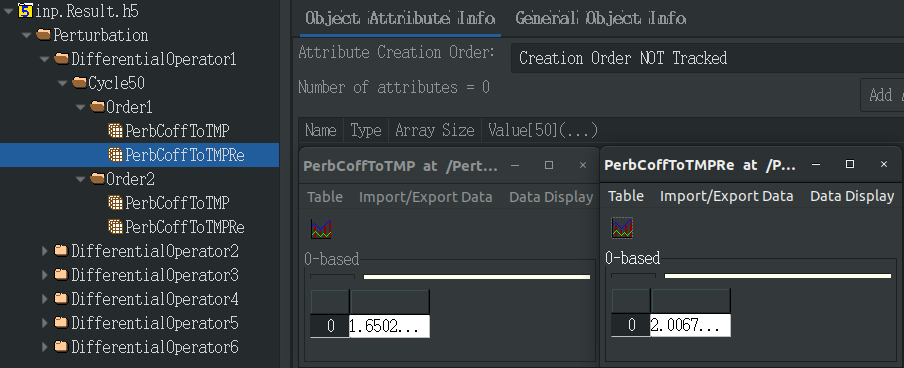

.. _section_eng_material_perturbation:

Material Perturbation (Enterprise Version Only)
================================================

RMC supports material perturbation functions in both criticality source and fixed source modes, including material
density perturbation and material temperature perturbation. Material temperature perturbation accounts for the Doppler
effect of microscopic cross-sections, i.e., the impact of temperature on nuclide microscopic cross-sections. Material
density perturbation, on the other hand, considers the effect of material density changes on response values.
For specific usage methods, refer to the input card instructions below.

Material Density and Temperature Perturbation Module Input Cards
--------------------------------------------------------------------

.. code-block:: none

    Perturbation
    Differentialoperator <id> [cell=<cell_vector>] [perbcellfilter=<params>] [material=<mat_vector>]
        [nuclide=<nuc_vector>] [variable=<param>] [estimator=<param>] [order=<param>] [sourceperb=<param>]
        [batchcycle=<param>]  [outputbycycle=<param>] [crosssection=<param>] [response=<param>]
        [tallycell=<cell_vector>] [tallycellfilter=<params>] [matnameid=<param>] [pressure=<param>]
        [gramdenpoly=<params>]

Where:

-  **CriticalitySearch** \  is the keyword for the criticality search module.

-  **differentialoperator** \  is the input card for the differential operator method, supporting multiple entries, each with a unique id.

-  **cell** \  is the vector of perturbed cells. The hierarchical input format is consistent with that in celltally.
   If not specified, only the material is used to locate the perturbed cells, meaning that all cells containing the
   perturbed material are considered perturbed cells. Otherwise, the cell and material are used together in an AND
   relationship to locate the perturbed cells. This input card is designed to narrow down the perturbation scope,
   as one material may fill multiple cells. Therefore, using the cell card allows further filtering of perturbed cells
   from those determined by the material.

-  **perbcellfilter** \  is the perturbed cell filter, and its usage follows the same format as the filter card in the tally section.

-  **material** \  is the ID of the perturbed material from the material card, and allows input of either a single material number
   or a list of material numbers, and cannot be omitted.

-  **nuclide** \  is the ZAID of the perturbed nuclide, and can be omitted, When omitted, it indicates all nuclides in the perturbed material.

-  **variable** \  is the perturbation type: 1 for material density perturbation (default), 2 for material temperature perturbation. 
   Material density perturbation considers the impact of density change on response quantities. If the matnameid
   card is not used, the program will only output the sensitivity coefficients of atomic density and mass density for the perturbed nuclide 
   in the perturbed material, which is accurate. If the matnameid card is used, the program will also calculate the material temperature
   coefficient based on the mass density coefficient, though this result is only for reference as the thermal properties of the same material 
   may vary depending on the user and application field. Temperature perturbation considers the impact of temperature on the microscopic 
   cross-section of nuclides, leading to a perturbation of the response quantities.

   Note: The temperature perturbation function requires enabling OTFDB in the material input card module. In AIS database mode,
   material temperature perturbation can account for the temperature effects of URR cross-sections, which requires enabling OTFPTB.
   If ptable=1 in the material card section, only first-order sensitivity coefficients can consider URR cross-section temperature effects.
   If ptable=2, second-order sensitivity coefficients can also account for URR cross-section temperature effects.

-  **estimator** \   is the Keff estimator for perturbation: 0 for collision estimator (default), 1 for absorption estimator, 2 for track-length 
   estimator.

   Note: Only the absorption estimator is allowed in TMS mode. When source perturbation is enabled, the track-length estimator may
   produce inaccurate results—it is recommended to use the collision estimator instead. For temperature perturbation,
   the absorption estimator is not advised.

-  **order** \  is the perturbation order: 1 for first-order perturbation, 2 for second-order perturbation (default);

-  **sourceperb** \  determines whether to use source perturbation: 0 for no source perturbation (default), 1 for source perturbation. Using 
   source perturbation improves accuracy but increases computation time. In fixed-source mode, the material perturbation function does not
   consider fission reactions, so there is no need to account for source perturbation effects, and no input is required.

-  **batchcycle** \  defines the cycles in a batch when using source perturbation. The default value is 5. This option is not required in
   fixed-source mode.

-  **outputbycycle** \  determines whether to output perturbation coefficients per cycle: 0 for final cycle only (default), 1 for output per cycle.
   This option is not required in fixed-source mode.

-  **crosssection** \  specifies the type of perturbation cross-section and is used only when variable=2 (temperature perturbation): 1 for total 
   cross-section (default), 2 for elastic scattering cross-section, 3 for fission cross-section, 4 for absorption cross-section. Multiple values 
   can be entered to perturb several cross-sections simultaneously, but the total cross-section cannot be perturbed along with other cross-sections. 
   For material density perturbation (variable=1), even if a non-1 value is entered, the program defaults to using 1.

-  **response** \  is the response quantity: 1 for effective multiplication factor, keff (default), 2 for power, 3 for neutron flux.

-  **tallycell** \  Specifies the response tally cells, used when the response quantities are power or flux. Multiple cell expansion formats can
   be input (i.e., the sum of response tallies across multiple cells is considered). The hierarchical input format is consistent with that in
   celltally. This tab is optional; if omitted, all cells in the model are treated as response tally cells.

-  **tallycellfilter** \  is the response tally cell filter, and its usage follows the same format as the filter card in the tally section.

-  **matnameid** \  is the material name identifier, used only for material density perturbation, for calculating the material temperature coefficient, 
   i.e., the sensitivity coefficient of response quantities to material temperature (considering only the effect of temperature on material density 
   and its subsequent impact on response quantities). Values: 1 for pure water, 2 for heavy water, 3 for borated water, 4 for solid beryllium, 
   5 for solid beryllium oxide. The default value is empty. If the user enters values of 1, 2, or 3 without using the gramdenpoly input card, 
   the pressure input card must also be used to provide the material's pressure.

   Note: When using matnameid, it indicates that the entire material is perturbed. Therefore, the nuclide input card should include all nuclides
   in the perturbed material, or an error will be reported. Additionally, the program will check the consistency between the user-specified material 
   and its nuclide composition to ensure self-consistency (e.g., borated water must not contain nuclides other than H, O, and B), though this is a 
   necessary but not sufficient check. The user is responsible for ensuring self-consistency, as inaccurate material temperature coefficients may 
   result otherwise.

-  **gramdenpoly** \  specifies the polynomial relationship between material density and temperature. This card must be used with the matnameid card.
   If the user wants to specify a polynomial relationship between density and temperature as :math:`\rho(g/cm^3)=aT^4+bT^3+cT^2+dT(K)+e`, the input card 
   should be gramdenpoly = `e d c b a`. Up to five parameters can be entered, representing a polynomial of up to the fourth degree. If this card is used, 
   the program will calculate the derivative of material density with respect to temperature based on the polynomial, then convert the material density 
   coefficient to a material temperature coefficient. Otherwise, for pure water and heavy water, the program uses the CoolProp library to calculate the 
   first- and second-order derivatives of material density with respect to temperature under given pressure and density conditions. For borated water, 
   RMC calculates the first- and second-order derivatives of density with respect to temperature based on boron concentration and water properties. 
   For Be, RMC uses the formula:

   .. math::
      \rho(kg/m^3) = 1869.84 -0.07168\ T(K) - 1.6151E-5\ T^2

   to calculate the first- and second-order derivatives of density with respect to temperature. For BeO, RMC uses the formula:

   .. math::
      \rho(kg/m^3) = &2870 - 4.419513\times 10^{-2}\ t(^{\circ}C) - 4.00365\times 10^{-5}\ t^2 + \\
                     &1.325079\times 10^{-9}\ t^3 + 3.117681\times 10^{-12}\ t^4

   to calculate the first- and second-order derivatives of density with respect to temperature.

-  **pressure** \  is the pressure value of the material, in MPa. The default value is 15.5. This card must be used with the matnameid card, 
   and is required only if matnameid is 1, 2, or 3 and the gramdenpoly card is not used.

Examples of Material Density and Temperature Perturbation Modules
-----------------------------------------------------------------------

.. code-block:: none

    PERTURBATION
    DifferentialOperator 1 cell = 21 > 4 > 0 > 60
                           perbcellfilter = 1 1 0 1
                           material = 1
                           variable = 2
                           sourceperb = 1
    DifferentialOperator 2 cell = 21 > 4 > 0 > 60
                           perbcellfilter = 1 1 0 1
                           material = 1
                           variable = 2
                           sourceperb = 1
                           response = 3
                           tallycell = 28
    DifferentialOperator 3 cell = 21 > 2 > 0 > 70 21 > 2 > 0 > 80
                           perbcellfilter = 1 1 0 1
                           material = 2 3
                           variable = 2
                           sourceperb = 1
    DifferentialOperator 4 cell = 21 > 2 > 0 > 70 21 > 2 > 0 > 80
                           perbcellfilter = 1 1 0 1
                           material = 2 3
                           variable = 2
                           sourceperb = 1
                           response = 3
                           tallycell = 28
    DifferentialOperator 5 cell = 21 > 3 > 0 > 70 21 > 3 > 0 > 80
                           perbcellfilter = 1 1 0 1
                           material = 2 3
                           variable = 2
                           sourceperb = 1
    DifferentialOperator 6 cell = 21 > 3 > 0 > 70 21 > 3 > 0 > 80
                           perbcellfilter = 1 1 0 1
                           material = 2 3
                           variable = 2
                           sourceperb = 1
                           response = 3
                           tallycell = 28
    
Material Density Perturbation and Temperature Perturbation Output File
-------------------------------------------------------------------------

The sensitivity coefficients are stored in the **Perturbation** data block of the .Result.h5 file, containing the
first- and second-order sensitivity coefficients calculated by the differential operator method, along with their
relative standard deviations, as illustrated in :numref:`perturbation_output_fig_eng` .

   Schematic Diagram of Material Perturbation Output