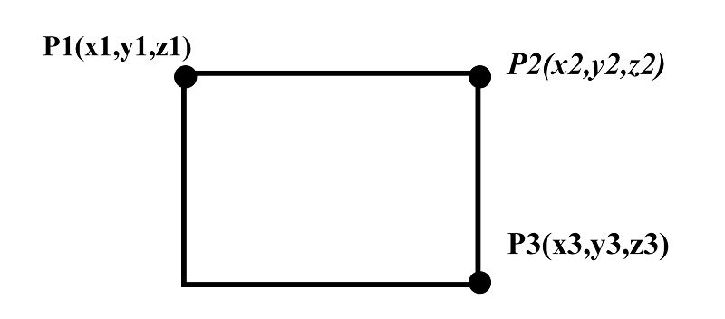
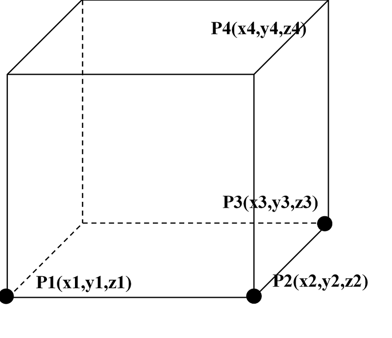

.. _section_eng_plot:

Plot
===========

RMC supports 2D and 3D visualization of models—the plotting function. 2D plotting displays the geometric/material 
information of a specific slice of the model. The program generates an image (in png format, viewable by commonly 
used image software) showing geometric/material information based on the user-specified rectangular location/range 
and image size. 3D plotting displays the model information within a specified cuboid range (in vti format, viewable 
by 3D visualization software such as VTK, ParaView, VisIt).

Both plotting modes use a pixel format, dividing the plotting area into a uniform pixel grid. Each grid's color 
corresponds to the material/cell at that geometric position. The user specifies the pixel dimensions of the image, 
such as pixel values for length and height for 2D images, and for length, width, and height for 3D images. The larger 
the pixel dimensions, the finer the image, but the larger the image file.

The plotting area is specified using the vertex method, where vertices define the plotting range. For 2D plotting, 
the rectangular plotting range is determined by the vertices of the top-left corner (P1), top-right corner (P2), and 
bottom-right corner (P3) (\ **If the image is aligned with the coordinate axes, only two vertices, P1 and P3, need to 
be defined** \  ), as shown in :numref:`plot_2d_fig_eng` . For 3D plotting, the cuboid plotting range is determined by four vertices,
as shown in :numref:`plot_3d_fig_eng`, where P1 is the reference point, and P2, P3, and P4 are vertices extending along the length,
width, and height directions, respectively.

   2D Plotting – A rectangular plotting range is determined by three vertices (P1, P2, P3) or two vertices (P1, P3).

   3D Plotting – A cuboid plotting range is determined by four vertices (P1, P2, P3, P4).

.. _section_eng_plot_cards:

Plotting Module Input Card
-----------------------------

The input format for the plotting module is as follows:

.. code-block:: none

  PLOT
  [ColorScheme = <scheme number>] [Continue-calculation = <flag>]
  PlotID <id> Type=<type> Color=<color> Pixels= <pixel_sizes> Vertexes= <vertexes>

Among them, 

-  **PLOT** is the keyword for the plotting module.

-  **ColorScheme** \  This option sets the color scheme for plotting (effective for color-filled 
   materials). The \ **scheme number** \  can be any positive integer, and different values will result 
   in random changes to the material-color pairing in the image. This option allows the user to 
   adjust the contrast of the image colors. The default value is \ **1** \ .

-  **Continue-calculation** \  This option controls whether the program continues calculation after plotting. 
   \ **0** \  means skipping calculation, and the program exits after plotting; \ **1** \  means the program continues
   calculation after plotting. The default value is \ **0** \ .

-  **PlotID** \  This option specifies the plotting parameters. The \ **<id>** \   option sets the plot ID for image
   identification, and the corresponding output image file name is \ *inputfilename*\ _plot_\ *id*\ (in png or vti format).

-  **Type** \  This option specifies the type of image, with selectable values being \ **Slice** \  or \ **Box** \ . \ **Slice** \  
   indicates a 2D image output, and \ **Box** \  indicates a 3D image output. The consistency of this option with 
   ColorType, Pixels, and Vertexes can be found in :numref:`plot_types_table_eng`.

-  **Color** \  This option sets the color style for plotting, referring to how the model information is colorized. 
   It includes material coloring and cell coloring, as well as the combination of whether to draw the cell boundaries, 
   resulting in five styles: material color style (\ **Mat** \  ), cell color style (\ **Cell** \  ), boundary surface style (\ **Surf** \  ), 
   material color with cell boundary style (\ **MatSurf** \  ), and cell color with cell boundary style (\ **CellSurf** \  ). Material/Cell 
   coloring means that the same cell/material is filled with the same color (the color scheme is determined by \ **ColorScheme** \  ), 
   and Surf means the cell boundaries are drawn with black lines (1-pixel width).

-  **Pixels** \  This option specifies the pixel dimensions of the image, i.e., the resolution of the plotting area. 
   A 2D image (\ **Slice** \  ) is determined by two pixel values (length × width), while a 3D image (\ **Box** \  ) is determined by three 
   pixel values (length × width × height). Pixel values must be positive integers. The larger the pixel dimensions, the 
   finer the image, but it also requires more memory. It is recommended that the image dimensions match the dimensions of 
   the plotting rectangle to avoid distortion.

-  **Vertexes** \  This option specifies the vertices of the plotting area. Each vertex is represented by three floating-point 
   numbers for x/y/z coordinates. For 2D images (\ **Slice** \  ), two vertices (\ **P1** \  and \ **P3** \ , where the plane is perpendicular to one 
   coordinate axis, i.e., x1 and x2, y1 and y2, z1 and z2 must have one group of equal values) or three vertices (\ **P1** \ , \ **P2** \ , 
   \ **P3** \ , where \ **P1→P2** \  is perpendicular to \ **P2→P3** \ ) are required. For example, Vertexes = -15 70 20 65 10 20 indicates that 
   the rectangle is perpendicular to the z-axis (on the z=20 plane). Note that the plotting plane should not coincide with user-defined curved 
   surfaces, as it will be difficult to identify geometric features at the plane (the program has certain automatic adjustment 
   features to avoid coincidence with surfaces, but it may not handle virtual surfaces such as interfaces of repeated structures, 
   which could result in errors).

   For 3D images (\ **Box** \ ), four vertices (\ **P1** \ , \ **P2** \ , \ **P3** \ , \ **P4** \ ) are required to define the plotting area, 
   where the vectors P1→P2, P2→P3, and P3→P4 must be mutually perpendicular. For example, \ **Vertexes** = 0 0 0 10 0 0 10 5 0 10 5 8.

.. table:: Plotting Parameter Consistency Relationship
  :name: plot_types_table_eng

  +---------+----------------------------------------+------------+--------------+
  |**Type** | **Color**                              | **Pixels** | **Vertexes** |
  +=========+========================================+============+==============+
  |**Slice**| Mat / Cell / Surf / MatSurf / CellSurf | 2 (int)    | 6 / 9 double |
  +---------+----------------------------------------+------------+--------------+
  |**Box**  | Mat / Cell / Surf*/ MatSurf*/ CellSurf*| 3 (int)    | 12 double    |
  +---------+----------------------------------------+------------+--------------+

\*Note: Not supported yet.

.. _section_eng_plot_example:

Example of Plotting Module Input
------------------------------------

Multiple images can be plotted in a single run, and the \ *inputfilename*.plot file output along with the images 
will save information such as image dimensions and color.

.. code-block:: c

  PLOT ColorScheme=9
  PlotID 1 Type = slice Color = Mat Pixels=900 900 Vertexes=0 20 0 20 0 0
  PlotID 2 Type = Slice Color = Cell Pixels= 1800 1265 Vertexes= 0 0 20 90 0 20 90 60 0
  PlotID 6 type = box color = Mat Pixels=100 100 200 vertexes = 0 0 0 10 0 0 10 10 0 10 10 20

