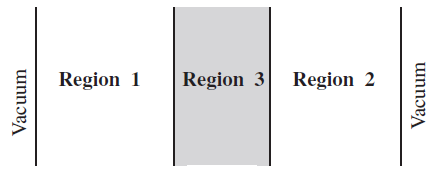

.. _section_eng_fsc:

Source Convergence Diagnosis and Acceleration
==============================================

Monte Carlo criticality calculation uses fission source iteration method. The convergence speed of fission source
distribution depends on the system dominance ratio. For systems with high dominance ratio (such as full reactor
and spent fuel pool), fission source convergence may take hundreds or even thousands of generations, resulting
in a lot of computing time wasted on inactive generations that do not directly contribute to the statistical results.

.. _section_eng_fsc_semesh:

Shannon Entropy and Progressive Relative Entropy Statistics
------------------------------------------------------------

The RMC source convergence module provides Shannon Entropy statistical function, which qualitatively reflects the
convergence trend of fission source distribution and helps users choose a reasonable number of inactive
generation neutrons.

Shannon entropy is defined as:

.. math::

    H(S) = - \sum_{i} S(i) \log _2 \left( S(i) \right)

where :math:`S(i)`  is the fission source fraction of the :math:`i` th mesh cell.

The RMC source convergence module also provides a progressive relative entropy (PRE) statistical function. Similar
to the Shannon entropy function, PRE can qualitatively reflect the convergence trend of the fission source
distribution and help users choose a reasonable number of inactive generation neutrons.

The relative entropy is defined as:

.. math::

    D(S||Y) = \sum_{i=1}^B S(i) \log _2 \left( \frac{S(i)}{Y(i)} \right)

where :math:`S` and :math:`Y` are fission source distributions, :math:`S(i)` and :math:`Y(i)` are the
fission source fraction of the :math:`i` th mesh cell. :math:`D(S||Y)` is always non-negative, and when :math:`S = Y` ,
:math:`D(S||Y) = 0`.

Shannon entropy can characterize the disorder of source distribution, while relative entropy characterizes the
deviation between two source distributions. The larger the relative entropy, the greater the deviation, and the
smaller the similarity between the two source distributions. The relative entropy may be infinite, so the quantity
that better characterizes the deviation between two source distributions is the progressive relative entropy PRE.
PRE is defined as:

.. math::

    PRE(j) = D(S^{(1)} || 0.5 \times (S^{(1)} + S^{(j)})) + D(S^{(j)} || 0.5 \times (S^{(1)} + S^{(j)}))

where :math:`S^{(j)}` is the fission source distribution of the :math:`j` th iteration step.

Shannon entropy or progressive relative entropy is defined by the following input card:

.. code-block:: none

  SeMesh [Scope = < xNum yNum zNum >]
  [Bound = <xMin xMax yMin yMax zMin zMax>]
  [PRE = <flag>]
  [Output = <flag>]

where,

-  **SeMesh** \ is the keyword for the Shannon Entropy Mesh input option.

-  **Scope** \ specifies the number of divisions in the Shannon entropy mesh in the x, y, and z directions.  \ **xNum** \,
   \ **yNum** \, and \ **zNum** \ are positive integers.

-  **Bound** \ specifies the boundary range of the Shannon entropy mesh in the x, y, and z directions. If
   the number of mesh divisions in a certain direction is specified as -1 in the \ **Scope** \ input option,
   the default mesh boundary is (-∞, +∞), and the boundary of the corresponding direction in \ **Bound** \ has
   no practical meaning. \*Note that the user should ensure that the mesh range can cover the neutron
   tracking area, otherwise the statistical results of the Shannon entropy will be incorrect.*\

-  **PRE** \ specifies whether to calculate the progressive relative entropy. When \ **PRE = 1** \, the progressive
   relative entropy is calculated; when \ **PRE = 0** \, the progressive relative entropy is not calculated
   (default value). *Note that the program can only calculate Shannon entropy or progressive relative
   entropy, not both.*

-  **Output** \ specifies whether to output the neutron source fractions in the mesh. When \ **Output = 0** \ (default),
   no neutron source fractions are output; when \ **Output = 1** \, the neutron source fractions for each generation
   are output to the \ **convergence/source** \ data set in the \ **.Info.h5** \ file, and each generation of
   data sets is named after the generation.

.. _section_eng_fsc_fet:

Statistics of the coefficients of the fission source distribution functional expansion
----------------------------------------------------------------------------------------------

The RMC source convergence module provides the function of statistical functional expansion
coefficients to characterize the shape of fission source distribution, qualitatively reflects
the change of fission source distribution shape with iteration steps, and helps users choose a
reasonable number of inactive generation neutrons.

The function is defined by the following input options:

.. code-block:: none

  FET [Axis = <x y z>]
  [Bound = <x_boundary_min x_boundary_max y_boundary_min y_boundary_max z_boundary_min z_boundary_max>]

where,

-  **FET** \ is the keyword for input card for the function.

-  **Axis** \  specifies the coordinate axis of the fission source distribution shape. The program only
   allows the use of functional expansion coefficients to characterize the fission source distribution
   shape from the three coordinate axes of the Cartesian coordinate system, namely, x, y, and z. For
   example, if the functional expansion coefficients in the x and z directions are needed to characterize
   the fission source distribution shape, you need to specify \ **Axis = 1 0 1** \.

-  **Bound** \ specifies the boundary range of the fission source distribution shape in three directions. The
   boundary range needs to be larger than the positions where all neutrons may undergo fission reactions,
   and the smaller the better. Note that \ **boundary_min < boundary_max** \. When statistics in a certain
   direction are not needed, the relevant values can be arbitrary. For example, if the functional
   expansion coefficients in the x and z directions are needed to characterize the fission source
   distribution shape, you can specify \ **Bound = -300 300 0 0 0 300** \.

It should be noted that this option is not compatible with the fission source convergence acceleration methods
(such as asymptotic Wieland, asymptotic hyperhistory method).

.. _section_eng_fsc_fmmesh:

Fission Matrix Statistics
--------------------------

The RMC source convergence module also provides fission matrix statistics. Based on the fission matrix,
Monte Carlo undersampling can be diagnosed and the dominance ratio can be calculated. In addition to using
the fission matrix to calculate the dominance ratio, RMC also supports the dominance ratio calculation method
based on the error transfer matrix, which is not available in the current version.

The fission matrix is defined as follows: Each element :math:`F_{ij}` in the fission matrix *F* indicates the
probability of neutrons born in area :math:`j` undergoing fission to produce neutrons in area :math:`i`.

.. math::

    F_{ij} = \frac {\int _{Vi} dr \int _{Vj} dr' f(r'\rightarrow r) s_0 (r') }
    {\int _{Vj} dr' s_0 (r')}

The input format of the fission matrix statistics input option is similar to the Shannon entropy statistics card:

.. code-block:: none

  FmMesh [Scope = < xNum yNum zNum >]
  [Bound = <xMin xMax yMin yMax zMin zMax>]

where,

-  **FmMesh** \ is the keyword for the fission matrix mesh input option.

-  **Scope** \ specifies the number of mesh divisions of the Shannon entropy mesh in the x, y, and z directions.
   \ **xNum** \, \ **yNum** \, and \ **zNum** \ are positive integers. The size of the fission matrix is
   (**xNum** \ \*\ **yNum\*zNum**)\ :sup:`2`\ , and if the mesh division is too fine, the calculation efficiency may
   be reduced.

-  **Bound** \ specifies the boundary range of the Shannon entropy mesh in the x, y, and z directions. If the
   number of mesh divisions in a certain direction is specified as -1 in \ **Scope** \, the default mesh
   boundary is (-∞, +∞), and the boundary of the corresponding direction in \ **Bound** \ has no practical
   meaning. *Note that the user should ensure that the mesh range is able to cover the neutron tracking area,
   otherwise the statistical results of the fission matrix will be wrong.*

.. _section_eng_fsc_accefsc:

Source Convergence Acceleration
--------------------------------

RMC uses the asymptotic hyperhistory method and the asymptotic Weiland method to accelerate source
convergence and reduce the number of inactive generations. The current version only provides the
asymptotic hyperhistory acceleration method.

The input options for the source convergence acceleration function are:

.. code-block:: none

  AcceFsc [Factor = <f(1) p(1) f(2) p(2) …f(n) p(n)>]
          [AutoFactor = <inactive_cycle>]

where,

-  **AcceFsc** \ is the keyword for the Shannon Entropy Mesh Input Card.

-  **Factor** \ and \ **AutoFactor** \ are used to specify the parameters of
   the asymptotic hyperhistory acceleration method and will be discussed separately later.

Factor Input Option
~~~~~~~~~~~~~~~~~~~

**Factor** \ is used to customize the acceleration parameters. The f(i) in the input card is called
the acceleration factor, and p(i) is called the acceleration period. Its meaning is: in the first
p(1) generation, use the acceleration factor f(1); in the next p(2) generation, use the acceleration factor
f(2); and so on. The principle of the asymptotic superhistorical acceleration method is not introduced in
detail here, only the two parameters of the acceleration factor and the acceleration period are introduced as follows:

The larger the acceleration factor f(i), the more obvious the acceleration effect is, but the statistical
fluctuation may also be greater. The user needs to define a set of asymptotically decreasing acceleration
factors {f(i)}, such as "16 → 8 → 4 → 2". *Note that the acceleration factor should not be too large
(it is recommended to be less than 20), otherwise it may cause instability.*

The acceleration period p(i >1) is generally set to 5-10 generations. The first acceleration period p(1) is
usually set larger because it corresponds to the largest acceleration factor and plays a major role in the
acceleration effect.

The asymptotic hyperhistory acceleration method acts on the first few inactive generations, and the
acceleration effect it produces is roughly equivalent to the time taken to compute all inactive generations
without acceleration. For example, a full-reactor critical calculation requires about 200 inactive generations
without acceleration. By using "factor = 16 10 8 5 4 5 2 5" to accelerate the first 10+5+5+5=25 inactive generations, a
basically equivalent convergence effect as computing 200 non-accelerated inactive generations can be achieved.

AutoFactor Input Option
~~~~~~~~~~~~~~~~~~~~~~~

As an alternative to \ **Factor** \, the RMC program provides \ **AutoFactor** \ for automatically generating source
convergence acceleration parameters. For ordinary users, it is recommended to use \ **AutoFactor** \ instead of the
custom input in \ **Factor** \. In \ **AutoFactor** \, the user specifies the number of inactive generations
when the acceleration method is not used (**inactive_cycle**), and the program will automatically generate
the parameter sequence of the asymptotic hyperhistory method. Assuming that the number of inactive
generations when the acceleration method is not used is N, the required number of inactive generations after
using \ **AutoFactor** \ is approximately:

.. math::

    N' = \frac {N}{16} + 15

For example, a full-reactor calculation requires 300 generations to converge.
After using automatic source convergence acceleration, the required inactive generations can be
set to: :math:`N' = \frac {300}{16} + 15 \approx 35`. If the number of inactive generations N
specified in  \ **AutoFactor** \ is less than 30, the program will turn off the source convergence acceleration function.

Notes on Source Convergence Acceleration
~~~~~~~~~~~~~~~~~~~~~~~~~~~~~~~~~~~~~~~~~~~

When using the source convergence acceleration method, reasonable matching parameters should be used in the
PowerIter input option of the criticality calculation module, including:

1）Specify a reasonable initial effective multiplication factor in \ **Keff0** \ to allow the final result to be
close to the true Keff.

2）Specify a sufficiently large number of particles per generation in \ **Population** \. For full-reactor
criticality calculations, it is recommended that the number of particles per generation be greater than 100,000.

3）Specify a reasonable number of inactive generations in \ **Population** \. The number of inactive generations
should be greater than or equal to the source convergence acceleration number.

.. _section_eng_fsc_example:

Source Convergence Module Input Example
---------------------------------------

Acceleration of OECD benchmark source convergence
~~~~~~~~~~~~~~~~~~~~~~~~~~~~~~~~~~~~~~~~~~~~~~~~~~

   OECD Monte Carlo source convergence benchmark problem

:numref:`source_convergence_fig_eng` describes a benchmark problem in the OECD Monte Carlo source convergence study.
The benchmark problem is a weakly coupled system consisting of three 1D plates, with 20 cm thick fuel zones on both
sides and a 30 cm water layer in the middle. The initial source position is located at the center of the fuel zone
on the left. The number of inactive generations required for conventional source iteration convergence is about 1000.
Through the RMC source convergence acceleration method, the number of inactive generations can be reduced to less
than 100. In the source convergence module of :numref:`source_convergence_input_eng`, the number of Shannon entropy mesh
cells is specified to be 70 and the width is 1.0 cm. This example requires a large number of particles to be
simulated, and it is recommended to use a parallel machine to complete the calculation.

|

.. code-block:: c
  :caption: OECD Monte Carlo Source Convergence Input
  :name: source_convergence_input_eng

  ///// OECD MC convergence benchmark 3 . SHE Ding 2012-09-12 /////
  UNIVERSE 0
  cell 1 1 & -2 mat = 1
  cell 2 2 & -3 mat = 2
  cell 3 3 & -4 mat = 1
  cell 4 -1 : 4 void = 1

  SURFACE
  surf 1 px 0
  surf 2 px 20
  surf 3 px 50
  surf 4 px 70

  MATERIAL
  mat 1 9.9487E-02
        92235.30c 7.6864E-05
        92238.30c 6.8303E-04
        8016.30c 3.7258E-02
        1001.30c 5.9347E-02
        7014.30c 2.1220E-03
  mat 2 1.0006E-01
        1001.30c 6.6706E-02
        8016.30c 3.3353E-02

  CRITICALITY
  PowerIter population = 500000 100 1000
  InitSrc point = 10 0 0

  Tally
  Celltally 1 type = 1 cell = 1 3

  CONVERGENCE
  SeMesh Scope = 70 -1 -1 Bound = 0 70 0 1 0 1
  FmMesh Scope = 70 -1 -1 Bound = 0 70 0 1 0 1
  AcceFsc Autofactor = 1000

Hoogenboom Full-Reactor Benchmark Source Convergence Acceleration
~~~~~~~~~~~~~~~~~~~~~~~~~~~~~~~~~~~~~~~~~~~~~~~~~~~~~~~~~~~~~~~~~

:numref:`fsc_hoogenboom_input_eng` describes the Hoogenboom Monte Carlo full-reactor benchmark. The number of inactive
generations required for the conventional source iteration to converge is about 250. By using the automatic source
convergence acceleration parameter, the number of inactive generations is set to 35. In the source convergence
input module, a Shannon entropy mesh (21×21) based on the component is defined to help the user diagnose the source
convergence trend. This example requires a large number of particles to be simulated, and it is recommended
to use a running machine capable of parallelization to complete the calculation.

|

.. code-block:: c
  :caption: Hoogenboom Monte Carlo Full-Reactor Benchmark Input
  :name: fsc_hoogenboom_input_eng

  // same model as previous

  CONVERGENCE
  SeMesh Scope = 21 21 1 Bound = -224.91 224.91 -224.91 224.91 -229 223
  AcceFsc Autofactor = 250

