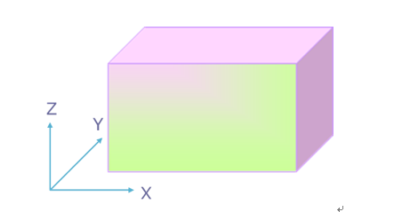
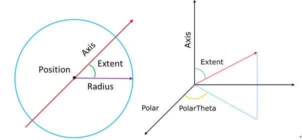
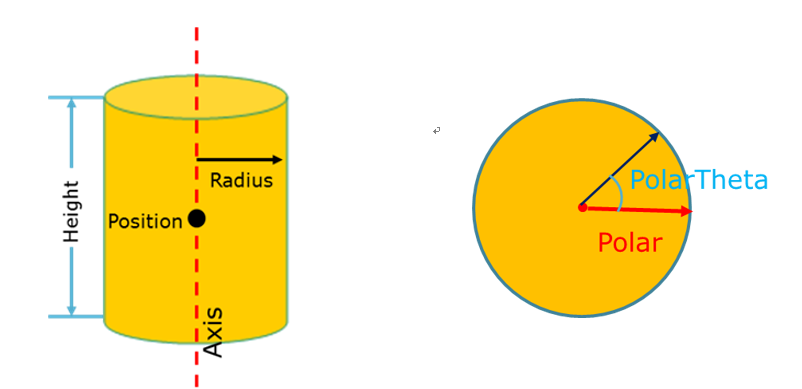
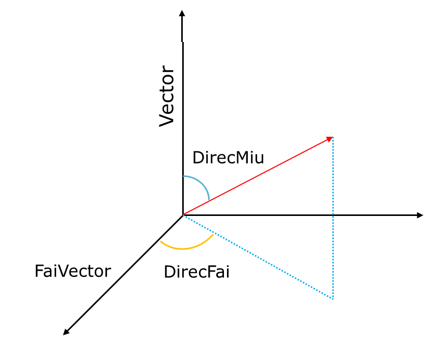

.. _section_eng_external_source:

Source Description
==================

RMC supports users to flexibly describe the information of source particles, such as particle type, initial
position, initial energy and initial flight direction.

According to the particle type, users can define neutron sources, photon sources, and mixed sources containing both
neutrons and photons; according to the purpose of calculation, they can be divided into critical sources and
shielding sources; according to the distribution of the starting position of the source particles, users can
define point sources, line sources, plane sources, spherical sources, cuboid volume sources, cylindrical (cylindrical
tube) volume sources, and spheres (including spherical shell volume sources), etc; it can not only support
specific initial particle flight directions and energies, but also support the definition of initial
particle flight directions and energies through probability table distribution (including discrete distribution
and piecewise uniform distribution) and built-in power functions and exponential functions. Amongst them, Maxwell
fission spectrum, Watt fission spectrum, Gaussian fusion spectrum, evaporation spectrum, etc. are also built-in to
describe energy. When defining the direction or energy information of the source particles, biased sampling can be
used to make more particles fly in the direction of interest to the user, which can reduce the statistical variance
of the area of interest to the user.

Source Description Module Input Option
--------------------------------------

.. code-block:: none

     EXTERNALSOURCE
     Source <id>  Fraction=<fraction>  [Particle=<particle_type>]
            [<Simple type>={params}] [Surface=<surface_id>]  [X=<x>  Y=<y>  Z=<z>]
            [Position=<position>]  [Radius=<radius>] [Axis=<axis>]
            [Polar=<polar_base_vector>]  [PolarTheta=<polar_theta>]  [Extent=<extent>]
            [Height=<height>]  [Norm=<norm>]  [Vector=<direction_basis_vector>
            [DirecMiu=<direction_miu>]  [FaiVector=<fai_basis_vector>]
            [DirecFai=<direction_fai>]  [Energy=<energy>]  [Cell=<cell_vector>]
            [SampEff=<efficiency>] [Biasfrac=<biasfrac>] [Weight=<weight>]
            [Transform=<transform_id>]
     SurfSrcRead  OldSurf=< S1 S2 S3……Sn >  NewSurf = < S11 S21 S31…Sm1…Smn >
                  Cell=<cell_vector_group>  Party=<params>  Coli=<coli>
                  Wtm=<wtm> Axis=<x1 x2 x3>   Extent=<id>  Posace=<posace> Tr=<id> ssr=<flag>
     Distribution  <id>  [Depend = <id>]  Type = <flag>  Value= <params>
                   Probability = <params>  [Bias = <params>]
     Transform  <id>  [Move=<x1 x2 x3>]  [Rotate=<a11 a12 a12 a21……a33>]
     H5SourceInfo filename=<file> groupname=<group>

where,

-  \ **EXTERNALSOURCE** \ is the keyword for source description. \ **Source** \ defines general source description, and
   \ **SurfSrcRead** \ defines continuous surface sources. \ **Source** \ and \ **SurfSrcRead** \ cannot be defined at the same
   time; \ **Distribution** \ is used to define the distribution used in \ **Source** \ and \ **SurfSrcRead** \,
   \ **Transform** \ is used to define the coordinate transformation used in \ **Source** \ and \ **SurfSrcRead** \, and
   \ **Distribution** \ and \ **Transform** \ have to be used in conjunction with \ **Source** \ and \ **SurfSrcRead** \;
   if the \ **Source** \ or \ **SurfSrcRead** \ input options do not contain distribution and coordinate transformation, they
   cannot be defined; lastly, aside from the \ **SurfSrcRead** \ input option where only a single option can be defined,
   the other three options can be defined with one or more values, without any specific order. The following
   introduces how to use the four input options respectively.

Source Input Option
~~~~~~~~~~~~~~~~~~~~~~~~~~~~~~~~~~~~~

The Source input card specifies the basic parameters of the source particles.

-  **ID** \ specifies the \ **Source** \ serial number, and it is for the user's convenience to distinguish between the IDs.
   It must be a positive, non-repeating integer.

-  **Fraction** \ specifies the weightage of the source and it must be greater than 0. This weightage is meaningful
   only when the user defines multiple sources. The weightage reflects the relative size of each source and the user
   does not need to perform normalization.

-  **Particle** \ specifies the type of source particles. The parameter must be a positive integer 1, a positive integer
   2, or a D+ positive integer. 1 represents neutrons, 2 represents photons, and the D+ positive integer indicates
   that the type of particle is described by a distribution (distributions in this module are all in this form).
   The distribution needs to be defined in the \ **Distribution** \ card. The positive integer is the corresponding
   distribution number (corresponding to the the ID of the \ **Distribution** \ card). The default value of this variable is
   1, indicating that the default particle type is a neutron.

-  **Simple type** \ is used to conveniently define commonly used uniform volume sources: uniformly distributed
   point sources, uniform spherical (shell) volume sources, and cylindrical (shell) volume sources with axes
   parallel to the coordinate axes. For detailed parameters, see.

.. table:: Initial source distribution supported by **Simple type** \
  :name: source_types_eng

  +------------+-----------------------------------------------------------+-----------------------+
  |Keyword     |Description                                                |Parameters             |
  +============+===========================================================+=======================+
  | **Point**  |Isolated point source                                      |x1 y1 z1 x2 y2 z2 …    |
  +------------+-----------------------------------------------------------+-----------------------+
  | **Sphere** |Sphere (shell) uniform source                              |x y z Rmin Rmax        |
  +------------+-----------------------------------------------------------+-----------------------+
  | **Cyl/x**  |Cylindrical (shell) uniform source parallel to the x-axis  |y z xmin xmax Rmin Rmax|
  +------------+-----------------------------------------------------------+-----------------------+
  | **Cyl/y**  |Cylindrical (shell) uniform source parallel to the y-axis  |x z ymin ymax Rmin Rmax|
  +------------+-----------------------------------------------------------+-----------------------+
  | **Cyl/z**  |Cylindrical (shell) uniform source parallel to the z-axis  |x y zmin zmax Rmin Rmax|
  +------------+-----------------------------------------------------------+-----------------------+

-  **Surface** \ specifies a surface defined in the \ **Surface** \ module (spherical or flat surface only). This variable is
   used to define the surface source. The parameter is the surface number (positive integer) defined in the \ **Surface** \
   module or D+ positive integer. A D+ positive integer indicates that the surface number is described by the
   distribution whose ID is the positive integer in the **Distribution** \ card.
-  **X** \ specifies the value of coordinate x. There are two forms of definition:
   1. \ **X** \ = x indicates that \ **X** \ takes on a fixed value x;
   2. \ **X** \ = D+ positive integer, indicating that \ **X** \ is described by the distribution whose ID in the
   \ **Distribution** \ input option is the positive integer.
   \ **X** \ needs to be used in combination with \ **Y** \ and \ **Z** \.
-  **Y** \ specifies the value of coordinate y. There are two forms of definition:
   1. \ **Y** \ = y indicates that \ **Y** \ takes on a fixed value y;
   2. \ **Y** \ = D+ positive integer, indicating that **Y** is described by the distribution whose ID in the
   \ **Distribution** \ input option is the positive integer.
   \ **Y** \ needs to be used in combination with \ **X** \ and \ **Z** \.
-  **Z** \ specifies the value of coordinate z. There are two forms of definition:
   1. \ **Z** \ = z indicates that **Z** \ takes on a fixed value z;
   2. \ **Z** \ = D+ positive integer, indicating that \ **Z** \ is described by the distribution whose ID in the
   \ **Distribution** \ input option is the positive integer.
   \ **Z** \ needs to be used in combination with \ **X** \ and \ **Y** \.
-  **Position** \ specifies the reference position coordinates in a rectangular coordinate system and has two definition forms:
   1. \ **Position** \ = x y z；
   2. \ **Position** \ = D+ positive integer, indicating that \ **Position** \ is described by the distribution whose ID in the
   \ **Distribution** \ input option is the positive integer, and the distribution must satisfy \ **type** \ = 2
   (indicating that the object described by the distribution is a coordinate or a vector).
-  **Radius** \ specifies the radius of the sphere or circle with \ **Position** \ as the center. There are two forms of
   definitions:
   1. \ **Radius** \ = non-negative floating point number, indicating that the radius is the non-negative floating point number;
   2. \ **Radius** \ = D+ positive integer, indicating that \ **Radius** \ is described by the distribution whose ID in the
   \ **Distribution** \ input option is the positive integer
   This variable is used when defining a sphere (shell) volume source or a cylinder (shell) volume source. The default value is 0.
-  **Axis** \ specifies the reference direction of a position description. There are two forms of definition:
   1. \ **Axis** \ = u v w;
   2. \ **Axis** \ = D+ positive integer, indicating that \ **Axis** \ is described by the distribution whose ID in the
   **Distribution** input option is the positive integer, and the distribution must satisfy \ **type** \ = 2
   (indicating that the object described by the distribution is a coordinate or a vector). This variable is used
   when defining a spherical source or a cylindrical (shell) volume source.
-  **Extent** \ specifies the cosine value of the angle between the line connecting the sampling position of the
   spherical source and the center of the sphere and \ **AXIS** \. There are two forms of definition:
   1. \ **Extent** \ = floating point number, the range of this floating point number is [0,1].
   2. \ **Extent** \ = D+ positive integer, indicating that \ **Extent** \ is described by the distribution whose ID in the
   \ **Distribution** \ input option is the positive integer, and the range of this distribution must also be [0,1].
   This variable is used when defining a spherical volume source or a spherical source.
-  **Polar** \ specifies the polar reference direction when describing the position. There are two forms of definition:
   1. \ **Axis** \ = u v w；
   2. \ **Axis** \ = D+ positive integer, indicating that \ **Axis** \ is described by the distribution whose ID in the
   \ **Distribution** \ input option is the positive integer, and the distribution must satisfy \ **type** \ = 2
   (indicating that the object described by the distribution is a coordinate or a vector). This variable is
   used when defining a spherical source or a cylindrical (shell) volume source.
-  **PolarTheta** \ specifies the angle between the sampling position and the polar reference direction (**Polar**)
   when projected onto a plane perpendicular to \ **Axis** \. There are two forms of definition:
   1. \ **PolarTheta** \ = floating point number, which is the angle in radians.
   2. \ **PolarTheta** \ = D+ positive integer, indicating that \ **PolarTheta** \ is described by the distribution whose ID in the
   \ **Distribution** \ input option is the positive integer. This variable is used in conjunction with \ **Polar** \.
-  **Height** \ specifies the height of the cylindrical (shell) volume source along the axis \ **AXIS** \. There are
   two definition forms:
   1. \ **Height** \ = floating point number means that the value of \ **Height** \ is the floating point number;
   2. \ **Height** \ = D+ positive integer, indicating that \ **Height** \ is described by the distribution whose ID in the
   \ **Distribution** \ input option is the positive integer. This variable is used when defining a spherical
   source or a cylindrical (shell) volume source.
-  **Norm** \ specifies the sign of the reference flight direction \ **Vector** \ or surface normal, which can
   only be defined with two values: 1 or -1. A value of 1 means the sign is consistent with the reference
   flight direction \ **Vector** \, and -1 means the sign is opposite to the reference flight direction \ **Vector** \ or
   inward along the surface normal. The default value is +1.
   1. \ **Vector** \ = u v w;
   2. \ **Vector** \ = D+ positive integer, indicating that \ **Vector** \ is described by the distribution whose ID in the
   \ **Distribution** \ input option is the positive integer, and the distribution must satisfy \ **type** \ = 2
   (indicating that the object described by the distribution is a coordinate or a vector).
-  **DirecMiu** \ specifies the cosine value of the angle between the particle flight direction and the reference
   direction \ **Vector** \. There are two definition forms:
   1. \ **DirecMiu** \ = floating point number, the range of the floating point number is [-1.0, 1.0].
   2. \ **DirecMiu** \ = D+ positive integer, indicating that \ **DirecMiu** \ is described by the distribution whose ID in the
   \ **Distribution** \ input option is the positive integer, with the range of the distribution also being [-1.0, 1.0].
   \ **DirecMiu** \ must be used in conjunction with \ **Vector** \ and cannot be used alone.
-  **FaiVector** \ specifies a direction perpendicular to the reference direction (\ **Vector** \）of the particle flight.
   There are two forms of definition:
   1. \ **FaiVector** \ = u v w；
   2. \ **FaiVector** \ = D+ positive integer, indicating that \ **FaiVector** \ is described by the distribution whose ID in the
   \ **Distribution** \ input option is the positive integer, and the distribution must satisfy \ **type** \ = 2
   (indicating that the object described by the distribution is a coordinate or a vector). \ **FaiVector** \ must be used in
   conjunction with \ **Vector** \ and must be perpendicular to \ **Vector** \
-  **DirecFai** \ specifies the angle between the sampled flight direction and the polar reference direction (\ **Polar** \)
   when projected onto a plane perpendicular to \ **Vector** \. There are two forms of definition:
   1. \ **DirecFai** \ = floating point number, which is the angle in radians.
   2. \ **DirecFai** \ = D+ positive integer, indicating that \ **DirecFai** \ is described by the distribution whose ID in the
   \ **Distribution** \ input option is the positive integer.
   \ **DirecFai** \ is used in conjunction with \ **FaiVector** \.
-  **Energy** \ specifies the initial energy of the particle. The energy range allowed for neutrons is 10-11MeV to
   20MeV, and the energy range allowed for photons is 1keV to 1GeV. There are two forms of definition:
   1. \ **Energy** \ = energy value (floating point number), which must be within the above range.
   2. \ **Energy** \ = D+ positive integer, indicating that \ **Energy** \ is described by the distribution whose ID in the
   \ **Distribution** \ input option is the positive integer, and the value range of the distribution must also be
   consistent with the energy range of the neutron or photon mentioned above. The default value is 4MeV.
-  **Cell** \ specifies the cell number where the particle sampling position is located. There are two definition forms:
   1. \ **Cell** \ = c_0>c_1>...>c_n，c_0>c_1>...>c_n is a cell vector. The specific meaning will be further
   explained in the following instructions.
   2. \ **Cell** \ = D+ positive integer, indicating that \ **Cell** \  is described by the distribution whose ID in the
   \ **Distribution** \ input option is the positive integer，At this time, the type of distribution must satisfy
   \ **type** \ = 3 (indicating that the object described by the distribution is a cell vector).
-  **SampEff** \ specifies the minimum efficiency of particle sampling, and its value must be a floating point
   number between (0,1.0). When the sampling efficiency is lower than this value, the program will report an
   error and exit automatically.
-  **Biasfrac** \ specifies the bias parameter for each source.
-  **Weight** \ specifies the initial weight of the source particle. It does not support distribution
   description, only single values.
-  **Transform** \ specifies the coordinate transformation (rotation and translation) of the source particle position
   and flight direction. The parameters of the coordinate transformation are defined in the \ **Transform** \ input option.

Instructions for use:

In addition to the source fraction (Fraction), particle type (Particle) and particle energy (Energy),
the remaining variables can be divided into two categories: position variables (Simple type, Surface, XYZ,
Position, Radius, Axis, Extent, Polar, PolarTheta, Height) and direction variables (Norm, Vector,
DirecMiu, FaiVector, DirecFai), which are used to define the initial position and initial direction of the particle
respectively; the Cell variable specifies the cell where the particle's initial position is located, which
is defined by the cell vector or distribution.

1. Location variables: Different combinations of variables can be used to define initial sources with
different location distributions.

\ **Simple type** \ is for users to define some simple uniform volume sources. It is easy to use, but its functions
are relatively limited. \ **Simple type** \ and other position variables are mutually exclusive and cannot be
used at the same time.

\ **Cuboid Volume Source** \ : X, Y, and Z are used together to define line sources, plane sources parallel to
the coordinate axes, and cuboid volume sources. X, Y, and Z variables are mutually exclusive with other
position variables and cannot be used at the same time.

   Cuboid Volume Source

\ **Spherical volume source** \: Position, Radius, Axis, Extent, Polar, and PolarTheta can be combined to define a
spherical (shell) volume source, as shown in :numref:`sphere_source_eng`. Position specifies the position of the
center of the sphere, and Radius specifies the radius. In this case, Radius must be a single value
(spherical surface) or described by a quadratic function distribution (distribution is described below).
The default value of Radius is 0, which is a point source. Axis defines a reference direction, and Extent
specifies the cosine value of the angle between the line connecting the sampling position point and the center
of the sphere and the reference direction Axis. Polar defines a direction perpendicular to Axis, and PolarTheta
is the angle between the projection of the line connecting the particle sampling position and the center of the
circle on the plane perpendicular to Axis and the Polar direction, that is, the azimuth (expressed in radians).
If Polar and PolarTheta are missing, the azimuth is uniformly sampled from 0 to 2π. If Axis, Extent, Polar, and \
PolarTheta are all missing, the sampling is uniform on the spherical surface specified by Surface.

   Sphere volume source

\ **Cylinder volume source** \: Position, Radius, Axis, Polar, PolarTheta, and Height are combined to define the
cylinder (shell) volume source. As shown in :numref:`cylinder_source_eng`, Position defines the reference point on
the axis of the cylinder (shell), Radius defines the radius of the cross section of the cylinder (shell),
which needs to be a single value (cylinder surface) or described by a linear function distribution, Axis
defines the direction vector of the axis of the cylinder (shell) (no unitization is required), Polar defines
a direction perpendicular to Axis, and PolarTheta is the angle between the line connecting the center of the
circle on the cross section where the particle sampling position is located and Polar (expressed in radians).
Height defines the distance of the cylinder (shell) from the point Position along the Axis direction, which
is positive if it is in the same direction as the Axis direction and negative if it is in the opposite direction.

   Cylinder (shell) volume source

\ **Plane source** \: The combination of Surface, Position, and Radius variables can define a plane source.
Surface specifies a plane (pre-defined in the Surface module), Position specifies a reference point on
the plane (must be on the plane), and Radius specifies the radius of the circle with Position as the center
on the plane. In this case, Radius needs to be a single value or a linear function distribution.

\ **Spherical surface source** \: The five variables Surface, Axis, Extent, Polar, and PolarTheta can be
combined to define a spherical source. Surface specifies a sphere (pre-defined in the Surface module),
Axis defines a reference direction, and Extent specifies the cosine value of the angle between the line
connecting the sampling position point on the sphere and the center of the sphere and the reference direction
Axis. Polar defines a direction perpendicular to Axis, and PolarTheta is the angle between the projection
of the line connecting the particle sampling position and the center of the circle on the plane perpendicular
to Axis and the Polar direction, that is, the azimuth (expressed in radians). If Polar and PolarTheta are
missing, the azimuth is sampled uniformly from 0 to 2π. If Axis, Extent, Polar, and PolarTheta are all missing,
the sampling is uniform on the sphere specified by Surface.

2. Direction variable

The five variables Norm, Vector, DirecMiu, FaiVector, and DirecFai are combined to define the initial
flight direction of the particle. As shown in :numref:`flying_direction_eng`, Vector specifies a reference direction, and
DirecMiu specifies the cosine value of the angle with Vector. The two variables are used in combination.
FaiVector specifies the reference direction perpendicular to Vector, and DirecFai is the angle between the
flight direction and FaiVector when projected onto a plane perpendicular to Vector, i.e. the azimuth
(radian system). When FaiVector and DirecFai are default, the azimuth φ is uniformly sampled on (0,2π).
When Vector, DirecMiu, FaiVector, and DirecFai are all in their default values, if the position variable Surface is not
defined, the default flight direction is isotropic; if the position variable Surface is defined, the angle
between the flight direction and the normal direction of the surface where the sampling position point is
located is cosine distributed on (0,π/2) (p(θ)=cos(θ) or p(μ)=μ), and the azimuth angle φ is uniformly
sampled on (0,2π).

   Flight direction

3. Cell variables

The Cell variable is used to specify the cell where the particle's initial position is located, and is
described by the cell vector c_0>c_1>…>c_n or distribution (the distribution must use the corresponding
distribution type in this case). c_0 is a cell in the reference space (Universe 0), c_1 is a cell in the
space (Universe) that fills the cell c_0, and they are filled downwards in sequence, and c_n is not necessarily
the bottom cell (i.e. c_n can still be filled by other spaces).

It should be noted that if the Cell variable is not defined, the defined particle position and direction
are absolute coordinates. If the Cell variable is defined, the defined particle position and direction become
relative coordinates. If the defined particle position and direction are within the mesh cell c_n (here
refers to the range of the mesh cell c_n directly defined in the Cell tab), the sampling position and flight
direction are accepted. Otherwise, the sampling position and flight direction are rejected and re-sampling
is required. After that, the accepted sampling position and flight direction will be rotated and translated
according to the filling method during geometry construction to obtain the final particle position and flight
direction.

If the space (Universe I) of the filled mesh cell c_i is a repeated geometric structure, then c_(i+1) should
be replaced by the arrangement order position of the repeated geometry in the space (Universe I). (Refer to
the description of the repeated geometry hierarchy in CellTally) If the space (Universe I) is a repeated
geometric structure, the arrangement position coordinate is directly written as 0, which means that each
unit structure is uniformly extracted in the repeated geometric structure of the space.

For example: For a 3x3x2 quadrilateral repeating geometric structure, if Cell=4>3>8, then 4 is the mesh
cell in the basic space (Universe 0), mesh cell 4 is filled by the space of a 3x3x2 quadrilateral repeating
geometric structure, 3 represents the third mesh cell filled in the quadrilateral repeating geometric
space (the mesh cell filling order in RMC is x, y, z), and the coordinates are counted from the coordinate
origin, the third in the x direction, the first in the y direction, and the first in the z direction. The
repeating unit is located in the filling space. If Cell=4>10>8, 10 represents the tenth repeated geometric mesh
cell filled, and the coordinates are represented as mesh cell 10 in the filling space at (1 1 2). If the
extracted particle is within the area obtained by the surface Boolean operation of cell 8, the position
and direction of the particle are accepted, and then it is rotated or translated following the space where
cell 8 is located (if rotation and translation exist at the same time, it is first rotated around the origin
and then translated), filled into the repeated geometric space, and finally filled into cell 4 in the basic space
(Universe 0) to obtain the final information such as the sampled particle position and flight direction.

Note that the Cell card is compatible with the MCNP-style lattice format, that is, it uses three-point
annotation (x, y, z). Taking the 3x3x2 quadrilateral repeating geometric structure as an example, if
Cell=4>3>8, the corresponding MCNP expansion is 4>(3 1 1)>8. However, you need to install the RMC python module.

At the same time, when describing the source position information, if you need to define a uniform
sampling source based on the position information of the underlying CELL geometry, you can use the
CELL card alone (without using Position, X, Y, Cyl, etc.), and the program will automatically build the
initial source position based on the defined cell underlying position information. It should be noted
that the current CELL-based initial source position description only supports CELL geometric structures such
as spheres/spherical shells (S, SO, SX, SY, SZ), cylinders/cylindrical shells (CX, CY, CZ, C/X, C/Y, C/Z),
and cuboids.

! ! ! Note: **CAD geometry does not support the definition of CELL cards alone and
must be used in conjunction with Position, X, Y, Cyl, etc.** Note: **the constituent surfaces of the
underlying CELL need to be able to enclose a space**, as per the example shown below:

.. code-block:: none

     UNIVERSE 0
     cell  1   1:-3:-4:5:6:-7  mat=0  void=1
     cell  2   -2&3&4&-5&-6&7  mat=0  fill=1
     cell  3   -1&2&4&-5&-6&7  mat=0  fill=2
     
     UNIVERSE 1  move=-50.004 -20.01 0 lat=1 pitch=16.668 13.34 1 scope=3 3 1 fill=3*9
     
     UNIVERSE 2  move=0 -20 0  lat=1 pitch=25 10 1  scope=2 4 1 fill=4 4 6 4 4 5 4 4

     UNIVERSE 3  move=8.334  6.67 0
     cell  6     21:-22:-23:24  mat=1 
     cell  8     -21&22&23&-24  mat=2 
     
     UNIVERSE 4
     cell  7     19   mat=1    
     cell  11    -19  mat=2  
     
     UNIVERSE 5
     cell  9     20&(31:-32:-33:34)&9  mat=1   
     cell  12    -9   mat=1      
     cell  13    -20&-6&7  mat=2    // In order to support CELL-based uniform source sampling, the underlying cell requires the ability to form a universe independently.
     cell  15    -31&32&33&-34  mat=2     
     
     UNIVERSE 6 move=5 0 0
     cell  17     19   mat=1    
     cell  21    -19  mat=2   
     
     SURFACE 
     surf  1     px 50   bc=3 pair=3 //periodic boundary condition
     surf  2     px 0    
     surf  3     px -50  bc=3 pair=1 //periodic boundary condition
     surf  4     py -20  
     surf  5     py 20   
     surf  6     pz 60   bc=2         //white boundary condition
     surf  7     pz -60  bc=2         //white boundary condition
     surf  9     s 5 5 3 .5
     surf  11    px 8.334
     surf  12    px -8.334
     surf  13    py -6.67
     surf  14    py 6.67
     surf  15    px 25
     surf  16    px 0
     surf  17    py 0
     surf  18    py 10
     surf  19    c/z 10 5 3
     surf  20    c/z 10 5 3
     surf  21    px 4
     surf  22    px -4
     surf  23    py -3
     surf  24    py 3
     surf  31    px 20
     surf  32    px 16
     surf  33    py 3
     surf  34    py 6
     
     EXTERNALSOURCE
     Source 1 fraction=1 particle=1 energy=d1 cell=3>6>13 
     distribution 1 type=-3 probability=1.4

Distribution Input Option
~~~~~~~~~~~~~~~~~~~~~~~~~~

The \ **Distribution** \ input card specifies all the distributions used to describe the variables in the \ **Source** \
input option. The distribution number must be consistent with that in the \ **Source** \ input option, with no order
between distributions required. Each distribution is described by \ **ID, Depend** \ (optional), \ **Type ,
Value, Probability** \ (optional when it is subordinate to other distributions), \ **Bias** \ (optional), and the order of the
parameters cannot be changed.

-  **ID** \ specifies the serial number of the distribution, which is the same as the distribution number used
   to describe the variable in the \ **Source** \ input option. All distribution numbers must be unique;

-  **Depend** \ specifies the serial number of the distribution to which this distribution is subordinate
   (dependent) (that is, the value of this distribution is determined by the sampled value of the
   distribution to which it is subordinate, and sampling is no longer independent). It can support multiple
   layers of subordination, but deadlock cannot occur. This variable can be omitted for independent
   distribution. When this variable is defined, the definitions of \ **Probability** \ and \ **Bias** \ are
   meaningless, and these two can be omitted. There will be further explanations regarding
   dependent distributions in later sections;

-  **Type** \ specifies the type of distribution, with different integers representing different types
   of reactions. You may refer :numref:`distribution_cards_eng` for more details;

-  **Value** \ specifies the range of the distribution. Parameter requirements are shown in
   :numref:`distribution_cards_eng`;

-  **Probability** \ specifies the probability distribution parameters of the distribution. For
   specific requirements, refer to :numref:`distribution_cards_eng`;

-  **Bias** \ specifies the biased sampling probability distribution parameters of the distribution. For
   specific requirements, :numref:`distribution_cards_eng`. When using \ **Bias** \, the probability specified after
   \ **Bias** \ will replace the probability value defined in  \ **Probability** \ during actual sampling, but
   accordingly, the initial weight of the particle will be adjusted to: Value of probability defined
   in \ **Probability** \ divided by the value of probability defined in \ **Bias** \;

.. table:: Distribution types and parameters supported by the Distribution input option
  :name: distribution_cards_eng

  +--------+-----------------+------------------+-----------------+-----------------+
  |Type    |Value            |Probability       |Bias             |Description      |
  +========+=================+==================+=================+=================+
  |0       |n\ :sub:`1`\     |p\ :sub:`1`\      |b\ :sub:`1`\     |Sub-distribution |
  |        |n\ :sub:`2`\     |p\ :sub:`2`\      |b\ :sub:`2`\     |                 |
  |        |n\ :sub:`3`\  …  |p\ :sub:`3`\  …   |b\ :sub:`3`\  …  |                 |
  |        |n\ :sub:`i`\  …  |p\ :sub:`i`\  …   |b\ :sub:`i`\  …  |                 |
  +--------+-----------------+------------------+-----------------+-----------------+
  |Represents a sub-distribution. Each value (positive integer) of Value is a       |
  |distribution number. The distribution number cannot be itself. Deadlocks should  |
  |be avoided. p\ :sub:`i`\ and b\ :sub:`i`\ are the true probability and biased    |
  |sampling probability of n\ :sub:`i`\ occurrence, respectively. The number of     |
  |values of Probability and Bias must be the same as the number of values of       |
  |Value.                                                                           |
  +--------+-----------------+------------------+-----------------+-----------------+
  |1       |a\ :sub:`1`\     |p\ :sub:`1`\      |b\ :sub:`1`\     |Discrete value   |
  |        |a\ :sub:`2`\     |p\ :sub:`2`\      |b\ :sub:`2`\     |distribution     |
  |        |a\ :sub:`3`\  …  |p\ :sub:`3`\  …   |b\ :sub:`3`\  …  |                 |
  |        |a\ :sub:`i`\  …  |p\ :sub:`i`\  …   |b\ :sub:`i`\  …  |                 |
  +--------+-----------------+------------------+-----------------+-----------------+
  |Represents a discrete value distribution. The Value variable defines the possible|
  |discrete values (floating point type). p\ :sub:`i`\  and b\ :sub:`i`\  are the   |
  |true probability and biased sampling probability of a\ :sub:`i`\  appearing,     |
  |respectively. The number of Probability and Bias values must be consistent with  |
  |the number of Value values.                                                      |
  +--------+-----------------+------------------+-----------------+-----------------+
  |2       |x\ :sub:`1`\     |p\ :sub:`1`\      |b\ :sub:`1`\     |Location or      |
  |        |y\ :sub:`1`\     |p\ :sub:`2`\      |b\ :sub:`2`\     |vector discrete  |
  |        |z\ :sub:`1`\  …  |p\ :sub:`3`\  …   |b\ :sub:`3`\  …  |value            |
  |        |x\ :sub:`i`\  …  |p\ :sub:`i`\  …   |b\ :sub:`i`\  …  |distribution     |
  |        |y\ :sub:`i`\  …  |                  |                 |                 |
  |        |z\ :sub:`i`\  …  |                  |                 |                 |
  +--------+-----------------+------------------+-----------------+-----------------+
  |Represents the discrete value distribution of a position or vector. The Value    |
  |variable defines the discrete value (floating point type) of the desired position|
  |or vector. p\ :sub:`i`\  and b\ :sub:`i`\  are the true probability and biased   |
  |sampling probability of (x\ :sub:`i`\ , y\ :sub:`i`\ , z\ :sub:`i`\ )            |
  |respectively. The number of values in Value must be an integer multiple of 3.    |
  |The number of Probability and Bias values must be equivalent to 1/3 of the       |
  |number of values in Value.                                                       |
  +--------+-----------------+------------------+-----------------+-----------------+
  |3       |Cell_vector1     |p\ :sub:`1`\      |b\ :sub:`1`\     |Discrete value   |
  |        |Cell_vector2 …   |p\ :sub:`2`\  …   |b\ :sub:`2`\  …  |distribution of  |
  |        |Cell_vectori …   |p\ :sub:`i`\  …   |b\ :sub:`i`\  …  |mesh cell vector |
  +--------+-----------------+------------------+-----------------+-----------------+
  |Represents the discrete value distribution of the cell vector. The Value         |
  |variable defines the desired cell vector (as introduced above).                  |
  |p\ :sub:`i`\  and b\ :sub:`i`\  are the true probability and biased sampling     |
  |probability of a\ :sub:`i`\  appearing, respectively. The number of values       |
  |of Probability and Bias must be consistent with the number of values of Value.   |
  +--------+-----------------+------------------+-----------------+-----------------+
  |4       |a\ :sub:`0`\     |p\ :sub:`1`\      |b\ :sub:`1`\     |Uniform          |
  |        |a\ :sub:`1`\     |p\ :sub:`2`\      |b\ :sub:`2`\     |distribution of  |
  |        |a\ :sub:`2`\     |p\ :sub:`3`\  …   |b\ :sub:`3`\  …  |intervals        |
  |        |a\ :sub:`3`\  …  |p\ :sub:`i`\  …   |b\ :sub:`i`\  …  |                 |
  |        |a\ :sub:`i`\  …  |                  |                 |                 |
  +--------+-----------------+------------------+-----------------+-----------------+
  |Indicates uniform distribution of intervals. The Value variable defines the      |
  |boundary value of each interval (floating point type). p\ :sub:`i`\  and         |
  |b\ :sub:`i`\  are the true probability and biased sampling probability of        |
  |the interval (a\ :sub:`i-1`\, a\ :sub:`i`\) respectively. The number of          |
  |Probability and Bias values must be 1 less than the number of values in Value.   |
  +--------+-----------------+------------------+-----------------+-----------------+
  |5       |a\ :sub:`1`\     |p\ :sub:`1`\      |b\ :sub:`1`\     |Piecewise linear |
  |        |a\ :sub:`2`\     |p\ :sub:`2`\      |b\ :sub:`2`\     |interpolation    |
  |        |a\ :sub:`3`\  …  |p\ :sub:`3`\  …   |b\ :sub:`3`\  …  |distribution     |
  |        |a\ :sub:`i`\  …  |p\ :sub:`i`\  …   |b\ :sub:`i`\  …  |                 |
  +--------+-----------------+------------------+-----------------+-----------------+
  |Represents a linear interpolation distribution. The Value variable defines the   |
  |interpolation point (floating point type). p\ :sub:`i`\  and b\ :sub:`i`\  are   |
  |the true probability and biased sampling probability of the interpolation point  |
  |a\ :sub:`i`\, respectively. The number of Probability and Bias values must be the|
  |same as the number of values in Value. Between two interpolation points, the     |
  |true probability and biased sampling probability satisfy the linear              |
  |interpolation.                                                                   |
  +--------+-----------------+------------------+-----------------+-----------------+
  |-1      |x\ :sub:`0`\     |a\ :sub:`p`\      |a\ :sub:`b`\     |Power            |
  |        |x\ :sub:`1`\     |                  |                 |distribution     |
  +--------+-----------------+------------------+-----------------+-----------------+
  |The power function distribution is p(x)=c|x|\ :sup:`a`\, and the distribution    |
  |range is (x\ :sub:`0`\, x\ :sub:`1`\) (x\ :sub:`0`\<x\ :sub:`1`\ must be         |
  |satisfied), a\ :sub:`p`\  and a\ :sub:`b`\  are the exponents of the true        |
  |power function and the biased sampling power function respectively, if           |
  |x\ :sub:`0`\ •x\ :sub:`1`\ ≤0, then a > -1 must be satisfied. The coefficient c  |
  |will be automatically normalized by the program and the user does not need to    |
  |provide an value for c. When a = 0, it is a uniform distribution with the range  |
  |(x\ :sub:`0`\, x\ :sub:`1`\).                                                    |
  +--------+-----------------+------------------+-----------------+-----------------+
  |-2      |x\ :sub:`0`\     |a\ :sub:`p`\      |a\ :sub:`b`\     |Exponential      |
  |        |x\ :sub:`1`\     |                  |                 |distribution     |
  +--------+-----------------+------------------+-----------------+-----------------+
  |The exponential function distribution is p(x)=ce\ :sup:`ax`\, and the            |
  |distribution range is (x\ :sub:`0`\, x\ :sub:`1`\) (must satisfy x\ :sub:`0`\ <  |
  |x\ :sub:`1`\ ), and a\ :sub:`p`\  and a\ :sub:`b`\  are the exponential          |
  |coefficients of the true exponential function and the biased sampling            |
  |exponential function respectively. The coefficient c will be automatically       |
  |normalized by the program and the user does not need to provide an value for c.  |
  |When a = 0, it is a uniform distribution on (x\ :sub:`0`\, x\ :sub:`1`\).        |
  +--------+-----------------+------------------+-----------------+-----------------+
  |-3      |                 |a                 |                 |Maxwell Fission  |
  |        |                 |                  |                 |Spectrum         |
  +--------+-----------------+------------------+-----------------+-----------------+
  |The Maxwell fission energy spectrum distribution is                              |
  |p(E)=CE\ :sup:`1/2`\ e\ :sup:`(-E/a)`\, where a is the temperature in MeV, and   |
  |the default value of a is 1.2895MeV. Biased sampling is not currently supported. |
  +--------+-----------------+------------------+-----------------+-----------------+
  |-4      |                 |a b               |                 |Watt Fission     |
  |        |                 |                  |                 |Spectrum         |
  +--------+-----------------+------------------+-----------------+-----------------+
  |The Watt fission energy spectrum distribution is                                 |
  |:math:`p(E)=Ce^(-E/a)\sinh \sqrt{bE}`, where a is in MeV, with a default value of|
  |0.965 MeV, and b is in MeV-1, with a default value of 2.29 MeV-1. Biased sampling|
  |is not currently supported.                                                      |
  +--------+-----------------+------------------+-----------------+-----------------+
  |-5      |                 |a b               |                 |Gaussian Fusion  |
  |        |                 |                  |                 |Spectrum         |
  +--------+-----------------+------------------+-----------------+-----------------+
  |The Gaussian fusion energy spectrum distribution is                              |
  |:math:`p(E)=Ce^(-((E-b)/a)^2)`, where a is the energy spectrum width and b is the|
  |average energy, both in MeV. The definition of the energy spectrum width here is |
  |that when E is greater than b by ΔE, the exponential function term is equal to   |
  |e\ :sup:`-1`\. If a < 0, it is considered to be a temperature expressed in MeV,  |
  |and b must also be negative. If b = -1, the DT fusion reaction energy is         |
  |calculated as the value of b. If b = -2, the DD fusion reaction energy is        |
  |calculated as the value of b. Please note: a is not the half-width (FWHM,        |
  |full-width-at-half-maximum). The calculation formula for a and half-width is FWHM|
  |= a(ln2)\ :sup:`1/2`. Biased sampling is not currently supported. Default        |
  |values: a = -0.01, b = -1 (DT fusion reaction energy spectrum occurring at       |
  |10keV).                                                                          |
  +--------+-----------------+------------------+-----------------+-----------------+
  |-6      |                 |a                 |                 |Evaporation      |
  |        |                 |                  |                 |Energy Spectrum  |
  +--------+-----------------+------------------+-----------------+-----------------+
  |The Evaporation Energy Spectrum is :math:`p(x)=CEe^(-E/a)`, where the unit of a  |
  |is MeV, and the default value is 1.2895MeV. Biased sampling is not supported yet.|
  +--------+-----------------+------------------+-----------------+-----------------+

-  It should be pointed out that only distributions of \ **Type** \ = 0, 1, 2, 3, and 4 can be dependent on
   each other. The sampling value of the subordinate distribution is determined by the sampling position
   of the subordinate distribution. The two have the same sampling position, so the \ **Probability** \ and
   \ **Bias** \ is meaningless and can be left undefined by default. The sampling position of the
   subordinate distribution is divided into two categories:
   1. When \ **Type** \ = 0, 1, or 2, if the sampling value is ni, ai or xi, yi, zi, the sampling position is i.
   2. When \ **Type** \ = 3, the sampling value falls in the range（a\ :sub:`i-1`\ ,a\ :sub:`i`\), and the
   sampling position is i.
   When defining a subordinate distribution, the user needs to ensure that the total number of
   sampling positions of the subordinate distribution and the subordinate distribution must be equal,
   otherwise the program will report an error.

SurfSrcRead Input Option
~~~~~~~~~~~~~~~~~~~~~~~~~~

For a detailed description of the SurfSrcRead tab, see the :ref:`section_eng_conti_surf` section on using the module input
card for the continuation surface source file.

Transform Input Option
~~~~~~~~~~~~~~~~~~~~~~~~~~

.. code-block:: none

     Transform  ID  Rotate=<a11 a12 a12 a21……a33>  Move=<x1 x2 x3>

The Transform input card defines the coordinate transformation defined by the source. ID is the number of
the coordinate transformation and corresponds to the serial number of the Transform variable defined by the
Source card or SurfSrcRead card. Rotate defines the rotation matrix of the coordinate transformation, and
Move defines the translation vector of the coordinate transformation.

The rotational transformation can be around any axis, and its expression is:

.. math::

    \mathbf{r'} = \mathbf{R} \cdot \mathbf{r}

where, :math:`\mathbf{R}` is the rotational transformation matrix.

The translational transformation expression is:

.. math::

    \mathbf{r'} = \mathbf{r} + \mathbf{m}

where, :math:`\mathbf{r}=(r_x,r_y,r_z)` and :math:`\mathbf{r}=(r_x',r_y',r_z')` are the position coordinates of
any point in space before and after the transformation, :math:`\mathbf{m}=(m_x,m_y,m_z)` is the translational
transformation vector.

H5SourceInfo Input Option
~~~~~~~~~~~~~~~~~~~~~~~~~~

.. code-block:: none

     H5SourceInfo filename=<file> group=<group>

H5SourceInfo indicates the generation of the initial source from the HDF5 file, where \ **filename** \ is the name
of the HDF5 file, and \ **groupname** \ is the group name specified in the HDF5 file. Currently, the path of the decay
source generated by the burnup calculation is \ **file/StepXXX/<cell_1 cell_2 ... cell_n>/(Energy, Intensity)** \

Source Description Module Input Example
---------------------------------------

-  **Simple type** \ defines a uniform volume source

.. code-block:: c

    EXTERNALSOURCE
    Source   1  Fraction =1  Particle = 1  Point=0 0 0 1 1 0  Vector = 1 0 0
             DirecMiu = 0  FaiVector = 0 1 0  DirecFai = 0  Energy = 4

This example defines a point source, with the particle type as neutron. The position of the point source is
uniformly sampled from the two positions (0,0,0) and (1,1,0); the reference flight direction is (1,0,0,),
the cosine value of the angle between the particle flight direction and the reference direction is 0,
the azimuth reference direction is (0,1,0), and the projection of the flight direction on the plane perpendicular
to the Vector and parallel to the azimuth reference direction (0,1,0) has an angle of 0 with the azimuth
reference direction (0,1,0), that is, the particle flight direction is (0,1,0); the initial energy of
the particle is 4MeV.

.. code-block:: c

    EXTERNALSOURCE
    Source   1  Fraction =1  Particle = 2  Sphere=0 0 0 1 2  Energy = 4

This example defines a spherical shell uniform distribution source, with the particle type as photon,
the center is (0,0,0), the radius is (1,2), the position of the source particle is uniformly sampled from the
spherical shell according to the volume. The initial flight direction of the particle is isotropic, and
the initial energy of the particle is 4MeV.

.. code-block:: c

    EXTERNALSOURCE
    Source   1  Fraction =0.5  Particle = 1  Cyl/x=1 2 -5 5 0 1   Vector = 1 0 0  DirecMiu = 0  Energy = 4

This example defines a cylindrical volume source parallel to the x-axis. The particle type is neutron.
The axis of the cylinder is along the x-direction. The position of the axis on the yz plane is (1,2).
The radius of the cross section is (0,1). The x-coordinate range of the cylinder is (-5,5). The reference
flight direction is (1,0,0). The cosine value of the angle between the particle flight direction and the
reference direction is 0, that is, the particle flight direction is perpendicular to the reference direction
(1,0,0). The azimuth angle is sampled on (0,2π). The initial energy of the particle is 4MeV.

-  Define a cuboid volume source using \ **X** \，\ **Y** \ and \ **Z** \ variables

.. code-block:: c

    EXTERNALSOURCE
    Source   1  Fraction =0.5  Particle = 1  X=d1  Y=d2  Z=d3
    Distribution  1  type=4  value= -1 1  probability=1
    Distribution  2  type=4  value= 0 2  probability=1
    Distribution  3  type=4  value= 5 6  probability=1

This example defines a rectangular volume source. The particle type is neutron, x is uniformly sampled on (-1,1),
y is uniformly sampled on (0,2), z is uniformly sampled on (5,6), the initial flight direction of the particle
is isotropic, and the initial energy is 4MeV.

.. code-block:: c

    EXTERNALSOURCE
    Source   1  Fraction =0.5  Particle = 1  X=0  Y=d2  Z=5
    Distribution  2  type=4  value=0 2  probability=1

This example defines a uniform line source with a particle type of neutron, x=0, y uniformly sampled on (0,2), z=5,
the initial flight direction of the particle is isotropic, and the initial energy is 4MeV.

.. code-block:: c

    EXTERNALSOURCE
    Source   1  Fraction =0.5  Particle = 1  X=d1  Y=d2  Z=5  Energy= d3
    Distribution  1  Type= 1  Value=0 1  Probability=1 2
    Distribution  2  Type= 4  Value=2 3  Probability=1
    Distribution  3  Type= -3

This example defines a generalized rectangular volume source. The particle type is neutron. The x value is
0 or 1, with corresponding sampling probabilities of 1/3 and 2/3 respectively. The y value is uniformly sampled
on (2,3). The z value is 5. The initial flight direction of the particle is isotropic. The initial energy
distribution obeys the Maxwell fission spectrum (the parameter a takes the default value of 1.2895MeV).

-  Use six variables: \ **Position、Radius、Axis、Extent、Polar** \ and \ **PolarTheta** \ to define the spherical volume source

.. code-block:: c

    EXTERNALSOURCE
    Source   1  Fraction =0.5  Particle = 1  Position=0 1 0  Radius=d1 Energy=d2
    Distribution  1  Type= -1  Value=0 5  Probability=2
    Distribution  2  Type= -4  Probability=1 2

This example defines a uniform spherical volume source. The particle type is neutron. The center of the sphere
is (0,1,0). The Radius is sampled on (0,5) according to a quadratic function distribution
(uniform sampling by volume). The initial flight direction of the particle is isotropic. The initial energy
distribution obeys the Watt fission spectrum (parameter a is 1MeV and b is 2MeV-1).

.. code-block:: c

    EXTERNALSOURCE
    Source 1  particle=1 fraction=0.5 position=0 0 0 radius=d1 axis=0 0 1 extent=d2
              polar=1 1 0  polartheta=d3  energy=4
    Distribution  1  type=-1  value=0 5  probability=2
    Distribution  2  type=4  value=0 1  probability=1
    Distribution  3  type=4  value=-0.7853981633974475  0.7853981633974475 probability=1

This example defines a 1/8 uniform spherical volume source. The particle type is neutron, the center of the
sphere is (0,1,0), and the Radius is sampled on (0,5) according to the quadratic function distribution
(uniform sampling by volume). The cosine value of the angle between the particle sampling position and the direction
(0,0,1) is uniformly distributed on (0,1). The projection of the line connecting the particle sampling position
and the center of the sphere on the plane perpendicular to the direction (0,0,1) and the angle between the direction
(1,1,0) and the direction (-π/4, π/4) are uniformly distributed, that is, a 1/8 uniform spherical volume source;
the initial flight direction of the particle is isotropic, and the initial energy is 4MeV.

-  Use the six variables **Position、Radius、Axis、Polar、PolarTheta、Height** to define the cylinder volume source

.. code-block:: c

    EXTERNALSOURCE
    Source   1  Fraction =0.5  Particle = 1  Position=0 1 0  Axis= 0 0 1 Radius=d1  Height=d2
    Distribution  1  Type= -1  Value=0 2  Probability=1
    Distribution  2  Type= 4  Value=-5 5  Probability=1

This example defines a uniform cylindrical volume source. The particle type is neutron. The axis is along the
z-axis. The reference point on the axis is (0,1,0). The Radius is sampled on (0,2) according to a linear
function distribution. The Height is sampled uniformly on (-5,5). The above is uniform sampling by volume.
The initial flight direction of the particle is isotropic and the initial energy is 4MeV.

.. code-block:: c

    EXTERNALSOURCE
    Source 1  particle=1  fraction=0.5  position=0 0 0  energy=4  axis=0 0 1
              polar=1 0 0  polartheta=d3  radius=d1  height=d2
    Distribution  1  type=-1 value=0 10  probability=1
    Distribution  2  type=4 value=-5 5  probability=1
    Distribution  3  type=4 value=0 1.570796326794895 probability=1

This example defines a uniform 1/4 cylindrical volume source. The particle type is neutron. The axis is along the
z-axis. The reference point on the axis is (0,1,0). The Radius is sampled on (0,2) according to a linear function
distribution. On the cross section, the reference direction is (1,0,0). The angle between the line connecting the
particle sampling position and the center of the circle and the reference direction is uniformly sampled on (0,π/2).
The Height is uniformly sampled on (-5,5). The above is uniform sampling according to the 1/4 cylindrical volume.
The initial flight direction of the particle is isotropic and the initial energy is 4MeV.

-  Using the combination of \ **Surface、Position、Radius** \ variables, you can define a plane source

.. code-block:: c

    EXTERNALSOURCE
    Source   1  Fraction =0.5  Particle = 1  Surface=5  Position=0 1 0 Radius=d1
    Distribution  1  Type= -1  Value=0 2  Probability=1

This example defines a uniform circular plane source (surface No. 5 is a plane predefined in the geometry module),
the particle type is neutron, the reference point on the plane is (0,1,0), the Radius is sampled on (0,2) according
to a linear function distribution, the angle between the initial flight direction of the particle and the plane
normal is cosine distributed within (0,π/2), and the initial energy is 4MeV.

.. code-block:: c

    EXTERNALSOURCE
    Source 1  particle=1  fraction=0.5  surface=1  energy=4

This example defines a uniform spherical source (surface 1 is a spherical surface predefined in the geometry module),
the particle type is neutron, and the initial energy is 4MeV.

.. code-block:: c

    EXTERNALSOURCE
    Source 1  particle=1 fraction=0.5 surface=1 axis=0 0 1 extent=d1 polar=1 0 0 polartheta=d2  energy=4
    Distribution  1  type=4  value=0  1  probability=1
    Distribution  2  type=4  value=0  1.570796326794895  probability=1

This example defines a 1/8 uniform spherical source (surface 1 is a spherical surface predefined in the geometry
module), the particle type is neutron, the reference direction is (0,0,1), the cosine value of the angle between
the line connecting the particle sampling position and the center of the sphere and the reference direction is
uniformly distributed on (0,1), the reference direction of the azimuth angle is (1,0,0), and the angle between the
projection of the line connecting the particle sampling position and the center of the sphere on the plane
perpendicular to the reference direction (0,0,1) and the reference direction (1,0,0) is uniformly distributed on
(0,π/2). The initial energy is 4MeV.

-  Repeating geometry cylinder volume source (use of Cell variables)

.. code-block:: c

    UNIVERSE 0
    CELL 1   -1 : 2 : -3 : 4   mat = 0   imp:n=0   // rectangle outside
    CELL 2   1 & -2 & 3 & -4   fill = 1   imp:n=1      // rectangle inside

    UNIVERSE 1  lat =1 pitch=10 10 0  scope = 3 3 1 fill =
        2 2 2
        2 2 2
        2 2 2

    UNIVERSE 2  move = 5 5 0
    CELL 3   -5 : 6 : -7 : 8   mat = 0   imp:n=0   // rectangle outside
    CELL 4   5 & -6 & 7 & -8   mat = 1   vol=1   imp:n=1   // rectangle inside

    SURFACE
    surf  1  px    0
    surf  2  px   30
    surf  3  py    0
    surf  4  py   30
    surf  5  px   -5
    surf  6  px   5
    surf  7  py   -5
    surf  8  py   5
    surf  10  px   10

    MATERIAL
    mat 1  -2.52
           5010.60c   4
           5011.60c   16
           6000.60c   5

    FixedSource
    particle  population = 10000000

    ParticleMode n

    EXTERNALSOURCE
    Source 1 fraction=0.5 position=d1 energy=4 axis=0 0 1 radius=d2 height=d3
    distribution  1  type=2
    value=5 5 0 5 15 0 5 25 0 15 5 0 15 15 0 15 25 0 25 5 0 25 15 0 25 25 0
    probability=1 1 1 1 1 1 1 1 1
    Distribution  2  type=-1  value=0 3  probability=1
    Distribution  3  type=4  value=-5 5  probability=1

This example defines a volume source of 9 cylinders of the same size that are evenly arranged in a 3×3 mesh.
It would be more concise if the Cell variable definition is used, such as:

.. code-block:: c

    EXTERNALSOURCE
    Source 1 fraction=0.5 position=0 0 0 energy=4 axis=0 0 1 radius=d2 height=d3 cell=2>0>4
    distribution  2  type= -1  value=0 3  probability=1
    Distribution  3  type=4  value=-5 5  probability=1

Or the Cell variable is described by using a distribution:

.. code-block:: c

    EXTERNALSOURCE
    Source 1 fraction=0.5 position=0 0 0 energy=4 axis=0 0 1 radius=d2 height=d3 cell=d1
    distribution  1  type=3  value=2>1>4  2>4>4  2>7>4  2>2>4  2>5>4  2>8>4  2>3>4  2>6>4  2>9>4 probability=1 1 1 1 1 1 1 1 1
    Distribution  2  type= -1  value=0 3  probability=1
    Distribution  3  type= 4  value=-5 5  probability=1

-  Examples of using dependent distributions and subdistributions

.. code-block:: c

    EXTERNALSOURCE
    Source 1 fraction=0.5 position=d1 energy=4 axis=0 0 1 radius=d2 height=d3
    distribution  1  type=2  value=5 5 0  5 15 0  probability=1 1
    Distribution  2  depend=1  type=0  value=4  5
    Distribution  3  type=3  value=-5 5  probability=1
    Distribution  4  type= -1  value=0 3  probability=1
    Distribution  5  type= -1  value=0 5  probability=1

This example defines two cylindrical volume sources of different sizes, with radii of 3 cm and 5 cm respectively.
It should be noted that Distribution 2 depends on Distribution 1 (specifying the reference point on the axis
of the cylinder), and Distribution 2 is a sub-distribution. The probabilities of the two sub-distributions
(Distributions 4 and 5) are both 0.5 (determined by Distribution 1).

-  Coordinate transformation usage examples

.. code-block:: c

    EXTERNALSOURCE
    Source   1  Fraction =0.5  Particle = 1  Position=0 1 0  Axis= 0 0 1 Radius=d1  Height=d2  Transform=1
    Distribution  1  Type= -1  Value=0 2  Probability=1
    Distribution  2  Type= 4  Value=-5 5  Probability=1
    Transform   1   rotate= 0 0 -1 0 1 0 1 0 0  move=0.5 0.5 1

This example rotates and translates a cylindrical source. First, according to the rotation matrix
:math:`\begin{bmatrix} 0 &0 &-1 \\ 0 & 1 &0 \\ 1 & 0 &0 \end{bmatrix}`, rotation is performed, and then
translation is performed according to the translation vector (0.5 0.5 1). Note: If you define
coordinate rotation and coordinate translation at the same time, the coordinate rotation is performed
first, and then the coordinate translation.

User-defined external subroutines
--------------------------------------------

RMC supports the use of a python script for more diverse source descriptions. Instead of writing a
source description input card, the user can provide a custom subroutine. Each time RMC needs to sample a
source particle, it will call the user-defined subroutine python script to obtain the necessary particle
information for subsequent transport processes. At the same time, RMC also provides some functions with
specific functions for users to call in the subroutine python script to use the functions or information within RMC.

.. important:: If the user needs to use the custom external subroutine function, when compiling RMC, the
   compilation options need to be specified:

   .. code-block:: bash

       cmake path_to_RMC -Dpythonapi=on

.. warning:: Currently, user-defined external subroutines are only supported on Unix or Unix-like systems,
   not on Windows systems.

Structure of an External Subroutine
~~~~~~~~~~~~~~~~~~~~~~~~~~~~~~~~~~~

The user-defined external subroutine consists of three parts: importing dynamic libraries,
defining source functions, and returning particle information.

-  External Subroutine Example

.. code-block:: python

    #If you do not use RMC's internal functions, this part is not necessary
    import ctypes 
                  #RMC internal functions are provided to Python in the form of C dynamic libraries. Before using,
                  #,first import the ctypes module that comes with Python to use the C dynamic library
    dll = ctypes.cdll.LoadLibrary('../libRMCPy_Interface.so') 
                  #This line is used to import dynamic libraries. The path of the compiled dynamic library is in single quotes. It is strongly recommended to use an absolute path
                  #The library name is fixed and is usually in the build directory
                  #Since the python script is called by the RMC program, the working path at this time is not the path where the script file is located,
                  #but the path where RMC is called (that is, the path where the terminal is opened). Be careful when using relative paths
    rand = dll.RandForPython 
                  #When you need to use a function in RMC, you can declare it first. Here, 'RandForPython' is the function name in the dynamic library and is fixed;
                  #'rand' can be freely defined by the user, which is equivalent to the function name in Python. When using it later, 'res = rand(arg)' is enough.
                  #The functions contained in the dynamic library and their parameters and return types are given later
    rand.restype = ctypes.c_double 
                  #When the RMC function you are using has a return value, you must set the return value type here before you can call it normally.
                  #The function calling method and the C++ and Python data type comparison table will be introduced in detail later

        #Every time a source particle needs to be sampled, RMC actually calls the source function of the python script once.
        #This function name is fixed and must be source;
        #There are two input parameters, which are provided by the RMC main program during calculation. The first parameter is the process number (starting from 0), and the second is the number of particles that the process is sampling.
        #Even if these two pieces of information are not used, they need to be written in the input list of the source function.
    def source(proc_id, num): 

        ...

        return [particle_type, position, direction, energy, wight, dtime, source_id]
            #The source function needs to return the particle information at the end, including particle type, position, direction, energy, speed, weight, time, and source number;
            #This information must be returned to RMC in this order. In addition, the enumeration value of the particle type and the units of other data are the same as when writing the source description input card normally;
            #The particle type particle_type is an integer, 1 represents neutrons, 2 represents photons, and 3 represents electrons;
            #Only enter the energy, and the particle speed will be calculated by RMC after the data is returned.

The points that need to be noted in the above code have been added in the comments. **Please be sure to read them carefully before using this function.**

Data Types
~~~~~~~~~~~~~~~~~~~~~~~~~~~~~~~~~~~~~~~~~~~~~~~~~~~~

The data types of Python and C are not exactly the same. When calling C functions in Python, the data must be
packaged and converted. The data defined in Python files using Python syntax is the Python type. When Python
needs to be compatible with C types, it must be packaged into ctypes types. :numref:`data_comparision_eng` defines
some basic data types that are compatible with C.

.. table:: Data comparison table between Python and C
  :name: data_comparision_eng

  =========================  ============================================  ==================
  ctypes Types                 C Types                                        python Types
  =========================  ============================================  ==================
  c_bool                     _Bool                                         bool(1)
  c_char                     char                                          Single-character byte string object
  c_wchar                    wchar_t                                       Single character string
  c_byte                     char                                          int
  c_ubyte                    unsigned char         			   int
  c_short                    short                 		  	   int
  c_ushort                   unsigned short         			   int
  c_int                      int                     			   int
  c_uint                     unsigned int             			   int
  c_long                     long                   			   int
  c_ulong                    unsigned long           			   int
  c_longlong                  __int64 or long long         	           int
  c_ulonglong                unsigned __int64 or unsigned long long        int
  c_size_t                   size_t                         		   int
  c_ssize_t                  ssize_t or Py_ssize_t                	   int
  c_float                    float	                           	   float
  c_double                   double                          		   float
  c_longdouble               long double                  		   float
  c_char_p                   char* (NUL terminated)          		   A bytes object or None
  c_wchar_p                  wchar_t* (NUL terminated)        		   String or None
  c_void_p                   void*                           		   int or None
  =========================  ============================================  ==================

The basic usage of ctypes types is as follows (taking the double-precision floating-point type double as an example):

.. code-block:: python

    energy_c = ctypes.c_double(4)   #Declare and initialize a c_double type with a value of 4
    energy_c.value = 5              #You can use ".value" to reassign the value. The right side of the equal sign must be of Python type
    energy = energy_c.value         #".value" can also be used to read the value of c_double type, get the python type, and perform calculations

    position_c = (ctypes.c_double * 3)(10, 0, 0)              
                              #Declare and initialize a c_double array type
    position = [position_c[0], position_c[1], position_c[2]]  
                              #When you need to read the value of the c_double array, ".value" is not needed. The position here is a Python list type

    rota_mat_d = ((ctypes.c_double * 3) * 3)((ctypes.c_double * 3)(0, 0, 0), (ctypes.c_double * 3)(0, 0, 0),
                                               (ctypes.c_double * 3)(0, 0, 0))
                              #Define a 3*3 array of c_double type

RMC Function Usage
~~~~~~~~~~~~~~~~~~~~~~~~~~~~~~~~~~~~~~~~~~~~~~~~~~~~

The dynamic library provides a series of functions for users to better describe the source code when writing
subroutines. All implemented functions are shown in :numref:`C_function_list_eng`

.. table:: Dynamic library C function table
  :name: C_function_list_eng

  +------------------+--------------------------------------------+---------------------------------------------+--------------------------+
  |Function Name     |Function                                    |Parameters (order)                           |Return Value              |
  +==================+============================================+=============================================+==========================+
  |RandForPython     |Used to generate random numbers             |None                                         |double 0~1 uniformly      |
  |                  |                                            |                                             |distributed random number |
  +------------------+--------------------------------------------+---------------------------------------------+--------------------------+
  |CalcNeuVel        |Calculating the relativistic speed          |double neutron energy                        |double neutron speed      |
  |                  |of neutrons based on neutron energy         |                                             |                          |
  +------------------+--------------------------------------------+---------------------------------------------+--------------------------+
  |SetRandSeed       | Used to modify the random number seed      |unsigned long long seed                      | None                     |
  +------------------+--------------------------------------------+---------------------------------------------+--------------------------+
  |Note: Actually Python scripts do not need to return speed, it is only for possible use by users                                         |
  +------------------+--------------------------------------------+---------------------------------------------+--------------------------+
  |Rotate            |Rotate the vector by the rotation matrix    |double 3*3 Rotation Matrix                   |None                      |
  |                  |                                            |                                             |                          |
  |                  |                                            |double 1*3 Vector to be rotated              |                          |
  +------------------+--------------------------------------------+---------------------------------------------+--------------------------+
  |Note: The function will directly save the rotated vector to the input parameter (i.e. pass by reference)                                |
  +------------------+--------------------------------------------+---------------------------------------------+--------------------------+
  |GetRotate         |Calculate the rotation matrix from the Z    |double 3*3 rotation matrix                   |None                      |
  |                  |                                            |                                             |                          |
  |                  |axis to the reference vector                |double 1*3 reference vector                  |                          |
  +------------------+--------------------------------------------+---------------------------------------------+--------------------------+
  |Note: The function will directly save the calculated rotation matrix to the input parameter (i.e. pass by reference)                    |
  +------------------+--------------------------------------------+---------------------------------------------+--------------------------+
  |SampleDistriBias  |Get a sample value from a special           |int          Distribution Type               |double sampled value      |
  |                  |distribution (biased)                       |                                             |                          |
  |                  |                                            |double       Weight                          |                          |
  |                  |                                            |                                             |                          |
  |                  |                                            |double[n1] distribution value parameter      |                          |
  |                  |                                            |                                             |                          |
  |                  |                                            |int number of distribution value parameters  |                          |
  |                  |                                            |                                             |                          |
  |                  |                                            |double[n2] probability parameter             |                          |
  |                  |                                            |                                             |                          |
  |                  |                                            |double[n2] bias parameter                    |                          |
  |                  |                                            |                                             |                          |
  |                  |                                            |int number of probability parameters         |                          |
  +------------------+--------------------------------------------+---------------------------------------------+--------------------------+
  |Only applicable to discrete value distribution, interval uniform distribution, piecewise linear difference distribution, power function,|
  |and exponential function distribution;                                                                                                  |
  |                                                                                                                                        |
  |The enumeration values of the type and other input parameters are the same as those in :numref:`distribution_cards_eng` (as below);     |
  |                                                                                                                                        |
  |Biased sampling will change the weight of the particle. The weight of the particle must be passed in when using it. The function will   |
  |automatically correct the weight according to the sampling result.                                                                      |
  +------------------+--------------------------------------------+---------------------------------------------+--------------------------+
  |SamplePosVecBias  |3D vector sampling of discrete valued       |double       Weight                          |double sampled value      |
  |                  |distributions (biased)                      |                                             |                          |
  |                  |                                            |double[n1] distribution value parameter      |                          |
  |                  |                                            |                                             |                          |
  |                  |                                            |int number of distribution value parameters  |                          |
  |                  |                                            |                                             |                          |
  |                  |                                            |double[n2] probability parameter             |                          |
  |                  |                                            |                                             |                          |
  |                  |                                            |double[n2] bias parameter                    |                          |
  |                  |                                            |                                             |                          |
  |                  |                                            |int number of probability parameters         |                          |
  +------------------+--------------------------------------------+---------------------------------------------+--------------------------+
  |The enumeration value of type is 2, but it does not need to be entered. n1 should be 3 times n2;                                        |
  |                                                                                                                                        |
  |Biased sampling will change the weight of the particle. The weight of the particle must be passed in when using it. The function will   |
  |automatically correct the weight according to the sampling result.                                                                      |
  |                                                                                                                                        |
  |When biased sampling is not required, the probability parameter and bias parameter can be input the same way.                           |
  +------------------+--------------------------------------------+---------------------------------------------+--------------------------+
  |SampleCellVecBias |Discrete value distribution mesh vector     |double       Weight                          |int*  sampled value       |
  |                  | sampling (biased)                          |                                             |                          |
  |                  |                                            |int[]      distribution value parameter      |                          |
  |                  |                                            |                                             |                          |
  |                  |                                            |int row    number of rows                    |                          |
  |                  |                                            |                                             |                          |
  |                  |                                            |int col    number of columns                 |                          |
  |                  |                                            |                                             |                          |
  |                  |                                            |double[n2] probability parameter             |                          |
  |                  |                                            |                                             |                          |
  |                  |                                            |double[n2] bias parameter                    |                          |
  +------------------+--------------------------------------------+---------------------------------------------+--------------------------+
  |The enumeration value of the type is 3, but it does not need to be entered. The distribution value parameter is a 1-dimensional array,  |
  |which is a 2-dimensional array written in a row from left to right and from top to bottom. Each row of this 2-dimensional array is a    |
  |mesh vector. If the length is inconsistent, it is left-aligned and trailing zeros are set.                                              |
  |                                                                                                                                        |
  |row is the number of rows of the parameter value, representing the number of gate element vectors, which should be the same as the      |
  |number of elements in Prob and Bias	                                                                                                   |
  |                                                                                                                                        |
  |The 0 at the end has been deleted from the return value                                                                                 |
  |                                                                                                                                        |
  |Biased sampling will change the weight of the particle. The weight of the particle must be passed in when using it. This function will  |
  |automatically correct the weight according to the sampling result;                                                                      |
  |                                                                                                                                        |
  |When biased sampling is not required, the probability parameter and bias parameter can be input the same way.                           |
  +------------------+--------------------------------------------+---------------------------------------------+--------------------------+
  |SampleDistri      |Get a sample value from a particular        |int          Distribution Type               |double sampled value      |
  |                  |distribution (unbiased)                     |                                             |                          |
  |                  |                                            |double[n1] distribution value parameter      |                          |
  |                  |                                            |                                             |                          |
  |                  |                                            |int number of distribution value parameters  |                          |
  |                  |                                            |                                             |                          |
  |                  |                                            |double[n2] probability parameter             |                          |
  |                  |                                            |                                             |                          |
  |                  |                                            |int number of probability parameters         |                          |
  +------------------+--------------------------------------------+---------------------------------------------+--------------------------+
  |Only applicable to discrete value distribution, interval uniform distribution, piecewise linear difference distribution, power function,|
  |and exponential function distribution;                                                                                                  |
  +------------------+--------------------------------------------+---------------------------------------------+--------------------------+
  |SampleSpectrum    |Get a sample value of the spectral          |int          Distribution Type               |double sampled value      |
  |                  |distribution                                |                                             |                          |
  |                  |                                            |double[n]  probability parameter             |                          |
  |                  |                                            |                                             |                          |
  |                  |                                            |int   number of probability parameters       |                          |
  +------------------+--------------------------------------------+---------------------------------------------+--------------------------+
  |Only applicable to Maxwell fission spectrum, Watt fission spectrum, Gaussian fusion spectrum, and evaporation energy, and does not      |
  |support bias;                                                                                                                           |
  +------------------+--------------------------------------------+---------------------------------------------+--------------------------+
  |IsInCell          |Used to determine whether the particle is   |double[3] position                           |bool Is it in the mesh    |
  |                  |within the mesh cell                        |                                             |cell?                     |
  |                  |                                            |double[3] direction                          |                          |
  |                  |                                            |                                             |                          |
  |                  |                                            |double[n] mesh cell vector                   |                          |
  |                  |                                            |                                             |                          |
  |                  |                                            |int mesh cell vector level                   |                          |
  +------------------+--------------------------------------------+---------------------------------------------+--------------------------+
  |If yes, translate and rotate the particle's coordinates and flight direction to the corresponding position in the repeating geometric   |
  |structure                                                                                                                               |
  +------------------+--------------------------------------------+---------------------------------------------+--------------------------+
  |LocateCell        |Input particle position and direction       |double[3] position                           |None                      |
  |                  |                                            |                                             |                          |
  |                  |The mesh cell vector where the particle     |double[3] direction                          |                          |
  |                  |is located                                  |                                             |                          |
  |                  |                                            |int[n] mesh cell vector                      |                          |
  |                  |                                            |                                             |                          |
  |                  |                                            |int mesh cell vector level                   |                          |
  +------------------+--------------------------------------------+---------------------------------------------+--------------------------+
  |There is no return value. Take the mesh cell vector as the input parameter, modify it in the function, and call it after executing the  |
  |function.                                                                                                                               |
  +------------------+--------------------------------------------+---------------------------------------------+--------------------------+
  |GetMatCs          |The cross section of a material's reaction  |int material number (user-defined)           |double reaction           |
  |                  |with neutrons at a certain temperature      |                                             |cross-section             |
  |                  |                                            |double neutron energy                        |                          |
  |                  |                                            |                                             |                          |
  |                  |                                            |tmp environmental temperature                |                          |
  |                  |                                            |                                             |                          |
  |                  |                                            |int Nuclear reaction type                    |                          |
  +------------------+--------------------------------------------+---------------------------------------------+--------------------------+
  |(Currently only supports neutrons) The material number is the user number, the same as the number on the material input card; the       |
  |temperature unit is the same as the tmp option in the cell card;                                                                        |
  |                                                                                                                                        |
  |It is the cross section after adding up multiple nuclides. In the case of multiple groups, it supports total cross section '1',         |
  |absorption cross section '2', scattering cross section '3', and fission cross section '4' (the number of fission neutrons has been      |
  |multiplied when adding up);                                                                                                             |
  |                                                                                                                                        |
  |Continuous energy only supports Major XS when TMS is used. When not used, it supports total cross-section '1' and fission cross-section |
  |'4' (the sum is multiplied by the number of fission neutrons).                                                                          |
  |                                                                                                                                        |
  |When continuous energy is selected in the material card, this function can only call the function of continuous energy cross-section,   |
  |and the same is true for multiple groups.                                                                                               |
  +------------------+--------------------------------------------+---------------------------------------------+--------------------------+

When using functions to write custom external subroutines, you need to pay attention to the following points:

#.  The input parameters of C functions imported from dynamic libraries using ctypes must be of ctypes type;
#.  The return value of a C function imported from a dynamic library using ctypes is actually a Python type after being set by "restype";
#.  The data returned by the entire Python subroutine (source function) to the RMC program must be of Python type;
#.  In the data returned by the source function to the RMC program, the particle type and source number must be integers, the energy, speed, weight, and time must be floating point numbers, and the position and direction must be **tuples** rather than **lists**;
#.  You can use "ctypes.byref(position_c)" to pass references to C functions.
#.  Because of random number etc., the calculation results using Python subroutine and EXTERNALSOURCE card may not be strictly the same. In the case of written correctly, the results should be equal in statistical terms. If you want to guarantee the results to be strictly the same, you must write the Python subroutine referring to the sampling process in source code, and make sure the same process in invoking random number functions.
#.  For the two functions SamplePosVecBias and SampleCellVecBias, the return value is a pointer type and should be set as per the code shown below when used:

.. code-block:: python

	import ctypes
	dll = ctypes.cdll.LoadLibrary('../libRMCPy_Interface.so')

	SamplePos = dll.SamplePosVecBias
	SamplePos.restype = ctypes.POINTER(ctypes.c_double)
	SampleCell = dll.SampleCellVecBias
	SampleCell.restype = ctypes.POINTER(ctypes.c_int)
	#POINTER indicates a pointer to the ctype
	...
	cellvecs = (ctypes.c_int * 9)(3, 8, 11,3, 7, 9,3, 5, 13)
	prob = (ctypes.c_double * 3)(1.5, 0.4, 0.1)
	bias = (ctypes.c_double * 3)(1.5, 0.4, 0.1)
	w = ctypes.c_double(1)
	result = SampleCell(ctypes.byref(w), testpos, 3,3, testprob, testbias)
    #The return value result is a pointer. The pointer and array in ctypes type are different from C and cannot be mixed. The return value obtained by the above method is a pointer.
    #If you want to use it as an input parameter of LocateCell, etc., you must first use result.contents to get the content of the pointer.
    #You can directly access the value of a certain position through result[i], but it is not equivalent to a list. You can convert it in the following way (when the length is uncertain)
	result_list = []
    	i = 0
    	while result[i] != 0:
        	result_list.append(result[i])
        	i += 1
    	print(result_list)

External Source Subroutine Example
~~~~~~~~~~~~~~~~~~~~~~~~~~~~~~~~~~~~~~~~~~~~~~~~~~~~

Here is an example showing how to write the Python subroutine step by step, and make it equivalent to the following EXTERNALSOURCE card:

.. code-block:: c

    UNIVERSE 0
    cell  3     -10                  mat=1 tmp = 300 //imp:n=1                    // source on surface of this cell
    //cell  4     -90 & !3 & !8 & !30  mat=2 tmp = 300 //imp:n=1                    // carbon between sources and tally
    cell  8     -14 & 15 & -16       mat=3 tmp = 300 //imp:n=1                    // tally here
    cell  30    (-21 & 22 & -23 & 24 : -27) & -25 & 26  mat=4 tmp = 300 //imp:n=1  // volume source here
    cell  40    90                   mat=0  void=1 //imp:n=0                   // zero-importance outside world
    cell  4     -90 & 10 & !8 & !30  mat=2 tmp = 300

    SURFACE
    surf  10   sx -50 12
    surf  14   py 50 
    surf  15   py 0
    surf  16   cy 15
    surf  21   py 30
    surf  22   py -16
    surf  23   px 30
    surf  24   px 25
    surf  25   pz 9
    surf  26   pz -9
    surf  27   c/z 25 30 4
    surf  90   so  100 
 
    MATERIAL
    mat 1   -7 
    		92238.00c 1 
    mat 2   -0.9
    		6000.00c 1		
    mat 3	-3.7
    		8016.00c 1 
    mat 4	-1.2
    		1001.00c 2  
    		8016.00c 1  
    		92235.00c 3
    CeAce   tms = 1

    FixedSource
    particle population=200
    EXTERNALSOURCE
    source 1 fraction=0.8 biasfrac=0.3 particle=1 surface=10 axis=4 2 0  extent=d1  energy=d2
    //  use distribution card for 'extent' variable, interval unity distribution
    //     position biasing on the surface
    distribution 1 type=4 value=-1 .5 .9 1 probability=1.5 0.4 0.1 bias=.5 .7 .8
    // energy probability density function：piecewise linear interpolation
    distribution 2 type=5 value=7 10 13 probability=0 1 0
    source 2 fraction=0.2 biasfrac=0.7 particle=1 cell=30 x=d11 y=d12 z=d13  vector=-3 1 0
             direcMiu=d14 energy=d15
    //  distribution 1 interval unity distribution
    //     sample x for the cell cover
    distribution 11 type=4 value=20 30  probability=1
    //  sample y for the cell cover
    distribution 12 type=4 value=-17 36 probability=1
    //  sample z for the cell cover
    distribution 13 type=4 value=-10 10 probability=1
    //  exponential biasing in the cell
    distribution 14 type=-2 value=-1 1.0 probability=0 bias=1.5
    distribution 15 type=-4 probability=0.965 2.29//Watt fission spectra，default

First，write the basic python templete：
.. code-block:: python

    import ctypes
    import math

    dll = ctypes.cdll.LoadLibrary('../cmake-build-debug/libRMCPy_Interface.so')
    rand = dll.RandForPython
    rand.restype = ctypes.c_double

    GetNeuVel = dll.CalcNeuVel
    GetNeuVel.restype = ctypes.c_double
    # GetNeuVel.argtypes = [ctypes.c_double]

    Rotate = dll.Rotate
    GetRotate = dll.GetRotate
    SampleSrcBias = dll.SampleDistriBias
    SampleSrcBias.restype = ctypes.c_double
    SampleSrc = dll.SampleDistri
    SampleSrc.restype = ctypes.c_double
    SampleSpectrum = dll.SampleSpectrum
    SampleSpectrum.restype = ctypes.c_double
    CheckCell = dll.IsInCell
    CheckCell.restype = ctypes.c_bool
    GetMatCs = dll.GetMatCs
    GetMatCs.restype = ctypes.c_double

        #gather the results and return
        position = (position_c[0], position_c[1], position_c[2])
        dtime = 0
        direction = (direction_c[0], direction_c[1], direction_c[2])
        energy = energy_c.value
        weight = wight_c.value
        return [particle_type, position, direction, energy, weight, dtime, source_id]

The above-mentioned EXTERNALSOURCE card includes two sources. Use sampling random number to determine which source the neutron comes from:

.. code-block:: python

    import ctypes
    import math

    dll = ctypes.cdll.LoadLibrary('../cmake-build-debug/libRMCPy_Interface.so')
    rand = dll.RandForPython
    rand.restype = ctypes.c_double

    GetNeuVel = dll.CalcNeuVel
    GetNeuVel.restype = ctypes.c_double
    # GetNeuVel.argtypes = [ctypes.c_double]

    Rotate = dll.Rotate
    GetRotate = dll.GetRotate
    SampleSrcBias = dll.SampleDistriBias
    SampleSrcBias.restype = ctypes.c_double
    SampleSrc = dll.SampleDistri
    SampleSrc.restype = ctypes.c_double
    SampleSpectrum = dll.SampleSpectrum
    SampleSpectrum.restype = ctypes.c_double
    CheckCell = dll.IsInCell
    CheckCell.restype = ctypes.c_bool
    GetMatCs = dll.GetMatCs
    GetMatCs.restype = ctypes.c_double

    def source(proc_id, num):
        particle_type = 1
        position_c = (ctypes.c_double * 3)(0, 0, 0)
        direction_c = (ctypes.c_double * 3)(0, 0, 0)
        energy_c = ctypes.c_double(1)
        velocity_c = ctypes.c_double()
        wight_c = ctypes.c_double(1)
        source_id = 0
        r1 = rand()
        if r1 < 0.3:
        #sample according to distributions of source 1
        source_id = 1

        else:
        #sample according to distributions of source 2
        source_id = 2

        #gather the results and return
        position = (position_c[0], position_c[1], position_c[2])
        dtime = 0
        direction = (direction_c[0], direction_c[1], direction_c[2])
        energy = energy_c.value
        weight = wight_c.value
        return [particle_type, position, direction, energy, weight, dtime, source_id]

源1中描述的分布是在一个球面源上抽样，且利用axis选项指定参考向量，源在球面上的分布概率与和axis向量的夹角相关，此外，粒子
出射能量也要根据分布抽样：
The distributions in source 1 is to sample on a sphere and to use axis option for reference vector. The distribution probability on sphere is related to the cosine between neutron position and axis vector. And the neutron energy should be sampled according to given distribution:

.. code-block:: python

    import ctypes
    import math

    dll = ctypes.cdll.LoadLibrary('../cmake-build-debug/libRMCPy_Interface.so')
    rand = dll.RandForPython
    rand.restype = ctypes.c_double

    GetNeuVel = dll.CalcNeuVel
    GetNeuVel.restype = ctypes.c_double
    # GetNeuVel.argtypes = [ctypes.c_double]

    Rotate = dll.Rotate
    GetRotate = dll.GetRotate
    SampleSrcBias = dll.SampleDistriBias
    SampleSrcBias.restype = ctypes.c_double
    SampleSrc = dll.SampleDistri
    SampleSrc.restype = ctypes.c_double
    SampleSpectrum = dll.SampleSpectrum
    SampleSpectrum.restype = ctypes.c_double
    CheckCell = dll.IsInCell
    CheckCell.restype = ctypes.c_bool
    GetMatCs = dll.GetMatCs
    GetMatCs.restype = ctypes.c_double

    def source(proc_id, num):
        particle_type = 1
        position_c = (ctypes.c_double * 3)(0, 0, 0)
        direction_c = (ctypes.c_double * 3)(0, 0, 0)
        energy_c = ctypes.c_double(1)
        velocity_c = ctypes.c_double()
        wight_c = ctypes.c_double(1)
        source_id = 0
        r1 = rand()
        if r1 < 0.3:
        wight_c.value = wight_c.value * 0.8 / 0.3
        x = ctypes.c_double()
        y = ctypes.c_double()
        z = ctypes.c_double()
        extent = ctypes.c_double(0)
        value = (ctypes.c_double * 4)(-1, 0.5, 0.9, 1)
        prob = (ctypes.c_double * 3)(1.5, 0.4, 0.1)
        bias = (ctypes.c_double * 3)(0.5, 0.7, 0.8)

        #sample according to distribution
        extent.value = SampleSrcBias(4, ctypes.byref(wight_c), value, 4, prob, bias, 3)
        energy_c.value = SampleSrc(5, (ctypes.c_double * 3)(7, 10, 13), 3, (ctypes.c_double * 3)(0, 1, 0), 3)

        #sample particle position according to 'extent'
        z.value = extent.value
        r2 = rand()
        x.value = math.sqrt(1.0 - z.value ** 2) * math.cos(2 * math.pi * r2)
        y.value = math.sqrt(1.0 - z.value ** 2) * math.sin(2 * math.pi * r2)
        position_c[0] = x.value
        position_c[1] = y.value
        position_c[2] = z.value
        rota_mat = ((ctypes.c_double * 3) * 3)((ctypes.c_double * 3)(0, 0, 0), (ctypes.c_double * 3)(0, 0, 0),
                                               (ctypes.c_double * 3)(0, 0, 0))
        GetRotate(ctypes.byref(rota_mat), (ctypes.c_double * 3)(4, 2, 0))
        Rotate(ctypes.byref(rota_mat), ctypes.byref(position_c))
        position_c[0] *= 12
        position_c[1] *= 12
        position_c[2] *= 12
        position_c[0] += -50

        #sample particle flying direction and rotate according to the position on the sphere
        a = rand()
        b = rand()
        d3 = math.sqrt(a)
        d1 = math.sqrt(1 - d3 ** 2) * math.cos(2 * math.pi * b)
        d2 = math.sqrt(1 - d3 ** 2) * math.sin(2 * math.pi * b)
        direction_c[0] = d1
        direction_c[1] = d2
        direction_c[2] = d3
        surf_norm_vector = (ctypes.c_double * 3)(position_c[0] + 50, position_c[1], position_c[2])
        rota_mat_d = ((ctypes.c_double * 3) * 3)((ctypes.c_double * 3)(0, 0, 0), (ctypes.c_double * 3)(0, 0, 0),
                                               (ctypes.c_double * 3)(0, 0, 0))
        GetRotate(ctypes.byref(rota_mat_d), surf_norm_vector)
        Rotate(ctypes.byref(rota_mat_d), ctypes.byref(direction_c))

        source_id = 1

        else:
        #sample according to distributions of source 2
        source_id = 2

        #gather the results and return
        position = (position_c[0], position_c[1], position_c[2])
        dtime = 0
        direction = (direction_c[0], direction_c[1], direction_c[2])
        energy = energy_c.value
        weight = wight_c.value
        return [particle_type, position, direction, energy, weight, dtime, source_id]

Source 2 is a volume source in cell 30, and satisfy spedific distributions on x, y and z. The directions should also satisfy specific distribution. The complete Python subroutine is as follows:

.. code-block:: python

    import ctypes
    import math

    dll = ctypes.cdll.LoadLibrary('../cmake-build-debug/libRMCPy_Interface.so')
    rand = dll.RandForPython
    rand.restype = ctypes.c_double

    GetNeuVel = dll.CalcNeuVel
    GetNeuVel.restype = ctypes.c_double
    # GetNeuVel.argtypes = [ctypes.c_double]

    Rotate = dll.Rotate
    GetRotate = dll.GetRotate
    SampleSrcBias = dll.SampleDistriBias
    SampleSrcBias.restype = ctypes.c_double
    SampleSrc = dll.SampleDistri
    SampleSrc.restype = ctypes.c_double
    SampleSpectrum = dll.SampleSpectrum
    SampleSpectrum.restype = ctypes.c_double
    CheckCell = dll.IsInCell
    CheckCell.restype = ctypes.c_bool
    GetMatCs = dll.GetMatCs
    GetMatCs.restype = ctypes.c_double

    def source(proc_id, num):
        particle_type = 1
        position_c = (ctypes.c_double * 3)(0, 0, 0)
        direction_c = (ctypes.c_double * 3)(0, 0, 0)
        energy_c = ctypes.c_double(1)
        velocity_c = ctypes.c_double()
        wight_c = ctypes.c_double(1)
        source_id = 0
        r1 = rand()
        if r1 < 0.3:
        wight_c.value = wight_c.value * 0.8 / 0.3
        x = ctypes.c_double()
        y = ctypes.c_double()
        z = ctypes.c_double()
        extent = ctypes.c_double(0)
        value = (ctypes.c_double * 4)(-1, 0.5, 0.9, 1)
        prob = (ctypes.c_double * 3)(1.5, 0.4, 0.1)
        bias = (ctypes.c_double * 3)(0.5, 0.7, 0.8)

        #sample according to distribution
        extent.value = SampleSrcBias(4, ctypes.byref(wight_c), value, 4, prob, bias, 3)
        energy_c.value = SampleSrc(5, (ctypes.c_double * 3)(7, 10, 13), 3, (ctypes.c_double * 3)(0, 1, 0), 3)

        #sample particle position according to 'extent'
        z.value = extent.value
        r2 = rand()
        x.value = math.sqrt(1.0 - z.value ** 2) * math.cos(2 * math.pi * r2)
        y.value = math.sqrt(1.0 - z.value ** 2) * math.sin(2 * math.pi * r2)
        position_c[0] = x.value
        position_c[1] = y.value
        position_c[2] = z.value
        rota_mat = ((ctypes.c_double * 3) * 3)((ctypes.c_double * 3)(0, 0, 0), (ctypes.c_double * 3)(0, 0, 0),
                                               (ctypes.c_double * 3)(0, 0, 0))
        GetRotate(ctypes.byref(rota_mat), (ctypes.c_double * 3)(4, 2, 0))
        Rotate(ctypes.byref(rota_mat), ctypes.byref(position_c))
        position_c[0] *= 12
        position_c[1] *= 12
        position_c[2] *= 12
        position_c[0] += -50

        #sample particle flying direction and rotate according to the position on the sphere
        a = rand()
        b = rand()
        d3 = math.sqrt(a)
        d1 = math.sqrt(1 - d3 ** 2) * math.cos(2 * math.pi * b)
        d2 = math.sqrt(1 - d3 ** 2) * math.sin(2 * math.pi * b)
        direction_c[0] = d1
        direction_c[1] = d2
        direction_c[2] = d3
        surf_norm_vector = (ctypes.c_double * 3)(position_c[0] + 50, position_c[1], position_c[2])
        rota_mat_d = ((ctypes.c_double * 3) * 3)((ctypes.c_double * 3)(0, 0, 0), (ctypes.c_double * 3)(0, 0, 0),
                                               (ctypes.c_double * 3)(0, 0, 0))
        GetRotate(ctypes.byref(rota_mat_d), surf_norm_vector)
        Rotate(ctypes.byref(rota_mat_d), ctypes.byref(direction_c))

        source_id = 1

        else:
        is_in_cell = False
        cell_vec = (ctypes.c_int*1)(30)
        wight_c.value = wight_c.value * 0.2 / 0.7
        initial_weight = wight_c.value

        #resample when the sampled particle is not in the cell
        while not is_in_cell:
            wight_c.value = initial_weight

            x = ctypes.c_double(1)
            y = ctypes.c_double(2)
            z = ctypes.c_double(3)
            miu = ctypes.c_double()

            #sample particle position
            x.value = SampleSrc(4, (ctypes.c_double * 2)(20, 30), 2, (ctypes.c_double * 1)(1), 1)
            y.value = SampleSrc(4, (ctypes.c_double * 2)(-17, 36), 2, (ctypes.c_double * 1)(1), 1)
            z.value = SampleSrc(4, (ctypes.c_double * 2)(-10, 10), 2, (ctypes.c_double * 1)(1), 1)
            miu.value = SampleSrcBias(-2, ctypes.byref(wight_c), (ctypes.c_double * 2)(-1, 1), 2, (ctypes.c_double * 1)(0),
                                      (ctypes.c_double * 1)(1.5), 1)
            energy_c.value = SampleSpectrum(-4, (ctypes.c_double * 2)(0.965, 2.29), 2)

            position_c[0] = x.value
            position_c[1] = y.value
            position_c[2] = z.value

            #sample the flying direction according to 'vector'
            vector = (ctypes.c_double * 3)(-3, 1, 0)
            dx = ctypes.c_double()
            dy = ctypes.c_double()
            dz = ctypes.c_double()
            dz.value = miu.value
            r3 = rand()
            dx.value = math.sqrt(1.0 - dz.value ** 2) * math.cos(2 * math.pi * r3)
            dy.value = math.sqrt(1.0 - dz.value ** 2) * math.sin(2 * math.pi * r3)
            direction_c[0] = dx.value
            direction_c[1] = dy.value

            direction_c[2] = dz.value
            rota_mat = ((ctypes.c_double * 3) * 3)((ctypes.c_double * 3)(0, 0, 0), (ctypes.c_double * 3)(0, 0, 0),
                                                   (ctypes.c_double * 3)(0, 0, 0))
            GetRotate(ctypes.byref(rota_mat), vector)
            Rotate(ctypes.byref(rota_mat), ctypes.byref(direction_c))

            #judge whether the particle is in the cell
            is_in_cell = CheckCell(ctypes.byref(position_c) ,ctypes.byref(direction_c), cell_vec, 1)
        source_id = 2

        #gather results and return
        position = (position_c[0], position_c[1], position_c[2])
        dtime = 0
        direction = (direction_c[0], direction_c[1], direction_c[2])
        energy = energy_c.value
        weight = wight_c.value
        return [particle_type, position, direction, energy, weight, dtime, source_id]

The Python subrout is equivalent to the following EXTERNALSOURCE：

.. code-block:: c

    EXTERNALSOURCE
    source 1 fraction=0.8 biasfrac=0.3 particle=1 surface=10 axis=4 2 0  extent=d1  energy=d2
    //  use distribution card for 'extent' variable, interval unity distribution
    //     position biasing on the surface
    distribution 1 type=4 value=-1 .5 .9 1 probability=1.5 0.4 0.1 bias=.5 .7 .8
    // energy probability density function：piecewise linear interpolation
    distribution 2 type=5 value=7 10 13 probability=0 1 0
    source 2 fraction=0.2 biasfrac=0.7 particle=1 cell=30 x=d11 y=d12 z=d13  vector=-3 1 0
             direcMiu=d14 energy=d15
    //  distribution 1 interval unity distribution
    //     sample x for the cell cover
    distribution 11 type=4 value=20 30  probability=1
    //  sample y for the cell cover
    distribution 12 type=4 value=-17 36 probability=1
    //  sample z for the cell cover
    distribution 13 type=4 value=-10 10 probability=1
    //  exponential biasing in the cell
    distribution 14 type=-2 value=-1 1.0 probability=0 bias=1.5
    distribution 15 type=-4 probability=0.965 2.29//Watt fission spectra，default

Point Tally Correction Subroutine
~~~~~~~~~~~~~~~~~~~~~~~~~~~~~~~~~~~~~~~~~~~~~~~~~~~~

This subroutine must be provided when using the exogenous subroutine with the point tally to correct for the isotropy
assumption.

Referring to Section 1.6.4 in the theory manual regarding the midpoint tally principle, :math:`p(\mu)` is used to
indicate the probability that the emitted particle is heading toward the detector. Considering particles emitted
from a source point, for isotropic sources, this value is always 0.5. For user-defined sources, the user needs
to provide an additional point tally correction subroutine based on the actual situation of the source. RMC
calls the subroutine every time the point tally counts the source point, and passes the subroutine the source
number to which the particle belongs, the particle position, and the direction vector of the line connecting the
particle and the detector. After the subroutine calculates, it returns :math:`p(\mu)` as its return value.

The following is an example of this subroutine, and the points that need to be noted are indicated in the comments.

.. code-block:: python

    # Likewise, each time the user calls a subroutine, the user is in actuality calling this function only.
    # The function name must be "clac_psc" (the file name can be anything else)
    def clac_psc(source_id, Pos, Dir):

        # This is just an example. The user performs different processing based on the source number and the
        # position of the particle, and returns the p value to RMC.
        if source_id == 1:
        return 0.5
        elif source_id == 2:
        return 0.5
        else:
        return 0

