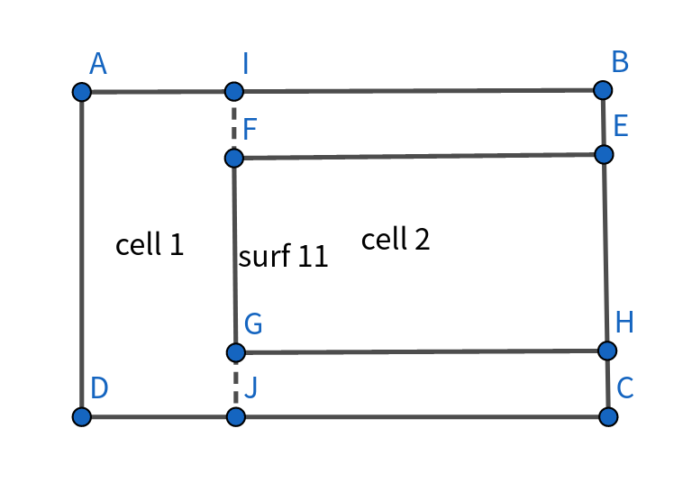

.. _section_eng_tally:

Tally
============

RMC includes four types of tallies: cell tally, mesh tally, function expansion tally (FET tally), and cross-section tally.

The cell tally is used to collect macroscopic physical quantities within a cell, including integral flux, power, fission reaction rates, 
absorption reaction rates, and more. RMC uses the Cell-Mapping method, which efficiently processes large-scale cell tallies. The mesh tally 
is similar to the cell tally but collects macroscopic physical quantities based on predefined meshes rather than cells. The cross-section 
tally records the reaction cross-sections (microscopic reaction rates) for specified nuclides and reaction types within cells. All three 
tallies support multi-group statistics, allowing for tally based on specified energy intervals.

It should be noted that if the user employs the implicit modeling method for random media in the geometry module, it is necessary to use 
the tallies to verify the fill rate of the implicit method to ensure the accuracy of the actual fill rate.

Cell Tally
--------------

The input card for a cell tally is as follows:

.. code-block:: none

    CellTally <id> [Type = <type>] [Estimator = <type>] [Energy = <erg_bin>] 
              [Filter = <params>] [Integral = <params>] [Cell = <cell_vector_group>] 
              [Time = <time_bin>] [Volume=<vol>] [Multiplier=<mul>] [Attenuator=<att>] 
              [Dose=<dose>] [Gaussian=<gaussian>] [Value=<val_bin>] [Segment=<seg_bin>]
              [Flag=<flag_bin>] [Nest=<nest>] [ReactionRate=<params>]
              [Source=<source_bin>][Absolute=<val>] [Component = <params>] 
              [Attribute=<attr>] [mt=<mt>]

Where:

-  **CellTally** \  is the keyword for the cell tally input card.

-  **id** \  is the identifier for the cell tally, facilitating output lookup.

-  **Type**\ specifies the tally type, as described in :numref:`tallytypes_table_eng` .

-  **Estimator** \  designates the type of tally estimator: 1 for path length estimator (default), 2 for collision estimator, and 3 for velocity 
   estimator (used for transient calculations with direct simulation, which requires time binning).

   .. note:: For certain tally types (e.g., HEATING for photons), the program defaults to the collision estimator. Additionally, when users 
      utilize TMS for online cross-section broadening, all tallies are forced to use the collision estimator.

-  **Energy** \  specifies the energy binning intervals for the tally, in MeV. For example, "\ **Energy = 0 6.25E-7 20** \ " indicates tally intervals of 
   0 to 0.625 eV, 0.625 eV to 20 MeV, and 20 MeV to infinity, resulting in three intervals, each left-closed and right-open. If multi-group 
   criticality is calculated, "\ **Energy  = -1** \  " uses the cross-section database's energy group structure. If \ **Energy** \  is omitted, only 
   the total tally rate is tallied.

-  **Time** \  specifies the time binning intervals for the tally, in seconds. For instance, "\ **Time = 0 5.0e-8  1.0e-7** \ " sets tally intervals of 
   0 to 5.0e-8 s and 5.0e-8 s to 1.0e-7 s, yielding two intervals, with a total tally also provided. Only used in fixed source scenarios 
   (refer to Chapter 11 for examples).

-  **Cell、Filter、Integral** \  options describe the tally cells, which will be detailed below.

-  **particle** \  designates the particle type for the cell tally: 1 for neutrons, 2 for photons, and 3 for electrons.

-  **volume** \  specifies the cell volume list as a positive number, corresponding to the merged cell tally; Type=6 indicates mass-based power density in MeV/g.
  
-  **Multiplier** \  serves as a cross-section multiplier, an integer used for custom multipliers or reaction cross-sections. When using Multiplier, 
   the tally type Type must be set to 1, and Dose functionality cannot be used.
   
-  **Attenuator** \  defines the attenuation multiplier, used to calculate attenuation factors, which will be explained later.

-  **Gaussian** \  defines Gaussian energy broadening, specified as an array of broadening factors, also explained later.

-  **Value** \  defines the tally value binning, allowing for binning within a single tally.

-  **Segment** \  defines segmentation binning.

-  **Flag** \  specifies flag binning, isolating particles passing through a particular surface or cell for separate tallying, explained later.

-  **Nest** \  specifies nesting between bins, such as nesting between energy bins and cosine bins.

-  **Reactionrate** \  generates a separate file for outputting energy group flux and reaction rates.

-  **Source** \  defines source binning, isolating particles sampled from a particular source for tallying, used only in fixed source calculations.

-  **Absolute** \  allows the input of absolute values, returning a multiplication factor to apply weighted averaging to Monte Carlo tally results. 
   If multiple cells are input, the absolute value represents the total of all cells.

-  **Component**\  option is only effective when Type=18, which is used to tally the energy release from different fission fragments while accounting 
   for their distinct contributions. Different fission fragments are distinguished by different Component numbers, and the corresponding relationships can be 
   referenced in table :numref:`tally_component_eng`.

-  **MT**\  option is only effective when Type=19, which is used to tally the reaction rate for a specific reaction, where MT refers to the cross-section number of the reaction.

-  **Attribute**\  This option is only effective when Type=12 and particle=2. It explicitly distinguishes the energy deposition from instantaneous photons, delayed photons, 
   and captured photons during photon energy deposition. For a detailed description, please refer to section:ref:`section_eng_energy_release`.

Cell Card
~~~~~~~~~~~~~~~~

In hierarchical geometry systems, any cell region is uniquely determined by a series of cell IDs and their hierarchical relationships.
\ **We describe this hierarchical relationship using cell vectors** \  :

.. code-block:: none

    Cell_vector = C[1] > C[2] > … > C[n]

Where ">" indicates the containment relationship from upper to lower layers, n denotes the level of the cell, and C[i] represents the cell 
number or repeated structure number (when the i-th level is a repeated structure). During Monte Carlo tracking, the particle always locates
to the bottom layer cell (i.e., C[n] is not filled by any other space) and then obtains the relevant material and temperature information 
for transport simulation.

The cell description used in particle positioning (see Section 3.5) is also described in vector form for tally cells as follows:

.. code-block:: none

    C[1] > C[2] > … > C[n]

Consider C[n] as the bottom-layer cell, meaning C[n] is not filled by any lower structure. The tallying process checks if the particle’s 
located cell matches the tally cell (both being bottom-layer cells) and, if so, accumulates tally data. Notably, the cell list provided 
in the \ **Cell** \  card must not contain duplicate cell vectors.

For flexible cell tally descriptions, the program introduces two auxiliary symbols, ":" and "*".

Taking a pressurized water reactor (PWR) core as an example, suppose the entire core (cell ID 1) includes 21×21=441 repeated meshes,
each representing a fuel assembly or reflector layer. The fuel assembly is further divided into 17×17=289 repeated meshes, with each mesh 
containing a fuel rod (cell ID 35) and moderator (cell ID 36).

To tally flux in the central fuel rod  (repeated mesh ID 145) of the central assembly (repeated mesh ID 221) of the core,
the cell tally input would be:

.. code-block:: none

    1 > 221 > 145 > 35

To tally flux in the central fuel rod of other assemblies, the input would be:

.. code-block:: none

    1 > 1 > 145 > 35
    1 > 2 > 145 > 35
    1 > 3 > 145 > 35
    …
    1 > 441 > 145 > 35

Using the ":" expansion symbol, the input can be simplified as:

.. code-block:: none

    1 > 1:441 > 145 > 35

The RMC code also supports multi-level expansion input, like "1 > 1:441 > 1:289 > 35," expanded layer-by-layer from right to left:

.. code-block:: none

    1 > 1 > 1 > 35
    …
    1 > 1 > 289 > 35
    1 > 2 > 1 > 35
    …
    1 > 2 > 289 > 35
    …
    1 > 441 > 1 > 35
    …
    1 > 441 > 289 > 35

The global expansion symbol "*" is a specific case of the ":" symbol, automatically searching all regions with the specified cell ID
as the bottom cell and tallying them individually. In the above example, the user could input:

.. code-block:: none

    *36

to tally flux in all moderator regions (cell ID 36) within each assembly.

Type Card
~~~~~~~~~~~~~~~~~~

.. table:: Tally Types
  :name: tallytypes_table_eng

  +--------+-------------------------------------------------------------------+
  |Type    | Description                                                       |
  +========+===================================================================+
  |1       |Neutron flux                                                       |
  +--------+-------------------------------------------------------------------+
  |2       |Power                                                              |
  +--------+-------------------------------------------------------------------+
  |3       |Fission rate                                                       |
  +--------+-------------------------------------------------------------------+
  |4       |Absorption rate                                                    | 
  +--------+-------------------------------------------------------------------+
  |5       |Fission neutron production rate                                    |
  +--------+-------------------------------------------------------------------+
  |6       |Energy deposition (from ACE thermal data)                          |
  +--------+-------------------------------------------------------------------+
  |7       |Inelastic scattering rate                                          |
  +--------+-------------------------------------------------------------------+
  |8       |Elastic scattering rate                                            |
  +--------+-------------------------------------------------------------------+
  |9       |Recoverable Energy: Includes the total energy released by          |
  |        |all nuclides within the mesh cell for all reactions, such          |
  |        |as fission and neutron capture (e.g., (n,γ), (n,α) reactions).     |
  +--------+-------------------------------------------------------------------+
  |10      |Recoverable Fission Energy: Includes energy released in the        |
  |        |form of fission fragments, prompt and delayed neutrons, prompt     |
  |        |and delayed photons, and delayed beta emissions, but excludes      |
  |        |neutrino energy. It assumes energy from both prompt and delayed    | 
  |        |photons is deposited locally. Note: This tally requires fission    | 
  |        |energy release data available in the neutron_hdf5 database.        |
  |        |Unit: MeV per particle.                                            |
  +--------+-------------------------------------------------------------------+   
  |11      |Kappa Fission Energy: This includes the kinetic energy of fission  |
  |        |fragments, prompt and delayed neutrons, prompt and delayed photons,| 
  |        |and delayed beta particles. Unlike recoverable fission energy      |
  |        |(type 10), this tally is unaffected by the energy of the incident  |
  |        |neutron. Unit: MeV per particle.                                   |
  +--------+-------------------------------------------------------------------+  
  |12      |Heating (Energy Deposition): Unit is MeV per particle. For         |
  |        |neutrons, heating is calculated using NJOY’s HEATR module (MT=301),|
  |        |and for photons, heating data is obtained from the photon source   |
  |        |database. Note: This tally should be used in coupled neutron-photon| 
  |        |transport modes.                                                   |
  +--------+-------------------------------------------------------------------+  
  |13      |Local Heating (Local Energy Deposition): Unit is MeV per particle. |
  |        |Unlike \ **type=12** \ , this tally assumes all secondary photon   |
  |        |energy is deposited locally. Note: Should be used in neutron       |
  |        |transport mode only.                                               |
  +--------+-------------------------------------------------------------------+ 
  |14      |Damage Energy: Represents energy imparted that contributes to      |
  |        |material damage, calculated with NJOY’s HEATR module (MT=444).     |
  |        |Unit: MeV per particle.                                            |
  +--------+-------------------------------------------------------------------+      
  |15      |Capture Recoverable Energy: Reflects energy released from all      |
  |        |non-fission reactions, such as (n,γ) and (n,α) reactions. Unit:    |
  |        |MeV per particle.                                                  |
  +--------+-------------------------------------------------------------------+      
  |16      |Flux-Weighted Neutron Average Energy: Measured in                  |
  |        |:math:`MeV \cdot flux`. To obtain the absolute neutron             |
  |        |average energy, divide this tally result by that of type=1.        |
  +--------+-------------------------------------------------------------------+  
  |17      |Prompt Fission Energy: Includes energy from fission fragments,     |
  |        |prompt neutrons, and prompt photons. Unit: MeV per particle.       |
  +--------+-------------------------------------------------------------------+           
  |25      |Migration Area,Measured in :math:`cm^2` ,group-wise statistical    |
  |        |result gives the contribution of each energy group to the total    |
  |        |migration area.                                                    |
  +--------+-------------------------------------------------------------------+    
  |26      |Directional migration area, unit: :math:`cm^2`,                    |
  |        |calculates the migration area in a certain direction.              |
  |        |Option selects direction: 1 for x, 2 for y, 3 for z.               |
  +--------+-------------------------------------------------------------------+    
  
Filter Card
~~~~~~~~~~~~~~~~~~

The tally cell description "C[1] > C[2] > … > C[n]" in 7.1.1 only considers C[n] as the base-level cell (i.e., C[n] is not
filled by a lower structure). However, users may sometimes need to calculate the flux distribution of non-base or composite cells. 
For this purpose, the \ **Filter** \  card is available.

**Filter** \  card parameters consist of a sequence of 0s and 1s, with the sequence length matching the tally cell hierarchy. 
By default, the sequence elements are set to 1; if a wildcard "0" appears in the tally cell (see example below), the 
corresponding position in the Filter vector will be replaced by 0.

One of the functions of the **Filter** \  is to calculate the flux for non-base-level cells. Taking the scenario in 7.1.1 as an example,
the target for flux statistics is the component level, i.e., the mesh within the first level of repeated structures. The input card for
the tally cell is as follows:

.. code-block:: none

    CellTally 1 Type = 1 Filter = 1 1
    Cell = 1 > 1:441

In this example, "1 > 1:441" is equivalent to "1 > 1 1 > 2 … 1 > 441," and "Filter = 1 1" indicates that all tallying cells within 
this tally only have two layers. This tally provides a total of 441 values, each corresponding to the flux of the mesh at the component level,
including the reflector mesh.

Another function of the **Filter** \  card is to calculate composite cell tallies, as follows:

.. code-block:: none

    CellTally 1 Type = 1 Filter = 1 1 0 1
    Cell = 1 > 1:441 > 0 > 35

In this example, "1 > 1:441 > 0 > 35" contains a wildcard (0) that ignores the cell or mesh ID at this hierarchy level during
tally matching. The corresponding level in the \ **Filter** \  card is marked as 0. This tally provides 441 flux values, with each tally 
representing the total flux of all fuel rods in the i-th component.

RMC uses cell mapping for efficient processing of large-scale tally cells. Users are encouraged to group tally cells of the same 
type (with the same Filter) within a single CellTally to reduce the total number of CellTallies (thus increasing the tally per 
individual CellTally) and improve tally efficiency.

Integral Card
~~~~~~~~~~~~~~~~~~~~

**Integral** \   card is used to combine tallies across multiple tally cells into a single tally as a collective measure. For instance:

.. code-block:: none

    CellTally 1 Type = 1 Filter = 1 1 0 1
    Integral = 100*3 141 （namely Integral = 100 100 100 141）
    Cell = 1 > 1:441 > 0 > 35

Here, the Integral card consolidates tallies across specified cell segments as follows:
1 > 1:100 > 0 > 35,
1 > 101:200 > 0 > 35,
1 > 201:300 > 0 > 35, and
1 > 301:441 > 0 > 35.
Thus, cells need not be adjacent to be combined under a single Integral card tally.

Multiplier Card
~~~~~~~~~~~~~~~~~~~~

**Multiplier** \  card generally takes the format:

.. code-block:: none

    Multiplier=C m R
    Where R represents a logical combination of a series of reaction cross-sections (or other physical quantities) labeled x1, x2, x3... 
    and can be represented by:
    A sum of multiple physical quantities: x1 : x2 : x3..., or
    A product of multiple physical quantities: x1 x2 x3...

The multiplier can be used to compute physical quantities of the form:  :math:`\mathrm{C} \int \varphi(E) \mathrm{R}(E) dE`  where φ(E) is 
the flux, R(E) represents cross-sections, fission yields, or other physical quantities calculated through addition or multiplication. The 
resulting value from cell tally statistics represents the energy-integrated result of the above expression. m is the material ID number 
for the cross-section. The Multiplier card has a higher priority than binning. When the Multiplier card is specified, the original tally 
values (prior to multiplier processing) are no longer output; if the user needs those values, a separate Tally should be added.

When m is a positive integer, RMC multiplies the tally value by the microscopic cross-section calculation result determined by R(x1,x2,…,xi) in
the material corresponding to mat=m on the material card, then normalizes it by C, yielding the value of: :math:`\mathrm{C} \int \varphi(E) \mathrm{R}(E) dE`.
The syntax rules for R are as follows: xi is the microscopic cross-section ID. When using the ENDF/B library, commonly used reaction cross-section
indices are listed in Table 3.5. The logical symbol ":" between x1 and x2 indicates addition, while a space between x1 and x2 represents 
multiplication (multiplication takes precedence over addition). Referencing Table 6-1-1, different Type values can implement C m R, where m 
is the material ID of the cell, and C is the atomic density (:math:`10^{24}\ \mathrm{atoms/cm^3}`) of the corresponding material.

For example:

To calculate neutron fission power with Type=2, use:

.. code-block:: none

    Multiplier = C m -6 -8  (where R is -6 -8, with -6 as the total fission cross-section, -8 as the fission energy)

For neutron fission reaction rate with Type=3:

.. code-block:: none

    Multiplier = C m -6

For neutron absorption rate with Type=4:

.. code-block:: none

    Multiplier = C m -2

For fission neutron yield with Type=5:

.. code-block:: none

    Multiplier = C m -7 -6

For neutron heat release rate with Type=6:

.. code-block:: none

    Multiplier = C m 1 -4

For photon heat release rate:

.. code-block:: none

    Multiplier = C m -5 -6

This explains why the Multiplier card may conflict when Type is set to non-1 values. Users can also derive physically meaningful quantities 
by combining cross-sections as needed.

When m is -1, -2, or -3, it represents special multipliers, and R must be left empty. When m is -1, each tallied value is set to 1, tallying 
track numbers through cells for cell tally, tracks through surfaces for surface tally (representing total surface flux J, not net surface flux, 
dimensionless), and source and collision tallies for point tally. In fixed-source mode, these values are normalized by external particle numbers; 
in criticality mode, they are normalized by neutrons per generation, with averages taken over active generations. m = -2 with R == v and m = -3 
calculates energy flux rate, equivalent to C=1, R=E (MeV).

.. table:: ENDF/B Reaction Cross-section Indices
  :name: xs_table_eng

  +---------+-------+------------------------------------------+
  |Particle |Index  |Reaction Cross-section                    |
  +=========+=======+==========================================+
  |Neutron  |   -1  |   Non-thermal total cross-section        |
  +---------+-------+------------------------------------------+ 
  |         |   -2  |   Absorption cross-section               |
  +---------+-------+------------------------------------------+
  |         |   -3  |   Non-thermal elastic scattering         |
  +---------+-------+------------------------------------------+
  |         |   -4  |   Average thermal number (MeV/collision) |
  +---------+-------+------------------------------------------+
  |         |   -5  |   Photon production cross-section        |
  +---------+-------+------------------------------------------+
  |         |   -6  |   Total fission cross-section            |
  +---------+-------+------------------------------------------+
  |         |   -7  |   Fission neutron yield                  |
  +---------+-------+------------------------------------------+
  |         |   -8  |   Fission energy Q (MeV/fission)         |
  +---------+-------+------------------------------------------+
  |Photon   |   -1  |   Incoherent scattering cross-section    |
  +---------+-------+------------------------------------------+
  |         |   -2  |   Coherent scattering cross-section      |
  +---------+-------+------------------------------------------+
  |         |   -3  |   Photoelectric effect cross-section     |
  +---------+-------+------------------------------------------+
  |         |   -4  |   Pair production cross-section          |
  +---------+-------+------------------------------------------+
  |         |   -5  |   Total cross-section                    |
  +---------+-------+------------------------------------------+
  |         |   -6  |   Photon heating rate                    |
  +---------+-------+------------------------------------------+

Dose Card
~~~~~~~~~~~~~~~~~~~~

**Dose** \  card consists of three components: interpolation method, energy array, and multiplier array.This function is used in RMC to perform dose 
estimation and customized multiplier operations (for example, calculating specific reaction channel reaction rates using specialized or user-defined databases).

RMC computes dose statistics by utilizing flux-to-dose conversion factor functions with energy as the variable. These functions approximate 
continuous energy through discrete energy arrays, replacing the continuous conversion factor with a multiplier array; thus, both arrays must 
have the same length. The more points in the array, the higher the precision of results
due to increased interpolation points. There are four interpolation types specified by the first positive integer in the Dose card:
1 specifies log-log interpolation (linear on a log-log scale), 2 specifies log-linear interpolation (linear on an energy log scale), 3 specifies
linear-log interpolation (linear on a conversion factor log scale), 4 specifies linear-linear interpolation (plain linear interpolation).

The current latest standards for the setting of energy arrays and conversion factor arrays (dose conversion factors) include the American National 
Standards Institute ANSI/ANS-6.1.1-1991 and the International Commission on Radiological Protection standard ICRP/74-1996 (the default type for MCNP 
is log-log, which is the first type of interpolation). These standards provide neutron and photon dose conversion factors, with the energy array measured 
in MeV. The neutron dose conversion factors are provided in four different sets based on various radiation propagation types according to ANSI/ANS-6.1.1-1991: 
anterior-posterior (AP), posterior-anterior (PA), lateral (LAT), and rotational (ROT), with units of :math:`\mathrm{pSv \cdot cm^2}` ICRP/74-1996 also 
provides six different sets: anterior-posterior (AP), posterior-anterior (PA), left lateral (LLAT), right lateral (RLAT), rotational (ROT), and isotropic 
(ISO), with units also in  :math:`\mathrm{pSv \cdot cm^2}` .

Regarding the different models provided by ANSI/ANS-6.1.1-1991 and ICRP/74-1996, they consider the human body as a geometric entity exposed to radiation 
from different directions. Specifically, anterior-posterior (AP) refers to ionizing radiation incident on the front of the body at a direction orthogonal 
to the body's long axis; posterior-anterior (PA) refers to ionizing radiation incident on the back of the body at a direction orthogonal to the body's long 
axis; lateral (LAT) refers to ionizing radiation incident from both sides at a direction orthogonal to the body's long axis. ICRP/74-1996 further divides 
this exposure pattern into left lateral (LLAT) and right lateral (RLAT), where LLAT is exposure from the right side to the left side of the body, and RLAT 
is exposure from the left side to the right side; rotational (ROT) refers to ionizing radiation beams incident on an object from a direction orthogonal to 
its long axis while rotating uniformly around that axis; isotropic (ISO) defined by ICRP/74-1996 refers to ionizing radiation determined by the radiation 
field, independent of particle density and direction in unit solid angle.

In addition to categorizing based on exposure direction, models can also be determined based on the type of radiation source. Anterior-posterior (AP), 
posterior-anterior (PA), and lateral (LAT) assume that radiation comes from a single source at a specific body orientation; rotational (ROT) assumes that 
radiation comes from a widely dispersed plane source, typically assumed to be caused by environmental contamination (for example, a person randomly moving 
within a radiation field from a single light source perpendicular to their body axis); isotropic (ISO) assumes that the radiation source is an object within 
a large suspended radioactive gas cloud, typically assumed to be irradiated by natural radionuclides in homes or environments or by radionuclides released 
into the environment from the atmosphere.

The energy points selected for each group model by ANS and ICRP along with neutron dose conversion factors are shown in the table:

.. table:: Energy Array Corresponding to ANSI/ANS-6.1.1-1991 Neutron Dose Conversion Factor
  :name: The energy array corresponds to the ANS-1991 neutron dose conversion factor_eng

  +--------+------+------+-------+-------+
  |Energy  |ANS-PA|ANS-AP|ANS-LAT|ANS-ROT|
  +========+======+======+=======+=======+
  | 2.5E-8 |  2.6 | 4.0  | 1.3   |  2.3  |
  +--------+------+------+-------+-------+
  | 1.0e-7 |  2.7 | 4.4  | 1.4   |  2.4  |
  +--------+------+------+-------+-------+
  | 1.0E-6 |  2.81| 4.82 | 1.43  |  2.63 |
  +--------+------+------+-------+-------+
  | 1.0E-5 |  2.78| 4.46 | 1.33  |  2.48 |
  +--------+------+------+-------+-------+
  | 1.0E-4 |  2.63| 4.14 | 1.27  |  2.33 |
  +--------+------+------+-------+-------+
  | 1.0E-3 |  2.49| 3.83 | 1.19  |  2.18 |
  +--------+------+------+-------+-------+
  | 0.01   |  2.58|  4.53| 1.27  |  2.41 |
  +--------+------+------+-------+-------+
  | 0.02   |  2.79|  5.87| 1.46  |  2.89 |
  +--------+------+------+-------+-------+
  | 0.05   |  3.64|  10.9| 2.14  |  4.7  |
  +--------+------+------+-------+-------+
  | 0.1    |  5.69|  19.8| 3.57  |  8.15 |
  +--------+------+------+-------+-------+
  | 0.2    |  8.6 |  38.6| 6.94  |  15.3 |
  +--------+------+------+-------+-------+
  | 0.5    | 30.8 |  87.0| 18.7  |  38.8 |
  +--------+------+------+-------+-------+
  | 1.0    | 53.5 | 143.0| 33.3  |  65.7 |
  +--------+------+------+-------+-------+
  | 1.5    | 85.8 | 183.0| 52.1  |  93.7 |
  +--------+------+------+-------+-------+  
  | 2.0    |120.0 | 214.0| 71.8  |  120.0|
  +--------+------+------+-------+-------+
  | 3.0    |174.0 | 264.0| 105.8 |  162.0|
  +--------+------+------+-------+-------+
  | 4.0    |215.0 | 300.0| 131.0 |  195.0|
  +--------+------+------+-------+-------+
  | 5.0    |244.0 | 327.0| 151.0 |  219.0|
  +--------+------+------+-------+-------+
  | 6.0    |265.0 | 347.0| 167.0 |  237.0|
  +--------+------+------+-------+-------+
  | 7.0    |283.0 | 365.0| 181.0 |  253.0|
  +--------+------+------+-------+-------+
  | 8.0    |296.0 | 380.0| 194.0 |  266.0|
  +--------+------+------+-------+-------+
  | 10.0   |321.0 | 410.0| 218.0 |  292.0|
  +--------+------+------+-------+-------+
  | 14.0   |415.0 | 480.0| 280.0 |  365.0|
  +--------+------+------+-------+-------+

.. table:: Neutron dose conversion factors corresponding to the energy array of ICRP/74-1996.
  :name: The energy array corresponds to the ICPR-1996 neutron dose conversion factor_eng

  +--------+-------+-------+---------+---------+--------+--------+
  |Energy  |ICPR-PA|ICPR-AP|ICPR-LLAT|ICPR-RLAT|ICPR-ROT|ICPR-ISO|
  +========+=======+=======+=========+=========+========+========+
  |1.0E-9  | 3.52  | 5.24  | 1.68    |  1.36   |  2.99  |   2.4  |
  +--------+-------+-------+---------+---------+--------+--------+
  |1.0E-8  | 4.39  | 6.55  | 2.04    |  1.7    |  3.72  |   2.89 |
  +--------+-------+-------+---------+---------+--------+--------+
  |2.5E-8  | 5.16  | 7.6   | 2.31    |  1.99   |  4.4   |   3.3  |
  +--------+-------+-------+---------+---------+--------+--------+
  |1.0E-7  | 6.77  | 9.95  | 2.86    |  2.58   |  5.75  |   4.13 |
  +--------+-------+-------+---------+---------+--------+--------+
  |2.0E-7  | 7.63  | 11.2  | 3.21    |  2.92   |  6.43  |   4.59 |
  +--------+-------+-------+---------+---------+--------+--------+
  |5.0E-7  | 8.76  | 12.8  | 3.72    |  3.35   |  7.27  |   5.2  |
  +--------+-------+-------+---------+---------+--------+--------+
  |1.0E-6  | 9.55  | 13.8  | 4.12    |  3.67   |  7.84  |   5.63 |
  +--------+-------+-------+---------+---------+--------+--------+
  |2.0E-6  | 10.2  | 14.5  | 4.39    |  3.89   |  8.31  |   5.96 |
  +--------+-------+-------+---------+---------+--------+--------+
  |5.0E-6  | 10.7  | 15.0  | 4.66    |  4.08   |  8.72  |   6.28 |
  +--------+-------+-------+---------+---------+--------+--------+
  |1.0E-5  | 11.0  | 15.1  | 4.8     |  4.16   |  8.9   |   6.44 |
  +--------+-------+-------+---------+---------+--------+--------+
  |2.0E-5  | 11.1  | 15.1  | 4.89    |  4.2    |  8.92  |   6.51 |
  +--------+-------+-------+---------+---------+--------+--------+
  |5.0E-5  | 11.1  | 14.8  | 4.95    |  4.19   |  8.82  |   6.51 |
  +--------+-------+-------+---------+---------+--------+--------+
  |1.0E-4  | 11.0  | 14.6  | 4.95    |  4.15   |  8.69  |   6.45 |
  +--------+-------+-------+---------+---------+--------+--------+
  |2.0E-4  | 10.9  | 14.4  | 4.92    |  4.1    |  8.56  |   6.32 |
  +--------+-------+-------+---------+---------+--------+--------+
  |5.0E-4  | 10.7  | 14.2  | 4.86    |  4.03   |  8.4   |   6.14 |
  +--------+-------+-------+---------+---------+--------+--------+
  |1.0E-3  | 10.7  | 14.2  | 4.84    |  4.0    |  8.34  |   6.04 |
  +--------+-------+-------+---------+---------+--------+--------+
  |2.0E-3  | 10.8  | 14.4  | 4.87    |  4.0    |  8.39  |   6.05 |
  +--------+-------+-------+---------+---------+--------+--------+
  |5.0E-3  | 11.6  | 15.7  | 5.25    |  4.29   |  9.06  |   6.52 |
  +--------+-------+-------+---------+---------+--------+--------+
  |0.01    | 13.5  | 18.3  | 6.14    |  5.02   |  10.6  |   7.7  |
  +--------+-------+-------+---------+---------+--------+--------+
  |0.02    | 17.3  | 23.8  | 7.95    |  6.48   |  13.8  |  10.2  |
  +--------+-------+-------+---------+---------+--------+--------+
  |0.03    | 21.0  | 29.0  | 9.74    |  7.93   |  16.9  |  12.7  |
  +--------+-------+-------+---------+---------+--------+--------+
  |0.05    | 27.6  | 38.5  | 13.1    |  10.6   |  22.7  |  17.3  |
  +--------+-------+-------+---------+---------+--------+--------+
  |0.07    | 33.5  | 47.2  | 16.1    |  13.1   |  27.8  |  21.5  |
  +--------+-------+-------+---------+---------+--------+--------+
  |0.1     | 40.0  | 59.8  | 20.1    |  16.4   |  34.8  |  27.2  |
  +--------+-------+-------+---------+---------+--------+--------+
  |0.15    | 52.2  | 80.2  | 25.5    |  21.2   |  45.4  |  35.2  |
  +--------+-------+-------+---------+---------+--------+--------+
  |0.2     | 61.5  | 99.0  | 30.3    |  25.6   |  54.8  |  42.4  |
  +--------+-------+-------+---------+---------+--------+--------+
  |0.3     | 77.1  | 133.0 | 38.6    |  33.4   |  71.6  |  54.7  |
  +--------+-------+-------+---------+---------+--------+--------+
  |0.5     | 103.0 | 188.0 | 53.2    |  46.8   |  99.4  |  75.0  |
  +--------+-------+-------+---------+---------+--------+--------+
  |0.7     | 124.0 | 231.0 | 66.6    |  58.3   |  123.0 |  92.8  |
  +--------+-------+-------+---------+---------+--------+--------+
  |0.9     | 144.0 | 267.0 | 79.6    |  69.1   |  144.0 |  108.0 |
  +--------+-------+-------+---------+---------+--------+--------+
  |1.0     | 154.0 | 282.0 | 86.0    |  74.5   |  154.0 |  116.0 |
  +--------+-------+-------+---------+---------+--------+--------+
  |1.2     | 175.0 | 310.0 | 99.8    |  85.8   |  173.0 |  130.0 |
  +--------+-------+-------+---------+---------+--------+--------+
  |2.0     | 247.0 | 383.0 | 153.0   |  129.0  |  234.0 |  178.0 |
  +--------+-------+-------+---------+---------+--------+--------+
  |3.0     | 308.0 | 432.0 | 195.0   |  171.0  |  283.0 |  220.0 |
  +--------+-------+-------+---------+---------+--------+--------+
  |4.0     | 345.0 | 458.0 | 224.0   |  198.0  |  315.0 |  250.0 |
  +--------+-------+-------+---------+---------+--------+--------+
  |5.0     | 366.0 | 474.0 | 244.0   |  217.0  |  335.0 |  272.0 |
  +--------+-------+-------+---------+---------+--------+--------+
  |6.0     | 380.0 | 483.0 | 261.0   |  232.0  |  348.0 |  282.0 |
  +--------+-------+-------+---------+---------+--------+--------+
  |7.0     | 391.0 | 490.0 | 274.0   |  244.0  |  358.0 |  290.0 |
  +--------+-------+-------+---------+---------+--------+--------+
  |8.0     | 399.0 | 494.0 | 285.0   |  253.0  |  366.0 |  297.0 |
  +--------+-------+-------+---------+---------+--------+--------+
  |9.0     | 406.0 | 497.0 | 294.0   |  261.0  |  373.0 |  303.0 |
  +--------+-------+-------+---------+---------+--------+--------+
  |10.0    | 412.0 | 499.0 | 302.0   |  268.0  |  378.0 |  309.0 |
  +--------+-------+-------+---------+---------+--------+--------+
  |12.0    | 422.0 | 499.0 | 315.0   |  278.0  |  385.0 |  322.0 |
  +--------+-------+-------+---------+---------+--------+--------+
  |14.0    | 429.0 | 496.0 | 324.0   |  286.0  |  390.0 |  333.0 |
  +--------+-------+-------+---------+---------+--------+--------+
  |15.0    | 431.0 | 494.0 | 328.0   |  290.0  |  391.0 |  338.0 |
  +--------+-------+-------+---------+---------+--------+--------+
  |16.0    | 433.0 | 491.0 | 331.0   |  293.0  |  393.0 |  342.0 |
  +--------+-------+-------+---------+---------+--------+--------+
  |18.0    | 435.0 | 486.0 | 335.0   |  299.0  |  394.0 |  345.0 |
  +--------+-------+-------+---------+---------+--------+--------+
  |20.0    | 436.0 | 480.0 | 338.0   |  305.0  |  395.0 |  343.0 |
  +--------+-------+-------+---------+---------+--------+--------+
  |30.0    | 437.0 | 458.0 |         |  324.0  |  395.0 |        |
  +--------+-------+-------+---------+---------+--------+--------+
  |50.0    | 444.0 | 437.0 |         |  358.0  |  404.0 |        |
  +--------+-------+-------+---------+---------+--------+--------+
  |75.0    | 459.0 | 429.0 |         |  397.0  |  422.0 |        |
  +--------+-------+-------+---------+---------+--------+--------+
  |100.0   | 477.0 | 429.0 |         |  433.0  |  443.0 |        |
  +--------+-------+-------+---------+---------+--------+--------+
  |130.0   | 495.0 | 432.0 |         |  467.0  |  465.0 |        |
  +--------+-------+-------+---------+---------+--------+--------+
  |150.0   | 514.0 | 438.0 |         |  501.0  |  489.0 |        |
  +--------+-------+-------+---------+---------+--------+--------+
  |180.0   | 535.0 | 445.0 |         |  542.0  |  517.0 |        |
  +--------+-------+-------+---------+---------+--------+--------+

The latest standards for photon dose conversion factors are ANSI/ANS-6.1.1-1991 and ICRP/21-1973. In ANSI, the units for photon dose conversion factors are :math:`\mathrm{pSv \cdot cm^2}`
and there are five types: anterior-posterior (AP), posterior-anterior (PA), lateral (LAT), rotational (ROT), and isotropic (ISO). In ICRP, the photon dose conversion factors are measured in 
:math:`\mathrm{mrem/hr/cm^{-2}\cdot s^{-1}}`. The energy points selected by ANS and ICRP for each group model along with the corresponding photon dose conversion factors are shown in the table:

.. table:: Energy Array Corresponding to ANSI/ANS-6.1.1-1991 Photon Dose Conversion Factor
  :name: The energy array corresponds to the ANSI/ANS-6.1.1-1991 photon dose conversion factor_eng

  +--------+------+------+-------+-------+-------+
  |Energy  |ANS-PA|ANS-AP|ANS-LAT|ANS-ROT|ANS-ISO|
  +========+======+======+=======+=======+=======+
  | 0.01   |0.0001|0.062 | 0.02  | 0.029 |0.022  |
  +--------+------+------+-------+-------+-------+
  | 0.015  | 0.031|0.157 | 0.033 | 0.071 |0.057  |
  +--------+------+------+-------+-------+-------+
  | 0.02   |0.0868|0.238 | 0.0491|  0.11 |0.0912 |
  +--------+------+------+-------+-------+-------+
  | 0.03   | 0.161|0.329 | 0.0863|  0.166|0.138  |
  +--------+------+------+-------+-------+-------+
  | 0.04   | 0.222|0.365 | 0.123 |  0.199|0.163  |
  +--------+------+------+-------+-------+-------+
  | 0.05   | 0.26 |0.384 | 0.152 |  0.222|0.18   |
  +--------+------+------+-------+-------+-------+
  | 0.06   | 0.286|0.4   | 0.17  |  0.24 |0.196  |
  +--------+------+------+-------+-------+-------+
  | 0.08   | 0.344| 0.451| 0.212 |  0.293|0.237  |
  +--------+------+------+-------+-------+-------+
  | 0.1    | 0.418| 0.533| 0.258 |  0.357|0.284  |
  +--------+------+------+-------+-------+-------+
  | 0.15   | 0.624| 0.777| 0.396 |  0.534|0.436  |
  +--------+------+------+-------+-------+-------+
  | 0.2    | 0.844| 1.03 | 0.557 |  0.731|0.602  |
  +--------+------+------+-------+-------+-------+
  | 0.3    | 1.3  | 1.56 | 0.891 |  1.14 |0.949  |
  +--------+------+------+-------+-------+-------+
  | 0.4    | 1.76 | 2.06 | 1.24  |  1.55 |1.3    |
  +--------+------+------+-------+-------+-------+
  | 0.5    | 2.2  | 2.54 | 1.58  |  1.96 |1.64   |
  +--------+------+------+-------+-------+-------+
  | 0.6    | 2.62 | 2.99 | 1.92  |  2.34 |1.98   |
  +--------+------+------+-------+-------+-------+
  | 0.8    | 3.43 | 3.83 | 2.6   |  3.07 |2.64   |
  +--------+------+------+-------+-------+-------+
  | 1.0    |4.18  | 4.6  | 3.24  |  3.75 |3.27   |
  +--------+------+------+-------+-------+-------+
  | 1.5    |5.8   | 6.24 | 4.7   |  5.24 |4.68   |
  +--------+------+------+-------+-------+-------+
  | 2.0    |7.21  | 7.66 | 6.02  |  6.56 |5.93   |
  +--------+------+------+-------+-------+-------+
  | 3.0    |9.71  | 10.2 | 8.4   |  8.9  |8.19   |
  +--------+------+------+-------+-------+-------+
  | 4.0    |12.0  | 12.5 | 10.6  |  11.0 |10.2   |
  +--------+------+------+-------+-------+-------+
  | 5.0    |14.1  | 14.7 | 12.6  |  13.0 |12.1   |
  +--------+------+------+-------+-------+-------+
  | 6.0    |16.2  | 16.7 | 14.6  |  14.9 |14.0   |
  +--------+------+------+-------+-------+-------+
  | 8.0    |20.2  | 20.8 | 18.5  |  18.9 |17.8   |
  +--------+------+------+-------+-------+-------+
  |10.0    |24.2  | 24.7 | 22.3  |  22.9 |21.6   |
  +--------+------+------+-------+-------+-------+
  |12.0    |28.8  | 28.9 | 26.4  |  27.6 |25.8   |
  +--------+------+------+-------+-------+-------+

.. table:: Photon dose conversion factors corresponding to the energy array of ICRP/21-1973
  :name: The energy array corresponds to the ICPR/21-1973 photon dose conversion factor_eng

  +--------+---------+
  |Energy  |ICPR-1973|
  +========+=========+
  |0.01    |2.778e-3 |
  +--------+---------+
  |0.015   |1.111e-3 |
  +--------+---------+
  |0.02    |5.882e-4 |
  +--------+---------+
  |0.03    |2.564e-4 |
  +--------+---------+
  |0.04    |1.563e-4 |
  +--------+---------+
  |0.05    |1.205e-4 |
  +--------+---------+
  |0.06    |1.111e-4 |
  +--------+---------+
  |0.08    |1.205e-4 |
  +--------+---------+
  |0.1     |1.471e-4 |
  +--------+---------+
  |0.15    |2.381e-4 |
  +--------+---------+
  |0.2     |3.448e-4 |
  +--------+---------+
  |0.3     |5.556e-4 |
  +--------+---------+
  |0.4     |7.692e-4 |
  +--------+---------+
  |0.5     |9.091e-4 |
  +--------+---------+
  |0.6     |1.136e-3 |
  +--------+---------+
  |0.8     |1.47e-3  |
  +--------+---------+
  |1.0     |1.786e-3 |
  +--------+---------+
  |1.5     |2.439e-3 |
  +--------+---------+
  |2.0     |3.03e-3  |
  +--------+---------+
  |3.0     |4.0e-3   |
  +--------+---------+
  |4.0     |4.762e-3 |
  +--------+---------+
  |5.0     |5.556e-3 |
  +--------+---------+
  |6.0     |6.25e-3  |
  +--------+---------+
  |8.0     |7.692e-3 |
  +--------+---------+
  |10.0    |9.091e-3 |
  +--------+---------+
  |20.0    |0.01563  |
  +--------+---------+
  |30.0    |0.02273  |
  +--------+---------+
  |40.0    |0.02941  |
  +--------+---------+
  |50.0    |0.03571  |
  +--------+---------+
  |60.0    |0.04348  |
  +--------+---------+
  |80.0    |0.05882  |
  +--------+---------+
  |100.0   |0.07143  |
  +--------+---------+
  |200.0   |0.1087   |
  +--------+---------+
  |500.0   |0.1724   |
  +--------+---------+
  |1.0e3   |0.2041   |
  +--------+---------+
  |2.0e3   |0.2326   |
  +--------+---------+
  |5.2e3   |0.2703   |
  +--------+---------+
  |1.0e4   |0.2941   |
  +--------+---------+
  |2.0e4   |0.3125   | 
  +--------+---------+

The custom multiplier operation function in RMC allows users to define their own multiplier arrays, thereby enabling customized cumulative calculations under specific interpolation schemes, achieving effects similar to \ **Multiplier** .
However, compared with \ **Multiplier** , \ **Dose** \ provides a more flexible data interface and a more explicit definition of energy dependence, making it particularly suitable for calculating specific reaction channel reaction rates based on specialized dosimetry databases.
In the \ **Multiplier** \ function of RMC, materials and reaction cross sections are indexed through the *xsdir* file to the ENDF/B nuclear data library internally used by RMC.
That is, \ **Multiplier** \ by default accesses the general-purpose ENDF/B nuclear data.
When it is necessary to reference specialized cross sections defined in other databases, \ **Multiplier** \ cannot directly access those external energy grids and reaction data.
Especially in reaction rate calculations for specific reaction channels, the ENDF/B general-purpose library often lacks sufficient cross-section resolution, so specialized dosimetry databases are required to improve the accuracy of the reaction rate calculation.
In such cases, the \ **Dose** \ function allows the user to manually define the energy points and corresponding cross-section values of a target nuclear reaction from an external database into the input file via custom energy and multiplier arrays, enabling cross-database reaction rate integration.
Therefore, when performing high-precision analysis of specific nuclear reactions, the \ **Dose** \ card should be used instead of the \ **Multiplier** \ card.
For example, in reactor shielding analysis (especially for reactor pressure vessel fast-neutron fluence calculations), experience has shown that the IRDF dosimetry database series can significantly improve the reliability of reaction rate calculations.

Taking the PCA benchmark (Pool Critical Assembly Benchmark) as an example, six types of activation reactions were experimentally measured, including:
:math:`{}^{237}\mathrm{Np}(\mathrm{n},\mathrm{f}){}^{137}\mathrm{Cs}`,
:math:`{}^{238}\mathrm{U}(\mathrm{n},\mathrm{f}){}^{137}\mathrm{Cs}`,
:math:`{}^{103}\mathrm{Rh}(\mathrm{n},\mathrm{n'}){}^{103\mathrm{m}}\mathrm{Rh}`,
:math:`{}^{115}\mathrm{In}(\mathrm{n},\mathrm{n'}){}^{115\mathrm{m}}\mathrm{In}`,
:math:`{}^{58}\mathrm{Ni}(\mathrm{n},\mathrm{p}){}^{58}\mathrm{Co}`, and
:math:`{}^{27}\mathrm{Al}(\mathrm{n},\alpha){}^{24}\mathrm{Na}`.

Among them, for the two inelastic scattering reactions
:math:`{}^{103}\mathrm{Rh}(\mathrm{n},\mathrm{n'}){}^{103\mathrm{m}}\mathrm{Rh}` and
:math:`{}^{115}\mathrm{In}(\mathrm{n},\mathrm{n'}){}^{115\mathrm{m}}\mathrm{In}`,
since the ENDF/B general-purpose library provides limited cross-section resolution, reference `1`_ recommends using the IRDF dosimetry database series (e.g., IRDF-2002) for reaction rate calculation to achieve higher computational accuracy and better agreement with experimental results.

The following example demonstrates the use of the IRDF-2002 database to calculate the reaction rate of
:math:`{}^{103}\mathrm{Rh}(\mathrm{n},\mathrm{n'}){}^{103\mathrm{m}}\mathrm{Rh}` using the \ **Dose** \ card.

.. code-block:: none

CellTally 1 particle=1 type=1 cell=1 dose = 4 
0.04014569 0.04260927 … 19.1 20 
0.000000000 0.000292169 0.000584337 … 0.193450000 0.185785000 0.179101000

Here, 4 indicates that the lin-lin interpolation method is adopted;
:math:`E_{1} = 0.04014569\ \mathrm{MeV}` to :math:`E_{n} = 20\ \mathrm{MeV}` are the energy points of the Rh inelastic scattering reaction from the IRDF-2002 database;
the corresponding :math:`S_{1} = 0.000000000` to :math:`S_{n} = 0.179101000` are the reaction cross-section values at those energy points.
These data are directly extracted from the original IRDF-2002 database files and can be used to construct an accurate energy–cross-section relationship, enabling high-fidelity reaction rate integration.

The actual calculation process of the Dose card is as follows:

Taking Cell 71000 as an example, if a neutron with an energy of 19.2 MeV passes through this region during a transport simulation, it contributes to the reaction rate in this cell.
First, based on the IRDF-2002 database, the reaction cross section corresponding to 19.2 MeV is obtained by linear interpolation:

:math:`S_{(19.2\,\mathrm{MeV})} = 0.185785000 + \dfrac{19.2 - 19.1}{20 - 19.1} \times (0.179101000 - 0.185785000) = 0.185042`

Subsequently, the program multiplies the neutron’s track length in Cell 71000 (i.e., its contribution to the flux tally at that energy) by the corresponding cross-section value :math:`S(E)` to obtain the single-history contribution to the reaction rate tally.
During the computation, RMC first bins the particle flux tally by energy: for each energy interval, the tallied flux value is multiplied by the interpolated cross section :math:`S(E_i)` and summed over all bins to form the total reaction rate tally.
Finally, the results from all particle histories are statistically averaged and analyzed to obtain the mean reaction rate and its relative error (RE) for the cell.

Attenuator Card
~~~~~~~~~~~~~~~~~~~~

**Attenuator** \  card input format is:

.. code-block:: none

    Attenuator=C m1 px1 m2 px2...
	
Where C is a normalization constant, m is the material ID, and px represents the product of density and attenuation thickness. If px is 
positive, it is the product of atomic density and attenuation thickness (:math:`10^{24}\ \mathrm{atoms/cm^2}`); if px is negative, it represents the product 
of mass density and attenuation thickness (:math:`10^{24}\ \mathrm{g/cm^{2}}`). This card allows calculation of attenuation factors of the form :math:`e^{-\sigma 1 p \times 1-\sigma 2 p \times 2}`
without physical modeling.

Gaussian Card
~~~~~~~~~~~~~~~~~~~~

**Gaussian** \  card is used for Gaussian sampling of the tally’s energy values, with the differential probability:
:math:`\mathrm{f}(\mathrm{E})=\operatorname{Cexp}\left(-\left(\frac{E-E_{0}}{A}\right)^{2}\right)` ,
where C is a normalization constant so that :math:`\int_{0}^{+\infty} f(\mathrm{E}) \mathrm{d} \mathrm{E}=1` ,
:math:`A=\frac{F W H M}{2 \sqrt{\ln 2}}` .

The input format for the Gaussian card is a b c, specifying a full-width at half-maximum (FWHM):
:math:`\mathrm{FWHM}=\mathrm{a}+\mathrm{b} \sqrt{E+c E^{2}}` .

The Gaussian card has priority over Energy binning but lower than the Dose card. Negative broadened energy values are set to zero.

Energy Card
~~~~~~~~~~~~~~~~~~~~

**Energy** \  card defines the energy binning for tallies, with two formats currently supported in RMC for defining the Energy keyword:

\ **First Format** \ requires the use of the Bin input card. Within the tally cell, define Energy=bi, where bi represents the corresponding 
continuous energy bin. The required bin card definition for this is:

.. code-block:: none

	Bin ni Type=1, bound=e0, e1, e2, ... , en
	
This sets up energy bins according to the boundaries e0, e1, e2, ... , en. An input example is:

.. code-block:: none

    celltally 1 particle=2 cell=1 energy=b1
    bin 1 type=1 bound=0 0.5 1 2

This example defines energy bins as [0, 0.5), [0.5, 1), and [1, 2). To emphasize the left-closed, right-open nature of these intervals, 
we use a 1 MeV photon source for calculations. The output result example is:

.. code-block:: none

    --------- ID = 1,  Photon, Type = flux, Number of cell/surface/point bins  = 1 --------------
    Cell                                 Ave            RE
    1                                6.7244E+00      7.1952E-04
    ENERGYMIN    ENERGYMAX    Ave            RE
    0.0000E+00   5.0000E-01   5.7808E-01   2.7290E-03
    5.0000E-01   1.0000E+00   1.0017E+00   3.0556E-03
    1.0000E+00   2.0000E+00   5.1446E+00   9.6922E-04

Here, particles emitted directly from the source are tallied in the [1, 2) energy bin. To prevent missed tallies, ensure the last bound value in 
the bin setup is sufficiently large.

\ **Second Format** \ defines Energy directly within the tally cell as Energy=e0, e1, e2, ... , en. This format simplifies input by eliminating 
the need for an additional Bin card. The output format is identical to the Bin card method, with a sample input as:

.. code-block:: none

    celltally 2 particle=2 cell=1 energy=0 0.5 1 2

In this example, the defined energy bins differ slightly from the first example, resulting in intervals [0, 0.5), [0.5, 1), [1, 2), and [2, :math:`\infty`). 
Using a similar model with a 1 MeV photon source, the output would look like this:

.. code-block:: none

   --------- ID = 2,  Photon, Type = flux, Number of cell/surface/point bins  = 1 --------------
   Cell                          Group       Energy Bin         Ave            RE
   1                               1         0.0000E+00     5.7808E-01     2.7290E-03
                                   2         5.0000E-01     1.0017E+00     3.0556E-03
                                   3         1.0000E+00     5.1446E+00     9.6922E-04
                                   4         2.0000E+00     0.0000E+00     0.0000E+00
                                  Tot                       6.7244E+00     7.1952E-04

In the second format output, an additional result for the [2, :math:`\infty`) interval appears, with all other energy bin tallies identical to those in the first example.

\ **Note** \:  If the Bin card is used in any tally (whether within the current tally cell or another), \ **the second input format is not allowed** \. 
The second format is currently incompatible with Bin. Additionally, in either format, particles with energy below e0 will not be included in any energy bin.

Time Card
~~~~~~~~~~~~~~~~~~~~

**Time** \   card defines the time binning for tallies.

Time card is directly defined within the tally cell as Time=t0, t1, t2, ... , tn. \ **Note that** \ currently, the Time card is incompatible with other 
Bin-based binning methods, meaning that if the Time card is used, no other Bin can be used within the CellTally.

Value Card
~~~~~~~~~~~~~~~~~~~~

**Value** \  card is used to bin individual tally values and is applicable for cell, surface, and point tallies. Each individual tally tally
represents the contribution to flux, current, etc., from a particle crossing a surface, moving through a cell, or colliding at a detection point.

The input format for **Value** \  is Value=bn, where bn is the Bin card ID. The Bin card should use continuous binning:

.. code-block:: none

        Type=1 bound=a1 a2 a3 … an

This format results in n-1 bin results: (a1, a2), (a2, a3), …, (an-1, an).

Segment Card
~~~~~~~~~~~~~~~~~~~~

**Segment** \  card divides CellTally or SurfaceTally into multiple sub-tallies.

The input format for **Segment** \  is Segment=bn, where bn is the Bin card ID. The Bin card should be formatted as follows:

.. code-block:: none

	Type=2，value=±s_1  ±s_2 … ±s_n

where s_i represents the surface ID as specified in the surf card. The sign before each surface ID designates the surface's orientation.
The resulting segmented bin represents the logical union of surfaces s_i with all preceding surfaces s_1, s_2, ..., s_(i-1). For example, 
value=1 2 3 -3 produces four bins, defined by 1, -1∩2, -1∩-2∩3, -1∩-2∩-3.

For cell tallies, specified surfaces segment the track lengths recorded in the tallies, with sub-track lengths assigned to corresponding bins. 
For surface tallies, specified surfaces segment the surface, with particles’ crossing positions determining their bin allocation. Consequently, 
segmented bins for cell tallies are non-exclusive, while those for surface tallies are exclusive and complete (where exclusive indicates that 
if a tally belongs to bin a, it does not belong to any other bin, and complete means that every tally will fall into one bin). 
The Segment card has lower priority than Type and Multiplier.

Below is an example of the geometry and Tally module segment in an input file:

.. code-block:: none

	UNIVERSE 0
	Cell  1  2           mat=0 void=1
	Cell  2  1&-2&-3     mat=1
	Cell  3  1&-2&3&-4  mat=1
	Cell  4  1&-2&4     mat=1
	Cell  5  -1          mat=1

	SURFACE 
	Surf 1  SO  10
	Surf 2  SO  20
	Surf 3  PX  2
	Surf 4  PX  5

	Tally
	CellTally  1  particle=1  type=1  cell=5  segment=b1
	
	SurfTally  1  particle=1  type=2  surf=1  segment=b1
	Bin 1 type=2 value=-3 -4 4

In the above example, the Segment effect in CellTally 1 will match the effect of three separate CellTally entries, and the Segment effect in 
SurfTally 1 will match the effect of three separate SurfTally entries in the following input.

.. code-block:: none

	UNIVERSE 0
	Cell  1  2           mat=0 void=1
	Cell  2  1&-2&-3     mat=1
	Cell  3  1&-2&3&-4  mat=1
	Cell  4  1&-2&4     mat=1
	Cell  5  -1&-3       mat=1
	Cell  6  -1&3&-4     mat=1
	Cell  7  -1&4        mat=1

	SURFACE 
	Surf 1  SO  10
	Surf 2  SO  20
	Surf 3  PX  2
	Surf 4  PX  5

	Tally
	CellTally  1  particle=1  type=1  cell=5  
	CellTally  2  particle=1  type=1  cell=6
	CellTally  3  particle=1  type=1  cell=7
	SurfTally  1  particle=1  type=2  surf=1  cell=5
	SurfTally  2  particle=1  type=2  surf=1  cell=6
	SurfTally  3  particle=1  type=2  surf=1  cell=7

Flag Card
~~~~~~~~~~~~~~~~~~~~
	
**Flag** \  card is used to tag particles that have crossed specified cells or surfaces, contributing to the corresponding cell tally in Celltally.

Input format: Flag=bn, where "n" is the Bin card ID number, and the Bin card has Type=2 with values in the format: c1 -s2 ... (ci -sj...) ...cn -sm. 
Positive integers (ci) denote cell IDs (nested geometry is not supported), and negative integers (sj) denote surface IDs as defined in the
SURF section. Parentheses indicate union grouping, meaning crossing any of the cells or surfaces qualifies for the bin; nesting of parentheses is 
not supported, but mixed cell and surface identifiers are allowed. Note that cell tagging records particles as they exit a specified cell. Therefore, 
a particle initially born within a flagged cell during its first track (e.g., from an external or fission source) does not tally toward that bin. 
Likewise, surface source particles are excluded from that surface tag bin.

A sample model using the same setup as 6.1.8 is shown below when using the Flag card:

.. code-block:: none

	UNIVERSE 0
	Cell  1  2           mat=0 void=1
	Cell  2  1&-2&-3     mat=1
	Cell  3  1&-2&3&-4  mat=1
	Cell  4  1&-2&4     mat=1
	Cell  5  -1          mat=1

	SURFACE 
	Surf 1  SO  10
	Surf 2  SO  20
	Surf 3  PX  2
	Surf 4  PX  5

	Tally
	CellTally  1  particle=1  type=1  cell=5  flag=b1 
	SurfTally  1  particle=1  type=2  surf=1  flag=b2
	Bin 1 type=2 value=2 3 4 5
	Bin 2 type=2 value=-3 -4

For CellTally 1, the output results are as follows:

.. code-block:: none

	FLAG         Ave            RE
	2           x.xxxxE+0x   x.xxxxE+0x
	3           x.xxxxE+0x   x.xxxxE+0x
	4           x.xxxxE+0x   x.xxxxE+0x
	5           x.xxxxE+0x   x.xxxxE+0x

Here, CellTally 1 records contributions to the tally from particles passing through cells 2, 3, 4, and 5, while SurfTally 1 records contributions 
from particles that cross surfaces 3 and 4. For example, a particle born at (0,0,0) that enters cell 5 and then cell 2 would not be included in 
flag=5, whereas a particle born at (0,0,0), entering cell 5, then cell 2, and scattering back to cell 5 would be tallied in flag=5.

Source Card
~~~~~~~~~~~~~~~~~~~~

**Source** \  card is used to tally particles sampled from specific sources.

Input format: Source=bn, where "n" is the Bin card ID number, and the Bin card has Type=2 with values of s1, s2, ..., representing each Source 
number from the ExternalSource tab. Example input file:

.. code-block:: none

    EXTERNALSOURCE
    Source 1 xxx
    Source 2 xxx

    Tally
    CellTally  1  particle=1  type=1  cell=5  source=b1
    Bin 1 type=2 value=1 2

Here, CellTally separately records the contributions to cell flux from particles sourced from Source 1 and Source 2.

Nest Card
~~~~~~~~~~~~~~~~~~~~

**Nest** \  card specifies bin nesting relationships. Without a Nest card, only total results and individual bin results are output; when using 
nested bins, the results of nested bins are also output.

Input format: Nest=h1 h2…hn, where "hi" is a positive integer marking the corresponding bin, such as 1 for energy bins, 2 for cosine bins 
(surface flow tallies), 3 for segment bins, 4 for tag bins, 5 for collision number bins (point detectors), 6 for collision cell bins (point 
detectors), 7 for tally value bins, and 11 for source bins. Higher-priority bins appear earlier in the output. As bin nesting creates a 
multiplicative effect on sub-bin numbers, increasing memory usage, deep nesting is discouraged.

An example of using the Nest card:

.. code-block:: none

	UNIVERSE 0
	Cell  1  2           mat=0 void=1
	Cell  2  1&-2&-3     mat=1
	Cell  3  1&-2&3&-4  mat=1
	Cell  4  1&-2&4     mat=1
	Cell  5  -1          mat=1

	SURFACE 
	Surf 1  SO  10
	Surf 2  SO  20
	Surf 3  PX  2
	Surf 4  PX  5

	Tally
	CellTally  1  particle=1  type=1  cell=5  energy=b1 segment=b2 nest=3 1
	Bin 1 type=1 bound=0 10e-5 10E-3 1.0 10
	Bin 2 type=2 value=-3 -4 4

This setup outputs energy bins and segment bins as well as energy bins within each segment bin.

Reactionrate Card
~~~~~~~~~~~~~~~~~~~~

**Reactionrate** \  card outputs a .Reactionrate file containing group flux and reaction rates. Setting Reactionrate=1 enables this option.
	
Mesh Tally
--------------

The input card for Mesh Tally is as follows:

.. code-block:: none

  MeshTally <id> [Type = <type>] [Particle = <type>]
                 [Energy = <erg_bin>] [Normalize = <flag>]
                 [HDF5Mesh = <flag>] [Absolute = <val>]
                 [Geometry=<geo>] [Axis=<a1><a2><a3>] 
                 [Vector=<v1><v2><v3>][Origin=<o1><o2><o3>] 
                 [Scope = <params>] [Bound = <params>]
                 [ScopeX/ScopeY/ScopeZ = <params>]
                 [BoundX/BoundY/BoundZ = <params>]
                 [mt = <mt>] [Component = <component>]
                 [Attribute = <attribute>] [Dose=<dose>]
                 [MCNPFORMATOUTPUT = <param>]

Where,

-  **MeshTally** \  is the keyword for the Mesh Tally input card.

-  **id** \  is the identifier of the mesh tally for easy reference in the output.

-  **Type**\ specifies the tally type, see :numref:`tallytypes_table_eng` for details.

-  **Particle** \   card specifies the type of particles to tally. \ **Particle = 1** \  indicates neutron tallying, \ **Particle = 2** \  indicates 
   photon tallying, and \ **Particle = 3** \  indicates electron and positron tallying. The default is neutron tallying.

-  **Energy** \  card specifies the energy intervals for tallying. The parameter consists of energy boundary points (MeV). For example, 
   \ **Energy   = 0 6.25E-7 20** \   indicates tallying intervals of 0 to 0.625 eV, 0.625 eV to 20 MeV, and 20 MeV to infinity, resulting in three intervals. 
   The program will also provide a total tally. Specifically, for multi-group critical calculations, \ **Energy  =  -1** \  indicates using the energy group 
   structure from the cross-section database. If there is no \ **Energy** \   card in the input, it means only the total tally rate is being tallied.

-  **Normalize** \  card specifies whether to normalize by the mesh volume. **Normalize = 1** \  means normalization by the mesh volume, while 
   **Normalize = 0** \  (default) means no normalization.

-  **Component**\  option is only effective when Type=18, which is used to tally the energy release from different fission fragments while accounting 
   for their distinct contributions. Different fission fragments are distinguished by different Component numbers, and the corresponding relationships can be 
   referenced in table :numref:`tally_component_eng`.

-  **MT**\  option is only effective when Type=19, which is used to tally the reaction rate for a specific reaction, where MT refers to the cross-section number of the reaction.

-  **Attribute**\  This option is only effective when Type=12 and particle=2. It explicitly distinguishes the energy deposition from instantaneous photons, delayed photons, 
   and captured photons during photon energy deposition. For a detailed description, please refer to section:ref:`section_eng_energy_release`.

-  **HDF5Mesh** \  card specifies whether to output the results of the mesh tally as a mesh-type HDF5 file.  **HDF5Mesh = 1** \  means output, while 
   **HDF5Mesh = 0** \  (default) means no output.

-  **Absolute** \  card specifies the absolute value, returning a multiplication factor for the user to convert the relative values tallied by the 
   mesh tally into absolute values.
-  **MCNPFORMATOUTPUT**\ The tab is used to specify that this mesh counter outputs in MCNP format. When this function is enabled, the output results are normalized by the corresponding mesh volume by default (i.e., differential flux). The numbers that follow correspond to the output modes in MCNP:  

0 represents "column,"  

1 represents "cf" (i.e., outputting differential flux along with mesh volume and volume-integrated flux),  

2 represents "IJ," which slices the cubic mesh in the Z direction or the cylindrical mesh in the Phi direction (Theta direction in MCNP), plotting the two-dimensional flux results and errors in an X-horizontal, Y-vertical manner,  

3 represents "IK," which slices the cubic mesh in the Y direction or the cylindrical mesh in the Z direction, plotting the two-dimensional flux results and errors in an X-horizontal, Z-vertical manner,  

4 represents "JK," which slices the cubic mesh in the X direction or the cylindrical mesh in the R direction, plotting the two-dimensional flux results and errors in a Y-horizontal, Z-vertical manner.

This is also applicable under cylindrical mesh counter conditions. When outputting, if a cylindrical mesh is used, the output of the rotational coordinate angle follows the same convention as in MCNP: n times 2π. For example, if the angle output is 0.1, it represents an actual angle of 36 degrees.

-  **Geometry** \  card specifies the type of coordinate system: 1 for Cartesian coordinates, 2 for cylindrical coordinates, with the default being 1.

-  **Axis** \  card specifies the z-axis direction in cylindrical coordinates; it is not defined for Cartesian coordinates.

-  **Vector** \  card, along with the \ **Axis** \  vector, forms the plane where \ **φ = 0** \  . The \ **Vector** \   and \ **Axis** \  can be non-perpendicular 
   but cannot be parallel; it is not defined for Cartesian coordinates.

-  **Origin** \  card specifies the origin coordinates in cylindrical coordinates; it is not defined for Cartesian coordinates.

-  **Scope** \   card specifies the number of meshes in the x, y, and z directions. Specifically, the parameter “-1” indicates that there is only one 
   infinite mesh in that direction (Note: in the Scope card within Universe repeated geometry, a parameter of 1 indicates that there is only one 
   infinite mesh in that direction).

-  **Bound** \  card specifies the boundary range of the mesh in the x, y, and z directions, formatted as “Bound = x_min x_max y_min y_max z_min z_max”. 
   If there is only one mesh in a direction, the corresponding parameters in the \ **Bound** \   card are meaningless.

-  **BoundX / BoundY / BoundZ** \  cards specify the coarse mesh boundary sequence for non-uniform meshes in the x, y, and z directions, respectively. 
   For example, "BoundX = 1.0 3.0 7.0" indicates there are three coarse mesh boundaries in the x direction, which are 1.0, 3.0, and 7.0. 
   Note: The coarse mesh boundary sequences in each direction must be monotonically increasing. If the mesh geometry is cylindrical, BoundY indicates the times of the entire circle, in other words times of 2PI. For example, BoundY =0 1 means this rotation circle is from 0 to 2PI.

-  **ScopeX \ ScopeY \ ScopeZ** \  cards specify the fine mesh tally sequences for non-uniform meshes in the x, y, and z /R , Phi, Z directions, respectively. 
   For example, "ScopeX = 2 8" indicates that there are a total of two coarse meshes in the x direction, with 2 and 8 fine meshes within each 
   coarse mesh, respectively. Note: The number of coarse mesh boundaries must be one more than the number of coarse meshes, and **RMC does 
   not currently support non-uniform meshes that have only one layer of infinite mesh in any direction**.

-  **Dose** \  is used for dose statistics, similar to usage in the CellTally.
   
For a given MeshTally, you can only choose either uniform mesh parameters or non-uniform mesh parameters; both cannot be input simultaneously.

The following input cards define one uniform mesh and one non-uniform mesh. The MeshTally labeled 1 is a uniform mesh, with boundaries in the 
x direction at 0 and 21.42, uniformly divided into 17 meshes; in the y direction, the boundaries are 0 and 21.42, uniformly divided into 17 meshes; 
in the z direction, it is infinite.

The MeshTally labeled 2 is a non-uniform mesh, with the x direction divided into 17 uniform meshes between [0, 21.42] and 17 uniform meshes between 
[21.42, 42.84]; in the y direction, it is divided into 17 uniform meshes between [0, 21.42] and 17 uniform meshes between [21.42, 42.84]; in the 
z direction, it is divided into 30 uniform meshes between [0, 300], 10 uniform meshes between [300, 1000], and 20 uniform meshes between [1000, 3000].

.. code-block:: c

    Tally
    MeshTally 1 Type = 1 Bound = 0 21.42 0 21.42 0 0 Scope = 17 17 -1
    MeshTally 2 Type = 2 BoundX = 0 21.42 42.84 ScopeX = 17 17
                         BoundY = 0 21.42 42.84 ScopeY = 17 17
                         BoundZ = 0 300 1000 3000 ScopeZ = 30 10 20

Material Tally
--------------
The input card for the Material Tally is as follows:

.. code-block:: none

   MaterialTally <id> [Particle=<particle>] [Type = <type>] 
   [Mat=<mat_1 mat_2 ... mat_n>] [HDF5Material=<flag>] [Energy=<e_1 e_2 ... e_n>]
   [mt=<mt>] [Component=<component>] [Attribute=<attribute>]

Where:

-  **MaterialTally** \  is the keyword for the Material Tally input card.

-  **id** \  is the identifier for the Material Tally, used for output reference.

-  **Particle** \  specifies the type of particle being tallied. \ **Particle = 1** \  indicates neutron tally, \ **Particle = 2** \  indicates photon 
   tally, and \ **Particle = 3** \   indicates electron and positron tally. The default is neutron tally.

-  **Type**\ specifies the tally type; see :numref:`tallytypes_table_eng` for details.

-  **Mat** \  specifies the identifiers of the materials to be tallied.

-  **Energy** \  specifies the energy group structure.

-  **Component**\  option is only effective when Type=18, which is used to tally the energy release from different fission fragments while accounting 
   for their distinct contributions. Different fission fragments are distinguished by different Component numbers, and the corresponding relationships can be 
   referenced in table :numref:`tally_component_eng`.

-  **MT**\  option is only effective when Type=19, which is used to tally the reaction rate for a specific reaction, where MT refers to the cross-section number of the reaction.

-  **Attribute**\  This option is only effective when Type=12 and particle=2. It explicitly distinguishes the energy deposition from instantaneous photons, delayed photons, 
   and captured photons during photon energy deposition. For a detailed description, please refer to section:ref:`section_eng_energy_release`.

-  **HDF5Material** \  controls whether to output to the inp.Result.h5 file. **HDF5Material = 1** \  indicates output, while **HDF5Material = 0** \  (default) 
   indicates no output.

Surface Tally
--------------

The input card for the Surface Tally is as follows:

.. code-block:: none

	SurfTally  <id>  [Particle=<particle>] [Type = <type>] [Surf=<surf_bin>]  
		[Cell = <cell_vector_group>] [Filter = <params>] [Integral = <params>] 
		[Area=<area>] [Vector=<vec>] [Multiplier=<mul>]  [Dose=<dose>] 
		[Attenuator=<att>] [Gaussian=<gaussian>]  [Energy = <erg_bin>] 
		[Cosine=<cosine>] [Value=<val_bin>] [Segment=<seg_bin>]
        [Flag=<flag_bin>] [Source=<source_bin>] [Nest=<nest>]

Where:

-  **SurfTally** \  is the keyword for the Surface Tally input card.

-  **id** \  is the identifier for the Surface Tally, used for output reference.

-  **Type** \  specifies the tallying type: 0 for neutron or photon current; 1 for neutron or photon flux, with the default value being 1. 
   Note that when Type is not 1, it conflicts with the Multiplier and Dose cards.
   
-  **Cell,Filter,Integral** \  are used to describe the tally cell, similar to usage in the CellTally.

-  **particle** \  indicates the particle type for the tally: 1 for neutrons, 2 for photons, and 3 for electrons.

-  **Area** \  specifies a list of surface areas (positive values) corresponding to the merged Surf numbers, applicable only for Type=1.
  
-  **Vector** \  sets the reference vector for the surface flux, to be used in conjunction with cosine binning.
  
-  **Multiplier** \  is the cross-section multiplier (an integer) used to customize multipliers or reaction cross-sections. When using Multiplier, 
   the tallying type (Type) must be set to 1, and the Dose feature cannot be used.
   
-  **Dose** \  is used for dose statistics, similar to usage in the CellTally.
   
-  **Attenuator** \  is the attenuation multiplier used to calculate the attenuation factor, similar to usage in the CellTally.

-  **Gaussian** \  defines the Gaussian energy broadening, specified as a real-number array.

-  **Energy** \  specifies the energy binning intervals for the tally, in MeV. For example, "\ **Energy = 0 6.25E-7 20** \ " indicates tally intervals of 
   0 to 0.625 eV, 0.625 eV to 20 MeV, and 20 MeV to infinity, resulting in three intervals, each left-closed and right-open. If multi-group 
   criticality is calculated, "\ **Energy  = -1** \  " uses the cross-section database’s energy group structure. If \ **Energy** \  is omitted, only 
   the total tally rate is tallied.
   
-  **Cosine** \  is used to define angle binning.

-  **Value** \  defines the tally value binning, allowing for binning within a single tally.
   
-  **Segment** \  defines segmentation binning, similar to usage in the CellTally.

-  **Flag** \  specifies flag binning, isolating particles passing through a particular surface or cell for separate tallying, similar to usage in the CellTally.

-  **Source** \  defines source binning, i.e., tallying particles sampled from a specific source separately, applicable only in fixed source calculations, 
   with usage similar to that in the CellTally.

-  **Nest** \  specifies nesting between bins, such as nesting between energy bins and cosine bins.

Surf Card
~~~~~~~~~~~~~~~~~~~~~~

The Surf card specifies the surfaces to be tallied, with two input modes: surface location and cell location. It is essential to note that \ **the 
specified surface must be a part of the cells** \ ; any arbitrarily defined surfaces cannot be tallied.

1.Surface Location

When using surface location, the user specifies the tallying surfaces, and all particles on these surfaces are tallied regardless of position or 
direction. This may conflict with the Cell, Filter, and Integral cards. \ **Note: Many surfaces in RMC geometry are infinite. If the user wishes to 
tally finite surfaces, it is recommended that the second method be used, employing cell location; otherwise, errors may easily occur** \.

The input format is Surf=s1…(si…sj)…sn, which tallies the values on each surface, with parentheses for surface merging (nested parentheses are 
not supported). Since si represents the surface IDs in the Surf card, for repeated geometries, many surfaces do not appear in the Surf card
but are defined using cell locations; therefore, this input mode is unsuitable for repeated geometries.

2.Cell Location

When using this mode, the input format is Surf=s, where s must be a surface ID included in the SURF card. It is used in conjunction with
the Cell, Filter, and Integral cards, resulting in the same number of bins as specified in the CellTally syntax. The tallied surface is the 
part of surface s on the corresponding cell. If cells are merged, the corresponding sub-surfaces are also merged.

It is essential to note that if you want to tally physical quantities other than surface flux and surface current, this cannot be accomplished 
through the Type card and must be manually implemented via the Multiplier. This is because the materials on both sides of the surface may differ, 
making it impossible to determine the cross-section.

Furthermore, currently in RMC, when there are concave geometries, it is necessary to use cells to specify the curved surfaces. For example, 
in :numref:`concave_fig_eng` , to tally the flux on surf 11, you need to use cell=2 as a condition, so the result tallies only those particles falling
within interval FG. If the cell option is not used, it tallies all particles passing through interval IJ. To determine whether a surface is located 
within a concave structure, one need only check whether the tangent plane at a point on that curved surface (for a flat surface, it would be the 
extended plane) divides the cell space into two parts. Since Surf 11 divides cell 1 into two parts, so the cell option is needed for additional positioning.

   Schematic Diagram of the Case with Concave Structure

Vector and Cosine Card
~~~~~~~~~~~~~~~~~~~~~~~~~~~

The Cosine card can be used for tallying the angle bins of the surface flow. When using the Cosine card, it is necessary to specify Type=0. The input 
format for the Cosine card is Cosine=bn, where bn is the bin ID corresponding to the Bin card. In the Bin card, Type=1 and value=u0, u1, u2,...un,
with u being the cosine value for the specified bins.

The Vector card allows you to specify the reference vector for the surface flow. Its input format is **Vector** \ =x y z. When not using a reference vector, 
the default reference vector is the normal vector of the surface.

Below is an example of the surface tally, where the surface flux of surface number 1 is being tallied, with energy binning enabled.

Tally
SurfTally 1 Particle = 3 type = 1 Surf = 1 Energy = b1
Bin 1 Type = 1 Bound = 0.0 0.01 0.02 0.04 0.08 0.16 0.32 0.64 1.28 2 3 4 5 6 7 8 9 10 15 20 25 31 35

Point Tally
--------------

The input card for the point tally is:

.. code-block:: none

	PointTally  <id> [Particle=<particle>] [Point=<x> <y> <z>]
		[Radius=<r>] [Multiplier=<mul>] [Dose=<dose>] [Attenuator=<att>]
		[Gaussian=<gaussian>] [Value=<val_bin>] [Energy = <erg_bin>] 
        [Number=<number>] [Cell=<cell>] [Source=<source_bin>] [Nest=<nest>]
		
Where:

-  **PointTally** \  is the keyword for the point tally input card.

-  **id** \  is the identifier for the point tally, facilitating output reference.

-  **Particle** \  specifies the particle type, with 1 for neutrons and 2 for photons.
   
-  **Point** \  describes the coordinates of the tally point (cm), with parameters as the three-dimensional coordinate array x, y, z.

-  **Radius** \  defines the uniform spherical radius of the point tally (cm), with a default value of 0.1.
  
-  **Multiplier** \  is the cross-section multiplier, an integer used to customize multipliers or reaction cross-sections. When using Multiplier, 
   the tally type must be set to 1, and the Dose function cannot be used.
   
-  **Dose** \  is used to tally doses, with the same method as in CellTally.
   
-  **Attenuator** \  is the attenuation multiplier used to calculate the attenuation factor, similar to its use in CellTally.

-  **Gaussian** \  defines the Gaussian energy broadening, consisting of a broadening array made of real numbers.

-  **Value** \  is used to define the tally value bins, i.e., binning the single tally.

-  **Energy** \  specifies the energy binning intervals for the tally, in MeV. For example, "\ **Energy = 0 6.25E-7 20** \ " indicates tally intervals of 
   0 to 0.625 eV, 0.625 eV to 20 MeV, and 20 MeV to infinity, resulting in three intervals, each left-closed and right-open. If multi-group 
   criticality is calculated, "\ **Energy  = -1** \  " uses the cross-section database’s energy group structure. If \ **Energy** \  is omitted, only 
   the total tally rate is tallied.
   
-  **Number** \  is used to define collision tally bins.

-  **Cell** \  defines the collision point cell array.

-  **Source** \  defines the source bin, i.e., tallying particles sampled from a specific source, applicable only in fixed-source calculations, 
   with usage similar to that in CellTally.

-  **Nest** \  is used to define nesting between bins, such as nesting between output energy bins and collision bins, with usage similar to 
   that in CellTally.

Number Card
~~~~~~~~~~~~~~~~~~~~

The Number card is used to bin the number of collisions that particles undergo during the transport process, with the input format being Number=bn, 
where n is the Bin card id number. In the Bin card, Type=2, value=n1 n2…(ni…nj)…nm, with parentheses for merging. Nested parentheses are not supported, 
and both inside and outside the parentheses must satisfy exclusivity without satisfying completeness.

Cell Card
~~~~~~~~~~~~~~~~~~~

The Cell card is used to bin the cells in which the particles are located, with the input format being Cell=bn, where n is the Bin card id number. 
In the Bin card, Type=2, value=c1 c2…(ci…cj)…cn, with parentheses for merging. Nested parentheses are not supported, and both inside and outside the 
parentheses must satisfy exclusivity without satisfying completeness, with ci being the input cell ID and repeated geometric structures not supported.

The RMC point tally assumes isotropy for external sources, fission reactions, neutron-induced photon reactions, and photoneutron reactions.

The energy for binning and calculating cross-section may differ from that for the transport process. Each time the cross-section is computed, 
it requires re-interpolation; therefore, the Type function cannot be used to compute physical quantities other than flux. Users may utilize the 
Multiplier card as needed.

Compared to cell tally and surface tally, the following points should be noted regarding point tally:

The point tally is a tally based on the secondary event estimation method at collision points. Due to potential secondary singularities when 
the distance to the detection point is too close, RMC employs a homogenization approach. Users need to specify R_0, with a small sphere centered 
at the point tally having a radius of R_0 to replace the detection point. If R_0 is chosen too large, the error is significant; if it is too small, the 
variance is large. Users can reference the average free path of the material where the detection point is located for multiple selections until R_0 
is minimized while satisfying variance requirements. It is important to ensure that the small sphere remains within a homogeneous region and does 
not cross boundaries with differing materials.

Binning
--------------

RMC uses a separate input card for specific information on binning, allowing multiple tallies to share bins for simplified input, and the program 
has improved extensibility for binning functions.

The input card for binning is:

.. code-block:: none

	Bin    <id>    [Type = <type>]  [Bound = <params>]  [Value = <params>] 
        [Weight=<wgt>] 

Where:

-  **Bin** \  is the keyword for the bin input card.

-  **id** \  is the identifier for the bin, facilitating output reference.

-  **Type** \  specifies the type of bin. Type = 1 indicates continuous interval bins, while Type = 2 indicates discrete value bins.

-  **Bound** \  specifies the boundaries for the bins when Type = 1. Bound = x1 x2 x3…xn produces n-1 bins, corresponding to intervals
   [x1, x2), [x2, x3)…[xn-1,xn], noting the distinction between open and closed intervals.

-  **Value** \  specifies the integer values for discrete bins when Type = 2, with Value = i1 i2…(ij…ik)…in, where the parentheses indicate a single bin.

-  **Weight** \  specifies the weights for each bin, requiring consistency in the number of bins.

The following example shows the use of the Pointtally function, which tallies the points at the coordinates (10,10,0) with a sphere radius of 0.7cm. Collision binning and energy binning are enabled.

pointtally 1 particle=2 point=10 10 0 radius=0.7 number=b3 energy=b1
Bin 1 type=1 bound=0 .01 .1 1 5
bin 3 type=2 value=1 10 100

Cross-Section Tally
-------------------

The cross-section tally records the single-group or multi-group cross-section of all nuclides of specified reaction types within a specified 
call or material. The input card for the cross-section tally is:

.. code-block:: none

  CsTally <id> [Cell = <cell_vector>] [Mat = <mat>] [Energy = <erg_bin>]
  [MT = <mt_list_1, mt_list_2, …>]

Where:

-  **CsTally** \  is the keyword for the cross-section tally input card.

-  **id** \  is the identifier for the tally.

-  **Cell** \  specifies the cell being tallied. Unlike the cell tally, the cross-section tally input is a single cell vector and must be a 
   base cell. Additionally, it is important to note that within different \ **CsTally** \  cards, the \ **Cell** \  card is not allowed to repeat.

-  **Mat** \  card specifies the material being tallied. This material may differ from the actual material filled in the cell. If users need to 
   tally the cross-sections of different nuclides in the same cell, they can define these nuclides within the same material.

-  **Energy** \  specification is detailed in the cell tally; **note: energy group cards only support bin formats**.

-  **MT** \  specifies the reaction types for various nuclides. Each nuclide can correspond to multiple reaction types, separated by commas, 
   e.g., “MT = 16, 17, 102, -6, 107”. The correspondence between reaction types and their numbers can be found in the ENDF/B manual,
   with :numref:`mt_table_eng` providing common reaction type numbers.

**Note**: When performing burnup calculations, the system assigns a cross-section tally to each burnup region (cell). At this time, users should not 
input the cells of the burnup regions in the input card, as this would duplicate the system's extended tally and result in reading phase errors.

.. table:: Correspondence between Reaction Types and MT Numbers (only a subset of ENDF reaction types listed)
  :name: mt_table_eng

  +-----------+-------------+-------------------------------------------------------------+
  | MT Number |Reaction Type| Remarks                                                     |
  +===========+=============+=============================================================+
  | **-1**    | Total Cross | For continuous energy ACE cross sections, when the cross    | 
  |           | Section     | section temperature does not match the cell temperature,    | 
  |           |             | the Doppler effect is applied to adjust the elastic         |
  |           |             | scattering cross section and total cross section. The       |
  |           |             | adjusted cross section is recorded here.                    |
  +-----------+-------------+-------------------------------------------------------------+
  | **-2**    | Absorption  | Excludes fission                                            |
  +-----------+-------------+-------------------------------------------------------------+
  | **-3**    | Elastic     |                                                             |
  |           | Scattering  |                                                             |
  +-----------+-------------+-------------------------------------------------------------+
  | **-6**    | Fission     |                                                             |
  +-----------+-------------+-------------------------------------------------------------+
  | **16**    | (n, 2n)     | Limited to continuous energy ACE cross sections             |
  +-----------+-------------+-------------------------------------------------------------+
  | **17**    | (n, 3n)     |                                                             |
  +-----------+-------------+-------------------------------------------------------------+
  | **102**   | (n, γ)      |                                                             |
  +-----------+-------------+-------------------------------------------------------------+
  | **103**   | (n, p)      |                                                             |
  +-----------+-------------+-------------------------------------------------------------+
  | **107**   | (n, α)      |                                                             |
  +-----------+-------------+-------------------------------------------------------------+

The following input card summarizes the single-group cross sections of three nuclides within a cell (1 > 221 > 145 > 35), which include: 
the fission cross section of U235, the absorption and fission cross sections of U238, and the radiative capture cross section of O16.

.. code-block:: c

  MATERIAL
  mat 2 -10.196
      92235.30c 0.03
      92238.30c 0.97
      8016.30c 2.0
  CsTally 1 Cell = 1 > 221 > 145 > 35 Mat = 2 MT = -6 , -2 -6 , 102

.. _section_eng_accetally:

FET Tally 
--------------

The input card for the Functional Expansion Tally (FET Tally) is defined as follows:

.. code-block:: none

  FETTally <id> [Type = <type>] [Particle = <type>]
                 [Dimension = <dimension>] [Geometry=<geo>]
                 [Bound = <params>]
                 [Legendre = <a1 a2 a3>] [Zenike = <Zenike>]
                 [CutNumber=<cutnumber>] [OutputNumber=<outputnumber>] 
                 [OutputStd=<OutputStd>] [HDF5OUTPUT=<HDF5OUTPUT>]

Where:

-  **FETTally** is the keyword for defining the Functional Expansion Tally input card.

-  **id** is the identifier of the FET tally, which helps to locate its results in the output.

-  **Type** option specifies the tally type, which can be referenced in the :numref:`tallytypes_table_eng`。

-  **Particle** option determines the type of particle to tally. For instance, setting **Particle = 1** tallies neutrons, 
   **Particle = 2** tallies photons, and **Particle = 3** tallies electrons and positrons. The default option is neutron tallying. 

-  **Geometry** option specifies the spatial geometry for polynomial fitting. It can be 0 for Cartesian geometry, 1 for 
   cylindrical geometry, or 2 for spherical geometry.

-  **Dimension** option defines the spatial dimension for polynomial fitting, which can be 1D, 2D, or 3D.

-  **Bound**  option specifies the boundaries of the tallying region.
   For Cartesian geometry, it should follow the format Bound = x_min x_max y_min y_max z_min z_max.
   
   For cylindrical geometry, it should follow the format Bound = r_max r_min X Y Z h_max h_min.
   
   For spherical geometry, it should follow the format Bound = r_max r_min X Y Z.
   
   If using 1D Cartesian geometry, the max and min values of the other two dimensions should be set to 0, representing the full geometry 
   along one direction. For discs or cylinders, the first value represents the radius, followed by the coordinates of the center. 
   For spheres, the first value represents the radius, followed by the coordinates of the center.

-  **Legendre** option specifies the orders of the Legendre polynomials in the three dimensions. Typically, the polynomial order is 
   set to the number of peaks in the data plus 2. For 3D space, three orders are required. For spherical geometry, the input represents 
   the order of spherical harmonics.

-  **Zenike** option specifies the order of Zernike polynomials, which can be any positive integer. For most simple disc examples, 
   orders of 4 to 6 are sufficient. For data with one peak, the order is typically set to the peak value plus 2.

-  **CutNumber** option specifies how many segments a trajectory is divided into. The default is 1. For smaller examples, dividing a 
   trajectory into 10 segments is usually sufficient. When multiple FET tallies are used, all tallies share the CutNumber value from the first FET tally.

-  **OutputNumber** option specifies the number of tally points in the output, with a default value of 100.

-  **OutputStd** option determines whether to output the standard deviation of the polynomial coefficients. Setting this value to 1 enables the output, 
   while the default is to not output the standard deviation.

-  **HDF5OUTPUT** option determines whether the polynomial coefficients are output in HDF5 format. Setting this value to 1 enables the output, while 
   the default is to not output in HDF5 format.

The following are examples of FET tally input cards for Cartesian and cylindrical geometries:

For a Cartesian geometry, the FET tally with ID 1 is a 1D Cartesian tally along the Z-direction within the range [-5, 5]. It uses a 10th-order Legendre 
polynomial and divides trajectories into 100 segments.

For a cylindrical geometry, the FET tally with ID 2 is a 3D cylindrical tally within a cylinder of radius 10 and along the Z-direction within the range 
[-5, 5]. It uses a 6th-order Legendre polynomial and a 6th-order Zernike polynomial, with trajectories divided into 100 segments.

.. code-block:: c

    Tally
    FETTally 1 dimension=1 geometry=0 bound=0 0 0 0 -5 5 legendre=10 0 0 zenike=0 cutnumber=100
    FETTally 2 type=1 dimension=3 geometry=1 bound=10 0 0 0 0 5 -5 legendre=6 0 0 zenike=6 cutnumber=100

Statistical Checks for Tallies
------------------------------

RMC provides general statistical check functionalities for different tallies. To use the statistical check functionality, you need to enable 
the statistical check switch in the tally input card:

.. code-block:: none

    Scheck 1

This switch is off by default. When enabled, it performs statistical checks on all tallies. Since the statistical check functionality requires 
a large amount of memory and has some impact on computational speed, users can turn off the statistical check switch for specific 
tallies by setting check=0 in the cellTally, meshTally, and other tally cards. Currently, the statistical check functionality is applicable 
to fixed source calculations and critical calculations.

When the statistical check functionality is enabled, the h5 file output by the tallies will include not only the mean and variance but also 
additional statistical parameters and check results. The output contents of statistical fluctuations are introduced as follows:

1) Ten basic statistical checks, output in the table TenStatisticsChecks, including: MeanBehaviourCheck, ReValueCheck, ReDecreaseCheck, 
   ReDeRateCheck, VOVValueCheck, VoVDecreaseCheck, VoVDeRateCheck, FoMValueCheck, FoMBehaviourCheck, PdfSlopeCheck;

2) Some statistical parameters, specifically described as follows:

- Confidence_intersval_shift: Indicates the correction to the mean due to the actual distribution not being normal; see the theoretical manual for specific statistical methods.
- Shifted_confidence_interval_center: The mean after correction (the midpoint of the confidence interval).
- Efficiency_for_the_nonzero_tallies: tallying efficiency, i.e., the proportion of non-zero tallying particles to the total number of simulated particles.
- Final_VOV: The relative variance obtained finally; see the theoretical manual for specific statistical methods.
- Largest_unnormalized_history_tally: The tally value (not divided by volume) contributed by the particle with the greatest contribution to that tally.
- Unnorm_average_tally_per_history: The average tally value not divided by volume.
- Number_of_nonzero_history_tallies: The number of non-zero tallying particles.
- Relative_error_from_nonzero_tallies: The contribution to variance from non-zero tallying particles only.
- Relative_error_from_zero_tallies: The contribution to variance from zero tallying particles.
- PDF_slope: The slope of the computed pdf function; specific definitions and statistical methods can be found in the theoretical manual.
- Fluctuated_Mean: If the particle contributing most to this tally appears again in the next simulation, this is the affected mean.
- Fluctuated_Re: If the particle contributing most to this tally appears again in the next simulation, this is the affected relative standard deviation.
- Fluctuated_VOV: If the particle contributing most to this tally appears again in the next simulation, this is the affected relative variance of the variance.
- Fluctuated_FOM: If the particle contributing most to this tally appears again in the next simulation, this is the affected figure of merit.
- Fluctuated_Shifted_Center: If the particle contributing most to this tally appears again in the next simulation, this is the affected mean correction amount.

3) A pdf function distribution table pdfTable, which divides the tallying values into several groups based on logarithmic intervals, recording the number of particles falling 
   into each group and the sum of their tally values.

4) Group output of some basic statistical parameters, including Batches_of_Mean, Batches_of_Re, Batches_of_VoV, Batches_of_FOM.

**Note: If the computation is unexpectedly interrupted, some intermediate files (.TallyData) will be retained. Users need to manually delete them; 
otherwise, it will cause errors in the next statistical check computation.**

Tally Acceleration and Data Decomposition (Enterprise Version Only)
--------------------------------------------------------------------

For cell tallies with a large number of cells and cross-section tallies with a large number of nuclides, RMC provides corresponding acceleration 
functionalities. The input card for tally acceleration is:

.. code-block:: none

    AcceTally [Map = <flag>] [Union = <flag>] [DataDecomposition = <flag>]

Where,

-  **AcceTally** \  is the keyword for the tally acceleration input card.

-  **Map** \  specifies whether to use the cell fast locating method to process cell tallies. \ **Map = 1** \  (default) indicates that the fast 
   locating method is used, while \ **Map = 0** \  indicates that it is not used. Enabling this option can significantly save computation time when 
   the cell tally contains a large number of cells.

-  **Union** \  specifies whether to use a unified energy framework method to process cross-section tallies. \ **Union=1** \   indicates that the unified 
   energy framework method is used, while \ **Union= 0** \  (default) indicates that it is not used. Using the unified energy framework method can save 
   computation time when the cross-section tally contains a large number of nuclides, but at the cost of losing variance information and consuming 
   additional memory.

-  **DataDecomposition** \  specifies whether to use tally data decomposition. \ **DataDecomposition = 1** \  indicates that tally data decomposition
   is used, while \ **DataDecomposition = 0** \  (default) indicates that it is not used.

.. _section_eng_tally_example:

Tally Module Input Example
---------------------------

Axial Segmentation Tallying for PWR Fuel Rods
~~~~~~~~~~~~~~~~~~~~~~~~~~~~~~~~~~~~~~~~~~~~~~~~~~~

:numref:`pwrpin_tally_input_eng` is a PWR fuel rod segmented axially into 10 sections. Two cell tallies, one mesh tally, and one cross-section
tally are defined in the tally module.

The first cell tally (CellTally 1) tallies the energy-group flux in the fuel and moderator regions for each axial segment, while the second 
cell tally (CellTally 2) tallies the total fission reaction rate in the fuel regions for each axial segment. The mesh tally (MeshTally 1) 
tallies the energy-group flux distribution in 100 axial segments. The cross-section tally (CsTally 1) tallies the single-group cross sections of 
various nuclides in the 5th fuel segment: the fission cross section of U235 (-6) and the radiative capture cross section (102), the fission cross 
section (-6), n-2n cross section (16), and radiative capture cross section (102) for U238, and the n-a cross section (107) for O16.

|

.. code-block:: c
  :caption: PWR pin tally input
  :name: pwrpin_tally_input_eng

  ///// PWR pin divided into 10 nodes in axial. Qiu Yishu 2012-09-15 //////
  UNIVERSE 0
  cell 1 6 & -7 & 8 & -9 & 10 & -11 Fill = 8 // Pin inside
  cell 2 -6 : 7 : -8 : 9 : -10 : 11 void = 1 // Pin outside

  UNIVERSE 8 lat = 1 pitch = 1 1 0.5 scope = 1 1 10  fill =
      1 * 10

  UNIVERSE 1 move = 0.63 0.63 0 // Fuel rod
  cell 3 -1 mat = 1             // Fuel
  cell 4 1 & -2 mat = 3         // Air
  cell 5 2 & -3 mat = 4         // Zr
  cell 6 3 mat = 5              // water

  SURFACE
  surf 1 cz 0.4096
  surf 2 cz 0.4178
  surf 3 cz 0.4750
  surf 6 px 0 bc = 1
  surf 7 px 1.26 bc = 1
  surf 8 py 0 bc = 1
  surf 9 py 1.26 bc = 1
  surf 10 pz 0 bc = 1
  surf 11 pz 5 bc = 1

  MATERIAL
  mat 1 -10.196
        92235.30c 6.9100E-03
        92238.30c 2.2062E-01
        8016.30c 4.5510E-01
  mat 3 -0.001
        8016.30c 3.76622E-5
  mat 4 -6.550
        40000.60c -98.2
  mat 5 9.9977E-02
        1001.30c 6.6643E-02
        8016.30c 3.3334E-02
  sab 5 lwtr.60t
  CeAce ErgBinHash = 0 pTable = 0

  CRITICALITY
  PowerIter population = 1000 30 200 // keff0 = 1.0
  InitSrc point = 0.63 0.63 2.75

    Tally
    CellTally 1 type = 1 energy = 0 6.25E-7 20
                     cell = 1 > 1: 10 > 3
                       1 > 1: 10 > 6
    CellTally 2 type = 3 integral = 10
                     cell = 1 > 1: 10 > 3
    MeshTally 1 type = 1 energy = 0 6.25E-7 20
                     Scope = 1 1 100
                     Bound = 0 1.26 0 1.26 0 5
    CsTally 1 cell = 1 > 5 > 3
                     mat = 1
                     mt = -6 102 , -6 16 102, 102

Large-Scale Tally for the Hoogenboom Full Core Benchmark
~~~~~~~~~~~~~~~~~~~~~~~~~~~~~~~~~~~~~~~~~~~~~~~~~~~~~~~~~~

:numref:`hoogenboom_tally_input_eng` describes a pressurized water reactor (PWR) full core benchmark. The core contains a total of 241 identical
fuel assemblies, each consisting of 17×17 fuel cells, with each cell axially divided into 100 layers. The tally module defines five cell tallies 
and two cross-section tallies.

The first cell tally measures the flux in the entire fuel region of the core. The second cell tally measures the flux in three different fuel assembly 
locations: (0,0), (3,2), and (-3,2). The third cell tally measures the power in the fuel region of the same three fuel assembly locations. The fourth 
cell tally records the fission reaction rate of two different fuel rods. The fifth cell tally measures the energy group absorption reaction rate in 
three different axial segments of a specific fuel rod.

The first cross-section tally measures the single-group cross-sections of various nuclides in a specific axial segment: the elastic scattering 
cross-section of H-1 (-3), the total cross-section of O-16 (-1), the absorption cross-section of O-16 (-2), the elastic scattering cross-section 
of B-10 (-3), and the fission and radiation capture cross-sections of B-11 (102). This material corresponds to an actual material used in the 
problem. The second cross-section tally measures the single-group cross-sections of various nuclides in another axial segment: the total 
cross-section of N-14 (-1), the absorption cross-section of N-14 (-2), the elastic scattering cross-section of N-14 (-3), the fission cross-section 
of N-14 (-6), the n-2n cross-section (16), the radiation capture cross-section (102), and the n-a cross-section (107). This material is a "virtual" 
material, which was not used in the actual criticality calculation.

|

.. code-block:: c
  :caption: Input of Tally Card for the Hoogenboom Full Core Benchmark
  :name: hoogenboom_tally_input_eng

  ///// Tally of MC full-core benchmark. /////
  universe 0
  cell 1 -11 : 19 : 9       mat = 0  void = 1         // outside core
  cell 2 11 & -19 & 8 & -9  mat = 1  vol = 1.3575E+07 // reactor vessel
  cell 3 12 & -18 & 7 & -8  mat = 2  vol = 1.1393E+07 // downcomer
  cell 6 18 & -19 & -8      mat = 3  vol = 1.3180E+06 // upper core plate region
  cell 7 11 & -12 & -8      mat = 4  vol = 4.9424E+06 // lower core plate region
  cell 8 17 & -18 & -6      mat = 5  vol = 1.3268E+06 // top nozzle region
  cell 9 12 & -13 & -6      mat = 6  vol = 6.6339E+05 // bottom nozzle region
  cell 10 16 & -17 & -6     mat = 7  vol = 2.2113E+06 // top FA region
  cell 11 13 & -14 & -6     mat = 8  vol = 1.1056E+06 // bottom FA region
  cell 12 16 & -18 & 6 & -7 mat = 9  vol = 8.5323E+05 // radial hot water
  cell 13 12 & -14 & 6 & -7 mat = 10 vol = 4.2662E+05 // radial cold water
  cell 14 14 & -16 & -7    fill = 1  vol = 5.0225E+07

  // assembly zone
  universe 1 move = -224.91 -224.91 -183 lat = 1 pitch = 21.42 21.42 1 scope = 21 21 1 fill=
      2 2 2 2 2 2 2 2 2 2 2 2 2 2 2 2 2 2 2 2 2
      2 2 2 2 2 2 2 2 2 2 2 2 2 2 2 2 2 2 2 2 2
      2 2 2 2 2 2 2 3 3 3 3 3 3 3 2 2 2 2 2 2 2
      2 2 2 2 2 3 3 3 3 3 3 3 3 3 3 3 2 2 2 2 2
      2 2 2 2 3 3 3 3 3 3 3 3 3 3 3 3 3 2 2 2 2
      2 2 2 3 3 3 3 3 3 3 3 3 3 3 3 3 3 3 2 2 2
      2 2 2 3 3 3 3 3 3 3 3 3 3 3 3 3 3 3 2 2 2
      2 2 3 3 3 3 3 3 3 3 3 3 3 3 3 3 3 3 3 2 2
      2 2 3 3 3 3 3 3 3 3 3 3 3 3 3 3 3 3 3 2 2
      2 2 3 3 3 3 3 3 3 3 3 3 3 3 3 3 3 3 3 2 2
      2 2 3 3 3 3 3 3 3 3 3 3 3 3 3 3 3 3 3 2 2
      2 2 3 3 3 3 3 3 3 3 3 3 3 3 3 3 3 3 3 2 2
      2 2 3 3 3 3 3 3 3 3 3 3 3 3 3 3 3 3 3 2 2
      2 2 3 3 3 3 3 3 3 3 3 3 3 3 3 3 3 3 3 2 2
      2 2 2 3 3 3 3 3 3 3 3 3 3 3 3 3 3 3 2 2 2
      2 2 2 3 3 3 3 3 3 3 3 3 3 3 3 3 3 3 2 2 2
      2 2 2 2 3 3 3 3 3 3 3 3 3 3 3 3 3 2 2 2 2
      2 2 2 2 2 3 3 3 3 3 3 3 3 3 3 3 2 2 2 2 2
      2 2 2 2 2 2 2 3 3 3 3 3 3 3 2 2 2 2 2 2 2
      2 2 2 2 2 2 2 2 2 2 2 2 2 2 2 2 2 2 2 2 2
      2 2 2 2 2 2 2 2 2 2 2 2 2 2 2 2 2 2 2 2 2

  universe 2 fill = // single reflector lattice
  cell 21 16 mat=9 // upper radial reflector
  cell 22 -16 mat=10 // lower radial reflector

  universe 3 lat = 1 pitch = 1.26 1.26 1 scope = 17 17 1 fill =
      4 4 4 4 4 4 4 4 4 4 4 4 4 4 4 4 4
      4 4 4 4 4 4 4 4 4 4 4 4 4 4 4 4 4
      4 4 4 4 4 5 4 4 5 4 4 5 4 4 4 4 4
      4 4 4 4 5 4 4 4 4 4 4 4 5 4 4 4 4
      4 4 4 4 4 4 4 4 4 4 4 4 4 4 4 4 4
      4 4 5 4 4 5 4 4 5 4 4 5 4 4 5 4 4
      4 4 4 4 4 4 4 4 4 4 4 4 4 4 4 4 4
      4 4 4 4 4 4 4 4 4 4 4 4 4 4 4 4 4
      4 4 5 4 4 5 4 4 5 4 4 5 4 4 5 4 4
      4 4 4 4 4 4 4 4 4 4 4 4 4 4 4 4 4
      4 4 4 4 4 4 4 4 4 4 4 4 4 4 4 4 4
      4 4 5 4 4 5 4 4 5 4 4 5 4 4 5 4 4
      4 4 4 4 4 4 4 4 4 4 4 4 4 4 4 4 4
      4 4 4 4 5 4 4 4 4 4 4 4 5 4 4 4 4
      4 4 4 4 4 5 4 4 5 4 4 5 4 4 4 4 4
      4 4 4 4 4 4 4 4 4 4 4 4 4 4 4 4 4
      4 4 4 4 4 4 4 4 4 4 4 4 4 4 4 4 4

  universe 4 lat=1 pitch = 1 1 3.66 scope = 1 1 100 fill =
           6*50 7*50

  universe 5 lat=1 pitch = 1 1 3.66 scope = 1 1 100 fill =
           8*50 9*50

  universe 6 move = 0.63 0.63 1.83
  cell 100 -1 mat=11
  cell 24 1 & -2 mat=12
  cell 25 2 mat=2

  universe 7 move = 0.63 0.63 1.83
  cell 101 -1 mat =11
  cell 27 1 & -2 mat =12
  cell 28 2 mat =22

  universe 8 move = 0.63 0.63 1.83
  cell 29 -3 mat =2
  cell 30 3 & -4 mat =12
  cell 31 4 mat =2

  universe 9 move = 0.63 0.63 1.83
  cell 32 -3 mat =22
  cell 33 3 & -4 mat =12
  cell 34 4 mat =22

  SURFACE
  surf 1 cz 0.41
  surf 2 cz 0.475
  surf 3 cz 0.56
  surf 4 cz 0.62
  surf 5 cz 1.26
  surf 6 cz 187.6
  surf 7 cz 209
  surf 8 cz 229
  surf 9 cz 249 bc =1 // radial boundary
  surf 11 pz -229 bc =1 // bottom boundary
  surf 12 pz -199
  surf 13 pz -193
  surf 14 pz -183
  surf 15 pz 0
  surf 16 pz 183
  surf 17 pz 203
  surf 18 pz 215
  surf 19 pz 223 bc =1 // upper boundary

  MATERIAL
  mat 1 -7.9 // reactor vessel
        26054.30c -5.4371E-02 26056.30c -8.8501E-01 26057.30c -2.0801E-02
        26058.30c -2.8216E-03 28058.30c -6.7198E-03 28060.30c -2.6776E-03
        28061.30c -1.1830E-04 28062.30c -3.8350E-04 28064.30c -1.0080E-04
        25055.30c -1.0000E-02 42000.60c -6.0000E-03 14028.30c -3.6746E-03
        14029.30c -1.9336E-04 14030.30c -1.3200E-04 24050.30c -1.0435E-04
        24052.30c -2.0925E-03 24053.30c -2.4185E-04 24054.30c -6.1325E-05
         6000.30c -2.5000E-03 29063.30c -1.3696E-03 29065.30c -6.3040E-04
  mat 2 -0.74 // Borated water below midplane
        1001.30c 2.0000E+00 8016.30c 1.0000E+00 5010.30c 6.4900E-04
        5011.30c 2.6890E-03
  sab 2 lwtr.60t
  mat 22 -0.66 // Borated water above midplane
        1001.30c 2.0000E+00 8016.30c 1.0000E+00 5010.30c 6.4900E-04
        5011.30c 2.6890E-03
  sab 22 lwtr.60t
  mat 3 -4.28 // top core plate region
        1001.30c -8.6117E-03 8016.30c -6.8337E-02 5010.30c -2.7764E-05
        5011.30c -1.2648E-04 26054.30c -3.5954E-02 26056.30c -5.8522E-01
        26057.30c -1.3755E-02 26058.30c -1.8658E-03 28058.30c -5.5815E-02
        28060.30c -2.2240E-02 28061.30c -9.8261E-04 28062.30c -3.1854E-03
        28064.30c -8.3725E-04 25055.30c -1.8458E-02 28058.30c -8.4783E-03
        28060.30c -4.4613E-04 28061.30c -3.0456E-04 24050.30c -7.3191E-03
        24052.30c -1.4677E-01 24053.30c -1.6963E-02 24054.30c -4.3013E-03
  mat 4 -7.184 // bottom plate region
        1001.30c -1.1505E-03 8016.30c -9.1296E-03 5010.30c -3.7092E-06
        5011.30c -1.6897E-05 26054.30c -3.8556E-02 26056.30c -6.2759E-01
        26057.30c -1.4750E-02 26058.30c -2.0009E-03 28058.30c -5.9855E-02
        28060.30c -2.3850E-02 28061.30c -1.0537E-03 28062.30c -3.4159E-03
        28064.30c -8.9785E-04 25055.30c -1.9794E-02 28058.30c -9.0920E-03
        28060.30c -4.7842E-04 28061.30c -3.2660E-04 24050.30c -7.8489E-03
        24052.30c -1.5739E-01 24053.30c -1.8191E-02 24054.30c -4.6127E-03
  at 5 -1.746 // top nozzle region
        1001.30c -3.5887E-02 8016.30c -2.8478E-01 5010.30c -1.1570E-04
        5011.30c -5.2708E-04 26054.30c -2.6440E-02 26056.30c -4.3037E-01
        26057.30c -1.0115E-02 26058.30c -1.3721E-03 28058.30c -4.1046E-02
        28060.30c -1.6355E-02 28061.30c -7.2261E-04 28062.30c -2.3425E-03
        28064.30c -6.1571E-04 25055.30c -1.3574E-02 28058.30c -6.2349E-03
        28060.30c -3.2808E-04 28061.30c -2.2397E-04 24050.30c -5.3825E-03
        24052.30c -1.0793E-01 24053.30c -1.2475E-02 24054.30c -3.1632E-03
  mat 6 -2.53 // bottom nozzle region
        1001.30c -2.4501E-02 8016.30c -1.9443E-01 5010.30c -7.8992E-05
        5011.30c -3.5985E-04 26054.30c -3.0411E-02 26056.30c -4.9501E-01
        26057.30c -1.1635E-02 26058.30c -1.5782E-03 28058.30c -4.7211E-02
        28060.30c -1.8812E-02 28061.30c -8.3114E-04 28062.30c -2.6944E-03
        28064.30c -7.0819E-04 25055.30c -1.5613E-02 28058.30c -7.1713E-03
        28060.30c -3.7736E-04 28061.30c -2.5761E-04 24050.30c -6.1909E-03
        24052.30c -1.2414E-01 24053.30c -1.4348E-02 24054.30c -3.6383E-03
  mat 7 -1.762 // top FA region
        1001.30c -2.9286E-02 8016.30c -2.3239E-01 5010.30c -9.4416E-05
        5011.30c -4.3012E-04 40000.60c -7.3780E-01
  mat 8 -3.044 // bottom FA region
        1001.30c -1.6291E-02 8016.30c -1.2928E-01 5010.30c -5.2523E-05
        5011.30c -2.3927E-04 40000.60c -7.3780E-01
  mat 9 -4.28 // upper radial reflector
        1001.30c -8.6117E-03 8016.30c -6.8337E-02 5010.30c -2.7764E-05
        5011.30c -1.2648E-04 26054.30c -3.5954E-02 26056.30c -5.8522E-01
        26057.30c -1.3755E-02 26058.30c -1.8658E-03 28058.30c -5.5815E-02
        28060.30c -2.2240E-02 28061.30c -9.8261E-04 28062.30c -3.1854E-03
        28064.30c -8.3725E-04 25055.30c -1.8458E-02 28058.30c -8.4783E-03
        28060.30c -4.4613E-04 28061.30c -3.0456E-04 24050.30c -7.3191E-03
        24052.30c -1.4677E-01 24053.30c -1.6963E-02 24054.30c -4.3013E-03
  mat 10 -4.32 // lower radial reflector
        1001.30c -9.5661E-03 8016.30c -7.5911E-02 5010.30c -3.0841E-05
        5011.30c -1.4050E-04 26054.30c -3.5621E-02 26056.30c -5.7981E-01
        26057.30c -1.3628E-02 26058.30c -1.8485E-03 28058.30c -5.5298E-02
        28060.30c -2.2034E-02 28061.30c -9.7351E-04 28062.30c -3.1559E-03
        28064.30c -8.2950E-04 25055.30c -1.8287E-02 28058.30c -8.3998E-03
        28060.30c -4.4200E-04 28061.30c -3.0174E-04 24050.30c -7.2514E-03
        24052.30c -1.4541E-01
        24053.30c -1.6806E-02 24054.30c -4.2615E-03
  mat 11 -10.062 // fuel
        92234.30c 4.9476E-06 92235.30c 4.8218E-04 92236.30c 9.0402E-05
        92238.30c 2.1504E-02 93237.30c 7.3733E-06 94238.30c 1.5148E-06
        94239.30c 1.3955E-04 94240.30c 3.4405E-05 94241.30c 2.1439E-05
        94242.30c 3.7422E-06 95241.30c 4.5041E-07 95242.30c 9.2300E-09
        96243.30c 4.7878E-07 96242.30c 1.0485E-07 96243.30c 1.4300E-09
        96244.30c 8.8760E-08 96245.30c 3.5300E-09 42095.30c 2.6497E-05
        43099.30c 3.2772E-05 44101.30c 3.0742E-05 44103.30c 2.3505E-06
        47109.30c 2.0009E-06 54135.30c 1.0800E-08 55133.30c 3.4612E-05
        60143.30c 2.6078E-05 60145.30c 1.9898E-05 62147.30c 1.6128E-06
        62149.30c 1.1627E-07 62150.30c 7.1727E-06 62151.30c 5.4947E-07
        62152.30c 3.0221E-06 63153.30c 2.6209E-06 64155.30c 1.5400E-09
        8016.30c 4.5737E-02
  mat 12 -5.77 // cladding composition also the guide tube ma
        40000.60c -7.3780E-01
  mat 13 1.0 // a material which is not used in the problem
        7014.30c 1.0

  CRITICALITY
  PowerIter population = 100000 250 1250 // keff0 = 1.0
  InitSrc point = 1.26 0 0.1
  ParallelBank 1

    Tally
    celltally 1 Type = 1 filter = 1 0 0 0 1 integral = 2
                cell = 14 > 0 > 0 > 0 > 100:101
    celltally 2 Type = 1 filter = 1 1
                cell = 14 > 221
                       14 > 266
                       14 > 260
    celltally 3 Type = 2 filter = 1 1 0 0 1 integral = 2*3
                cell = 14 > 221 > 0 > 0 > 100:101
                       14 > 266 > 0 > 0 > 100:101
                       14 > 260 > 0 > 0 > 100:101
    celltally 4 Type = 3 filter = 1 1 1
                Cell = 14 > 266 > 1
                       14 > 266 > 164
    celltally 5 Type = 4 Energy=0 6.25E-07
                Cell = 14 > 266 > 164 > 1 > 100
                14 > 266 > 164 > 50 > 100
                14 > 266 > 164 > 100 > 101
    CsTally 6 Cell = 14 > 266 > 164 > 49 > 100
               Mat = 2 MT = -3, -1 -2, -3, 102
    csTally 7 Cell = 14 > 266 > 164 > 51 > 101
               Mat = 13 MT = -1 -2 -3 -6 16 17 102 103 107

.. _1: https://doi.org/10.1155/2013/252140
