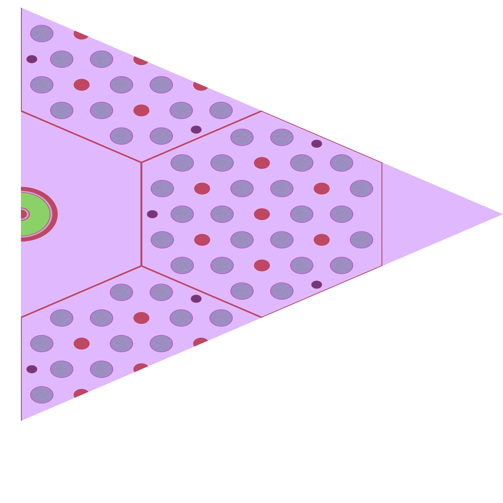
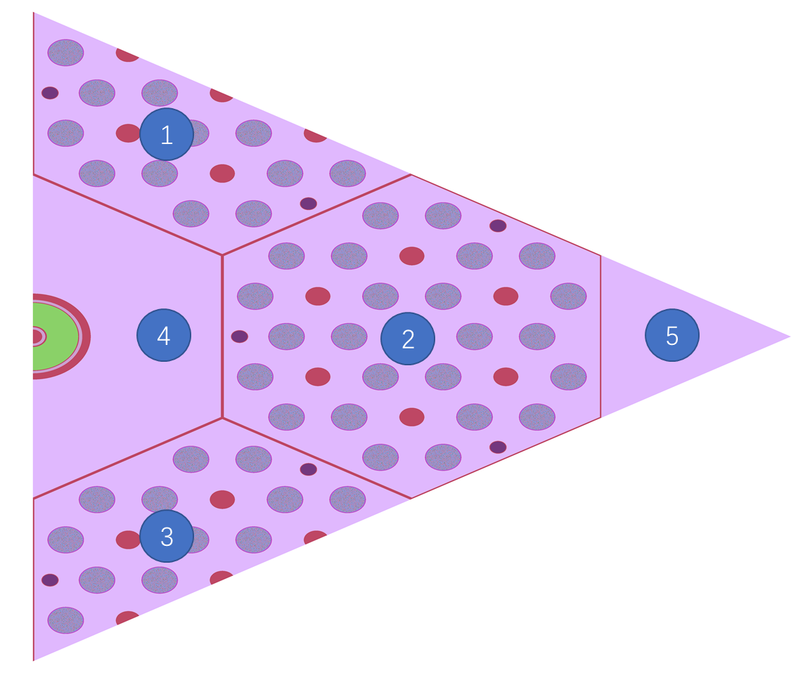

.. _section_eng_xs_parameterize:

Cross-section Parameterization Function (Enterprise Version Only)
=================================================================

The cross-section parameterization function is developed based on the group constant function, so the relevant
input options are included in the group constant module.

Cross-section Parameterization Module RMC Input Options
---------------------------------------------------------

.. code-block:: none

    GroupConstant
    ISBURNUPLINE=<Param>
    ASSEMBINFO= <univ paras1> < univ paras2> … <univ parasi>
                univ parasi = <cell number> <level> <matrix> <rod cell level>
    SUBUNIVERSE <Universes>
    FORMATTYPE = <Param>
    MATINFO = <MatIndexes>

where,

-  **ISBURNUPLINE** \ is the keyword for information related to statistical cross-section parameterization. The input
   options can be 0 or 1. 0 means restarting a certain burnup point in the calculation, and 1 means a
   complete burnup chain (branch) calculation. Note: **This option indicates if each area is a burnup zone, so the
   number of parameters used in the input options later needs to be consistent with the number of universes.**

-  **ASSEMBINFO** \ is a keyword for statistical cross-section parameterization related information, where the input
   option is a set of data. The number of data sets needs to be consistent with the number of regions defined
   by the universe input option of the group constant.
   Each dataset contains 4 different required pieces of data:
   <cell number> is the number of cells contained in the homogenization assembly.
   <level> indicates the level of the lattice in the area.
   <matrix> indicates the assembly shape, that is, the number of rows (the default assembly is a square matrix).
   <rod cell level> defines the cell level where the rod is located (as the input card has axial stratification,
   the axial burnup area needs to be accumulated, hence the level of the rod containing the
   axial stratification needs to be specified).
   Note: **When using the ASSEMBINFO card, the ISBURNUPLINE card must be defined at the same time,
   otherwise an error will be reported.**

-  **SUBUNIVERSE** \ is an optional input option. For geometries with truncation, input the universe number
   of the lattice with truncation for each region. For geometries without truncation, input -1. This card can
   be repeated, but the number of regions must match the number of regions defined on the universe input option
   for the group constant.

-  **FORMATTYPE** \ controls the parameterized interface format, where the value of 1 indicates that GAEA format
   is used, while a value of 2 means that CORCA3D format is being used. Note: **The FORMATTYPE input option
   cannot be placed at the end of the input module, otherwise there will be an error**.

-  **MATINFO** \ requires, in sequence, the material numbers corresponding to the four physical qualities: boron
   concentration, xenon concentration, moderator density, and fuel temperature.

Cross-Section Parameterization Module Python Input Options
------------------------------------------------------------

The Python program corresponding to the section parameterization function has two modules. For the
parameterization module, an input card needs to be provided, and the file name has to be titled inp_preprocess.
inp_preprocess is used to generate the input file of the multi-physics state. The specific format of the file
is as follows:

.. code-block:: none

    MPI=<para>  openmp=<para>  platform=<para>
    RESTARTBRANCH AUXILIARY
    INDEX=<para>  MATTEMP=<temperature material> burnuppoint=<para>

In the Python input card:

-  **MPI/openmp/platform** \ controls computing resources and parallel processing via MPI and openmp. By
   default, openmp is disabled and MPI=60. \ **Platform** \ sets the computing platform, with the default
   value being 1, the computing mode as the local server, and the command as: mpiexec -n ...;
   The user can also input the number 2 to indicate that they want to use the Tianhe platform. The command
   line is: yhrun ...

-  **RESTARTBRANCH/ AUXILIARY_Line** \ represent restart/auxiliary line keywords. Only one option can be chose at a time.

-  **INDEX** \ represents the branch number.

-  **MATTEMP** \ represents the material temperature, followed by a specific value (in K), and then the material
   number that needs to be modified. If all materials need to be modified at the same time, you can input All instead.

-  **burnuppoint** \ represents the burnup step for restarting the calculation (note: the burnup step
   number starts from 0, not 1).

The following is a simple example of the Python input card

|

.. code-block:: c
  :caption: Parallel Calculations
  :name: Parallel Calculations_eng

    MPI=80  openmp=12  platform=2
    RESTARTBRANCH
    INDEX=1    MATTEMP=1000.0  All  burnuppoint=0 3 4 6 8 9
    INDEX=2 MATTEMP=800.0   All  burnuppoint=0 3 4 6 8 9

|

Example of multi-region model containing hexagonal assemblies
~~~~~~~~~~~~~~~~~~~~~~~~~~~~~~~~~~~~~~~~~~~~~~~~~~~~~~~~~~~~~

The cross-section parameterization function is relatively complex, especially for truncated geometries such as
hexagonal assemblies. Therefore, a multi-region model containing hexagonal assemblies is used as an example.
The geometry model contains three fuel assemblies, a poison rod assembly, and a reflector layer area at the edge.
There are 24 fuel rods inside the fuel assembly, and each rod contains 8 fuel pellets axially. The pellets are
filled with fuel particles using the RSA method with a particle packing fraction of 35%. Note: **Currently,
the RSA model is not considered to have nested layers at the bottom.**

   Multi-region model containing hexagonal assemblies

The figure shown above is a specific geometric model. For the convenience of representation,
we have numbered each area of the model, as shown in the figure below.

   Multi-region model containing hexagonal components (numbered)

The input file example is as follows. Regions 1 to 5 in the geometric model correspond to
universes 10, 11, 12, 21, and 13 respectively:

|

.. code-block:: c
  :caption: Multi-region model containing hexagonal components
  :name: multi_region_eng

    ////////////////////// GR5 ////////////////
    ////////////// sleeve : SiC
    ////////////// Block bottom graphite, top He(save for future)
    /////////////  graphite & SiC matrix & sleeve: 1ppm   TRISO: 0.5ppm
    /////////////  top and bottom block, only channels for coolant and CR rod

    //Note: Due to the use of burn-up area merging, the volume here represents the total volume of
    //all triso particles. This should not have a major impact on burn-up, but the power (rate) will be affected\n
    //Each cell requires a given temperature, and the cross-section parameterization here requires
    //consistent temperatures\n
    Universe 1 //move = 0.050319623 0.050319623 0.050319623    //triso
    cell 1 -1           mat = 1  tmp = 1000  vol = 7.5313E-01 //kernel 8.5%
    cell 2  1 & -2      mat = 2  tmp = 1000  vol = 1.0422E+00 //buffer
    cell 3  2 & -3      mat = 3  tmp = 1000  vol = 6.5565E-01 //IPyC
    cell 4  3 & -4      mat = 4  tmp = 1000  vol = 6.9737E-01 //SiC
    cell 5  4 & -5      mat = 5  tmp = 1000  vol = 9.5248E-01 //OPyC
    cell 6  5           mat = 6  tmp = 1000  vol = 1.0000E-30 //SiC matrix

    Universe 2   lat = 4  MATRIC = 3  move = -1.1 -1.1 0.05
                PARTICLE = 1
                PF = 0.3//0.349631585
                RAD = 0.043981974  //PFCORRECT = 0
                RSA = 1
                TYPE = 2
                SIZE = 1.1 3.596
            //DEM = 1  TIME = 0.1

    Universe 3
    cell 14 -6    mat = 6  tmp = 1000

    ///////// pellet /////
    Universe 4
    cell 11 -14 & 16 & -19 & !12   mat =  7  tmp = 1000 vol = 1.6864E+00 //sleeve
    cell 12 -13 & 17 & -18         fill = 2     vol= 13.6696       //fuel compact
    cell 13 14 : -16 : 19          mat =  8  tmp = 1000 vol = 3.4914E-01  //He

    Universe 16  // bottom
    cell 7 -14  mat = 9  tmp = 1000 vol = 5.9496E+00 //graphite
    cell 8 14   mat = 9  tmp = 1000 vol = 1.3527E-01 //graphite

    Universe 17  // top
    cell 9 -14  mat = 8  tmp = 1000 vol = 1.0000E-30  //He
    cell 10 14   mat = 8 tmp = 1000 vol = 1.0000E-30  //He

    // 8 pellets
    Universe 5 move = 0 0 -2.264 lat = 1   pitch = 1 1 3.696   scope = 1 1 10   fill = 16 4*8 17

    Universe 6  // fuel rod
    cell 15  -15 fill = 5       vol=131.73      //fuel
    cell 16  15  mat =  9 tmp = 1000 vol = 2.9782E+02  //block graphite

    Universe 7   //graphite rod
    cell 17  -21 mat = 9  tmp = 1000 vol = 4.2955E+02
    cell 18  21  mat = 9  tmp = 1000 vol = 1.0000E-30

    Universe 8  //coolant rod
    cell 19  -20  mat = 8 tmp = 1000 vol = 6.2329E+01 // He
    cell 20   20  mat = 9 tmp = 1000 vol = 3.6722E+02 // graphite

    Universe 40 //BP1-1
    cell 100 -61 & 67 & -68        mat = 15  tmp = 1000  vol = 7.068583
    cell 101  61 & -62 & 67 & -68  mat = 15  tmp = 1000  vol = 7.068583
    cell 102  62 & -63 & 67 & -68  mat = 15  tmp = 1000  vol = 4.712389
    cell 103  63 & -64 & 67 & -68  mat = 15  tmp = 1000  vol = 3.534292
    cell 104  64 & -65 & 67 & -68  mat = 15  tmp = 1000  vol = 1.178097
    cell 105  ((65 & 67 & -68) : -67 : 68) & -66   mat = 8  tmp = 1000  vol = 5.898340
    cell 106  66    mat = 9  tmp = 1000  vol = 185.314015

    Universe 41  rotate = -0.5 0.8660254 0 -0.8660254 -0.5 0 0 0 1 //BP1-2 r120
    cell 110 -61 & 67 & -68        mat = 15  tmp = 1000  vol = 7.068583
    cell 111  61 & -62 & 67 & -68  mat = 15  tmp = 1000  vol = 7.068583
    cell 112  62 & -63 & 67 & -68  mat = 15  tmp = 1000  vol = 4.712389
    cell 113  63 & -64 & 67 & -68  mat = 15  tmp = 1000  vol = 3.534292
    cell 114  64 & -65 & 67 & -68  mat = 15  tmp = 1000  vol = 1.178097
    cell 115  ((65 & 67 & -68) : -67 : 68) & -66   mat = 8  tmp = 1000 vol = 5.898340
    cell 116  66    mat = 9  tmp = 1000  vol = 185.314015

    Universe 42  rotate = -0.5 -0.8660254 0 0.8660254 -0.5 0 0 0 1 //BP1-3 r240
    cell 120 -61 & 67 & -68        mat = 15  tmp = 1000  vol = 7.068583
    cell 121  61 & -62 & 67 & -68  mat = 15  tmp = 1000  vol = 7.068583
    cell 122  62 & -63 & 67 & -68  mat = 15  tmp = 1000  vol = 4.712389
    cell 123  63 & -64 & 67 & -68  mat = 15  tmp = 1000  vol = 3.534292
    cell 124  64 & -65 & 67 & -68  mat = 15  tmp = 1000  vol = 1.178097
    cell 125  ((65 & 67 & -68) : -67 : 68) & -66   mat = 8  tmp = 1000 vol = 5.898340
    cell 126  66    mat = 9  tmp = 1000  vol = 185.314015

    // block
    //The volume of each cell in the lattice is provided on the volume card.\n
    Universe 9  move = -24 -13.85640646 0
         lat=2 scope= 9 9 sita = 60 pitch = 4 4 fill = //inner block
             7 * 9
             7  7  7  7  7  6  6  41 7
             7  7  7  6  6  8  6  6  7
             7  7  6  8  6  6  8  6  7
             7  40 6  6  8  6  6  7  7
             7  6  8  6  6  8  6  7  7
             7  6  6  8  6  6  7  7  7
             7  7  6  6  42 7  7  7  7
             7 * 9

    Universe 10
    //The cell volume needs to contain all levels of cells residing in the homogenized area.
    //The volume can either be real or relative.\n
    cell 27  31 & -32 & -33 & 34 & 35 & -36        fill =  9      vol=498.8452656  //outer block
    cell 28  -31 : 32 : 33 : -34 : -35 : 36        mat =  8   tmp = 1000 vol = 8.348729792  //He 1mm
    /////// a block end

    Universe 11
    cell 29  31 & -32 & -33 & 34 & 35 & -36        fill =  9     vol=498.8452656         //outer block
    cell 30  -31 : 32 : 33 : -34 : -35 : 36        mat =  8   tmp = 1000 vol = 8.348729792  //He 1mm

    Universe 12
    cell 31  31 & -32 & -33 & 34 & 35 & -36        fill =  9       vol=498.8452656       //outer block
    cell 32  -31 : 32 : 33 : -34 : -35 : 36        mat =  8   tmp = 1000 vol = 8.348729792  //He 1mm

    Universe 13
    cell 33 -74 mat = 9 tmp = 1000 vol=1.0  //core graphite

    Universe 73 //move = 24.2 0 0
    cell 60 -40       mat = 8  tmp = 1000 vol=0.188495556//He
    cell 61 40 & -41  mat = 12 tmp = 1000 vol=0.146607655//inner cladding
    cell 62 41 & -42  mat = 8  tmp = 1000 vol=0.08901179//He
    cell 63 42 & -43  mat = 11 tmp = 1000 vol=3.979350627//control rod
    cell 64 43 & -44  mat = 8  tmp = 1000 vol=0.184097326//He
    cell 65 44 & -45  mat = 12 tmp = 1000 vol=0.64088489//outer cladding
    cell 66 45        mat = 8  tmp = 1000 vol=1.939619271//He

    Universe 21  //move = 24.2 0 0 ////shutdown contrl column
    cell 84 -46 vol=7.168067116 fill = 73
    cell 67 46 & 31 & -32 & -33 & 34 & 35 & -36   mat = 9 tmp = 1000 vol=34.40237168  //core graphite
    cell 83 -31 : 32 : 33 : -34 : -35 : 36    mat = 8 tmp = 1000 vol=0.695727483 //He 1mm

    Universe 30 lat=2 scope= 3 3 sita = 60 pitch = 24.2 24.2 fill = //inner block
     13 10 13
     21 11 13
     12 13 13

    Universe 0
    cell 90  69 & -70 & 71 & -72 & -73  fill = 30 vol=1.0 //core
    cell 92  -69: 70: -71 : 72 : 73    mat = 0 vol=1.0e-30  void = 1

    SURFACE
    // ----------triso particle
    surf 1   so   0.025       // keneral
    surf 2   so   0.033396452     // buffer
    surf 3   so   0.037047997      // IPyC
    surf 4   so   0.040272833   // SiC
    surf 5   so   0.043981974   // OPyC
    surf 6   inf
    /// ----------pellet
    //surf 11 cz 0.30    //inner radius
    //surf 12 cz 0.35    //outer radius
    surf 13 cz 1.1     //pellet
    surf 14 cz 1.15    //sleeve radius
    surf 15 cz 1.163   //fuel hole
    surf 16 pz 0
    surf 17 pz 0.05
    surf 18 pz 3.646
    surf 19 pz 3.696
    surf 20 cz  0.8   // coolant hole
    /// ---------- block
    surf 21 cz 10    // block inner radius
    // surf 22 cz 10.05 // inner tube inner radius
    // surf 23 cz 10.25 // inner tube outer radius
    // surf 24 cz 10.4  // pressure tube inner radius
    // surf 25 cz 10.9  // pressure tube outer radius
    // surf 26 cz 11    // block outer radius
    surf 27 cz 0.75  //relector hole
    surf 31 px -12
    surf 32 px 12
    surf 33 p 1 1.732 0 24
    surf 34 p 1 -1.732 0 -24
    surf 35 p 1 1.732 0 -24
    surf 36 p 1 -1.732 0 24
    ///----------shutdown control column
    surf 40 cz 0.6      //inner clad inside
    surf 41 cz 0.8      //inner clad outside
    surf 42 cz 0.9      //control rod inside
    surf 43 cz 2.9      //control rod outside
    surf 44 cz 2.96     //outer clad inside
    surf 45 cz 3.16     //outer clad outside
    surf 46 cz 3.7      //control rod channel
    ///------------BP
    surf 61 c/z  1 0  0.27386128
    surf 62 c/z  1 0  0.38729834
    surf 63 c/z  1 0  0.44721360
    surf 64 c/z  1 0  0.48733972
    surf 65 c/z  1 0  0.5
    surf 66 c/z  1 0  0.55
    surf 67 pz   0.5
    surf 68 pz   30.5
    surf 69 pz 0  bc=1
    surf 70 pz 31  bc=1
    surf 71 px 12.11 bc=1
    surf 72 p 1 -1.732 0 24.2 bc=1
    surf 73 p 1 1.732 0 96.8   bc=1
    surf 74 cz 200

    //surf 69 pz 0  bc=1
    //surf 70 pz 31  bc=1
    //surf 71 px 0  bc=1
    //surf 72 px 12.1
    //surf 73 p 1 1.732 0 24.2   bc=1
    //surf 74 p 1 -1.732 0 -24.2
    //surf 75 p 1 1.732 0 -24.2
    //surf 76 p 1 -1.732 0 24.2 bc=1

    MATERIAL
    //  -------kernel 8.5%---------
    mat 1  -10.4
          5010.30c  -0.5000E-06
          8016.30c  -1.1855E-01
          8017.30c  -5.0406E-05
         92234.30c  -5.9058E-04
         92235.30c  -7.4919E-02
         92238.30c  -8.0589E-01
    //  ------buffer layer--------
    mat 2  -1.235294118
         5010.30c  6.8467E-09
         6000.30c  6.1936E-02
    //sab 2 Graph.71t
    //  -------IPyC layer---------
    mat 3  -2.235294118
         5010.30c  1.2389E-08
         6000.30c  1.1207E-01
    //sab 3 Graph.71t
    //  -------SiC layer----------
    mat 4  -3.741176471
         5010.30c  2.0736E-08
         6000.30c  5.6189E-02
        14028.30c  5.1823E-02
        14029.30c  2.6313E-03
        14030.30c  1.7346E-03
    //sab 4 Graph.71t
    //  --------OPyC layer--------
    mat 5   -2.235294118
         5010.30c  1.2389E-08
         6000.30c  1.1207E-01
    //sab 5 Graph.71t
    //  ------SiC matrix----
    mat 6  -2.933721806
         5010.30c  3.2520E-08
         6000.30c  4.4062E-02
        14028.30c  4.0638E-02
        14029.30c  2.0634E-03
        14030.30c  1.3602E-03
    //sab 6 Graph.71t
    //  ------SiC sleeve-----
    mat 7  -3.18
         5010.30c  3.5251E-8
         6000.30c  4.7761E-2
        14028.30c  4.4050E-2
        14029.30c  2.2366E-3
        14030.30c  1.4744E-3
    //sab 7 Graph.71t
    //  ------helium coolant------
    mat 8  -1.6361E-4
         2003.30c  3.3724E-11
         2004.30c  2.4616E-5
    //  ------IG-110 graphite-----
    mat 9  -1.7512
         5010.30c  1.9412E-8
         6000.30c  8.7804E-2
    //sab 9 Graph.71t
    //  ------control rod natural B4C---------
    mat 11  -2.5
         5010.30c  2.1579E-02
         5011.30c  8.7406E-02
         6000.30c  2.7246E-02
    //sab 11 Graph.71t
    //  -------alloy 800H---------
    mat 12  -8.03
        6000.30c  3.2210E-4
        13027.30c  6.7209E-4
        14028.30c  5.5580E-4
        14029.30c  2.8222E-5
        14030.30c  1.8604E-5
        15031.30c  3.1225E-5
        16032.30c  1.4325E-5
        16033.30c  1.1311E-7
        16034.30c  6.4094E-7
        16036.30c  1.5081E-9
        22046.30c  3.1254E-5
        22047.30c  2.8186E-5
        22048.30c  2.7928E-4
        22049.30c  2.0495E-5
        22050.30c  1.9624E-5
        24050.30c  8.4860E-4
        24052.30c  1.6364E-2
        24053.30c  1.8556E-3
        24054.30c  4.6189E-4
        25055.30c  8.8022E-4
        26054.30c  2.2265E-3
        26056.30c  3.4951E-2
        26057.30c  8.0717E-4
        26058.30c  1.0742E-4
        28058.30c  1.8229E-2
        28060.30c  7.0217E-3
        28061.30c  3.0523E-4
        28062.30c  9.7320E-4
        28064.30c  2.4785E-4
        29063.30c  1.5791E-4
        29065.30c  7.0383E-5
    // ------ Burnable Poison (Gd2O3 1%) -----
    mat 13  -1.71789
         5010.30c  1.9043E-8
         6000.30c  8.6134E-2
    //sab 13 Graph.71t
    mat 15 -1.7
         6000.30c  8.4383E-02
         8016.30c  8.4691E-05
         8017.30c  3.3890E-08
        64152.30c  1.1297E-07
        64154.30c  1.2144E-06
        64155.30c  8.3200E-06
        64156.30c  1.1562E-05
        64157.30c  8.8566E-06
        64158.30c  1.4047E-05
        64160.30c  1.2370E-05
    //sab 15 Graph.71t
    CeAce  OTFDB=1  OTFSab=0  pTable=0 DBRC=0  ErgBinHash=1

    CRITICALITY
    PowerIter   population = 1000  10  15
    InitSrc point =  30  30  5

    GroupConstant
    //Supports multiple universes. This input option must be placed in the first position
    Universe = 10 11 12 13 21
    Energy = 4E-6//3.000000E-08 1.463700E-07 3.500000E-07 1.071000E-06 1.855390E-06 9.118820E-03 8.208500E-01
    WIMS=0  // Using a two-step method, the WIMS 69 group structure is used. After merging, the energy structure is used. Hence, the energy structure needs to be included in the wims structure\n
    BONE=0  //b1 correction is used\n
    Hybrid=1  // Output MCNP format multi-group file
    Angular=1  //Angular distribution variable order 1 for the default, as p1\n
    //Homogenization method，0：Non-Homogenization method，1：DF，2：sph
    //DF Parameter：1（quadrilateral) 2（hexagon）
    //SPH Parameter：Number of iterations\n
    EQUIVALENCE = 2 10
    //volume input option description：
    //Note: This input option can be defined multiple times, but it needs to be consistent with the input number of universe cards.\n
    //The order given by the input options corresponds to the universe of the universe card.
    //Volume input option contains 5 lines of data
    //The first data in the first line is the total volume (real volume), used for sph calculation\n
    //1-3 //4-5 //6-7 //8-9 //axial
    volume = 7732 0*20 71.59 0*6
                  0*2 4.2955E+02 2.1477E+02 0*6 2.1477E+02 4.2955E+02*2 2.1477E+02 0*4
                  0 4.2955E+02*4 2.1477E+02 0*3 1.4318E+02 4.2955E+02*5 71.59 0*2
                  0 2.1477E+02 4.2955E+02*2 2.1477E+02 0*6 1.4318E+02 0*6
                  0 3.696*8 1.432
    volume = 1.5464E+04 1.0E-30*6 1.4318E+02 1.0E-30*6 2.1477E+02 4.2955E+02*2 2.1477E+02 1.0E-30*3 1.4318E+02 4.2955E+02*5 1.4318E+02
                                     1.0E-30*2 4.2955E+02*6 1.0E-30*2 2.1477E+02 4.2955E+02*5 2.1477E+02 1.0E-30*2 4.2955E+02*6 1.0E-30*2
                                     1.4318E+02 4.2955E+02*5 1.4318E+02 1.0E-30*3 2.1477E+02 4.2955E+02*2 2.1477E+02 1.0E-30*6 1.4318E+02
                                     1.0E-30*6 0 3.696*8 1.432
    //Volume input option contains 5 lines of data
    //The first data in the first line is the total volume (real volume), used for sph calculation\n
    //81 data structures：
    //1-2 //3-4 //5-6 //7-9
    //10 axial data
    //Note: Do not add comments inside the volume input option. If there is too much data, you can write the data in separate lines.\n
    volume = 7732 0*6 1.4318E+02 0*6 2.1477E+02 4.2955E+02*2 2.1477E+02 0
                  0*2 1.4318E+02 4.2955E+02*5 71.59 0*2 4.2955E+02*4 2.1477E+02 0*2
                  0 2.1477E+02 4.2955E+02*2 2.1477E+02 0*5 4.2955E+02 2.1477E+02 0*6
                  71.59 0*26
                  0 3.696*8 1.432
    //Corresponding to universe 13, this area is not a lattice, hence a value of 1.0 is sufficient\n
    //But if you wish to calculate SPH and produce the real volume\n
    volume = 2577.3
    //Corresponding to universe 21, this area is not a lattice, hence a value of 1.0 is sufficient\n
    volume = 7732
    //ASSEMBINFO input option description：
    //Structure: <univ paras>...
    //<cell number>,<level>,<matrix>,<axial para num>,<axial para>
    //Meaning:
    //The number of universes = number of sets of <univ paras> data to be provided
    //Each set of <univ paras> includes <cell number>,<level>,<matrix>,<rod cell level>
    //For example, universe10 contains 81 1 9 16 8 1*15
    //Universe10 includes 81 cells,lattice structure. As per the hierarchy, we go down 1 layer, find universe9,
    //and output the h5 file of the power and fuel consumption of this area. The 9*9 matrix is used to output 81 sets of data.\n
    //Since the input card has axial stratification, the axial burnup area has to be accumulated, so this card is set up
    //The burncell in universe10 contains: 1 100 101 102 103 104 110 111 112 113 114 120 121 122 123 124
    //Since the input card is divided into axial directions according to the cell vector, the meaning of 3 is: 90 > 2 > 27 > 15, (0, 1, 2, 3)
    ASSEMBINFO = 81 1 9 3    81 1 9 3   81 1 9 3    1 0 1 3    1 0 1 3
    ////Branch signal
    //A value of 1 means main line, auxiliary line, while 2 means to restart\n
    ISBURNUPLINE 1
    //Input whether each area is a fuel consumption area, 1 is yes, 0 is no
    IsBurnRegion=1 1 1 0 0
    //SUBUNIVERSE：
    //Repeated definition of this input option is supported
    //For geometric cutoff cases\n
    //The order in which the input options are provided corresponds to the universe of the universe card
    //Using universe10 as an example: There are two truncated areas, 9 and 5 (the volume input gives 9 first, then 5)\n
    SUBUNIVERSE=9 5
    SUBUNIVERSE=9 5
    SUBUNIVERSE=9 5
    //If there is no truncation or if truncation has no effect, -1 is given.
    SUBUNIVERSE=-1
    SUBUNIVERSE=-1
    FORMATTYPE = 1
    //Input Option for setting status parameters
    //Boron concentration, xenon concentration, moderator density, fuel temperature vs. material number\n
    MATINFO = 9 1 9 1

    //Note: Cutting off the burn-up area will result in a 0 energy warning, which does not affect the calculation\n
    //Consider replacing the truncated burnup area with a non-burnup structure instead\n
    BURNUP
    BurnCell    1 100 101 102 103 104 110 111 112 113 114 120 121 122 123 124
    TimeStep    10 20//
    Power       17.98162286*2
    Substep     10
    Inherent    0.9999
    AceLib      .30c
    Strategy    0
    Parallel    1
    Solver      2
    Merge  7 2  //burnup zone merging function, (level /universe) 0->30->10/11/12->9->6->5->4->2 (7 layers), note that 10, 11, 12 must be on the same layer, otherwise an error will occur\n

    //Plot ColorScheme=9  Continue-calculation=0
    //PlotID 1 Type = slice Color = mat Pixels=5000 5000 Vertexes=10  -8 5  60.5 60  5
    //PlotID 2 Type = slice Color = mat Pixels=4000 4000 Vertexes= 20  -8 -1  20 60 32
    //PlotID 3 Type = slice Color = cell Pixels=4000 8000 Vertexes=23  -1 5  24 1  5

|

Parameterized Calculation Description
-------------------------------------

The calculation process of cross-section parameterization is as follows:

a) Before using Python for calculation, please make sure that you have used RMC to complete the
   group constant calculation. The group constant calculation requires turning on options such as
   EQUIVALENCE = 2 and Hybrid = 1. For details, see the RMC user manual for the group constant module
   description. When calculating the group constant, be sure to turn on the continuation calculation
   function (in the output control module, define inpfile as 1) for restarting the calculation of
   cross-section parameterization.

b) Calculation Process:

   1. Prepare inp_preprocess for auxiliary line, restart and other calculations;

   2. Prepare RMC program, xsdir and other files and programs

   3. Prepare the subsequent output files (XXX.FMTinp.stepXXX and materialXX)

   4. Run main.py to complete the construction and calculation of parameterized branch files

   5. Use the RMC input file and multi-group output file generated by the branch to perform SPH calculations in
      the Python program folder of SPH. Note that the restarted SPH file is processed by Python
      (path: ~/Restart/branch_xx/xsparatable_SPH.h5)

   6. Copy the sph calculation result file

      Each sph_Iter.h5 of the auxiliary line is placed in ~/Auxliary/branch_xx/burnup_xx/

      Each sph_Iter.h5 of the main line is placed in ~/burnup_xx/

      Each sph_Iter.h5 that is restarted is placed in ~/Restart/branch_xx/step_xx/

      Restart and delete the ~/Restart/branch_xx/xsparatable_SPH.h5 file

   7. Prepare the Pair_inp file, which sets the correspondence between the parameterized area and the sph area

   8. Run ChangeRestartXS.py and ChangeAuxliaryXS.py

   9. Run H5FileFormat.py

   10. The final result is in the Result folder

