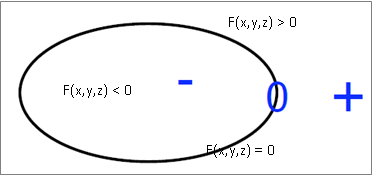
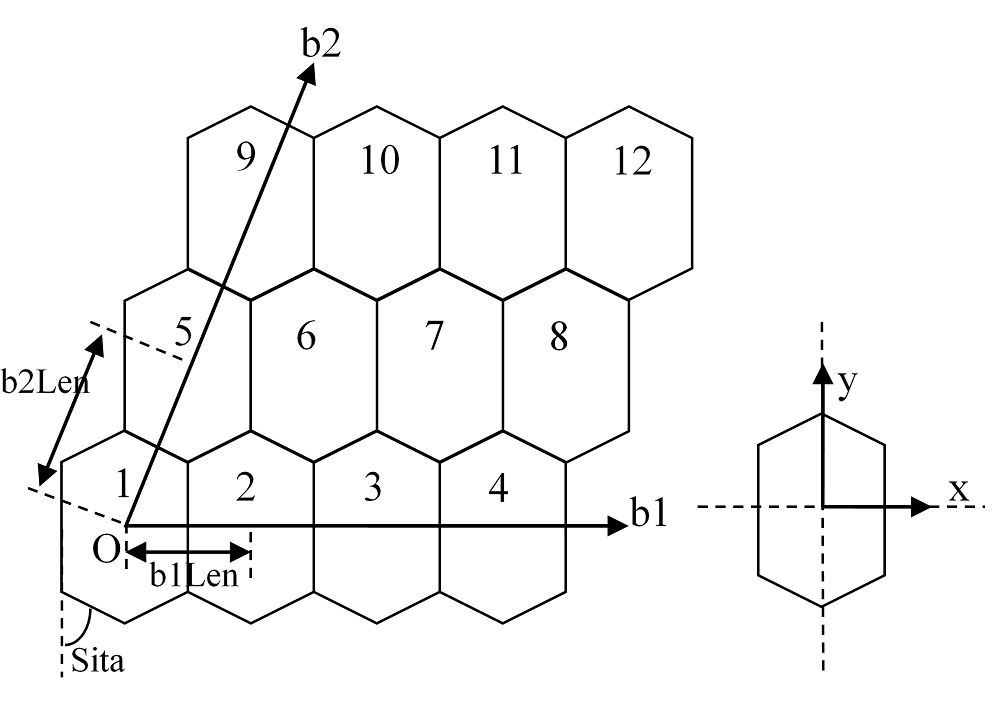
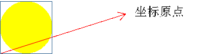
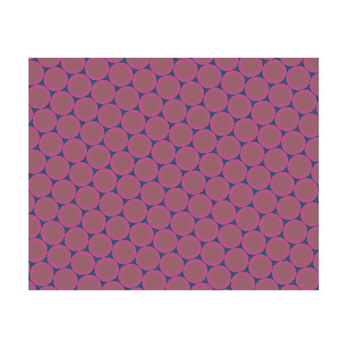
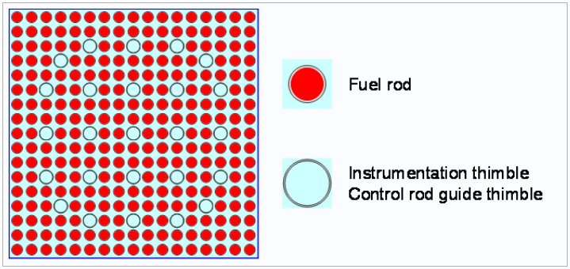
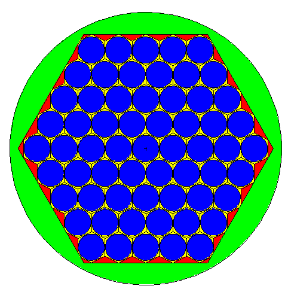
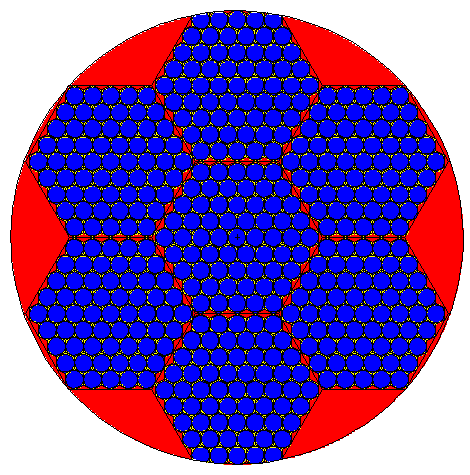
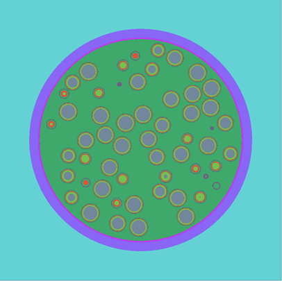

.. _section_geometry:

几何
==========

复杂几何描述是蒙卡程序相对于确定论程序的重要优势之一。与世界上其它绝大多数蒙卡程
序一样，RMC支持基于CAD几何与CSG几何输运。CSG几何采用基于层级空间的几何描述系统（universe-based
geometry system）。

RMC的CSG几何描述系统包括三类基本的几何描述单元，即，曲面（surface），栅元（cell）和
空间（universe）。一般地，物理系统由多个或单个层级空间组成，每个空间由一定数量的
栅元构成，栅元通过曲面方向（sense）的交并运算来定义。RMC几何输入模块的一般具有以下形式：

.. code-block::none

  UNIVERSE 0 // 描述最顶层的Universe模块
  Cell …     // 描述Universe模块当中的第1个栅元
  Cell …     // 描述Universe模块当中的第2个栅元
  ...

  UNIVERSE 1 // 描述用于填充的Universe模块
  ...

  SURFACE    // 描述曲面模块
  Surf ...   // 描述第1个曲面
  Surf ...   // 描述第2个曲面
  ...

.. _section_geometry_surface:

曲面（surface）
-------------------

曲面是RMC几何描述的最基本单元。考虑到MCNP用户的广泛性，RMC参考了MCNP的曲面定义方
式。曲面输入卡的定义方式为：

.. code-block:: none

  Surf <id> <type> {params} [rotate = <params>] [rotateangle = <params>] [move = <params>]
                            [bc = <flag>] [pair = <pair surf>] [value=<v1 v2 ... vn>] [time=<t1 t2 ... tn>] 

其中，

-  **Surf** 是曲面输入卡关键词。

-  **id**\ 是曲面编号。编号为正整数，且不允许重复。

-  **type**\ 是曲面类型所对应的关键词，\ **params**\ 是曲面方程参数。
   :numref:`surftypes_table` 给出了RMC支持的曲面类型及相应的曲面方程。

-  **bc**\ 是曲面边界条件（boundary condition）。bc = 0（缺省值）表示真空边界条
   件，bc = 1表示全反射边界条件，bc = 2表示白边界条件，bc = 3表示周期边界条件。

-  **Move**\ 面的平移向量

-  **Rotate**\ 面的旋转矩阵

-  **RotateAngle**\ 面的旋转角。对面进行旋转和平移操作时，顺序为先旋转后平移。
   注意，程序不支持对包含圆环面(TX/TY/TZ)的旋转，RMC的面的旋转平移功能需使用RMC的python模块进行计算。

-  **pair**\ 是在周期边界条件下两个周期面的另一个，pair surf 是与该 surf 配对的另
   一个周期面。
   另外，使用周期边界条件有如下限制：

      - 周期边界条件的面只能是平面，即 P/ PX/ PY/ PZ；
      - 周期边界条件的面只能是最外表面，即周期边界条件的平面的其中一边必须是重要性为零的 Cell
      - 配对的面必须平行，且不能有变形

-  **value**\ 卡和\ **time**\ 卡结合使用，描述曲面方程中最后一个参数随时间的变化规律，
   两个卡中输入的值的数目相等，表示当时间超过ti时，对应参数取为vi。

.. table:: 曲面类型
   :name: surftypes_table

   +---------------------+--------+-------------------+------------------------------------------------+----------------------------+
   | 类型                | 关键词 | 说明              | 方程                                           | 曲面方程参数               |
   +=====================+========+===================+================================================+============================+
   | 平面                | **P**  | 一般              | :math:`Ax+By+Cz-D=0`                           |:math:`A,B,C,D`             |
   +---------------------+--------+-------------------+------------------------------------------------+----------------------------+
   |                     | **PX** | 垂直X轴           | :math:`x-D=0`                                  |:math:`D`                   |
   +---------------------+--------+-------------------+------------------------------------------------+----------------------------+
   |                     | **PY** | 垂直Y轴           | :math:`y-D=0`                                  |:math:`D`                   |
   +---------------------+--------+-------------------+------------------------------------------------+----------------------------+
   |                     | **PZ** | 垂直Z轴           | :math:`z-D=0`                                  |:math:`D`                   |
   +---------------------+--------+-------------------+------------------------------------------------+----------------------------+
   | 球面                | **SO** | 球心在原点        | :math:`x^2+y^2+z^2-R^2=0`                      |:math:`R`                   |
   +---------------------+--------+-------------------+------------------------------------------------+----------------------------+
   |                     | **S**  | 一般              | :math:`(x-x_0)^2+(y-y_0)^2+(z-z_0)^2-R^2=0`    |:math:`x_0,y_0,z_0,R`       |
   +---------------------+--------+-------------------+------------------------------------------------+----------------------------+
   |                     | **SX** | 球心在X轴         | :math:`(x-x_0)^2+y^2+z^2-R^2=0`                |:math:`x_0,R`               |
   +---------------------+--------+-------------------+------------------------------------------------+----------------------------+
   |                     | **SY** | 球心在Y轴         | :math:`x^2+(y-y_0)^2+z^2-R^2=0`                |:math:`y_0,R`               |
   +---------------------+--------+-------------------+------------------------------------------------+----------------------------+
   |                     | **SZ** | 球心在Z轴         | :math:`x^2+y^2+(z-z_0)^2-R^2=0`                |:math:`z_0,R`               |
   +---------------------+--------+-------------------+------------------------------------------------+----------------------------+
   | 圆柱面              | **C/X**| 平行于X轴         | :math:`(y-y_0)^2+(z-z_0)^2-R^2=0`              |:math:`y_0,z_0,R`           |
   +---------------------+--------+-------------------+------------------------------------------------+----------------------------+
   |                     | **C/Y**| 平行于Y轴         | :math:`(x-x_0)^2+(z-z_0)^2-R^2=0`              |:math:`x_0,z_0,R`           |
   +---------------------+--------+-------------------+------------------------------------------------+----------------------------+
   |                     | **C/Z**| 平行于Z轴         | :math:`(x-x_0)^2+(y-y_0)^2-R^2=0`              |:math:`x_0,y_0,R`           |
   +---------------------+--------+-------------------+------------------------------------------------+----------------------------+
   |                     | **CX** | 轴心在X轴         | :math:`y^2+z^2-R^2=0`                          |:math:`R`                   |
   +---------------------+--------+-------------------+------------------------------------------------+----------------------------+
   |                     | **CY** | 轴心在Y轴         | :math:`x^2+z^2-R^2=0`                          |:math:`R`                   |
   +---------------------+--------+-------------------+------------------------------------------------+----------------------------+
   |                     | **CZ** | 轴心在Z轴         | :math:`x^2+y^2-R^2=0`                          |:math:`R`                   |
   +---------------------+--------+-------------------+------------------------------------------------+----------------------------+
   | 圆锥面              | **K/X**| 平行于X轴         | :math:`\sqrt{(y-y_0)^2+(z-z_0)^2}=\pm t(x-x_0)`|:math:`x_0,y_0,z_0,t^2,\pm1`|
   +---------------------+--------+-------------------+------------------------------------------------+----------------------------+
   |                     | **K/Y**| 平行于Y轴         | :math:`\sqrt{(x-x_0)^2+(z-z_0)^2}=\pm t(y-y_0)`|:math:`x_0,y_0,z_0,t^2,\pm1`|
   +---------------------+--------+-------------------+------------------------------------------------+----------------------------+
   |                     | **K/Z**| 平行于Z轴         | :math:`\sqrt{(x-x_0)^2+(y-y_0)^2}=\pm t(z-z_0)`|:math:`x_0,y_0,z_0,t^2,\pm1`|
   +---------------------+--------+-------------------+------------------------------------------------+----------------------------+
   |                     | **KX** | 轴心在X轴         | :math:`\sqrt{y^2+z^2}=\pm t(x-x_0)`            |:math:`x_0,t^2,\pm1`        |
   +---------------------+--------+-------------------+------------------------------------------------+----------------------------+
   |                     | **KY** | 轴心在Y轴         | :math:`\sqrt{x^2+z^2}=\pm t(y-y_0)`            |:math:`y_0,t^2,\pm1`        |
   +---------------------+--------+-------------------+------------------------------------------------+----------------------------+
   |                     | **KZ** | 轴心在Z轴         | :math:`\sqrt{x^2+y^2}=\pm t(z-z_0)`            |:math:`z_0,t^2,\pm1`        |
   +---------------------+--------+-------------------+------------------------------------------------+----------------------------+
   | 椭球面/双曲面/抛物面| **SQ** | 轴平行于X、Y或Z轴 | :math:`A(x-x_0)^2+B(y-y_0)^2+C(z-z_0)^2        |:math:`A,B,C,D,E,F,G,x_0,y_0|
   |                     |        |                   | +2D(x-x_0)+2E(y-y_0)+2F(z-z_0)+G=0`            |,z_0`                       |
   +---------------------+--------+-------------------+------------------------------------------------+----------------------------+
   | 圆柱面/圆锥面/椭球面| **GQ** | 轴不平行于X、Y    | :math:`Ax^2+By^2+Cz^2+Dxy+Eyz+Fzx+Gx+Hy+Jz+K=0`|:math:`A,B,C,D,E,F,G,H,J,K` |
   | /双曲面/抛物面      |        | 或Z轴             |                                                |                            |
   +---------------------+--------+-------------------+------------------------------------------------+----------------------------+
   | 椭圆或圆形的圆环面  | **TX** | 平行于X轴         | :math:`(x-x_0)^2/B^2+                          |:math:`x_0,y_0,z_0,A,B,C`   |
   |                     |        |                   | (\sqrt{(y-y_0)^2+(z-z_0)^2}-A)^2/C^2-1=0`      |                            |
   +---------------------+--------+-------------------+------------------------------------------------+----------------------------+
   |                     | **TY** | 平行于Y轴         | :math:`(y-y_0)^2/B^2+                          |:math:`x_0,y_0,z_0,A,B,C`   |
   |                     |        |                   | (\sqrt{(x-x_0)^2+(z-z_0)^2}-A)^2/C^2-1=0`      |                            |
   +---------------------+--------+-------------------+------------------------------------------------+----------------------------+
   |                     | **TZ** | 平行于Z轴         | :math:`(z-z_0)^2/B^2+                          |:math:`x_0,y_0,z_0,A,B,C`   |
   |                     |        |                   | (\sqrt{(x-x_0)^2+(y-y_0)^2}-A)^2/C^2-1=0`      |                            |
   +---------------------+--------+-------------------+------------------------------------------------+----------------------------+

.. _section_geometry_macrobody:

宏体（macrobody） （仅限企业版本）
-------------------------------------------

曲面是RMC几何描述的最基本单元，而宏体定义方式可以代替面定义的方式进行建模。
RMC中的宏体定义方式如下：

.. code-block:: none

 Body <id> <type> {params} [rotate = <params>] [rotateangle = <params>] [move = <params>]

其中,

-  **Body**\ 是宏体输入卡关键词

-  **id**\ 是宏体编号,编号为正整数且不能与面的编号重复。

-  **type**\ 是不同宏体类型所对应的关键词，\ **params**\ 是宏体参数。
   :numref:`bodytypes_table` 给出了RMC支持的宏体类型及相应的宏体参数。

-  **Move**\ 宏体的平移向量

-  **Rotate**\ 宏体的旋转矩阵

-  **RotateAngle**\ 宏体的旋转角。对面进行旋转和平移操作时，顺序为先旋转后平移。
   注意，程序不支持对圆环体(Torus)的旋转。

-  注意，RMC的宏体建模功能必须要调用python模块进行计算。

.. list-table:: 宏体类型
   :name: bodytypes_table
   :widths: 15 20 50
   :header-rows: 1

   *   - 关键词
       - 宏体描述
       - 宏体参数
   *   - RPP
       - 任意方向长方体，面不一定垂直于x,y,z轴
       - Xmin,Xmax:垂直于x轴得最小最大边界面
   *   -
       -
       - Ymin,Ymax:垂直于y轴的最小最大边界面
   *   -
       -
       - Zmin,Zmax:垂直于z轴的最小最大边界面
   *   - BOX
       - 任意方向长方体，面不一定垂直于x,y,z轴
       - Vx,Vy,Vz:长方体的一个顶点坐标
   *   -
       -
       - a1x,a1y,a1z:从指定顶点坐标到第一条边的向量
   *   -
       -
       - a2x,a2y,a2z:从指定顶点坐标到第二条边的向量
   *   -
       -
       - a3x,a3y,a3z:从指定顶点坐标到第三条边的向量
   *   - SPH
       - 球体
       - Vx,Vy,Vz:球心坐标
   *   -
       -
       - r:球半径
   *   - RCC
       - 圆柱体
       - Vx,Vy,Vz:圆柱底面中心坐标
   *   -
       -
       - hx,hy,hz:圆柱高度向量
   *   -
       -
       - r:圆柱半径
   *   - RHP or HEX
       - 六棱柱
       - V1,V2,V3:六棱柱底面中心坐标
   *   -
       -
       - h1,h2,h3:六棱柱高度向量
   *   -
       -
       - r1,r2,r3:六棱柱中心到第一个面的向量
   *   -
       -
       - s1,s2,s3:六棱柱中心到第二个面的向量
   *   -
       -
       - t1,t2,t3:六棱柱中心到第二个面的向量
   *   -
       -
       - 需要指出的是，对正六棱柱来说，三个到面的向量只需要一个即可，即只需要写 r1,r2,r3即可
   *   - REC
       - 椭圆柱体
       - Vx,Vy,Vz:椭圆柱体底面中心坐标
   *   -
       -
       - hx,hy,hz:圆柱轴向向量
   *   -
       -
       - V1x,V1y,V1z:椭圆长轴向量
   *   -
       -
       - V2x,V2y,V2z:椭圆短轴向量，这个向量可以写也可以不写，也可以直接写个短轴长度，因为短轴方向可以由轴向与长轴方向确定
   *   - TRC
       - 圆台
       - Vx,Vy,Vz:圆台底面中心坐标
   *   -
       -
       - hx,hy,hz:圆台轴向向量
   *   -
       -
       - r1:底面半径
   *   -
       -
       - r2:顶面半径   r1>r2
   *   - ELL
       - 旋转椭球
       - V1x,V1y,V1z    如果r>0 表示第一个焦点位置  如果r<0 表示椭球中心点坐标
   *   -
       -
       - V2x,V2y,V2z    如果r>0 表示第二个焦点位置  如果r<0 表示椭球体长半轴向量
   *   -
       -
       - 如果r>0 表示长半轴长度 如果r<0 表示短半轴长度
   *   - WED
       - 三棱柱
       - Vx,Vy,Vz:底面一个顶点坐标   V1x,V1y,V1z:从顶面定义的顶点出发，底面三角形的第一条边向量
   *   -
       -
       - V1x,V1y,V1z:从顶面定义的顶点出发，底面三角形的第二条边向量   hx,hy,hz:三棱柱轴向向量
   *   - Torus
       - 圆环体
       - u,v,w:圆环方向向量，分为x,y,z三个方向    Vx,Vy,Vz:圆环的中心点坐标
   *   -
       -
       - r1:圆环半径   r2:切面圆半径      当r1<2*r2,如果要取outer surface,方向向量中不为0的那个值取为1，如果要取innner surface     方向向量中不为0的那个值取为-1
   *   - SEC
       - 圆柱扇体
       - Vx,Vy,Vz:圆柱扇形底面圆的中心  hx,hy,hz:圆柱扇形轴向向量  r1:内径  r2:外径
   *   -
       -
       - 当圆柱扇体轴向为z轴，那么theta表示为与x轴正向的夹角；当圆柱扇体轴向为y轴，那么theta表示为与z轴正向的夹角;当圆柱扇体轴向为x轴，那么theta表示为与y轴正向的夹角
   *   -
       -
       - theta1:圆柱扇体的一个侧面与坐标轴夹角     theta2:圆柱扇体的另一个侧面与坐标轴夹角     theta2>theta1 且theta2-theta1<180度

注：每个宏体的参数顺序就是上表中参数的顺序

.. table:: 宏体面
   :name: bodysurf_table

   +---------------+------+----------------------------------+
   |宏体关键词     |面编号|面描述                            |
   +===============+======+==================================+
   |RPP            |1     |平面位于Xmax                      |
   +---------------+------+----------------------------------+
   |               |2     |平面位于Xmin                      |
   +---------------+------+----------------------------------+
   |               |3     |平面位于Ymax                      |
   +---------------+------+----------------------------------+
   |               |4     |平面位于Ymin                      |
   +---------------+------+----------------------------------+
   |               |5     |平面位于Zmax                      |
   +---------------+------+----------------------------------+
   |               |6     |平面位于Zmin                      |
   +---------------+------+----------------------------------+
   |BOX            |1     |位于向量a1x,a1y,a1z末端的平面     |
   +---------------+------+----------------------------------+
   |               |2     |位于向量a1x,a1y,a1z起点的平面     |
   +---------------+------+----------------------------------+
   |               |3     |位于向量a2x,a2y,a2z末端的平面     |
   +---------------+------+----------------------------------+
   |               |4     |位于向量a2x,a2y,a2z起点的平面     |
   +---------------+------+----------------------------------+
   |               |5     |位于向量a3x,a3y,a3z末端的平面     |
   +---------------+------+----------------------------------+
   |               |6     |位于向量a3x,a3y,a3起点的平面      |
   +---------------+------+----------------------------------+
   |SPH            |      |普通面                            |
   +---------------+------+----------------------------------+
   |RCC            |1     |圆柱面                            |
   +---------------+------+----------------------------------+
   |               |2     |圆柱顶面                          |
   +---------------+------+----------------------------------+
   |               |3     |圆柱底面                          |
   +---------------+------+----------------------------------+
   |RHP or HEX     |1     |位于向量r1,r2,r3末端的平面        |
   +---------------+------+----------------------------------+
   |               |2     |位于向量r1,r2,r3起点的平面        |
   +---------------+------+----------------------------------+
   |               |3     |位于向量s1,s2,s3末端的平面        |
   +---------------+------+----------------------------------+
   |               |4     |位于向量s1,s2,s3起点的平面        |
   +---------------+------+----------------------------------+
   |               |5     |位于向量t1,t2,t3末端的平面        |
   +---------------+------+----------------------------------+
   |               |6     |位于向量t1,t2,t3起点的平面        |
   +---------------+------+----------------------------------+
   |               |7     |六棱柱顶面                        |
   +---------------+------+----------------------------------+
   |               |8     |六棱柱底面                        |
   +---------------+------+----------------------------------+
   |REC            |1     |椭圆柱面                          |
   +---------------+------+----------------------------------+
   |               |2     |椭圆柱体顶面                      |
   +---------------+------+----------------------------------+
   |               |3     |椭圆柱体底面                      |
   +---------------+------+----------------------------------+
   |TRC            |1     |圆台面                            |
   +---------------+------+----------------------------------+
   |               |2     |圆台顶面                          |
   +---------------+------+----------------------------------+
   |               |3     |圆台底面                          |
   +---------------+------+----------------------------------+
   |ELL            |      |普通面                            |
   +---------------+------+----------------------------------+
   |WED            |1     |包含了顶部与底面斜边的斜面        |
   +---------------+------+----------------------------------+
   |               |2     |包含了向量V2与V3的平面            |
   +---------------+------+----------------------------------+
   |               |3     |包含了向量V1与V3的平面            |
   +---------------+------+----------------------------------+
   |               |4     |三棱柱顶面                        |
   +---------------+------+----------------------------------+
   |               |5     |三棱柱底面                        |
   +---------------+------+----------------------------------+
   |Torus          |      |普通面                            |
   +---------------+------+----------------------------------+
   |SEC            |1     |圆柱扇体底面                      |
   +---------------+------+----------------------------------+
   |               |2     |圆柱扇体顶面                      |
   +---------------+------+----------------------------------+
   |               |3     |里柱面                            |
   +---------------+------+----------------------------------+
   |               |4     |外柱面                            |
   +---------------+------+----------------------------------+
   |               |5     |与坐标轴夹角较小的侧面            |
   +---------------+------+----------------------------------+
   |               |6     |与坐标轴夹角较大的侧面            |
   +---------------+------+----------------------------------+

注：对于正六棱柱来说，由于只有r1,r2,r3这一个向量，因此3号面表示朝着r1,r2,r3顺时针旋转60度所对应的面,4号面为3号面的对面
5号面表示r1,r2,r3逆时针旋转60度所对应的面,6号面为5号面的对面

.. code-block:: c

    /////// PWR pin: defined in single universe /////////////
    Universe 0
    cell 1 -10      mat = 1   // Fuel Pin
    cell 2 !1 & -11 mat = 2                // Air
    cell 3 11 & -12 mat = 3                // cladding
    cell 4 12 & -17 mat= 4 // water
    cell 5 17 void = 1    // outside

    Macrobody
    Body 10 rcc 0 0 -1 0 0 2 0.4096
    Body 11 rcc 0 0 -1 0 0 2 0.4178
    Body 12 rcc 0 0 -1 0 0 2 0.4750
    Body 17 rpp -0.63 0.63 -0.63 0.63 -2 2

    EXTERNALSOURCE
    Source 1 particle = 1 Surface = 12.2 energy = 1 Position = 0 0 1 radius = 1

    Tally
    Surftally 1 Particle = 1 type = 1 surf = 10.1 11.2 12.3 17.4

    Binaryout
    WrtSurfSrc write = 1 surf = 10.2

    PTRAC NEU = 1 SUR = 1 FILE = 1 SURFACE = 10.1 12.1 17.1

.. _section_geometry_cell:

栅元（cell）
----------------

栅元输入卡的定义方式为：

.. code-block:: none

  Cell <id> {surf_bool_definition} {cell_info}

其中，

-  **Cell** 是栅元输入卡关键词。

-  **id**\ 是栅元编号。编号为正整数，且不允许重复。

-  **surf_bool_definition**\ 指栅元的曲面布尔定义，由带方向的曲面和布尔运算符组
   成，用来定义栅元区域。\ **cell_info**\ 定义了该栅元的其它相关信息。下面将分别阐述。

栅元的曲面布尔定义
~~~~~~~~~~~~~~~~~~~~~~~~

栅元的曲面布尔定义由一系列曲面和布尔运算符组成，形如：

.. code-block:: none

  <±surf> <boolean> <±surf> <boolean> <±surf> …

曲面方向（sense）的定义为：如果点（x,y,z）在一个曲面方程\ *f* (*x,y,z*)的计算值
为\ *f* (*x,y,z*) > 0，则称该点对于这个曲面是正向的；若计算值为\ *f* (*x,y,z*) <
0，则为负向；若计算值为\ *f* (*x,y,z*) = 0，则表明该点在曲面上。
:numref:`surfsense_fig` 给出了某二次曲面的方向所对应的区域：

   曲面方向示意图

RMC的布尔运算符包括交集（&）、并集（:）和补集（!）两种，并支持用圆括号调整运算优
先级。\ *补集的优先级高于交集和并集*\ ；\ *交集和并集的优先级相同*\ ，按照定义的
先后顺序进行逻辑运算；\ *圆括号的优先级最高*\ ，并且可以使用多层圆括号嵌套，类似
于算术运算。假设栅元1和栅元2的几何描述分别为：

.. code-block:: none

  栅元1： (1 & -2) : 3

  栅元2： 4 & -5 : !1

栅元1所表示的几何区域为：（曲面1的正向 ∩ 曲面2的负向）∪ 曲面3的正向

栅元2所表示的区域为：（曲面4的正向 ∩ 曲面5的负向）∪ 非栅元1。栅元2的另一种等价
描述方式为：4 & 5 : !( (1 & -2) : 3)。需要注意的是，若“!”之后紧跟数字，则表示非
栅元；若“!”之后为括号，则表示非曲面。

栅元信息选项卡
~~~~~~~~~~~~~~~~~~~~

栅元信息选项卡由一系列选项卡组成，主要用于描述栅元的物理和几何参数，包括材料、体
积、温度、层级填充信息、几何变换，等。

.. code-block:: none

    Cell … [Mat = <id>] [Vol = <vol>] [Tmp = <tmp>]
    [Dens = <dens>] [Void = <flag>] [Fill = <id>] [Inner = <flag>]
    [Move = <params>] [Rotate = <params>] [RotateAngle = <params>]
    [Noburn = <flag>] [FillMove = <params>] [FillRotate = <params>] [FillRotateAngle = <params>]

其中，

-  **Mat**\ 选项卡定义该栅元的填充材料，缺省值为\ **Mat=0（真空）**\ 。

-  **Vol**\ 选项卡定义该栅元的体积，单位为cm\ :sup:`3`\ ，缺省值为\ **Vol=1.0**\ cm\ :sup:`3`\ 。

-  **Tmp**\ 选项卡定义该栅元的温度。用户可输入大于0的自然数，或小于0的整数。
   当输入的值大于0时，表示输入了该栅元的温度，单位为K；当输入的值小于0时，表示
   用户输入了该栅元的温度网格（详见网格章节），单位为K；\ **当用户未输入该选项卡时，
   默认使用栅元填充材料对应的温度**\。当用户需要使用展宽功能时，需要设置栅元温度
   （不同于栅元内填充的材料的温度），在该情况下，如果用户未指定任何在线展宽选项，
   程序将对核素截面热化区进行简单修正；若用户指定了在线展宽选项，则按照用户指定
   的选项进行在线多普勒展宽或在线插值。

-  **Dens**\ 选项卡定义该栅元的密度。用户可输入大于0的自然数，或小于0的整数。
   当输入的值大于0时，表示输入了该栅元的原子密度，
   单位为10\ :sup:`24`\ 原子/cm\ :sup:`3`\ ；当输入的值小于0时，表示
   用户输入了该栅元的温度网格（详见网格章节），单位为g/cm\ :sup:`3`\ ；
   当用户未输入该选项卡时，默认用户输入的密度与所填充材料的密度保持一致。
   \ **需要注意的是，当前版本的程序不支持对燃耗栅元使用该选项**\ 。

-  **Void**\ 选项卡指定中子进入该栅元后是否停止跟踪，主要用于描述真空边界以外的
   区域。\ **Void=0**\ （缺省值），中子进入该区域继续跟踪；\ **Void=1**\ ，中子
   进入该区域停止跟踪；

-  **Fill** 选项卡定义该栅元内部填充的空间，详见后续章节。

-  **Inner**\ 选项卡指定该栅元是否为内部栅元，即，在填充过程中未被外层边界分割。
   \ **Inner= 0**\ （缺省值）表示非内部栅元，\ **Inner =1**\ 表示内部栅元。指定
   内部 栅元可以加速几何处理，但错误地指定内部栅元会导致几何跟踪出错，因此只建议
   高级用户使用。

-  **Move**\ 选项卡定义该栅元的平移向量，**Rotate**\ 选项卡与 **RotateAngle**\ 选项卡
   定义该栅元几何变换的旋转矩阵的转置，分别类似于3.4.3 空间几何变换的move、rotate和rotateangle卡。
   对栅元进行几何变换时，是先旋转，再平移。对于被填充的栅元，是连同其内部填充结构做整体变换。
   这里不支持对包含圆环面(TX/TY/TZ)的旋转。

-  **FillMove**\ 选项卡定义该栅元的内部填充空间的位移向量， **FillRotate**\ 选项卡
   与 **FillRotateAngle**\ 选项卡定义该栅元的内部填充空间的旋转矩阵的转置，分别类似
   于3.4.3 空间几何变换的move、rotate和rotateangle卡。这三个选项卡仅对内部填充空间
   填充入本栅元时起作用。

-  **Noburn**\ 选项卡定义该栅元是否参与燃耗计算。\ **Noburn = 0**\ 
   （缺省值）表示不参与燃耗计算，\ **Noburn = 0**\ 表示参与燃耗计算。

.. _section_geometry_universe:

空间（universe）
--------------------

单层空间
~~~~~~~~~~~~~~

空间由一系列栅元组合而成，且这些栅元之间\ *不能存在重叠或未定义区域*\ 。单层空间
输入卡的形式为：

.. code-block:: none

  UNIVERSE <id> [options]

其中，\ **id**\ 是空间编号。\ **options**\ 是与空间几何变换、重复结构相关的选项
，形式如下，后面将具体述及。

.. code-block:: none

  [Move = <params>] [Rotate = <params>] [Lat = <params>] [DISP = <params>]
  [Pitch = <params>] [Scope = <params>] [Sita = <param>] [Fill = <params>]

对任意的物理系统，至少需要一个空间来描述，这在输入文件中定义为Universe 0。例如，
以下输入文件是一个普通压水堆栅元的几何部分。这里将栅元1顺时针旋转90°。

.. code-block:: c

    /////// PWR pin: defined in single universe /////////////
    Universe 0
    cell 1 -10      mat = 1   move=0 0 0 rotate=0 -1 0 1 0 0 0 0 1// Fuel Pin
    cell 2 !1 & -11 mat = 2                // Air
    cell 3 11 & -12 mat = 3                // cladding
    cell 4 12 & 13 & -14 & 15 & -16 mat= 4 // water
    cell 5 -13 : 14 : -15 : 16 void = 1    // outside

    Surface
    surf 10 cz 0.4096
    surf 11 cz 0.4178
    surf 12 cz 0.4750
    surf 13 px -0.63 bc = 1
    surf 14 px 0.63 bc = 1
    surf 15 py -0.63 bc = 1
    surf 16 py 0.63 bc = 1

若该单层空间用于随机栅格扰动法填充上层重复结合结构，则需要用到DISP关键词对随机颗
粒球心位置进行扰动，具体方法及输入在3.4.3节进行说明。

多层空间
~~~~~~~~~~~~~~

对于复杂的物理系统，可能需要用到空间填充的描述方式，即，将某个空间填充到另一个空
间的某个栅元当中。\ *注意，填充空间应涵盖被填充的栅元区域，*\ 否则该栅元区将存在
未定义的空白区域，造成粒子跟踪错误。

空间填充的选项卡内嵌在栅元输入卡中（参考3.2.2）：

.. code-block:: none

  Cell ... [Fill = <universe>]

对上例中的压水堆栅元，我们可以使用空间填充的方式来等价地进行描述，如下所示。首先
，定义了燃料棒及慢化剂区域（Universe 1），然后将其填充至栅元格（cell 102）。

.. code-block:: c

  /////// PWR pin: defined in multilevel universe /////////////
  Universe 0
  cell 101 13 & -14 & 15 & -16 Fill = 1 // define a cell filled by a universe
  cell 102 -13 : 14 : -15 : 16 void = 1 // outside the box

  Universe 1
  cell 1 -10      mat = 1 // Fuel Pin
  cell 2 10 & -11 mat = 2 // Air
  cell 3 11 & -12 mat = 3 // cladding
  cell 4 12       mat = 4 // water

  Surface
  surf 10 cz 0.4096
  surf 11 cz 0.4178
  surf 12 cz 0.4750
  surf 13 px -0.63 bc = 1
  surf 14 px 0.63  bc = 1
  surf 15 py -0.63 bc = 1
  surf 16 py 0.63  bc = 1

几何变换
~~~~~~~~~~~~~~

RMC支持对空间（universe）的平移变换/旋转变换/随机扰动（随机颗粒的球心坐标）。几何变换选
项卡内嵌在空间输入卡当中：

.. code-block:: none

  Universe ... [Move = Mx My Mz]
  [Rotate =Cx'x Cx'y Cx'z Cy'x Cy'y Cy'z Cz'x Cz'y Cz'z ]
  [RotateAngle = \alpha \beta \gamma]

平移变换的表达式为:

.. math::

    \mathbf{r'} = \mathbf{r} + \mathbf{m}

其中， :math:`\mathbf{r}=(r_x,r_y,r_z)` 和 :math:`\mathbf{r}=(r_x',r_y',r_z')` 分
别为变换前和变换后的空间任意一点的位置坐标， :math:`\mathbf{m}=(m_x,m_y,m_z)` 为
平移变换向量。

旋转变换可以绕任意轴，其表达式为：

.. math::

    \mathbf{r'} = \mathbf{R} \cdot \mathbf{r}

其中， :math:`\mathbf{R}` 为旋转变换矩阵。

RMC支持以两种形式输入旋转变换矩阵。

第一种形式是通过 \ **Rotate**\ 关键字，直接输入旋转变换矩阵。RMC实际要求用户输入旋转变换矩阵的
转置矩阵 :math:`\mathbf{R}^T` ，其参数按照以下方式定义：给定某直角坐标
系 :math:`(x,y,z)` ，它经过该旋转变换后得到新坐标系 :math:`(x',y',z')` ，
则 :math:`\mathbf{R}^T` 可表示为

.. math::

    \mathbf{R}^T = \begin{bmatrix} C_{x'x} & C_{x'y} &C_{x'z} \\ C_{y'x}
    & C_{y'y} &C_{y'z} \\ C_{z'x} & C_{z'y} &C_{z'z} \end{bmatrix}

其中， :math:`C_{x'x}` 表示 :math:`x` 和 :math:`x'` 两个坐标轴之间的夹角余弦，以
此类推。

第二种形式是通过 \ **RotateAngle**\ 关键字，以角度制（degree）输入三个角度：
:math:`\alpha, \beta, \gamma` (称为俯仰角，偏航角，翻滚角，参考欧拉角定义方式)，
程序内部可以自动生成旋转矩阵。

*注意，如果对某个空间同时做旋转变换和平移变换，应先旋转，再平移。对于多层空间，
对某个空间的几何变换总是连同其内部填充结构做整体变换。此外，Universe
0是基准空间，因此不允许对Universe 0做几何变换。*

*注意，使用Rotate关键字输入旋转矩阵时，需检查输入精度以保证建模正确性。*

*注意，Rotate关键字和RotateAngle关键字不能同时使用。*

使用几何变换的方式，我们重新定义上面的压水堆栅元，如下所示。燃料棒和慢化剂区域
（Universe1）定义为与x轴平行，通过平移（move = 0.5 0.5 0）和旋转（rotate = 0 0 -1
0 1 0 1 0 0），填充到栅元格（Cell 102）中。

.. code-block:: c

  // PWR pin: defined in multilevel universe with coordinate transformation //
  Universe 0
  cell 101 13 & -14 & 15 & -16 Fill = 1 // define a cell filled by a universe
  cell 102 -13 : 14 : -15 : 16 void = 1 // outside the box

  Universe 1 move = 0.5 0.5 0 rotate = 0 0 -1 0 1 0 1 0 0
  cell 1 -10      mat = 1 // Fuel Pin
  cell 2 10 & -11 mat = 2 // Air
  cell 3 11 & -12 mat = 3 // cladding
  cell 4 12       mat = 4 // water

  Surface
  surf 10 c/x -0.5 -0.5 0.4096
  surf 11 c/x -0.5 -0.5 0.4178
  surf 12 c/x -0.5 -0.5 0.4750
  surf 13 px -0.63 bc = 1
  surf 14 px 0.63 bc = 1
  surf 15 py -0.63 bc = 1
  surf 16 py 0.63 bc = 1

对于随机栅格扰动法，DISP参数用于填充重复几何结构的单层空间，球心坐标扰动方程为：

.. math::

    x& =x'+(2\xi_{1}-1) \times \delta_{x} \\
    y& =y'+(2\xi_{2}-1) \times \delta_{y} \\
    z& =z'+(2\xi_{3}-1) \times \delta_{z}

其中， :math:`\xi_i` 为(0,1)之间的随机数， :math:`\delta_i` 为对应坐标轴方向的扰动幅度。
\ **注意：坐标转换的随机扰动幅度不能超过栅格的边界。**\

以下是随机栅格扰动法的一个输入示例：

.. code-block:: c

    ////////  HTR 5*5*5 lattice, liu-sc, 2014-10-28 ////////
    UNIVERSE 2 lat = 1  pitch = 0.1982 0.1982 0.1982    scope = 5  5  1  fill =
      1 1 1 1 1
      1 1 1 1 1
      1 1 1 1 1
      1 1 1 1 1
      1 1 1 1 1

    UNIVERSE 1 move = 0.0991 0.0991 0.0991      Disp=0.0536 0.0536 0.0536
    cell  3   -1       mat = 3   //fuel
    cell  4   1 & -2   mat = 1     //1.1C
    cell  5   2 & -3   mat = 4     //1.9C
    cell  6   3 & -4   mat = 2     //SiC
    cell  7   4 & -5   mat = 4    //1.1C
    cell  8   5        mat = 4    //1.1C

.. _section_geometry_lattice:

重复结构（lattice）
-----------------------

重复结构是一类特殊的空间，该空间由规则排列的网格组成。RMC支持常用的四边形重复结
构和六边形重复结构，它们在反应堆堆芯计算分析时最为常见。四边形重复结构可以建立在
1维、2维平面或3维空间，六边形重复结构建立在2维平面。

同时，为了描述弥散燃料介质随机模型，RMC在重复结构选项卡中增加了两个特殊选项，分别
为隐式模拟方法和显式模拟方法。
**（注意：RMC的随机介质功能仅企业版本提供）**
RMC隐式方法采用弦长抽样法（CLS），通过概率分布函数
在线抽样确定随机介质燃料颗粒的位置，其特点是不需要显式构建众多燃料颗粒的位置，因此
在填充率上没有严格限制。其缺点是计算精确性比显式模拟差一些，并且填充率高时，实际
填充率与目标填充率存在差别，需要通过修正改善精度。RMC的显式方法采用随机介质序列添加法
（RSA），在输运计算前会显式确定每一个弥散介质燃料颗粒的空间位置，因此实际填充率即为
目标填充率。但由于方法的固有特性，填充率不宜过高，上限值为38%，越接近上限则产生颗粒的时间越长。

重复结构选项卡内嵌在空间
（universe）输入卡当中：

.. code-block:: none

  Universe … [Lat = <type>]

其中，\ **Lat = 1**\ 表示四边形重复结构，\ **Lat = 2**\ 表示六边形重复结构，\ **Lat = 3**\ 表示
显式建模法随机几何，\ **Lat = 4**\ 表示弦长抽样法随机几何，\ **Lat = 5**\ 表示小球正四面体排列重复几何结构。
下面针对这几种重复结构类型分别阐述。

四边形重复结构
~~~~~~~~~~~~~~~~~~~~

:numref:`lattice_mesh_fig` 给出了四边形重复结构的示意图。\ *四边形重复网格建立在xyz坐标系，坐标原点O建
立在第一个网格（编号为1）的左下角点*\ 。

.. figure:: media/lattice_mesh.png
   :width: 4.5in
   :name: lattice_mesh_fig

   四边形重复结构示意图

四边形重复结构的选项卡为：

.. code-block:: none

  Universe … [Lat = 1] [Scope = <xNum yNum zNum>]
  [Pitch = <xLen yLen zLen>] [Fill = <U1 U2 … UM>]

其中，

-  **Lat = 1**\ 表示重复结构类型为四边形。

-  **Scope**\ 选项卡定义重复网格在x，y，z方向的数量。特别地，参数为1表示该方向上
   只有一层网格。例如，2维PWR组件的重复网格表示为\ **Scope = 17 17 1**\ 。需要指
   出的是，尽管程序支持直接定义3维四边形重复结构，但建议用户通过2维重复结构和1维
   重复结构的填充方式来生成3维重复结构。

-  **Pitch**\ 选项卡定义重复网格在x，y，z方向的宽度，参数必须为正。若某方向只有
   一层网格，\ **Pitch**\ 选项卡中对应的参数没有实际意义。

-  **Fill**\ 选项卡依次定义网格内填充的空间（universe）的编号，一共
   有 :math:`M = xNum \times yNum \times zNum` 个编号。\ **Fill**\ 选项卡的填充
   次序为：\ **先按x方向填充，再按y方向填充，最后按照z方向
   填充**\ 。:numref:`lattice_mesh_fig` 给出了四边形重复结构的索引下标的编号方式
   ，对应\ **Fill**\ 选项卡的填充顺序，同时也对应重复结构计数器的编号。

在使用随机栅格扰动法时，需要对四边形重复结构填充的Universe添加disp选项，具体内容参见3.3.3后半部分。

六边形重复结构
~~~~~~~~~~~~~~~~~~~~

   六边形重复结构示意图

六边形重复网格的排列方式见 :numref:`lattice_hex_fig` 。不难发现，各个六边形的中心
按照平行四边形的方式
排列。平行四边形的两条边所对应的方向向量b1和b2位于xy平面内，b1与x方向重合。

六边形重复结构的选项卡为：

.. code-block:: none

  Universe … [Lat = 2] [Scope = <b1Num b2Num>] [Sita = <sita>]
  [Pitch = <b1Len b2Len>] [Fill = <U1 U2 … Um]

其中，

-  **Lat = 2**\ 表示重复结构类型为六边形。

-  **Scope**\ 选项卡定义重复网格在b\ :sub:`1`\ 和b\ :sub:`2`\ 方向的数量。

-  **Pitch**\ 选项卡定义重复网格在b\ :sub:`1`\ 和b\ :sub:`2`\ 方向的宽度。

-  **Sita**\ 选项卡定义六边形网格其中一对邻边的夹角（如图所示），单位为度°。

-  **Fill**\ 选项卡依次定义网格内填充的空间（universe）的编号，一共
   有 :math:`M = b_1Num \times b_2Num` 个编号。
   \ **Fill**\ 选项卡的填充次序为：先按 :math:`M = b_1` 方向（即x方向）填充，
   再按 :math:`M = b_2` 方向填充，具体次序见 :numref:`lattice_hex_fig` 给出的编号。

需要指出的是，\ **与四边形重复结构不同的是，六边形重复结构总是建立在xy平面，坐标
原点O建立在第一个重复六边形（编号为1）的中心。通过平移和旋转变换，可以将其转换到
其它平面。**

弦长抽样随机几何（仅限企业版本）
~~~~~~~~~~~~~~~~~~~~~~~~~~~~~~~~~

弦长抽样随机几何的选项卡为：

.. code-block:: none

    Universe … [Lat = 3] [MATRIC = <UM>] [PARTICLE = <U1 U2 … UP>]
    [PF = <pf1 pf2 … pfp>] [RAD = <rad1 rad2 … radp>]
    [TYPE = <1/2/3>] [SIZE = <size>] [PFCORRECT]

其中，

-  **Lat = 3**\ 表示弦长抽样法随机几何。

-  **MATRIC**\ 选项卡定义基体所在空间（universe）的编号。

-  **PARTICLE**\ 选项卡定义颗粒所在空间（universe）的编号。通过其后定义的Ui标识
   分辨不同类型的燃料颗粒，一种燃料对应一个空间（universe）的编号。

-  **PF**\ 选项卡定义颗粒占其填充的几何的体积份额。

-  **RAD**\ 选项卡定义颗粒的半径。

-  **PFCORRECT**\ 选项卡定义是否使用隐式方法自动修正，若选用该模式，
   在临界计算前会对填充率进行自动校正。0表示不用校正方法，为默认选项，
   1表示开启自动校正模式。(注1： **当开启隐式方法自动修正时，由于该方法需要使用
   celltally进行辅助，因此需要在输入卡内任意写一个celltally**)
   (注2： **隐式方法填充率自动修正模式不兼容固定源模式**\ )

注意：**采用隐式方法时，由于在线抽样的特性，无法绘制实际的几何模型，若要采用RMC绘图功能，请使用显式方法**

显式建模法随机几何（仅限企业版本）
~~~~~~~~~~~~~~~~~~~~~~~~~~~~~~~~~~~

显式建模法随机几何的选项卡为：

.. code-block:: none

    Universe … [Lat = 4] [MATRIC = <UM>] [PARTICLE = <U1 U2 … UP>]
    [PF = <pf1 pf2 … pfp>] [RAD = <rad1 rad2 … radp>]
    [RSA = <0/1>] [TYPE = <1/2/3/4>] [SIZE = <size>]
    [DEM = <0/1>] [DEMACC = <0/1>] [TIME = <time>] [STEP = <step>]

其中，

-  **Lat = 4**\ 表示显式建模法随机几何。

-  **MATRIC**\ 选项卡定义基体所在空间（universe）的编号。

-  **PARTICLE**\ 选项卡定义颗粒所在空间（universe）的编号。通过其后定义的Ui标识
   分辨不同类型的燃料颗粒，一种燃料对应一个空间（universe）的编号。

-  **PF**\ 选项卡定义颗粒占其填充的几何的体积份额。

-  **RAD**\ 选项卡定义颗粒的半径。

-  **RSA**\ 选项卡定义随机颗粒的产生方式，RSA = 1 表示颗粒位置由程序内部使用RSA方法产生，
   并产生存储颗粒位置的文本,名字为 “ random\_geometry\_[当前空间号(Lat=4)] ”；RSA = 0表示
   球的位置从外部文件读取，外部文件的名字为 “ random\_geometry\_[当前空间号(Lat=4)] ”。

   \ **注意** 颗粒产生文件的格式为：

   x坐标  y坐标  z坐标  颗粒最外层半径   颗粒空间编号（用户编号）

   \ **例如** :

   -1.67308E+00  2.92296E-01  1.07829E+00  4.55000E-02 1
 
   这里，坐标及半径的单位是cm，位置坐标是颗粒球心坐标，对应的坐标系
   原点是随机介质区域中心

-  **TYPE**\ 选项卡定义被颗粒填充几何的形状，TYPE = 1表示颗粒填充的形状为球体，
   TYPE = 2表示被颗粒填充的形状为圆柱体，TYPE = 3表示被颗粒填充的形状为长方体，
   TYPE = 4表示被颗粒填充的形状为环体。

-  **SIZE**\ 选项卡定义被颗粒填充几何的尺寸。TYPE = 1时，输入球的半径（一个参数），
   TYPE = 2时依次输入圆柱体的半径和高（两个参数），TYPE = 3时，依次输入长方体的长宽高
   （x,y,z三个参数），TYPE = 4时，依次输入环体的的内半径，外半径和高（三个参数）。

-  **DEM**\ 选项卡选择是否使用DEM方法产生随机颗粒以获得更高的填充率，DEM = 1 表示颗粒位置使用DEM方法产生，
   并产生存储颗粒位置的文本,名字同样为 “ random\_geometry\_[当前空间号(Lat=4)]” ,此时坐标系为随机介质区域中心坐标系，
   这个文件可以被RMC直接读取进行计算；DEM= 0表示不使用DEM方法产生颗粒。需要注意的是：\ **选取DEM的
   方法获得更高的填充率时必须先进行RSA计算，RSA的输入卡片必须为1，且相关选项卡也必须填写完全**。

-  **DEMACC**\ 选项卡选择是否使用迭代的的RSA-DEM方法产生随机颗粒以获得更高的填充率，DEMACC = 1 表示颗粒位置使用迭代RSA-DEM方法产生，
   并产生存储颗粒位置的文本,名字同样为 “ random\_geometry\_[当前空间号(Lat=4)]” ,此时坐标系为随机介质区域中心坐标系，
   这个文件可以被RMC直接读取进行计算；DEMACC= 0或把它留空表示不使用迭代RSA-DEM方法产生颗粒。需要注意的是：\ **选取DEMACC的
   方法获得更高的填充率时必须进行RSA和DEM计算，RSA的输入卡片必须为1，DEM的输入卡片也必须为1，且相关选项卡也必须填写完全**。目前，RMC不支持将DEMACC选项
   用于包含两种或多种颗粒类型的随机介质。

-  **TIME**\ 选项卡定义DEM方法产生小球的下落时间(自落体体时间),单位为s，一般建议时间设置为颗粒下落两倍的几何高度所需时间的两倍。
   :math:`h=1/2gt^2` 为重力加速度公式，这里使用 :math:`2h=1/2gt^2` ，2h为颗粒下落高度的两倍，即填充高度，t为“颗粒下落
   两倍几何高度所需要时”，一般建议这里时间设置为2t,例如几何高度为1m时，建议时间设置为1s。当使用迭代RSA-DEM方法时
   （选项卡DEMACC = 1），时间可以设置为低于2t，因为小球将直接生成到随机介质中。

-  **STEP**\ 是DEM方法计算公式中的一个时间间隔步长参数，通过这个参数计算得到DEM方法的循环时间间隔，一般情况下不建议修改，使用默认值0.02就可以，
   增大该值可以增大时间间隔，缩短计算时间，但是可能导致失败，最大不建议超过0.2。

需要注意的是，\ **显式建模法的Lattice所在的空间的坐标原点不是在球、圆柱、长方体的几何中心
而是在定位小球位置的网格中，坐标原点为网格的左下角角点。如下图所示：**

   显式建模法坐标原点

\ **显式建模法的Lattice所在的空间去填充Cell的时候，要根据被填充Cell
的坐标原点进行必要的坐标平移。Particle空间定义建议球心定位于原点，即选用so类型面。**

另外，需要注意RSA方法有填充率上限（38.4%），建议38%以上填充率的模型采用DEM方法。

小球正四面体排列重复几何结构
~~~~~~~~~~~~~~~~~~~~~~~~~~~~~~~~~~~

:numref:`lattice_tetrahedron_fig` 给出了小球正四面体排列重复几何结构的示意图。\ *小球正四面体排列重复几何结构
网格建立在xyz坐标系，坐标原点O建立在第一个网格（编号为1）的左下角点*\ 。

   小球正四面体排列重复几何结构示意图

小球正四面体排列重复几何结构的选项卡为：

.. code-block:: none

    Universe ... Lat=5 Length=numLen Radius=numR BallUni=Ui IntervalUni=Uj [max=10000]

其中
-  **Lat = 5**\ 表示重复结构类型为面心立方球阵。

-  **Length**\ 选项卡定义面心立方球阵中球心之间的距离。

-  **Radius**\ 选项卡定义面心立方球阵中小球的半径。

-  **BallUni**\ 选项卡定义面心立方球阵中小球填充的空间（universe）的编号。

-  **IntervalUni**\ 选项卡定义面心立方球阵中小球之间间隔中填充的空间（universe）编号，建议该空间填充同一种材料。

-  **max**\ 选项卡定义面心立方球阵中一条边上最大填充的小球数。默认为10000，请使用前确认无误。

需要指出的是，\ **面心立方球阵结构的密排面总是建立在法线为（1,1,1）的平面上。通过平移和旋转变换，可以将其转换到其它平面。**

基于CAD(BREP)几何的输运(仅限企业版本)
-------------------------------------------

通过DAGMC(Direct Accelerated Geometry Monte Carlo)的方式，支持基于CAD几何的输运功能。
临界计算及固定源计算功能、画图功能已验证，其余功能暂不支持。
使用此功能需提前准备满足DAGMC要求的几何网格文件，命名为 “ dagmc.h5m ” 。基于BREP几何输运功能的使用流程如下：

准备dagmc.h5m文件
~~~~~~~~~~~~~~~~~~~~~~~~~~
用户可在购买或申请使用教育版 `Cubit软件 <https://coreform.com/products/coreform-cubit/>` ，并
安装 `DAGMC插件<https://github.com/svalinn/Cubit-plugin>` 后使用该软件生成dagmc.h5m文件。具体步骤如下：

-  打开Cubit软件，导入.stp, .sat, .stl等通用格式的CAD模型。

-  在Cubit自带的命令行窗口,使用如下命令为每个body(volume)赋予材料（mat，无默认值）、
   中光电子重要性（impn、impp、impe，默认均为1）、栅元温度（Temp，单位为K）等信息:

   .. code-block:: sh

       group "mat:1" add vol 3 //id为3的栅元中，材料的用户编号为1，即材料卡中的序号
       group "temp:300" add vol 2 to 1000 //id为2到1000的栅元中，温度均为300K
       group "impn:24" add vol 56 //id为56的栅元中，中子重要性为24

-  使用如下命令为Surface赋予边界条件（boundary），默认为真空边界条件，可赋予反射边界条件，其他边界条件暂不支持:

   .. code-block:: sh

       group "boundary:reflective" add surf 35 //id为35的面中的边界条件为反射边界条件

-  添加Graveyard，即完全包裹模型的几何体。在Graveyard之外，粒子将直接被杀死。
   在Cubit自带的命令行窗口,可以使用如下命令设置Graveyard，并添加材料为Graveyard:

   .. code-block:: sh

       create brick x 4000  // 假设该栅元id为9
       create brick x 4005  // 假设该栅元id为10
       subtract vol 9 from vol 10  // 将10与9取补集，得到Graveyard的id为11
       group "mat:Graveyard" add volume 11 // 将材料Graveyard的赋予这个几何体

-  为填充空间赋材料，填充空间指在Graveyard内部各几何体之间的空隙空间。填充空间的id是Graveyard的id+1:

   .. code-block:: sh

       group "mat:4" add volume 12 // 填充空间的id是Graveyard的id+1

-  imprint、merge几何体的重合面、点，使用如下命令:

   .. code-block:: sh

       imprint body all
       merge body all

-  导出DAGMC网格文件，并检查水密性，使用如下命令，其中 \ **faceting_tolerance** 指网格的离散精度，
   需要选定合适的离散精度以保证计算结果精确可靠。但较小的离散精度会导致几何网格文件较大且导出、读入耗时较长。

   .. code-block:: sh

       export dagmc "dagmc.h5m" faceting_tolerance 1.e-1 make_watertight

通过以上步骤可以得到dagmc.h5m的网格文件。

准备几何部分之外的输入卡
~~~~~~~~~~~~~~~~~~~~~~~~~~~~~~~~~~~~~~~
用户需要准备几何部分以外的输入卡，在输入卡中可不写 \ **Universe** 和 \ **Surface** 模块，但需声明 \ **DAGMC** 关键词。

.. code-block:: none

    DAGMC

输入卡中需要填写材料部分、Criticality部分、Fixedsource部分、计数器、权窗、源描述等内容，可参考对应模块的用户手册填写。

执行计算
~~~~~~~~~~~~~~~
将DAGMC网格文件和其他部分输入卡放置于执行目录下，可使用以下命令执行计算：

.. code-block:: sh

    mpiexec -n [并行核数] ./RMC [其他部分输入卡名]

几何模块输入示例
--------------------

PWR组件
~~~~~~~~~~~~~

:numref:`pwr_assembly_input` 是一个PWR17×17组件（ :numref:`pwr_assembly_fig` ）
的输入示例。Universe 1和Universe 3分别为燃料栅
元和管道栅元，中心坐标在（0, 0, 0）。Universe 8为四边形重复结构。因为四边形重复
结构的下角点总是建立在（0, 0, 0），所以Universe 8的第一个网格的中心点位置为
（0.63, 0.63, 0）。将Universe 1和Universe 3按照向量（0.63, 0.63, 0）平移后，填充
到Universe 8的第一个网格中，然后按照四边形重复结构排列展开。

   PWR17×17组件

|

.. code-block:: c
  :caption: 17x17组件几何输入示例
  :name: pwr_assembly_input

  // STANDARD WESTINGHOUSE 17*17 ASSEMBLY MODEL. SHE DING : 2012-03-08 //
  UNIVERSE 0
  CELL 1 6 & -7 & 8 & -9 mat = 0 Fill = 8 // Assembly inside
  CELL 2 -6 : 7 : -8 : 9 mat = 0 void = 1 // Assembly outside

  UNIVERSE 8 lat = 1 pitch = 1.26 1.26 1 scope = 17 17 1 fill =
      1 1 1 1 1 1 1 1 1 1 1 1 1 1 1 1 1
      1 1 1 1 1 1 1 1 1 1 1 1 1 1 1 1 1
      1 1 1 1 1 3 1 1 3 1 1 3 1 1 1 1 1
      1 1 1 3 1 1 1 1 1 1 1 1 1 3 1 1 1
      1 1 1 1 1 1 1 1 1 1 1 1 1 1 1 1 1
      1 1 3 1 1 3 1 1 3 1 1 3 1 1 3 1 1
      1 1 1 1 1 1 1 1 1 1 1 1 1 1 1 1 1
      1 1 1 1 1 1 1 1 1 1 1 1 1 1 1 1 1
      1 1 3 1 1 3 1 1 3 1 1 3 1 1 3 1 1
      1 1 1 1 1 1 1 1 1 1 1 1 1 1 1 1 1
      1 1 1 1 1 1 1 1 1 1 1 1 1 1 1 1 1
      1 1 3 1 1 3 1 1 3 1 1 3 1 1 3 1 1
      1 1 1 1 1 1 1 1 1 1 1 1 1 1 1 1 1
      1 1 1 3 1 1 1 1 1 1 1 1 1 3 1 1 1
      1 1 1 1 1 3 1 1 3 1 1 3 1 1 1 1 1
      1 1 1 1 1 1 1 1 1 1 1 1 1 1 1 1 1
      1 1 1 1 1 1 1 1 1 1 1 1 1 1 1 1 1

  UNIVERSE 1 move = 0.63 0.63 0   // Fuel rod
  cell 3 -1     mat = 1 inner = 1 // Fuel
  cell 4 1 & -2 mat = 3 inner = 1 // Air
  cell 5 2 & -3 mat = 4 inner = 1 // Zr
  cell 6 3      mat = 5           // water

  UNIVERSE 3 move = 0.63 0.63 0 // Guide tube
  cell 11 -4     mat = 5 inner = 1 // water
  cell 12 4 & -5 mat = 4 inner = 1 // Air
  cell 13 5      mat = 5           // water

  SURFACE
  surf 1 cz 0.4096
  surf 2 cz 0.4178
  surf 3 cz 0.4750
  surf 4 cz 0.5690
  surf 5 cz 0.6147
  surf 6 px 0     bc = 1
  surf 7 px 21.42 bc = 1
  surf 8 py 0     bc = 1
  surf 9 py 21.42 bc = 1

  MATERIAL
  mat 1 -10.196
      92235.30c 6.9100E-03
      92238.30c 2.2062E-01
      8016.30c 4.5510E-01
  mat 3 -0.001
      8016.30c 3.76622E-5
  mat 4 -6.550
      40000.60c -98.2
  mat 5 9.9977E-02
      1001.30c 6.6643E-02
      8016.30c 3.3334E-02
  sab 5 lwtr.60t

  CRITICALITY
  PowerIter population = 10000 50 300 // keff0 = 1.0
  InitSrc point = 0.63 0.63 0

PWR堆芯
~~~~~~~~~~~~~

:numref:`pwr_core_input` 是一个PWR堆芯几何模块输入示例。简单起见，堆芯输入文件仅
包含一种类型的组件
。堆芯（Cell 1）被填充21×21的四边形重复结构（Universe 1），其中包括组件网格和反
射层网格。组件（Universe 3）是17×17的四边形重复结构，填充有燃料栅元（Universe 6）
和管道栅元（Universe 7）。

.. code-block:: c
  :caption: PWR堆芯几何输入示例
  :name: pwr_core_input

  ////////// PWR core. SHE Ding 2012-07-01 ////////////
  UNIVERSE 0
  CELL 1 -10 mat = 0 Fill = 1 // Core inside
  CELL 2 10 mat = 0 void = 1 // Core outside

  UNIVERSE 1 lat = 1 pitch = 21.42 21.42 1 scope = 21 21 1 Fill = // core lattice zone
      2 2 2 2 2 2 2 2 2 2 2 2 2 2 2 2 2 2 2 2 2
      2 2 2 2 2 2 2 2 2 2 2 2 2 2 2 2 2 2 2 2 2
      2 2 2 2 2 2 2 3 3 3 3 3 3 3 2 2 2 2 2 2 2
      2 2 2 2 2 3 3 3 3 3 3 3 3 3 3 3 2 2 2 2 2
      2 2 2 2 3 3 3 3 3 3 3 3 3 3 3 3 3 2 2 2 2
      2 2 2 3 3 3 3 3 3 3 3 3 3 3 3 3 3 3 2 2 2
      2 2 2 3 3 3 3 3 3 3 3 3 3 3 3 3 3 3 2 2 2
      2 2 3 3 3 3 3 3 3 3 3 3 3 3 3 3 3 3 3 2 2
      2 2 3 3 3 3 3 3 3 3 3 3 3 3 3 3 3 3 3 2 2
      2 2 3 3 3 3 3 3 3 3 3 3 3 3 3 3 3 3 3 2 2
      2 2 3 3 3 3 3 3 3 3 3 3 3 3 3 3 3 3 3 2 2
      2 2 3 3 3 3 3 3 3 3 3 3 3 3 3 3 3 3 3 2 2
      2 2 3 3 3 3 3 3 3 3 3 3 3 3 3 3 3 3 3 2 2
      2 2 3 3 3 3 3 3 3 3 3 3 3 3 3 3 3 3 3 2 2
      2 2 2 3 3 3 3 3 3 3 3 3 3 3 3 3 3 3 2 2 2
      2 2 2 3 3 3 3 3 3 3 3 3 3 3 3 3 3 3 2 2 2
      2 2 2 2 3 3 3 3 3 3 3 3 3 3 3 3 3 2 2 2 2
      2 2 2 2 2 3 3 3 3 3 3 3 3 3 3 3 2 2 2 2 2
      2 2 2 2 2 2 2 3 3 3 3 3 3 3 2 2 2 2 2 2 2
      2 2 2 2 2 2 2 2 2 2 2 2 2 2 2 2 2 2 2 2 2
      2 2 2 2 2 2 2 2 2 2 2 2 2 2 2 2 2 2 2 2 2

  UNIVERSE 2 // reflector
  cell 21 1 mat = 5
  cell 22 -1 mat = 5

  UNIVERSE 3 lat = 1 pitch = 1.26 1.26 1 scope = 17 17 1 fill = // assembly
      6 6 6 6 6 6 6 6 6 6 6 6 6 6 6 6 6
      6 6 6 6 6 6 6 6 6 6 6 6 6 6 6 6 6
      6 6 6 6 6 7 6 6 7 6 6 7 6 6 6 6 6
      6 6 6 7 6 6 6 6 6 6 6 6 6 7 6 6 6
      6 6 6 6 6 6 6 6 6 6 6 6 6 6 6 6 6
      6 6 7 6 6 7 6 6 7 6 6 7 6 6 7 6 6
      6 6 6 6 6 6 6 6 6 6 6 6 6 6 6 6 6
      6 6 6 6 6 6 6 6 6 6 6 6 6 6 6 6 6
      6 6 7 6 6 7 6 6 7 6 6 7 6 6 7 6 6
      6 6 6 6 6 6 6 6 6 6 6 6 6 6 6 6 6
      6 6 6 6 6 6 6 6 6 6 6 6 6 6 6 6 6
      6 6 7 6 6 7 6 6 7 6 6 7 6 6 7 6 6
      6 6 6 6 6 6 6 6 6 6 6 6 6 6 6 6 6
      6 6 6 7 6 6 6 6 6 6 6 6 6 7 6 6 6
      6 6 6 6 6 7 6 6 7 6 6 7 6 6 6 6 6
      6 6 6 6 6 6 6 6 6 6 6 6 6 6 6 6 6
      6 6 6 6 6 6 6 6 6 6 6 6 6 6 6 6 6

  UNIVERSE 6 move = 0.63 0.63 0   // Fuel rod
  cell 3 -1     mat = 1 inner = 1 // Fuel
  cell 4 1 & -2 mat = 3 inner = 1 // Air
  cell 5 2 & -3 mat = 4 inner = 1 // Zr
  cell 6 3      mat = 5           // water

  UNIVERSE 7 move = 0.63 0.63 0    // Guide tube
  cell 11 -4     mat = 5 inner = 1 // water
  cell 12 4 & -5 mat = 4 inner = 1 // Air
  cell 13 5      mat = 5           // water

  SURFACE
  surf 1 cz 0.4096
  surf 2 cz 0.4178
  surf 3 cz 0.4750
  surf 4 cz 0.5690
  surf 5 cz 0.6147
  surf 10 c/z 224.91 224.91 209 bc = 1 // container

  MATERIAL
  mat 1 -10.196
      92235.30c 6.9100E-03
      92238.30c 2.2062E-01
      8016.30c 4.5510E-01
  mat 3 -0.001
      8016.30c 3.76622E-5
  mat 4 -6.550
      40000.60c -98.2
  mat 5 9.9977E-02
      1001.30c 6.6643E-02
      8016.30c 3.3334E-02
  sab 5 lwtr.60t

  CRITICALITY
  PowerIter population = 100000 250 500 // keff0 = 1.0
  InitSrc point = 224.91 226.17 0

六边形组件
~~~~~~~~~~~~~~~~

   六边形组件结构简化示意图

:numref:`lattice_hex_assembly_input` 是一个六边形组件的简化输入示例，包含61个六边形燃料栅元。
:numref:`lattice_hex_assembly_fig` 中蓝色为燃
料，黄色为绕线，红色为冷却剂，绿色为反射层。Universe 1为六边形重复结构，其中
Universe 2和Universe 3分别为冷却剂栅元和燃料栅元。由 :numref:`lattice_hex_fig`
中六边形的排列结构可知，
六边形重复结构的原点在左下角六边形的中心，所以Universe 1需要向x和y方向分别移动
-15和-9.05，才能使得Universe 1的中心与Cell 1的中心重合。

|

.. code-block:: c
  :caption: 六边形组件输入示例
  :name: lattice_hex_assembly_input

  ///////////// MFR ASSEMBLY. FAN Xiao 2012-09-17 /////////////
  Universe 0
  cell 1 -1 & -2 & -3 & 4 & -5 & -6 & 7 & -8 mat = 0 fill = 1 //Assembly inside
  cell 2 16 : -17 : 18 mat = 0 void = 1 //Assembly outside
  cell 3 -16 & 17 & -18 & (1 : 2 : 3 : -4 : 5 : 6 : -7 : 8) mat = 5 //reflector

  niverse 1 move=-15 -9.05 0 lat=2 pitch=2 2.06787 scope=11 11 sita=63.435 fill=
      2 2 2 2 2 2 2 2 2 2 2
      2 2 2 2 2 3 3 3 3 3 2
      2 2 2 2 3 3 3 3 3 3 2
      2 2 2 3 3 3 3 3 3 3 2
      2 2 3 3 3 3 3 3 3 3 2
      2 3 3 3 3 3 3 3 3 3 2
      2 3 3 3 3 3 3 3 3 2 2
      2 3 3 3 3 3 3 3 2 2 2
      2 3 3 3 3 3 3 2 2 2 2
      2 3 3 3 3 3 2 2 2 2 2
      2 2 2 2 2 2 2 2 2 2 2

  Universe 2
  cell 21 -15 mat = 1
  cell 22 15 mat = 1

  Universe 3
  cell 31 -15 mat = 2
  cell 32 15 mat = 3

  Surface
  surf 1 py 8.4
  surf 2 p 1.732 1 0 16.3
  surf 3 p 1.732 -1 0 16.3
  surf 4 py -8.4
  surf 5 p -1.732 -1 0 16.3
  surf 6 p -1.732 1 0 16.3
  surf 7 pz -30
  surf 8 pz 30
  surf 15 cz 0.975
  surf 16 cz 30
  surf 17 pz -35
  surf 18 pz 35

  Material
  mat 1 -0.8139 // Na
      11023.30c 1.0
  mat 2 -10.41 // UO2
      92235.30c -56.5 92238.30c -31.1 8016.30c -12.3 13027.30c -0.02
      20000.60c -0.02 12000.60c -0.02 26000.55c -0.02 14000.60c -0.02
  mat 3 -0.8355 // wiry
      11023.30c 2.132E+0 28000.50c 3.223E-3
      24000.50c 4.759E-3 26000.55c 1.634E-2
  mat 5 0.1236 // Be9
      4009.30c 1

  Criticality
  PowerIter keff0 = 1.0 population = 2000 50 300
  InitSrc point = 0 0 0

六边形堆芯
~~~~~~~~~~~~~~~~

   六边形堆芯结构简化示意图

:numref:`lattice_hex_core_input` 是一个六边形堆芯几何模块的简化输入示例。
:numref:`lattice_hex_core_fig` 中蓝色为燃料，黄色为绕线，红
色为冷却剂。简单起见，堆芯输入文件仅包含同一类的7个燃料组件，真实堆芯可以自行增
加组件，这里只重点介绍几何变换填充过程。Universe 1是六边形重复结构，其中
Universe 2是冷却剂，Universe 3是六边形燃料组件。Universe 3本身又包含六边形重复
结构排列的燃料栅元（类似于 :numref:`lattice_hex_assembly_input` 中的描述），即，
整个系统用到了两层嵌套的六边形
重复结构。在描述该几何结构时，首先把燃料和冷却剂（Universe 4和Universe 5）填充
到六边形栅元重复结构（Universe 3）中；接下来把六边形栅元重复结构（Universe 3）在
x-y平面内逆时针旋转90°（rotate = 0 1 0 -1 0 0 0 0 1）并平移
（move = 9.05, -15, 0），填充到六边形组件重复结构（Universe 1）；接下来再把六边
形重复结构（Universe 1）平移（move = -50.4 -27.942 0）到堆芯（即Cell 1）的中心位
置并填充。需要注意的是，用户在做几何变换时应先做旋转再做平移。

|

.. code-block:: c
  :caption: 六边形堆芯几何输入示例
  :name: lattice_hex_core_input

  //// MFR CORE.FAN Xiao 2012-09-17 ////
  Universe 0
  cell 1 -21&7&-8 mat=0 fill=1
  cell 2 21:-7:8 mat=0 void=1

  Universe 1 move=-50.4 -27.942 0 lat=2 pitch=16.8 16.302 scope=5 5 sita=60 fill=
      2 2 2 2 2
      2 2 3 3 2
      2 3 3 3 2
      2 3 3 2 2
      2 2 2 2 2

  Universe 2
  cell 21 -15 mat=1
  cell 22 15 mat=1

  Universe 3 move=9.05 -15 0 rotate=0 1 0 -1 0 0 0 0 1
  lat=2 pitch=2 2.06787 scope=11 11 sita=63.435 fill=
      4 4 4 4 4 4 4 4 4 4 4
      4 4 4 4 4 5 5 5 5 5 4
      4 4 4 4 5 5 5 5 5 5 4
      4 4 4 5 5 5 5 5 5 5 4
      4 4 5 5 5 5 5 5 5 5 4
      4 5 5 5 5 5 5 5 5 5 4
      4 5 5 5 5 5 5 5 5 4 4
      4 5 5 5 5 5 5 5 4 4 4
      4 5 5 5 5 5 5 4 4 4 4
      4 5 5 5 5 5 4 4 4 4 4
      4 4 4 4 4 4 4 4 4 4 4

  Universe 4
  cell 41 -15 mat=1
  cell 42 15 mat=1

  Universe 5
  cell 51 -15 mat=2
  cell 52 15 mat=3

  Surface
  surf 5 p 1 1.6632 0 46.474
  surf 2 p 1 -1.6632 0 46.474
  surf 3 p -1 -1.6632 0 46.474
  surf 6 p -1 1.6632 0 46.474
  surf 1 px 27.942
  surf 4 px -27.942
  surf 7 pz -30
  surf 8 pz 30
  surf 15 cz 0.975
  surf 21 cz 25

  Material
  mat 1 -0.8139 // Na
      11023.30c 1.0
  mat 2 -10.41 // UO2
      92235.30c -56.5 92238.30c -31.1 8016.30c -12.3 13027.30c -0.02
      20000.60c -0.02 12000.60c -0.02 26000.55c -0.02 14000.60c -0.02
  mat 3 -0.8355 // wiry
      11023.30c 2.132 28000.50c 3.223E-3 24000.50c 4.759E-3 26000.55c 1.634E-2

  Criticality
  PowerIter keff0=1.0 population = 50000 200 1000
  InitSrc point=0 0 0

|

随机介质模型
~~~~~~~~~~~~~~~~~~~~

:numref:`explicit_model` 是一个随机介质单棒模型（显式建模法），随机介质内燃料颗粒体积份额为0.32。
对于单棒模型，周围介质为水，单棒包壳外表面半径，内表面半径，燃料棒半径分别为0.7116,0.6546
0.6461cm。

下表给出了所填充TRISO球的几何信息。

.. table:: TRISO颗粒尺寸
   :name: triso_sizes

  +-------------+-----------+----------------+----------+
  | Layer       | Radius/cm | Density/ g/cm3 | Material |
  +=============+===========+================+==========+
  | **Layer1**  | 0.0450    | 12.95          | UC       |
  +-------------+-----------+----------------+----------+
  | **Layer2**  | 0.0525    | 1.05           | C        |
  +-------------+-----------+----------------+----------+
  | **Layer3**  | 0.0555    | 1.9            | C`       |
  +-------------+-----------+----------------+----------+
  | **Layer4**  | 0.0590    | 3.18           | SiC      |
  +-------------+-----------+----------------+----------+
  | **Layer5**  | 0.0610    | 1.9            | C        |
  +-------------+-----------+----------------+----------+
  | **Outside** | \         | 3.18           | SiC      |
  +-------------+-----------+----------------+----------+

|

.. code-block:: c
  :caption: 随机介质组件模型（显式建模法）
  :name: explicit_model

    ///////////// SingleRod Explicit Model PF=0.32 /////////////
    Universe 0
    cell 1 -13:14:-15:16:-17:18 mat=0 void=1                           // Outside the Assembly
    cell 3 13&-14&15&-16&17&-18  fill=2                                // Inside the Assembly

    Universe 2                        //Fuel Rods
    cell 21 -30&17&-18    fill=5
    cell 22 30&-31&17&-18  mat=2      // Helium Fill
    cell 27 31&-32&17&-18  mat=3      // Cladding FeCrAl
    cell 23 32&17&-18      mat=4

    // TRISO Particles distribution using explicit model
    Universe 5   lat = 4  MATRIC = 7 move = -0.6461 -0.6461 -176.5
                 PARTICLE = 12
                 PF = 0.32
                 RSA = 1
                 RAD = 0.061
                 TYPE = 2
                 SIZE = 0.6461 353

    Universe 7
    cell 66 -49    mat = 7

    Universe 12
    cell 60 -44 mat=1  vol=0.000381704      tmp=900
    cell 61 44&-45 mat= 5    tmp=900
    cell 62 45&-46 mat= 6    tmp=900
    cell 63 46&-47 mat= 7    tmp=900
    cell 64 47&-48 mat= 8    tmp=900
    cell 65 48 mat=7         tmp=900

    Surface
    surf 30 cz 0.6461
    surf 31 cz 0.6546
    surf 32 cz 0.7116
    surf 13 py  -0.90                   bc=1
    surf 14 py   0.90                   bc=1
    surf 15 px  -0.90                   bc=1
    surf 16 px   0.90                   bc=1
    surf 17 pz  -176.5 bc=1
    surf 18 pz   176.5 bc=1
    surf 44 so  0.0450
    surf 45 so  0.0525
    surf 46 so  0.0555
    surf 47 so  0.0590
    surf 48 so  0.0610
    surf 49 inf
    surf 54 so  0.0130
    surf 55 so  0.0385
    surf 56 so  0.0425
    surf 57 so  0.0460
    surf 58 so  0.0500

    Material
    mat 1 -12.95                      //UC
      92235.90c 16.10097657
      92238.90c 83.89902343
      6000.90c  100
    mat 2 -0.0022                    // Helium
      2004.90c  1.0
    mat 3  1.6701076E-02            //FeCrAl
      26056.60c  1.22593E-02
      24052.60c  3.55342E-03
      13027.60c  8.88356E-04
    mat 4 -0.72    // Water
      8016.60c  1.0
      1001.60c  2.0
    sab 4  lwtr.62t
    mat 5 -1.05
      6000.90c    1.0
    //sab 5 grph.65t
    mat 6 -1.9
      6000.90c    1.0
    //sab 6 grph.65t
    mat 7 -3.18                   //SiC
      6000.90c     1.0
      14028.90c     1.0
    //sab 7 grph.65t
    mat 8 -1.9
      6000.90c    1.0
    //sab 8 grph.65t

   TRISO球截面几何

   燃料棒模型示意图

:numref:`triso_fig` 和 :numref:`fuel_rod` 为 :numref:`explicit_model` 的几何模型示意图。

:numref:`explicit_model_assembly` 是随机介质组件模型（隐式建模法），由上述单棒模型9*9棒束阵列构成

|

.. code-block:: c
  :caption: 随机介质组件模型（隐式建模法）
  :name: explicit_model_assembly

    ///////////// Array9*9 Implicit Model PF=0.32 /////////////
    Universe 0
    cell 1 -1:2:-3:4    mat=0 void=1   // Outside the Assembly
    cell 2 1&-2&3&-4    fill=1         // Inside the Assembly

    Universe 1 lat=1 pitch=1.8 1.8 1 scope=9 9 1 fill=
     2*81

    Universe 2  move=0.9 0.9 0       //Fuel Rods
    cell 3  32      mat=4            //water
    cell 21 -30     fill=5
    cell 22 30&-31  mat=2            //Helium Fill
    cell 27 31&-32  mat=3            //Cladding FeCrAl

    // TRISO Particles distribution using implicit model
    Universe 5   lat = 3  MATRIC = 7
                 PARTICLE = 12
                 PF = 0.32
                 RAD = 0.061

    Universe 7
    cell 66 -49    mat = 7

    Universe 12
    cell 60 -44 mat=1  vol=0.000381704  tmp=900 
   //vol表示对应的cell的体积，特别注意，当该cell为随机介质
   //并且使用了merge卡进行燃耗区合并时，此处体积为全部合并区域的燃料颗粒体积
    cell 61 44&-45 mat= 5    tmp=900
    cell 62 45&-46 mat= 6    tmp=900
    cell 63 46&-47 mat= 7    tmp=900
    cell 64 47&-48 mat= 8    tmp=900
    cell 65 48 mat=7         tmp=900

    Surface
    surf 1  px  0      bc=1
    surf 2  px  16.2   bc=1
    surf 3  py  0      bc=1
    surf 4  py  16.2   bc=1
    surf 30 cz 0.6461
    surf 31 cz 0.6546
    surf 32 cz 0.7116
    surf 13 py  -0.90  bc=1
    surf 14 py   0.90  bc=1
    surf 15 px  -0.90  bc=1
    surf 16 px   0.90  bc=1
    surf 17 pz  -176.5 bc=1
    surf 18 pz   176.5 bc=1
    surf 44 so  0.0450
    surf 45 so  0.0525
    surf 46 so  0.0555
    surf 47 so  0.0590
    surf 48 so  0.0610
    surf 49 inf  //inf表示无限大曲面，目前只用于描述随机介质基体所在空间

    Material
    mat 1 -12.95                     //UC
      92235.90c 16.10097657
      92238.90c 83.89902343
      6000.90c  100
    mat 2 -0.0022                    //Helium
      2004.90c  1.0
    mat 3  1.6701076E-02             //FeCrAl
      26056.60c  1.22593E-02
      24052.60c  3.55342E-03
      13027.60c  8.88356E-04
    mat 4 -0.72                      //Water
      8016.60c  1.0
      1001.60c  2.0
    sab 4  lwtr.62t
    mat 5 -1.05
      6000.90c    1.0
    //sab 5 grph.65t
    mat 6 -1.9
      6000.90c    1.0
    //sab 6 grph.65t
    mat 7 -3.18                      //SiC
      6000.90c     1.0
      14028.90c     1.0
    //sab 7 grph.65t
    mat 8 -1.9
      6000.90c    1.0
    //sab 8 grph.65t

