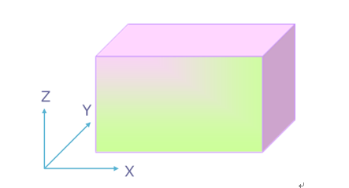
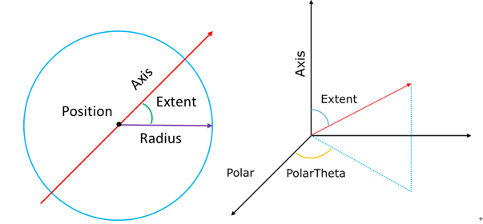
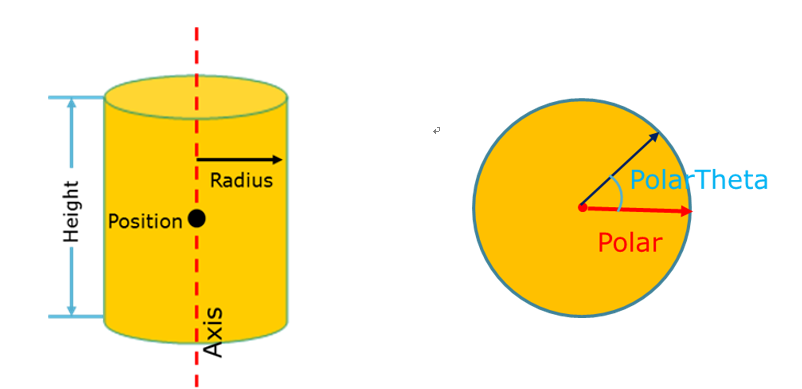
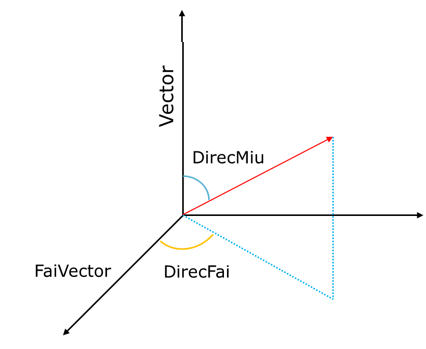

.. _section_external_source:

源描述
=================

RMC支持用户对源粒子的信息如粒子种类、初始位置、初始能量和初始飞行方向等进行灵活地描述。

按照粒子种类，用户可以定义中子源、光子源、中子和光子混合源；按照计算用途，
可以分为临界源和屏蔽源；按照源粒子的起始位置分布，用户可以定义点源、线源、平面源、
球面源、长方体体积源、圆柱体包含（圆柱筒）体积源和球体（包含球壳体积源）等；
不仅能够支持特定的粒子初始飞行方向和能量，还支持通过概率表分布（包括离散分布
和分段均匀分布）和内置幂函数、指数函数来定义初始粒子飞行方向和能量，其中，
还内置了麦克斯韦裂变谱、瓦特裂变谱、高斯聚变谱、蒸发谱等专门描述能量。
在定义源粒子的方向或能量信息时，可以使用偏倚抽样，使更多的粒子飞向用户感兴趣的方向，
可以减小用户关注区域的统计方差。

源描述模块输入卡
-------------------------

.. code-block:: none

     EXTERNALSOURCE
     Source <id>  Fraction=<fraction>  [Particle=<particle_type>]
            [<Simple type>={params}] [Surface=<surface_id>]  [X=<x>  Y=<y>  Z=<z>]
            [Position=<position>]  [Radius=<radius>] [Axis=<axis>]
            [Polar=<polar_base_vector>]  [PolarTheta=<polar_theta>]  [Extent=<extent>]
            [Height=<height>]  [Norm=<norm>]  [Vector=<direction_basis_vector>
            [DirecMiu=<direction_miu>]  [FaiVector=<fai_basis_vector>]
            [DirecFai=<direction_fai>]  [Energy=<energy>]  [Cell=<cell_vector>]
            [SampEff=<efficiency>] [Biasfrac=<biasfrac>] [Weight=<weight>]
            [Transform=<transform_id>]
     SurfSrcRead  OldSurf=< S1 S2 S3……Sn >  NewSurf = < S11 S21 S31…Sm1…Smn >
                  Cell=<cell_vector_group>  Party=<params>  Coli=<coli>
                  Wtm=<wtm> Axis=<x1 x2 x3>   Extent=<id>  Posace=<posace> Tr=<id>
     Distribution  <id>  [Depend = <id>]  Type = <flag>  Value= <params>
                   Probability = <params>  [Bias = <params>]
     Transformation  <id>  [Move=<x1 x2 x3>]  [Rotate=<a11 a12 a12 a21……a33>]
     H5SourceInfo filename=<file> groupname=<group>

其中，

-  **EXTERNALSOURCE**\ 为源描述关键词。\ **Source**\ 卡定义通用源描述,
   \ **SurfSrcRead**\ 卡定义接续面源，\ **Source**\ 卡和\ **SurfSrcRead**\ 卡不能
   同时定义；\ **Distribution**\ 卡用于定义\ **Source**\ 卡和\ **SurfSrcRead**\
   卡中使用到的分布，\ **Transformation**\ 卡用于定义\ **Source**\ 卡和\ **SurfSrcRead**\
   卡中使用到的坐标变换，\ **Distribution**\ 卡和\ **Transformation**\卡与S\ **Source**\
   卡或\ **SurfSrcRead**\配套使用，如\ **Source**\ 卡或\ **SurfSrcRead**\ 卡中
   没有用到分布和坐标变换，也可不定义；除\ **SurfSrcRead**\ 卡只能定义一个外，
   其他三种卡可以定义一个或多个，且没有先后顺序。下面分别介绍四个卡的使用方法。

Source 选项卡
~~~~~~~~~~~~~~~~~~~~~~~~~~~~~~~~~~~~~

Source卡指定源粒子的基本参数。

-  **ID**\ 指定\ **Source**\ 的编号，方便用户进行区别。需为正整数，且不能重复。

-  **Fraction**\ 指定该源的比例权重，必须大于0。当用户定义多个源时，该比例权重
   才有意义。该比例权重反映各个源的相对大小，用户不需要进行归一化处理。

-  **Particle**\ 指定源粒子的种类，参数必须为正整数1、正整数2或D+正整数。1代表
   中子，2代表光子，D+正整数表示粒子的种类通过一个分布来描述（该模块中分布均采
   用这种形式），该分布需要在\ **Distribution**\ 卡中进行定义，该正整数为对应
   的分布序号（\ **Distribution**\ 卡的ID）。该变量缺省值为1，表示默认粒子类型为中子。

-  **Simple type**\ 可便捷定义常用的均匀体积源：均匀分布的点源、均匀球（壳）体
   积源、轴线平行于坐标轴的圆柱体（壳）均匀体积源。详细参数见 \ 。

.. table:: **Simple type**\支持的初始源分布
  :name: source_types

  +-----------+-----------------------------+-----------------------+
  |关键词     |说明                         |参数                   |
  +===========+=============================+=======================+
  | **Point** |孤立点源                     |x1 y1 z1 x2 y2 z2 …    |
  +-----------+-----------------------------+-----------------------+
  |**Sphere** |球体（壳）均匀源             |x y z Rmin Rmax        |
  +-----------+-----------------------------+-----------------------+
  |**Cyl/x**  |平行于x轴的圆柱体（壳）均匀源|y z Rmin Rmax xmin xmax|
  +-----------+-----------------------------+-----------------------+
  |**Cyl/y**  |平行于y轴的圆柱体（壳）均匀源|x z Rmin Rmax ymin ymax|
  +-----------+-----------------------------+-----------------------+
  |**Cyl/z**  |平行于z轴的圆柱体（壳）均匀源|x y Rmin Rmax zmin zmax|
  +-----------+-----------------------------+-----------------------+

-  **Surface**\ 指定一个在\ **Surface**\ 模块中定义的曲面（仅限球面或者平面）。
   该变量用于定义曲面源。参数为\ **Surface**\ 模块中定义的曲面编号（正整数）或者
   D+正整数。D+正整数表示曲面编号通过\ **Distribution**\ 卡中ID为该正整数的分布来描述。
-  **X**\ 指定坐标x的值，有两种定义形式：
   1. \ **X**\ =x表示\ **X**\ 取固定值x；
   2. \ **X**\ = D+正整数，表示\ **X**\ 由\ **Distribution**\ 卡中ID为该正整数的分布来描述。
   \ **X**\ 需要和\ **Y、Z**\ 同时使用。
-  **Y**\ 指定坐标y的值，有两种定义形式：
   1. \ **Y**\ =y表示\ **Y**\ 取固定值y；
   2. \ **Y**\ = D+正整数，表示\ **Y**\ 由\ **Distribution**\ 卡中ID为该正整数的分布来描述。
   \ **Y**\ 需要和\ **X 、Z**\ 同时使用。
-  **Z**\ 指定坐标z的值，有两种定义形式：
   1. \ **Z**\ =z表示\ **Z**\ 取固定值z；
   2. \ **Z**\ = D+正整数，表示\ **Z**\ 由\ **Distribution**\ 卡中ID为该正整数的分布来描述。
   \ **Z**\ 需要和\ **X、Y**\ 同时使用。
-  **Position**\ 指定直角坐标系下的参考位置坐标，有两种定义形式：
   1. \ **Position**\ =x y z；
   2. \ **Position**\ = D+正整数，表示\ **Position**\ 由\ **Distribution**\ 卡中ID为该正整数的分布来描述，
   且该分布必须满足\ **type**\ =2（表示该分布描述的对象为坐标或者向量）。
-  **Radius**\ 指定以\ **Position**\ 为球心或者圆心的半径，有两种定义形式：
   1. \ **Radius**\ =非负浮点数，表示半径为该非负浮点数；
   2. \ **Radius**\ = D+正整数，表示\ **Radius**\ 由\ **Distribution**\ 卡中ID为该正整数的分布来描述。
   该变量在定义球体（壳）体积源或圆柱体（壳）体积源时使用。缺省值为0。
-  **Axis**\ 指定一个位置描述的参考方向，有两种定义形式：
   1. \ **Axis**\ =u v w；
   2. \ **Axis**\ = D+正整数，表示\ **Axis**\ 由\ **Distribution**\ 卡中ID为该正整数的分布来描述，
   且该分布必须满足\ **type**\ =2（表示该分布描述的对象为坐标或者向量）。该变量在定义
   球面源或者圆柱体（壳）体积源时使用
-  **Extent**\ 指定球面源的抽样位置和球心的连线与\ **AXIS**\ 夹角的余弦值，有两种定义形式：
   1. \ **Extent**\ =浮点数，该浮点数的范围为[0,1]。
   2. \ **Extent**\ = D+正整数，表示\ **Extent**\ 由\ **Distribution**\ 卡中ID为该负整数的分布来描述，
   该分布的取值范围也必须为[0,1]。该变量在定义球体积源或球面源时使用。
-  **Polar**\ 指定位置描述时极向的参考方向，有两种定义形式：
   1. \ **Axis**\ =u v w；
   2. \ **Axis**\ = D+正整数，表示\ **Axis**\ 由\ **Distribution**\ 卡中ID为该正整数的分布来描述，
   且该分布必须满足\ **type**\ =2（表示该分布描述的对象为坐标或者向量）。该变量在定义
   球面源或者圆柱体（壳）体积源时使用。
-  **PolarTheta**\ 指定抽样位置投影到与\ **Axis**\ 垂直的平面上时，与极向参考方向（\ **Polar**\ ）
   的夹角。有两种定义形式：
   1. \ **PolarTheta**\ =浮点数，该浮点数为弧度制下的角度大小。
   2. \ **PolarTheta**\ = D+正整数，表示\ **PolarTheta**\ 由\ **Distribution**\ 卡中ID为该正整数的分
   布来描述。该变量与**Polar**搭配使用。
-  **Height**\ 指定圆柱体（壳）体积源沿轴线\ **AXIS**\ 的高度，有两种定义形式：
   1. \ **Height**\ =浮点数表示\ **Height**\ 取值为该浮点数；
   2. \ **Height**\ = D+正整数，表示\ **Height**\ 由\ **Distribution**\ 卡中ID为该正整数的分布来描述。
   该变量在定义圆柱体（壳）体积源时使用。
-  **Norm**\ 指定参考飞行方向\ **Vector**\ 或表面法线的标志，只能为1或-1。1表示与参考飞行方向
   \ **Vector**\ 一致或沿表面法线向外，-1表示与参考飞行方向\ **Vector**\ 相反或沿表面法线向内。缺省值为+1。
-  **Vector**\ 指定粒子飞行的参考方向，有两种定义形式：
   1. \ **Vector**\ =u v w；
   2. \ **Vector**\ = D+正整数，表示\ **Vector**\ 由\ **Distribution**\ 卡中ID为该正整数的分布来描述，
   且该分布必须满足\ **type**\ =2（表示该分布描述的对象为坐标或者向量）。
-  **DirecMiu**\ 指定粒子飞行方向与参考方向\ **Vector**\ 的夹角的余弦值，有两种定义形式：
   1. \ **DirecMiu**\ =浮点数，该浮点数的范围为[-1.0,1.0]。
   2. \ **DirecMiu**\ = D+正整数，表示\ **DirecMiu**\ 由\ **Distribution**\ 卡中ID为该正整数的分布来描述，
   该分布的取值范围也必须为[-1.0,1.0]。\ **DirecMiu**\ 必须与\ **Vector**\ 结合使用，不能单独使用。
-  **FaiVector**\ 指定与粒子飞行的参考方向（\ **Vector**\ ）垂直的一个方向，有两种定义形式：
   1. \ **FaiVector**\ =u v w；
   2. \ **FaiVector**\ = D+正整数，表示\ **FaiVector**\ 由\ **Distribution**\ 卡中ID为该正整数的分布来描述，
   且该分布必须满足\ **type**\ =2（表示该分布描述的对象为坐标或者向量）。\ **FaiVector**\ 必须与
   \ **Vector**\ 配合使用，且必须互相垂直。
-  **DirecFai**\ 指定抽样的飞行方向投影到与\ **Vector**\ 垂直的平面上时，与极向参考方向（\ **Polar**\ ）
   的夹角。有两种定义形式：
   1. \ **DirecFai**\ =浮点数，该浮点数为弧度制下的角度大小。
   2. \ **DirecFai**\  = D+正整数，表示\ **DirecFai**\ 由\ **Distribution**\ 卡中ID为该正整数的分布来描述。
   该变量与\ **FaiVector**\ 搭配使用。
-  **Energy**\ 指定粒子的初始能量，中子允许的能量范围为10-11MeV到20MeV，光子允许的能量范围为1keV到1GeV，
   有两种定义形式：
   1. \ **Energy**\ =能量值（浮点数），该浮点数必须在上述范围内。
   2. \ **Energy**\ = D+正整数，表示\ **Energy**\ 由\ **Distribution**\ 卡中ID为该正整数的分布来描述，该分布
   的取值范围也必须与上述中子或者光子的能量范围一致。缺省值为4MeV。
-  **Cell**\ 指定粒子抽样位置所在的栅元号，有两种定义形式：
   1. \ **Cell**\ =c_0>c_1>...>c_n，c_0>c_1>...>c_n为栅元向量，具体含义会在下面的使用说明中进一步解释。
   2. \ **Cell**\ = D+正整数，表示\ **Cell**\ 由\ **Distribution**\ 卡中ID为该正整数的分布来描述，此时分布的类
   型必须满足\ **type**\ =3（表示该分布描述的对象为栅元向量）。
-  **SampEff**\ 指定粒子抽样的最低效率，取值必须为（0,1.0）的一个浮点数。当某一次的抽样效率
   低于该值时，程序会报错并自动退出。
-  **Biasfrac**\ 指定每个源的偏倚参数。
-  **Weight**\ 指定源粒子的初始权重，不支持分布描述，只支持单值。
-  **Transform**\ 卡指定源粒子位置、飞行方向的坐标变换（旋转和平移）。坐标变换的参数在\ **Transform**\ 卡中定义。

使用说明：

除了源的份额（Fraction）、粒子的类型（Particle）和粒子的能量（Energy）外，剩下的
变量可分为位置变量（Simple type、Surface、X Y Z、Position、Radius、Axis、Extent、
Polar、PolarTheta、Height）和方向变量（Norm、Vector、DirecMiu、FaiVector、DirecFai）两类，
分别用来定义粒子的初始位置和初始方向；Cell变量指定粒子初始位置所在的栅元，通过栅元向量或分布来定义。

1.位置变量。可通过不同的变量组合来定义具有不同位置分布的初始源。

\ **Simple type**\ 是为了方便用户定义一些简单的均匀体积源，使用起来方便，但是功能相对有限。
\ **Simple type**\ 与其他位置变量是互斥的，不能同时使用。

\ **长方体体积源**\ ：X、Y和Z一起使用，可以用来定义线源、和跟坐标轴平行的平面源以及
长方体体积源。X、Y和Z变量与其他位置变量互斥，不能同时使用。

   长方体体积源

\ **球体体积源**\ ：Position、Radius、Axis、Extent、Polar、PolarTheta六个变量结合
可以定义球体（壳）体积源，如 :numref:`sphere_source` 所示，Position指定球心的位置，Radius指定半径，
此时Radius需为单值（球面）或用二次函数分布（分布见下文）来描述。Radius的缺省值为0，
此时为点源。Axis定义一个参考方向，Extent指定抽样位置点与球心的连线跟参考方向Axis夹角
的余弦值。Polar定义一个跟Axis垂直的方向，PolarTheta为粒子抽样位置与圆心的连线在与Axis
垂直的平面上的投影，和Polar方向的夹角，即方位角（弧度制表示）。如果Polar和PolarTheta
缺省，则方位角在0到2π上均匀抽样。如果Axis、Extent、Polar、PolarTheta同时缺省，则为
在Surface指定的球面上均匀抽样。

   球体体积源

\ **圆柱体体积源**\ ：Position、Radius、Axis、Polar、PolarTheta、Height六个变量结合
可以定义圆柱体（壳）体积源。如 :numref:`cylinder_source` 所示，Position定义在圆柱体（壳）轴向上的参考点，
Radius定义圆柱体（壳）横截面的半径，此时需为单值（圆柱面）或用一次函数分布来描述，
Axis定义圆柱体（壳）轴向的方向向量（不需要单位化），Polar定义一个跟Axis垂直的方向，
PolarTheta为粒子抽样位置所在的横截面上与圆心的连线和Polar的夹角（弧度制表示）。
Height定义沿Axis方向圆柱体（壳）距离点Position的距离，与Axis方向相同为正，相反为负。

   圆柱体（壳）体积源

\ **平面源**\ ：Surface、Position、Radius三个变量结合可以定义平面源。Surface指定一个
平面（预先在Surface模块中定义），Position指定一个在该平面上的参考点（必须在该平面上），
Radius指定在该平面上以Position为圆心的半径，此时Radius需为单值或一次函数分布。

\ **球面源**\ ：Surface、Axis、Extent、Polar、PolarTheta五个变量结合可以定义球面源。
Surface指定一个球面（预先在Surface模块中定义），Axis定义一个参考方向，Extent指定
球面上的抽样位置点与球心的连线跟参考方向Axis夹角的余弦值。Polar定义一个跟Axis垂直的方向，
PolarTheta为粒子抽样位置与圆心的连线在与Axis垂直的平面上的投影，和Polar方向的夹角，
即方位角（弧度制表示）。如果Polar和PolarTheta缺省，则方位角在0到2π上均匀抽样。
如果Axis、Extent、Polar、PolarTheta同时缺省，则为在Surface指定的球面上均匀抽样。

2.方向变量。

Norm、Vector、DirecMiu、FaiVector、DirecFai五个变量结合来定义粒子的初始飞行方向。
如 :numref:`flying_direction` 所示，Vector 指定一个参考方向，DirecMiu指定与Vector夹角的余弦值，两个变量
结合使用。FaiVector 指定与Vector垂直的参考方向，DirecFai为飞行方向投影到与Vector垂直
的平面上时，与FaiVector的夹角即方位角（弧度制）。FaiVector和DirecFai缺省时，方位角φ
在（0,2π）上均匀抽样。Vector、DirecMiu、FaiVector、DirecFai同时缺省的情况下，如果位置
变量Surface没有定义，则默认飞行方向为各向同性；如果位置变量Surface被定义，则飞行方向
跟抽样位置点所在曲面的法线方向的夹角在（0,π/2）上成余弦分布（p(θ)=cos(θ)或p(μ)= μ），
方位角φ在（0,2π）上均匀抽样。

   飞行方向

3.Cell变量。

Cell变量用来指定粒子初始位置所在的栅元，通过栅元向量c_0>c_1>...>c_n或者分布来描述
（此时分布必须使用对应的分布类型）。c_0为基准空间（Universe 0）中的一个栅元，
c_1为填充栅元c_0的空间（Universe）中的一个栅元，依次向下填充，且c_n不一定为最
底层栅元（即c_n依旧可以被其他空间填充）。

需要注意的是，如果未定义Cell变量，则定义的粒子位置和方向为绝对坐标。如果定义了Cell变量，
则定义的粒子位置和方向变为相对坐标，定义的粒子的位置和方向如果在栅元c_n内（此处指
Cell选项卡中直接定义的栅元c_n的范围），则接受该抽样位置和飞行方向，否则，拒绝该抽样
位置和飞行方向，需要重新抽样；之后，接受的抽样位置和飞行方向会随着几何构建时的填充方式
进行旋转和平移，得到最终的粒子位置和飞行方向。

如果填充栅元c_i的空间（Universe I）是重复几何结构，则c_(i+1)应替换为该空间（Universe I）
中重复几何的排列顺序位置。（可参考CellTally中的重复几何层级描述）如果该空间（Universe I）为
重复几何结构，排列位置坐标直接写为0，则表示在空间的重复几何结构中均匀抽取每个单元结构。

例如：对于一个3x3x2的四边形重复几何结构中，如果Cell=4>3>8，则4为在基本空间（Universe 0）中的栅元，
栅元4被一个3x3x2的的四边形重复几何结构的空间填充，3表示在该四边形重复几何空间中，填充的第三个栅元
（RMC中栅元填充顺序为x,y,z）,表示为坐标是从坐标原点数，x方向第三个，y方向第1个，z方向第1个的重复单元
所在的填充空间。如果Cell=4>10>8,10表示填充的第十个重复几何栅元，坐标表示为（1 1 2）处的填充空间中的栅元10。
如果抽取的粒子在栅元8的曲面布尔运算所得到的区域内，则接受该粒子的位置和方向，之后再跟随栅元8所在的空间进行旋转或平移
（如果旋转和平移同时存在，则先以原点为中心进行旋转，再进行平移），填充到重复几何空间中，最后填充到基本空
间（Universe 0）中的栅元4中，得到最终的抽样粒子位置和飞行方向等信息。

**注意** Cell卡兼容MCNP风格的lattice格式，即采用三点式标注(x,y,z)，以3x3x2的四边形重复几何结构为例，如果
Cell=4>3>8，相应的MCNP的展开式为4>(3 1 1)>8。但需要安装RMC的python模块。

与此同时，在描述源位置信息时，如果需要定义一个基于底层CELL几何结构位置信息的均匀抽样源，则可以单独使用
CELL卡（不使用Position, X, Y, Cyl等），程序将自动根据定义的栅元底层位置信息构建初始源位置。需要注意的是，
目前基于CELL的初始源位置描述仅支持CELL的几何结构为球体/球壳（S, SO, SX, SY, SZ）,圆柱体/圆柱壳
（CX, CY, CZ, C/X, C/Y, C/Z）,长方体。！！！注意，**底层CELL的组成面需要能够围成一个空间**，例如：

.. code-block:: none

     UNIVERSE 0
     cell  1   1:-3:-4:5:6:-7  mat=0  void=1
     cell  2   -2&3&4&-5&-6&7  mat=0  fill=1
     cell  3   -1&2&4&-5&-6&7  mat=0  fill=2
     
     UNIVERSE 1  move=-50.004 -20.01 0 lat=1 pitch=16.668 13.34 1 scope=3 3 1 fill=3*9
     
     UNIVERSE 2  move=0 -20 0  lat=1 pitch=25 10 1  scope=2 4 1 fill=4 4 6 4 4 5 4 4

     UNIVERSE 3  move=8.334  6.67 0
     cell  6     21:-22:-23:24  mat=1 
     cell  8     -21&22&23&-24  mat=2 
     
     UNIVERSE 4
     cell  7     19   mat=1    
     cell  11    -19  mat=2  
     
     UNIVERSE 5
     cell  9     20&(31:-32:-33:34)&9  mat=1   
     cell  12    -9   mat=1      
     cell  13    -20&-6&7  mat=2    // 为了支持基于CELL的均匀源抽样，底层Cell要求能够独立构成空间  
     cell  15    -31&32&33&-34  mat=2     
     
     UNIVERSE 6 move=5 0 0
     cell  17     19   mat=1    
     cell  21    -19  mat=2   
     
     SURFACE 
     surf  1     px 50   bc=3 pair=3 //周期边界条件
     surf  2     px 0    
     surf  3     px -50  bc=3 pair=1 //周期边界条件
     surf  4     py -20  
     surf  5     py 20   
     surf  6     pz 60   bc=2         //白边界条件
     surf  7     pz -60  bc=2         //白边界条件
     surf  9     s 5 5 3 .5
     surf  11    px 8.334
     surf  12    px -8.334
     surf  13    py -6.67
     surf  14    py 6.67
     surf  15    px 25
     surf  16    px 0
     surf  17    py 0
     surf  18    py 10
     surf  19    c/z 10 5 3
     surf  20    c/z 10 5 3
     surf  21    px 4
     surf  22    px -4
     surf  23    py -3
     surf  24    py 3
     surf  31    px 20
     surf  32    px 16
     surf  33    py 3
     surf  34    py 6
     
     EXTERNALSOURCE
     Source 1 fraction=1 particle=1 energy=d1 cell=3>6>13 
     distribution 1 type=-3 probability=1.4

Distribution选项卡
~~~~~~~~~~~~~~~~~~~~~~~~~~

\ **Distribution**\ 卡指定\ **Source**\ 卡中描述变量用的所有分布，分布编号要与\ **Source**\ 卡中一致，
分布之间没有先后顺序。每个分布分别用\ **ID、Depend**\ （可缺省）、\ **Type 、Value、Probability**\
（从属于其他分布时可缺省）、\ **Bias**\ （可缺省）来描述，且先后顺序不可改变。

-  **ID**\ 指定分布的编号，与\ **Source**\ 卡中描述变量用的分布编号一致。所有的分布编号相互之间不能重复。

-  **Depend**\ 指定该分布所从属（依赖）的分布（即该分布的值由所从属的分布的抽样值决定，
   不再独立进行抽样）的编号，可支持多层从属关系，但不能出现死锁。独立分布可缺省该变量。
   当定义了该变量时，\ **Probability**\ 和\ **Bias**\ 的定义便没有意义，这两个可缺省。
   关于从属分布，后面会有更多解释。

-  **Type**\ 指定分布的类型，用不同的整数代表不同的反应类型。可取的分布类型见 :numref:`distribution_cards` 。

-  **Value**\ 指定分布的取值范围，参数要求见 :numref:`distribution_cards` 。

-  **Probability**\ 指定分布的概率分布参数，具体要求见 :numref:`distribution_cards` 。

-  **Bias**\ 指定分布的偏倚抽样概率分布参数，具体要求见 :numref:`distribution_cards` 。

.. table:: Distribution卡支持的分布类型及参数
  :name: distribution_cards

  +--------+-----------------+------------------+-----------------+-----------------+
  |Type    |Value            |Probability       |Bias             |说明             |
  +========+=================+==================+=================+=================+
  |0       |n\ :sub:`1`\     |p\ :sub:`1`\      |b\ :sub:`1`\     |子分布           |
  |        |n\ :sub:`2`\     |p\ :sub:`2`\      |b\ :sub:`2`\     |                 |
  |        |n\ :sub:`3`\  …  |p\ :sub:`3`\  …   |b\ :sub:`3`\  …  |                 |
  |        |n\ :sub:`i`\  …  |p\ :sub:`i`\  …   |b\ :sub:`i`\  …  |                 |
  +--------+-----------------+------------------+-----------------+-----------------+
  |表示子分布，Value的每一个值（正整数）是一个分布编号，该分布编号不能是自身,要避免 |
  |出现死锁。p\ :sub:`i`\ 和b\ :sub:`i`\ 分别是n\ :sub:`i`\ 出现的真实概率和偏倚抽样|
  |概率。Probability、Bias的取值个数必须和Value的取值个数一致。                     |
  +--------+-----------------+------------------+-----------------+-----------------+
  |1       |a\ :sub:`1`\     |p\ :sub:`1`\      |b\ :sub:`1`\     |离散值分布       |
  |        |a\ :sub:`2`\     |p\ :sub:`2`\      |b\ :sub:`2`\     |                 |
  |        |a\ :sub:`3`\  …  |p\ :sub:`3`\  …   |b\ :sub:`3`\  …  |                 |
  |        |a\ :sub:`i`\  …  |p\ :sub:`i`\  …   |b\ :sub:`i`\  …  |                 |
  +--------+-----------------+------------------+-----------------+-----------------+
  |表示离散值分布，Value变量定义可取的离散值（浮点数类型）。p\ :sub:`i`\ 和         |
  |b\ :sub:`i`\ 分别是a\ :sub:`i`\ 出现的真实概率和偏倚抽样概率。Probability、Bias的|
  |取值个数必须和Value的取值个数一致。                                              |
  +--------+-----------------+------------------+-----------------+-----------------+
  |2       |x\ :sub:`1`\     |p\ :sub:`1`\      |b\ :sub:`1`\     |位置或矢量离散值 |
  |        |y\ :sub:`1`\     |p\ :sub:`2`\      |b\ :sub:`2`\     |分布             |
  |        |z\ :sub:`1`\  …  |p\ :sub:`3`\  …   |b\ :sub:`3`\  …  |                 |
  |        |x\ :sub:`i`\  …  |p\ :sub:`i`\  …   |b\ :sub:`i`\  …  |                 |
  |        |y\ :sub:`i`\  …  |                  |                 |                 |
  |        |z\ :sub:`i`\  …  |                  |                 |                 |
  +--------+-----------------+------------------+-----------------+-----------------+
  |表示位置或矢量离散值分布，Value变量定义可取位置或矢量的离散值（浮点数类型）。    |
  |p\ :sub:`i`\ 和b\ :sub:`i`\分别是（x\ :sub:`i`\ ,y\ :sub:`i`\ ,z\ :sub:`i`\ ）出 |
  |现的真实概率和偏倚抽样概率。Value的取值个数必须是3的整数倍，Probability、Bias的取|
  |值个数必须和Value的取值个数的1/3一致。                                           |
  +--------+-----------------+------------------+-----------------+-----------------+
  |3       |Cell_vector1     |p\ :sub:`1`\      |b\ :sub:`1`\     |栅元向量离散值分 |
  |        |Cell_vector2 …   |p\ :sub:`2`\  …   |b\ :sub:`2`\  …  |布               |
  |        |Cell_vectori …   |p\ :sub:`i`\  …   |b\ :sub:`i`\  …  |                 |
  +--------+-----------------+------------------+-----------------+-----------------+
  |表示栅元向量离散值分布，Value变量定义可取的栅元向量（上文已介绍）。p\ :sub:`i`\  |
  |和b\ :sub:`i`\分别是a\ :sub:`i`\ 出现的真实概率和偏倚抽样概率。Probability、Bias |
  |的取值个数必须和Value的取值个数一致。                                            |
  +--------+-----------------+------------------+-----------------+-----------------+
  |4       |a\ :sub:`0`\     |p\ :sub:`1`\      |b\ :sub:`1`\     |区间均匀分布     |
  |        |a\ :sub:`1`\     |p\ :sub:`2`\      |b\ :sub:`2`\     |                 |
  |        |a\ :sub:`2`\     |p\ :sub:`3`\  …   |b\ :sub:`3`\  …  |                 |
  |        |a\ :sub:`3`\  …  |p\ :sub:`i`\  …   |b\ :sub:`i`\  …  |                 |
  |        |a\ :sub:`i`\  …  |                  |                 |                 |
  +--------+-----------------+------------------+-----------------+-----------------+
  |表示区间均匀分布，Value变量定义每个区间的边界值（浮点数类型）。p\ :sub:`i`\ 和   |
  |b\ :sub:`i`\分别是区间（a\ :sub:`i-1`\,a\ :sub:`i`\）的真实概率和偏倚抽样概率。  |
  |Probability、Bias的取值个数必须比Value的取值个数少1。                            |
  +--------+-----------------+------------------+-----------------+-----------------+
  |5       |a\ :sub:`1`\     |p\ :sub:`1`\      |b\ :sub:`1`\     |分段线性插值分布 |
  |        |a\ :sub:`2`\     |p\ :sub:`2`\      |b\ :sub:`2`\     |                 |
  |        |a\ :sub:`3`\  …  |p\ :sub:`3`\  …   |b\ :sub:`3`\  …  |                 |
  |        |a\ :sub:`i`\  …  |p\ :sub:`i`\  …   |b\ :sub:`i`\  …  |                 |
  +--------+-----------------+------------------+-----------------+-----------------+
  |表示线性插值分布，Value变量定义插值点（浮点数类型）。p\ :sub:`i`\ 和b\ :sub:`i`\ |
  |分别是插值点a\ :sub:`i`\ 的真实概率和偏倚抽样概率。Probability、Bias的取值个数必 |
  |须比Value的取值个数一致。在两个插值点之间，真实概率和偏倚抽样概率分别满足线性插值|
  +--------+-----------------+------------------+-----------------+-----------------+
  |-1      |x\ :sub:`0`\     |a\ :sub:`p`\      |a\ :sub:`b`\     |幂函数分布       |
  |        |x\ :sub:`1`\     |                  |                 |                 |
  +--------+-----------------+------------------+-----------------+-----------------+
  |幂函数分布p(x)=c|x|\ :sup:`a`\ ，分布的取值范围为（x\ :sub:`0`\，x\ :sub:`1`\ ） |
  |（一定要满足x\ :sub:`0`\<x\ :sub:`1`\），a\ :sub:`p`\ 和a\ :sub:`b`\ 分别为真实幂|
  |函数和偏倚抽样幂函数的指数，如果x\ :sub:`0`\ •x\ :sub:`1`\ ≤0，则必须满足a>-1。系|
  |数c会由程序自动进行归一化处理，用户不需要输入。当a=0时，为（x\ :sub:`0`\，       |
  |x\ :sub:`1`\ ）上的均匀分布。                                                    |
  +--------+-----------------+------------------+-----------------+-----------------+
  |-2      |x\ :sub:`0`\     |a\ :sub:`p`\      |a\ :sub:`b`\     |指数函数分布     |
  |        |x\ :sub:`1`\     |                  |                 |                 |
  +--------+-----------------+------------------+-----------------+-----------------+
  |指数函数分布p(x)=ce\ :sup:`ax`\ ，分布的取值范围为（x\ :sub:`0`\，x\ :sub:`1`\） |
  |（一定要满足x\ :sub:`0`\<x\ :sub:`1`\ ），a\ :sub:`p`\ 和a\ :sub:`b`\ 分别为真实 |
  |指数函数和偏倚抽样指数函数的指数系数。系数c会由程序自动进行归一化处理，用户不需要|
  |输入。当a=0时，为（x\ :sub:`0`\，x\ :sub:`1`\ ）上的均匀分布。                   |
  +--------+-----------------+------------------+-----------------+-----------------+
  |-3      |                 |a                 |                 |麦克斯韦裂变谱   |
  +--------+-----------------+------------------+-----------------+-----------------+
  |麦克斯韦裂变能量谱分布p(E)=CE\ :sup:`1/2`\ e\ :sup:`(-E/a)`\ ，其中a是温度，单位 |
  |是MeV，a的缺省值为1.2895MeV。暂不支持偏倚抽样。                                  |
  +--------+-----------------+------------------+-----------------+-----------------+
  |-4      |                 |a b               |                 |瓦特裂变谱       |
  +--------+-----------------+------------------+-----------------+-----------------+
  |麦克斯韦裂变能量谱分布 :math:`p(E)=Ce^(-E/a)\sinh \sqrt{bE}`，其中a单位是MeV,缺省|
  |值为0.965MeV，b单位是MeV-1，缺省值为2.29 MeV-1。暂不支持偏倚抽样。               |
  +--------+-----------------+------------------+-----------------+-----------------+
  |-5      |                 |a b               |                 |高斯聚变谱       |
  +--------+-----------------+------------------+-----------------+-----------------+
  |高斯聚变能量谱分布 :math:`p(E)=Ce^(-((E-b)/a)^2)`，其中a是能谱宽度，b是平均能量，|
  |单位均是MeV，这里能谱宽度的定义是当E比b大ΔE时，指数函数项等于e\ :sup:`-1`\ 。如果|
  |a<0，则认为是以MeV为单位表示的温度，此时b也必须为负值。如果b=-1，则计算D-T聚变反 |
  |应能量作为b的值。如果b=-2，则计算D-D聚变反应能量作为b的值。请注意：a并不是半高宽 |
  |（FWHM,full-width-at-half-maximum），a和半高宽的计算公式为FWHM=a(ln2)\ :sup:`1/2`|
  |。暂不支持偏倚抽样。缺省值：a=-0.01，b=-1（在10keV下发生的DT聚变反应能谱）。     |
  +--------+-----------------+------------------+-----------------+-----------------+
  |-6      |                 |a                 |                 |蒸发能量谱       |
  +--------+-----------------+------------------+-----------------+-----------------+
  |蒸发能量谱 :math:`p(x)=CEe^(-E/a)`，a的单位为MeV，缺省值为1.2895MeV。暂不支持偏倚|
  |抽样。                                                                           |
  +--------+-----------------+------------------+-----------------+-----------------+

-  需要指出的是，只有\ **Type**\ =0,1,2,3,4的分布之间才可以相互依赖。从属的分布抽样值由
   被从属的分布的抽样位置决定，二者具有相同的抽样位置，因此从属的分布\ **Porbability**\ 和\ **Bias**\
   的定义是没有实际意义的，可以缺省不定义。这里被从属的分布的抽样位置分为两类：
   1. 当\ **Type**\ =0,1,2时，如果抽样值为ni，ai或者xi,yi,zi），则抽样位置为i。
   2. 当\ **Type**\ =3时，抽样值落在区间（a\ :sub:`i-1`\ ,a\ :sub:`i`\ ），则抽样位置为i。
   在定义从属分布时，用户需要保证从属分布和被从属的分布的抽样位置总数必须相等，否则程序会报错。

SurfSrcRead选项卡
~~~~~~~~~~~~~~~~~~~~~~~~~~

.. code-block:: none

     SurfSrcRead  OldSurf=< S1 S2 S3……Sn >  NewSurf = < S11 S21 S31…Sm1…Smn >
                  Cell=<cell_vector_group>  Partype=<params>   Coli=<coli>  Wtm=<wtm>
                  Axis=<x1 x2 x3>   Extent=<id>  Posace=<posace>  Tr=<id>

其中，

-  **OldSurf**\ 通过指定原来计算中的面，来表示使用穿过这些面的粒子径迹。
   缺省表示使用原来计算中所有的面
-  **NewSurf**\ 指定原来的面在新的计算中所对应的面。其中一个面可以对应多个面即
   该输入卡中的面的个数，必须是\ **OldSurf**\ 卡中的面个数的整数倍。当缺省时，默认使用
   \ **oldsurf**\ 中的面；如果一个面对应多个面，必须在TR中定义对应的关系，两个面大小应当相同。
-  **Cell**\ 通过指定原来计算中的栅元，来表示使用这些栅元中的径迹。
-  **Partype**\ 指定使用的径迹粒子类型，0代表中子，1代表光子。默认包含接续
   面源文件中包含的径迹类型。
-  **Coli**\ 是指定使用的径迹的碰撞类型，-1表示仅选择没有经历碰撞的径迹，0表示任意径迹都记录，
   1表示仅记录经历碰撞的径迹。缺省值为0；
-  **Wtm**\ 指定选择的径迹的权重所乘以的倍数。
-  **Axis，Extent，Posace**\ 仅能在输出接续计算文件相应计算\ **SYMM**\ =0情况下使用。
   \ **Axis**\ 代表定义的轴向，\ **Extent**\ 对指定沿轴向的粒子的偏倚操作，具体在\ **Distribution**\ 卡中定义；
   其都有两种定义形式：
   1. \ **Axis**\ =u v w；
   2. \ **Axis**\ = D+正整数，表示\ **Axis**\ 由\ **Distribution**\ 卡中ID为该正整数的分布来描述。
   \ **Posace**\ 选择与\ **Axis**\ 对应轴向指定余弦内的粒子。
-  **Tr**\ 指定面面对应关系。当输入为正时，表示相应的对应关系，即空间变换关系。
   如果是D+正整数，则表示相应的偏倚操作：其定义为D+正整数时，正整数的值表示对应的\ **Distribution**\ 卡中定义的用户索引号，
   其仅支持离散值的分布，而后会根据相应的\ **Distribution**\ 卡内Type=1内的离散值 定义来进行相应的偏移操作。
-  当接续面源固定源计算中使用的粒子数大于接续面源文件中的粒子历史数，则会重复抽样直到粒子数等于固定源计算中使用的粒子数;反之，则不会重复抽样．

Transform选项卡
~~~~~~~~~~~~~~~~~~~~~~~~~~

.. code-block:: none

     Transform  ID  Rotate=<a11 a12 a12 a21……a33>  Move=<x1 x2 x3>

Transforma卡定义源定义的坐标变换。ID为坐标变换的编号和Source卡或SurfSrcRead卡定义
的Transform变量的序号一一对应。Rotate 定义坐标变换的旋转矩阵，Move定义坐标变换的平移向量。

旋转变换可以绕任意轴，其表达式为：

.. math::

    \mathbf{r'} = \mathbf{R} \cdot \mathbf{r}

其中， :math:`\mathbf{R}` 为旋转变换矩阵。

平移变换的表达式为：

.. math::

    \mathbf{r'} = \mathbf{r} + \mathbf{m}

其中， :math:`\mathbf{r}=(r_x,r_y,r_z)` 和 :math:`\mathbf{r}=(r_x',r_y',r_z')` 分
别为变换前和变换后的空间任意一点的位置坐标， :math:`\mathbf{m}=(m_x,m_y,m_z)` 为
平移变换向量。

H5SourceInfo选项卡
~~~~~~~~~~~~~~~~~~~~~~~~~~

.. code-block:: none

     H5SourceInfo filename=<file> group=<group>

H5SourceInfo卡表示从HDF5文件中生成初始源。其中\ **filename**\ 为HDF5格式文件名称，
\ **groupname**\ 表示HDF5文件中指定的group名称，目前，由燃耗计算生成的衰变源的的路径为
\ **file/StepXXX/<cell_1 cell_2 ... cell_n>/(Energy, Intensity)**\ 

源描述模块输入示例
-----------------------

-  **Simple type**\ 定义均匀体积源

.. code-block:: c

    EXTERNALSOURCE
    Source   1  Fraction =1  Particle = 1  Point=0 0 0 1 1 0  Vector = 1 0 0
             DirecMiu = 0  FaiVector = 0 1 0  DirecFai = 0  Energy = 4

该示例定义了一个点源，粒子类型为中子。点源的位置从（0,0,0）和（1,1,0）两个位置中
均匀抽样；参考飞行方向为（1,0,0,），粒子飞行方向与该参考方向夹角的余弦值为0，
方位角参考方向为（0,1,0），飞行方向在与Vector垂直且与方位角参考方向（0,1,0）平行
的平面上的投影与方位角参考方向（0,1,0）夹角为0，即粒子飞行方向为（0,1,0）；粒子的
初始能量为4MeV。

.. code-block:: c

    EXTERNALSOURCE
    Source   1  Fraction =1  Particle = 2  Sphere=0 0 0 1 2  Energy = 4

该示例定义了一个球壳均匀分布源，粒子类型为光子，球心为（0,0,0），半径为（1,2），
源粒子的位置从该球壳中按照体积均匀抽样。粒子初始飞行方向为各向同性，粒子的初始能量为4MeV。

.. code-block:: c

    EXTERNALSOURCE
    Source   1  Fraction =0.5  Particle = 1  Cyl/x=1 2 -5 5 0 1   Vector = 1 0 0  DirecMiu = 0  Energy = 4

该示例定义了一个平行于x轴的圆柱体体积源，粒子类型为中子，圆柱体的轴线沿x方向，
轴线在yz平面上的位置为（1,2），横截面的半径为（0,1），圆柱体x坐标的取值范围为（-5,5），
参考飞行方向为（1,0,0,），粒子飞行方向与该参考方向夹角的余弦值为0，即粒子的飞行方向
与参考方向（1,0,0）垂直，方位角在（0,2π）上均有抽样，粒子的初始能量为4MeV。

-  使用\ **X**，**Y**\ 和\ **Z**\ 变量定义长方体体积源

.. code-block:: c

    EXTERNALSOURCE
    Source   1  Fraction =0.5  Particle = 1  X=d1  Y=d2  Z=d3
    Distribution  1  type=4  value= -1 1  probability=1
    Distribution  2  type=4  value= 0 2  probability=1
    Distribution  3  type=4  value= 5 6  probability=1

该示例定义了一个长方体体积源，粒子类型为中子，x在（-1,1）上均匀抽样，y在（0,2）
上均匀抽样，z在（5,6）上均匀抽样，粒子的初始飞行方向为各向同性，初始能量为4MeV。

.. code-block:: c

    EXTERNALSOURCE
    Source   1  Fraction =0.5  Particle = 1  X=0  Y=d2  Z=5
    Distribution  2  type=4  value=0 2  probability=1

该示例定义了一个均匀线源，粒子类型为中子，x=0，y在（0,2）上均匀抽样，z=5，粒子的
初始飞行方向为各向同性，初始能量为4MeV。

.. code-block:: c

    EXTERNALSOURCE
    Source   1  Fraction =0.5  Particle = 1  X=d1  Y=d2  Z=5  Energy= d3
    Distribution  1  Type= 1  Value=0 1  Probability=1 2
    Distribution  2  Type= 4  Value=2 3  Probability=1
    Distribution  3  Type= -3

该示例定义了一个广义长方体体积源，粒子类型为中子，x取值为0或1，对应的抽样概率分别
为1/3和2/3，y在（2,3）上均匀抽样，z取值为5，粒子的初始飞行方向为各向同性，初始能量
分布服从麦克斯韦裂变谱（参数a取缺省值1.2895MeV）。

-  使用\ **Position、Radius、Axis、Extent、Polar**\ 和\ **PolarTheta**\ 六个变量定义球体体积源

.. code-block:: c

    EXTERNALSOURCE
    Source   1  Fraction =0.5  Particle = 1  Positioin=0 1 0  Radius=d1 Energy=d2
    Distribution  1  Type= -1  Value=0 5  Probability=2
    Distribution  2  Type= -4  Probability=1 2

该示例定义了一个均匀球体积源，粒子类型为中子，球心为（0,1,0），Radius在（0,5）上按二
次函数分布进行抽样（按体积进行均匀抽样），粒子的初始飞行方向为各向同性，初始能量分布
服从瓦特裂变谱（参数a为1MeV，b为2MeV-1）。

.. code-block:: c

    EXTERNALSOURCE
    Source 1  particle=1 fraction=0.5 position=0 0 0 radius=d1 axis=0 0 1 extent=d2
              polar=1 1 0  polartheta=d3  energy=4
    Distribution  1  type=-1  value=0 5  probability=2
    Distribution  2  type=4  value=0 1  probability=1
    Distribution  3  type=4  value=-0.7853981633974475  0.7853981633974475 probability=1

该示例定义了一个1/8均匀球体积源，粒子类型为中子，球心为（0,1,0），Radius在（0,5）上按二次
函数分布进行抽样（按体积进行均匀抽样）,粒子的抽样位置跟方向（0,0,1）的夹角的余弦值为（0,1）
上均匀分布，粒子抽样位置与球心的连线在与方向（0,0,1）垂直的平面上的投影和方向（1,1,0）的夹
角为（-π/4，π/4）上均匀分布，即1/8均匀球体积源;粒子的初始飞行方向为各向同性，初始能量为4MeV。

-  使用\ **Position、Radius、Axis、Polar、PolarTheta、Height**\ 六个变量结合定义圆柱体体积源

.. code-block:: c

    EXTERNALSOURCE
    Source   1  Fraction =0.5  Particle = 1  Positioin=0 1 0  Axis= 0 0 1 Radius=d1  Height=d2
    Distribution  1  Type= -1  Value=0 2  Probability=1
    Distribution  2  Type= 4  Value=-5 5  Probability=1

该示例定义了一个均匀圆柱体体积源，粒子类型为中子，轴向沿z轴方向，轴线上的参考点为（0,1,0），
Radius在（0,2）上按一次函数分布进行抽样，Height在（-5,5）上均匀抽样，上述即为按体积进行均匀
抽样，粒子的初始飞行方向为各向同性，初始能量为4MeV。

.. code-block:: c

    EXTERNALSOURCE
    Source 1  particle=1  fraction=0.5  position=0 0 0  energy=4  axis=0 0 1
              polar=1 0 0  polartheta=d3  radius=d1  height=d2
    Distribution  1  type=-1 value=0 10  probability=1
    Distribution  2  type=4 value=-5 5  probability=1
    Distribution  3  type=4 value=0 1.570796326794895 probability=1

该示例定义了一个均匀1/4圆柱体体积源，粒子类型为中子，轴向沿z轴方向，轴线上的参
考点为（0,1,0），Radius在（0,2）上按一次函数分布进行抽样，在横截面上，参考方向
为（1,0,0），粒子抽样位置与圆心的连线和参考方向的夹角在（0，π/2）上均匀抽样，
Height在（-5,5）上均匀抽样，上述即为按1/4圆柱体积进行均匀抽样，粒子的初始飞行
方向为各向同性，初始能量为4MeV。

-  使用\ **Surface、Position、Radius**\ 三个变量结合可以定义平面源

.. code-block:: c

    EXTERNALSOURCE
    Source   1  Fraction =0.5  Particle = 1  Surf=5  Positioin=0 1 0 Radius=d1
    Distribution  1  Type= -1  Value=0 2  Probability=1

该示例定义了一个均匀圆形平面源（5号曲面是在几何模块中预先定义的平面），粒子类型
为中子，平面上的参考点为（0,1,0），Radius在（0,2）上按一次函数分布进行抽样，
粒子的初始飞行方向和平面法向的夹角在（0,π/2）内成余弦分布，初始能量为4MeV。

.. code-block:: c

    EXTERNALSOURCE
    Source 1  particle=1  fraction=0.5  surface=1  energy=4

该示例定义了一个均匀球面源（1号曲面是在几何模块中预先定义的球面），粒子类型为
中子。初始能量为4MeV。

.. code-block:: c

    EXTERNALSOURCE
    Source 1  particle=1 fraction=0.5 surface=1 axis=0 0 1 extent=d1 polar=1 0 0 polartheta=d2  energy=4
    Distribution  1  type=4  value=0  1  probability=1
    Distribution  2  type=4  value=0  1.570796326794895  probability=1

该示例定义了一个1/8均匀球面源（1号曲面是在几何模块中预先定义的球面），粒子类型为
中子，参考方向为（0,0,1），粒子抽样位置与球心的连线和参考方向的夹角余弦值在（0,1）
上均匀分布，方位角的参考方向为（1,0,0），粒子抽样位置与球心的连线在与参考方向
（0,0,1）垂直的平面上的投影和参考方向（1,0,0）的夹角在（0,π/2）上均匀分布。初始能量为4MeV。

-  重复几何结构圆柱体体积源（Cell变量的使用）

.. code-block:: c

    UNIVERSE 0
    CELL 1   -1 : 2 : -3 : 4   mat = 0   imp:n=0   // rectangle outside
    CELL 2   1 & -2 & 3 & -4   fill = 1   imp:n=1      // rectangle inside

    UNIVERSE 1  lat =1 pitch=10 10 0  scope = 3 3 1 fill =
        2 2 2
        2 2 2
        2 2 2

    UNIVERSE 2  move = 5 5 0
    CELL 3   -5 : 6 : -7 : 8   mat = 0   imp:n=0   // rectangle outside
    CELL 4   5 & -6 & 7 & -8   mat = 1   vol=1   imp:n=1   // rectangle inside

    SURFACE
    surf  1  px    0
    surf  2  px   30
    surf  3  py    0
    surf  4  py   30
    surf  5  px   -5
    surf  6  px   5
    surf  7  py   -5
    surf  8  py   5
    surf  10  px   10

    MATERIAL
    mat 1  -2.52
           5010.60c   4
           5011.60c   16
           6000.60c   5

    FixedSource
    particle  population = 10000000

    ParticleMode n

    EXTERNALSOURCE
    Source 1 fraction=0.5 position=d1 energy=4 axis=0 0 1 radius=d2 height=d3
    distribution  1  type=2
    value=5 5 0 5 15 0 5 25 0 15 5 0 15 15 0 15 25 0 25 5 0 25 15 0 25 25 0
    probability=1 1 1 1 1 1 1 1 1
    Distribution  2  type=-1  value=0 3  probability=1
    Distribution  3  type=4  value=-5 5  probability=1

该示例定义了一个3×3网格内均匀排布的9个相同尺寸的圆柱体体积源。如果采用Cell
变量定义则更加简洁，如：

.. code-block:: c

    EXTERNALSOURCE
    Source 1 fraction=0.5 position=0 0 0 energy=4 axis=0 0 1 radius=d2 height=d3 cell=2>0>4
    distribution  2  type= -1  value=0 3  probability=1
    Distribution  3  type=4  value=-5 5  probability=1

或者Cell变量通过使用分布来描述：

.. code-block:: c

    EXTERNALSOURCE
    Source 1 fraction=0.5 position=0 0 0 energy=4 axis=0 0 1 radius=d2 height=d3 cell=d1
    distribution  1  type=3  value=2>1>4  2>4>4  2>7>4  2>2>4  2>5>4  2>8>4  2>3>4  2>6>4  2>9>4 probability=1 1 1 1 1 1 1 1 1
    Distribution  2  type= -1  value=0 3  probability=1
    Distribution  3  type= 4  value=-5 5  probability=1

-  从属分布和子分布使用示例

.. code-block:: c

    EXTERNALSOURCE
    Source 1 fraction=0.5 position=d1 energy=4 axis=0 0 1 radius=d2 height=d3
    distribution  1  type=2  value=5 5 0  5 15 0  probability=1 1
    Distribution  2  depend=1  type=0  value=4  5
    Distribution  3  type=3  value=-5 5  probability=1
    Distribution  4  type= -1  value=0 3  probability=1
    Distribution  5  type= -1  value=0 5  probability=1

该示例定义了两个尺寸相异的圆柱体体积源，半径分别为3厘米和5厘米。需要指出的是，
2号分布依赖于1号分布（指定圆柱轴线上的参考点），2号分布类型为子分布，两个子
分布（分别为4号和5号分布）的概率都为0.5（由1号分布决定）。

-  接续面源文件使用示例

.. code-block:: c

    SurfSrcRead  OldSurf=1 2 NewSurf = 1 2
    Cell= 3 Partype=0 Coli=1 Wtm=1.0

该示例使用原来面序号为12的面上的中子径迹，和栅元3中的中子径迹。权重乘子为1，且为碰撞后径迹。

-  坐标变换使用示例

.. code-block:: c

    EXTERNALSOURCE
    Source   1  Fraction =0.5  Particle = 1  Positioin=0 1 0  Axis= 0 0 1 Radius=d1  Height=d2  Transform=1
    Distribution  1  Type= -1  Value=0 2  Probability=1
    Distribution  2  Type= 4  Value=-5 5  Probability=1
    Transform   1   rotate= 0 0 -1 0 1 0 1 0 0  move=0.5 0.5 1

该示例对一个圆柱体体源进行了旋转和平移，先按照旋转矩阵 :math:`\begin{bmatrix} 0 &0 &-1 \\ 0
& 1 &0 \\ 1 & 0 &0 \end{bmatrix}` 进行旋转，再按照平移向量（0.5 0.5 1）进行平移。
注意：如果同时定义坐标旋转和坐标平移，则先进行坐标旋转，后进行坐标平移。

用户自定义外源子程序
--------------------------------------------

RMC支持使用一个python脚本来进行更多样化的源描述。用户可不书写源描述输入卡，改为提供一个自定义的子程序，RMC每次需要抽样一个源粒子时，会调用一次用户自定义的子程序python脚本，得到必要的粒子信息，以进行后续的输运过程。同时RMC也提供一些具有特定功能的函数供用户在子程序python脚本中调用，以使用RMC内的功能或信息。

外源子程序的结构
~~~~~~~~~~~~~~~~~~~~~~~~~~

用户自定义的外源子程序由三个部分组成，分别为导入动态库、定义source函数、返回粒子信息。

-  外源子程序示例

.. code-block:: python

    #如果完全不使用RMC内部的函数，这一部分不是必须的
    import ctypes 
                  #RMC内部的函数是以C动态库的形式提供给python的，使用
                  #前先导入python自带的ctypes模块，以使用C动态库
    dll = ctypes.cdll.LoadLibrary('../libRMCPy_Interface.so') 
                                                           #这一行用于导入动态库，单引号内为编译得到的动态库的路径。强烈建议使用绝对路径
                                                           #其中库的名字是固定的，一般在bulid directory内
							   #由于python脚本是由RMC程序调用的，所以这时的工作路径不是脚本文件所在的路径，而是调用RMC的路径(也就算打开终端的路径)，使用相对路径时需要注意
    rand = dll.RandForPython 
                             #当需要使用RMC内的函数时，可以先声明。这里'RandForPython'是动态库里的函数名，固定不变；
                             #'rand'可有用户自由定义，相当于在python中的函数名，之后使用时'res = rand(arg)'即可。
                             #动态库中包含的函数及其参数与返回类型在之后给出
    rand.restype = ctypes.c_double 
                                   #使用的RMC内函数有返回值时，必须在这里先将返回值类型设定，之后才能正常调用。
                                   #函数的调用方式以及C++与python数据类型对照表均在之后仔细介绍

    #每次需要抽样一个源粒子时，RMC实际上调用了一次python脚本的source函数。
    #这个函数名是固定的，必须为source;
    #有两个输入参数，由RMC主程序在计算时提供，第一个参数为进程编号（从0开始），第二个为该进程正在抽样第几个粒子。
    #即使不使用这两项信息，也需要写在source函数的输入列表中。
    def source(proc_id, num): 

        ...

        return [particle_type, position, direction, energy, wight, dtime, source_id]
        #source函数最后需要返回粒子的信息，包括粒子类型、位置、方向、能量、速度、权重、时间、源编号；
        #这些信息必须按照这个顺序返回给RMC。另外粒子类型的枚举值以及其他数据的单位和正常书写源描述输入卡时相同；
        #粒子类型particle_type为整数，1代表中子，2代表光子，3代表电子；
        #只输入能量即可，粒子速度在数据传回后由RMC计算。

上述代码中需要注意的事项已添加在注释中，使用此功能前请 **务必** 认真阅读。

数据类型
~~~~~~~~~~~~~~~~~~~~~~~~~~~~~~~~~~~~~~~~~~~~~~~~~~~~

python与C的数据类型不完全相同，在python里调用C的函数时要对数据进行包装转化。在python文件中正常使用python语法所定义的数据即为python类型，在python里需要兼容C类型时，须包装成ctypes类型。 :numref:`data_comparision` 中定义了一些和C兼容的基本数据类型，。

.. table:: python与C的数据对照表
  :name: data_comparision

  =========================  ============================================  ==================
  ctypes类型                 C类型                                         python类型
  =========================  ============================================  ==================
  c_bool                     _Bool                                         bool(1)
  c_char                     char                                          单字符字节串对象
  c_wchar                    wchar_t                                       单字符字符串
  c_byte                     char                                          int
  c_ubyte                    unsigned char         			   int
  c_short                    short                 		  	   int
  c_ushort                   unsigned short         			   int
  c_int                      int                     			   int
  c_uint                     unsigned int             			   int
  c_long                     long                   			   int
  c_ulong                    unsigned long           			   int
  c_longlong                  __int64 or long long         	           int
  c_ulonglong                unsigned __int64 or unsigned long long        int
  c_size_t                   size_t                         		   int
  c_ssize_t                  ssize_t or Py_ssize_t                	   int
  c_float                    float	                           	   float
  c_double                   double                          		   float
  c_longdouble               long double                  		   float
  c_char_p                   char* (NUL terminated)          		   字节串对象或 None
  c_wchar_p                  wchar_t* (NUL terminated)        		   字符串或 None
  c_void_p                   void*                           		   int 或 None
  =========================  ============================================  ==================

ctypes类型的基本用法如下（以双精度浮点数类型double为例）：

.. code-block:: python

    energy_c = ctypes.c_double(4)   #声明并初始化一个c_double类型，其值为4
    energy_c.value = 5              #可以使用".value"来重新赋值，等号右边必须为python类型
    energy = energy_c.value         #".value"也可以用来读取c_double类型的值，得到python类型，进行运算

    position_c = (ctypes.c_double * 3)(10, 0, 0)              
                              #声明并初始化一个c_double数组类型
    position = [position_c[0], position_c[1], position_c[2]]  
                              #在需要读取c_double数组的值的时候，不需要".value"。此处的position为python的列表类型

    rota_mat_d = ((ctypes.c_double * 3) * 3)((ctypes.c_double * 3)(0, 0, 0), (ctypes.c_double * 3)(0, 0, 0),
                                               (ctypes.c_double * 3)(0, 0, 0))
                              #定义一个c_double类型的3*3数组

RMC函数使用
~~~~~~~~~~~~~~~~~~~~~~~~~~~~~~~~~~~~~~~~~~~~~~~~~~~~

动态库中提供了一系列函数，供用户在编写子程序时更好地进行源描述。所有已实现的函数见 :numref:`C_function_list` 

.. table:: 动态库C函数表
  :name: C_function_list

  +------------------+----------------------------------+---------------------------+--------------------------+
  |函数名            |函数的功能                        |参数（顺序）               |返回值                    |
  +==================+==================================+===========================+==========================+
  |RandForPython     |用于生成随机数                    |无                         |double 0~1均匀分布随机数  |
  +------------------+----------------------------------+---------------------------+--------------------------+
  |CalcNeuVel        |根据中子能量计算中子相对论速度    |double 中子能量            |double 中子速度           |
  +------------------+----------------------------------+---------------------------+--------------------------+
  |SetRandSeed       | 用于修改随机数的种子             | unsigned long long 种子| 无                          |
  +------------------+----------------------------------+---------------------------+--------------------------+
  |注：实际上Python脚本不需要返回速度，仅供用户可能的使用                                                      |
  +------------------+----------------------------------+---------------------------+--------------------------+
  |Rotate            |将向量按旋转矩阵旋转              |double 3*3 旋转矩阵        |无                        |
  |                  |                                  |                           |                          |
  |                  |                                  |double 1*3 需要旋转的向量  |                          |
  +------------------+----------------------------------+---------------------------+--------------------------+
  |注：函数会直接把旋转后的向量保存到输入参数中（即传引用）                                                    |
  +------------------+----------------------------------+---------------------------+--------------------------+
  |GetRotate         |计算从Z轴到参考向量的旋转矩阵     |double 3*3 旋转矩阵        |无                        |
  |                  |                                  |                           |                          |
  |                  |                                  |double 1*3 参考向量        |                          |
  +------------------+----------------------------------+---------------------------+--------------------------+
  |注：函数会直接把计算得到的旋转矩阵保存到输入参数中（即传引用）                                              |
  +------------------+----------------------------------+---------------------------+--------------------------+
  |SampleDistriBias  |得到一个特殊分布的抽样值(有偏倚)  |int          分布类型      |double 抽样值             |
  |                  |                                  |                           |                          |
  |                  |                                  |double     权重            |                          |
  |                  |                                  |                           |                          |
  |                  |                                  |double[n1] 分布值参数      |                          |
  |                  |                                  |                           |                          |
  |                  |                                  |int        分布值参数个数  |                          |
  |                  |                                  |                           |                          |
  |                  |                                  |double[n2] 概率参数        |                          |
  |                  |                                  |                           |                          |
  |                  |                                  |double[n2] 偏倚参数        |                          |
  |                  |                                  |                           |                          |
  |                  |                                  |int        概率参数个数    |                          |
  +------------------+----------------------------------+---------------------------+--------------------------+
  |仅适用于离散值分布、区间均匀分布、分段线性差值分布、幂函数、指数函数分布；                                  |
  |                                                                    			                       |
  |类型的枚举值及其它输入参数与 :numref:`distribution_cards` 中相同（下同）；                                  |
  |                                                                    			                       |
  |偏倚抽样会改变粒子的权重，使用时必须传入粒子的权重，该函数会根据抽样结果自动对权重进行修正。                |
  +------------------+----------------------------------+---------------------------+--------------------------+
  |SamplePosVecBias  |离散值分布的3维矢量抽样(有偏倚)   |double     权重            |double* 抽样结果          |
  |                  |                                  |                           |                          |
  |                  |                                  |double[n1] 分布值参数      |                          |
  |                  |                                  |                           |                          |
  |                  |                                  |int        分布值参数个数  |                          |
  |                  |                                  |                           |                          |
  |                  |                                  |double[n2] 概率参数        |                          |
  |                  |                                  |                           |                          |
  |                  |                                  |double[n2] 偏倚参数        |                          |
  |                  |                                  |                           |                          |
  |                  |                                  |int        概率参数个数    |                          |
  +------------------+----------------------------------+---------------------------+--------------------------+
  |类型的枚举值为2，但不用输入。n1应该为n2的3倍；                                                              |
  |                                                                    			                       |
  |偏倚抽样会改变粒子的权重，使用时必须传入粒子的权重，该函数会根据抽样结果自动对权重进行修正；                |
  |                                                                    			                       |
  |不需要偏倚抽样时，概率参数与偏倚参数的输入相同即可。                                                        |
  +------------------+----------------------------------+---------------------------+--------------------------+
  |SampleCellVecBias |离散值分布的栅元矢量抽样(有偏倚)  |double     权重            |int* 抽样结果             |
  |                  |                                  |                           |                          |
  |                  |                                  |int[]      分布值参数      |                          |
  |                  |                                  |                           |                          |
  |                  |                                  |int row    行数            |                          |
  |                  |                                  |                           |                          |
  |                  |                                  |int col    列数            |                          |
  |                  |                                  |                           |                          |
  |                  |                                  |double[n2] 概率参数        |                          |
  |                  |                                  |                           |                          |
  |                  |                                  |double[n2] 偏倚参数        |                          |
  +------------------+----------------------------------+---------------------------+--------------------------+
  |类型的枚举值为3，但不用输入。分布值参数为1维数组，是把一个2维数组从左到右、从上到下写成一排，               |
  |这个2维数组的每一行为一个栅元向量，长度不一致时左对齐，后置零                                               |
  |                                                                    			                       |
  |row为参数value的行数，代表栅元向量的个数，应与Prob和Bias的元素个数相同	                                    |
  |                                                                    			                       |
  |返回值中已将末端的0删去                                             		                            |
  |                                                                    			                       |
  |偏倚抽样会改变粒子的权重，使用时必须传入粒子的权重，该函数会根据抽样结果自动对权重进行修正；                |
  |                                                                    			                       |
  |不需要偏倚抽样时，概率参数与偏倚参数的输入相同即可。                                                        |
  +------------------+----------------------------------+---------------------------+--------------------------+
  |SampleDistri      |得到一个特殊分布的抽样值(无偏倚)  |int          分布类型      |double 抽样值             |
  |                  |                                  |                           |                          |
  |                  |                                  |double[n1] 分布值参数      |                          |
  |                  |                                  |                           |                          |
  |                  |                                  |int        分布值参数个数  |                          |
  |                  |                                  |                           |                          |
  |                  |                                  |double[n2] 概率参数        |                          |
  |                  |                                  |                           |                          |
  |                  |                                  |int        概率参数个数    |                          |
  +------------------+----------------------------------+---------------------------+--------------------------+
  |仅适用于离散值分布、区间均匀分布、分段线性差值分布、幂函数、指数函数分布；                                  |
  +------------------+----------------------------------+---------------------------+--------------------------+
  |SampleSpectrum    |得到一个谱分布的抽样值            |int          分布类型      |double 抽样值             |
  |                  |                                  |                           |                          |
  |                  |                                  |double[n]  概率参数        |                          |
  |                  |                                  |                           |                          |
  |                  |                                  |int        概率参数个数    |                          |
  +------------------+----------------------------------+---------------------------+--------------------------+
  |仅适用于麦克斯维裂变谱、瓦特裂变谱、高斯聚变谱、蒸发能量，不支持偏倚；                                      |
  +------------------+----------------------------------+---------------------------+--------------------------+
  |IsInCell          |用于判断粒子是否在栅元内          |double[3] 位置             |bool 是否在栅元内         |
  |                  |                                  |                           |                          |
  |                  |                                  |double[3] 方向             |                          |
  |                  |                                  |                           |                          |
  |                  |                                  |double[n] 栅元向量         |                          |
  |                  |                                  |                           |                          |
  |                  |                                  |int 栅元向量层级数         |                          |
  +------------------+----------------------------------+---------------------------+--------------------------+
  |如果是则将粒子的坐标和飞行方向平移和旋转至重复几何结构中相应的位置        	   	                      |
  +------------------+----------------------------------+---------------------------+--------------------------+
  |LocateCell        |输入粒子的位置、方向              |double[3] 位置             |无                        |
  |                  |                                  |                           |                          |
  |                  |粒子所在栅元向量                  |double[3] 方向             |                          |
  |                  |                                  |                           |                          |
  |                  |                                  |int[n]    栅元向量         |                          |
  |                  |                                  |                           |                          |
  |                  |                                  |int 栅元向量层级数         |                          |
  +------------------+----------------------------------+---------------------------+--------------------------+
  |没有返回值，把栅元向量作为输入参数，函数中对其进行修改，执行函数后调用即可	   	                  |
  +------------------+----------------------------------+---------------------------+--------------------------+
  |GetMatCs          |材料在某温度下与中子的某种反应截面|int 材料编号（用户）       |double 反应截面           |
  |                  |                                  |                           |                          |
  |                  |                                  |double 中子能量            |                          |
  |                  |                                  |                           |                          |
  |                  |                                  |tmp 环境温度               |                          |
  |                  |                                  |                           |                          |
  |                  |                                  |int 核反应类型             |                          |
  +------------------+----------------------------------+---------------------------+--------------------------+
  |(目前只支持中子)材料编号是用户编号，和材料输入卡的编号相同；温度单位与cell卡中tmp选项相同；                 |
  |                                                                    			                       |
  |为多核素加和后的截面。多群情况下支持总截面'1'、吸收截面'2'、散射截面'3'、裂变截面'4'                        |
  |（加和时已乘以裂变中子数）；                                          			                 |
  |                                                                    			                       |
  |连续能量在使用TMS时只支持Major XS，不使用时支持总截面'1'、裂变截面'4'（加和时已乘以裂变中子数）。           |
  |                                                                    			                       |
  |在材料卡选择连续能量时，使用此函数也只能调用连续能量截面的功能，多群情况亦然。                              |
  +------------------+----------------------------------+---------------------------+--------------------------+

在使用函数编写自定义外源子程序时需要注意以下几点：

#.  使用ctypes从动态库中导入的C函数，其输入参数必须为ctypes类型；
#.  使用ctypes从动态库中导入的C函数，其返回值经过"restype"设定后，实际上为python类型；
#.  整个python子程序(source函数)返回给RMC程序的数据必须为python类型；
#.  source函数返回给RMC程序的数据中，粒子类型与源编号必须是整数，能量、速度、权重、时间必须为浮点数，位置和方向必须为 **元组** 而非 **列表** ；
#.  可以使用 "ctypes.byref(position_c)" 来传引用给C函数。
#.  对于SamplePosVecBias、SampleCellVecBias这两个函数，返回值为指针类型，使用时应如下设置：

.. code-block:: python

	import ctypes
	dll = ctypes.cdll.LoadLibrary('../libRMCPy_Interface.so')

	SamplePos = dll.SamplePosVecBias
	SamplePos.restype = ctypes.POINTER(ctypes.c_double)
	SampleCell = dll.SampleCellVecBias
	SampleCell.restype = ctypes.POINTER(ctypes.c_int)
	#POINTER意为指针
	...
	cellvecs = (ctypes.c_int * 9)(3, 8, 11,3, 7, 9,3, 5, 13)
	prob = (ctypes.c_double * 3)(1.5, 0.4, 0.1)
	bias = (ctypes.c_double * 3)(1.5, 0.4, 0.1)
	w = ctypes.c_double(1)
	result = SampleCell(ctypes.byref(w), testpos, 3,3, testprob, testbias)
	#得到的返回值result是一个指针，ctypes类型中的指针和数组和C不同，不能混用，通过上述方式得到的返回值是指针，
	#想要用它作为LocateCell等的输入参数时，要先用result.contents得到指针的内容
	#可以通过result[i]直接访问某个位置的值，但它不等同于列表，可通过下面的方式转换（不确定长度的情况下）
	result_list = []
    	i = 0
    	while result[i] != 0:
        	result_list.append(result[i])
        	i += 1
    	print(result_list)

外源子程序示例
~~~~~~~~~~~~~~~~~~~~~~~~~~~~~~~~~~~~~~~~~~~~~~~~~~~~

.. code-block:: python

    import ctypes
    import math

    dll = ctypes.cdll.LoadLibrary('../cmake-build-debug/libRMCPy_Interface.so')
    rand = dll.RandForPython
    rand.restype = ctypes.c_double

    GetNeuVel = dll.CalcNeuVel
    GetNeuVel.restype = ctypes.c_double
    # GetNeuVel.argtypes = [ctypes.c_double]

    Rotate = dll.Rotate
    GetRotate = dll.GetRotate
    SampleSrcBias = dll.SampleDistriBias
    SampleSrcBias.restype = ctypes.c_double
    SampleSrc = dll.SampleDistri
    SampleSrc.restype = ctypes.c_double
    SampleSpectrum = dll.SampleSpectrum
    SampleSpectrum.restype = ctypes.c_double
    CheckCell = dll.IsInCell
    CheckCell.restype = ctypes.c_bool
    GetMatCs = dll.GetMatCs
    GetMatCs.restype = ctypes.c_double

    def source(proc_id, num):
        particle_type = 1
        position_c = (ctypes.c_double * 3)(0, 0, 0)
        direction_c = (ctypes.c_double * 3)(0, 0, 0)
        energy_c = ctypes.c_double(1)
        velocity_c = ctypes.c_double()
        wight_c = ctypes.c_double(1)
        source_id = 0
        r1 = rand()
        if r1 < 0.3:
        wight_c.value = wight_c.value * 0.8 / 0.3
        x = ctypes.c_double()
        y = ctypes.c_double()
        z = ctypes.c_double()
        extent = ctypes.c_double(0)
        value = (ctypes.c_double * 4)(-1, 0.5, 0.9, 1)
        prob = (ctypes.c_double * 3)(1.5, 0.4, 0.1)
        bias = (ctypes.c_double * 3)(0.5, 0.7, 0.8)

        #根据分布进行抽样
        extent.value = SampleSrcBias(4, ctypes.byref(wight_c), value, 4, prob, bias, 3)
        energy_c.value = SampleSrc(5, (ctypes.c_double * 3)(7, 10, 13), 3, (ctypes.c_double * 3)(0, 1, 0), 3)

        #根据extent向量抽样粒子位置
        z.value = extent.value
        r2 = rand()
        x.value = math.sqrt(1.0 - z.value ** 2) * math.cos(2 * math.pi * r2)
        y.value = math.sqrt(1.0 - z.value ** 2) * math.sin(2 * math.pi * r2)
        position_c[0] = x.value
        position_c[1] = y.value
        position_c[2] = z.value
        rota_mat = ((ctypes.c_double * 3) * 3)((ctypes.c_double * 3)(0, 0, 0), (ctypes.c_double * 3)(0, 0, 0),
                                               (ctypes.c_double * 3)(0, 0, 0))
        GetRotate(ctypes.byref(rota_mat), (ctypes.c_double * 3)(4, 2, 0))
        Rotate(ctypes.byref(rota_mat), ctypes.byref(position_c))
        position_c[0] *= 12
        position_c[1] *= 12
        position_c[2] *= 12
        position_c[0] += -50

        #抽样粒子的方向，并根据在面源上的位置旋转
        a = rand()
        b = rand()
        d3 = math.sqrt(a)
        d1 = math.sqrt(1 - d3 ** 2) * math.cos(2 * math.pi * b)
        d2 = math.sqrt(1 - d3 ** 2) * math.sin(2 * math.pi * b)
        direction_c[0] = d1
        direction_c[1] = d2
        direction_c[2] = d3
        surf_norm_vector = (ctypes.c_double * 3)(position_c[0] + 50, position_c[1], position_c[2])
        rota_mat_d = ((ctypes.c_double * 3) * 3)((ctypes.c_double * 3)(0, 0, 0), (ctypes.c_double * 3)(0, 0, 0),
                                               (ctypes.c_double * 3)(0, 0, 0))
        GetRotate(ctypes.byref(rota_mat_d), surf_norm_vector)
        Rotate(ctypes.byref(rota_mat_d), ctypes.byref(direction_c))

        source_id = 1

        else:
        is_in_cell = False
        cell_vec = (ctypes.c_int*1)(30)
        wight_c.value = wight_c.value * 0.2 / 0.7
        initial_weight = wight_c.value

        #不在栅元时，重新抽样
        while not is_in_cell:
            wight_c.value = initial_weight

            x = ctypes.c_double(1)
            y = ctypes.c_double(2)
            z = ctypes.c_double(3)
            miu = ctypes.c_double()

            #抽样粒子的位置
            x.value = SampleSrc(4, (ctypes.c_double * 2)(20, 30), 2, (ctypes.c_double * 1)(1), 1)
            y.value = SampleSrc(4, (ctypes.c_double * 2)(-17, 36), 2, (ctypes.c_double * 1)(1), 1)
            z.value = SampleSrc(4, (ctypes.c_double * 2)(-10, 10), 2, (ctypes.c_double * 1)(1), 1)
            miu.value = SampleSrcBias(-2, ctypes.byref(wight_c), (ctypes.c_double * 2)(-1, 1), 2, (ctypes.c_double * 1)(0),
                                      (ctypes.c_double * 1)(1.5), 1)
            energy_c.value = SampleSpectrum(-4, (ctypes.c_double * 2)(0.965, 2.29), 2)

            position_c[0] = x.value
            position_c[1] = y.value
            position_c[2] = z.value

            #根据vector抽样粒子的方向
            vector = (ctypes.c_double * 3)(-3, 1, 0)
            dx = ctypes.c_double()
            dy = ctypes.c_double()
            dz = ctypes.c_double()
            dz.value = miu.value
            r3 = rand()
            dx.value = math.sqrt(1.0 - dz.value ** 2) * math.cos(2 * math.pi * r3)
            dy.value = math.sqrt(1.0 - dz.value ** 2) * math.sin(2 * math.pi * r3)
            direction_c[0] = dx.value
            direction_c[1] = dy.value

            direction_c[2] = dz.value
            rota_mat = ((ctypes.c_double * 3) * 3)((ctypes.c_double * 3)(0, 0, 0), (ctypes.c_double * 3)(0, 0, 0),
                                                   (ctypes.c_double * 3)(0, 0, 0))
            GetRotate(ctypes.byref(rota_mat), vector)
            Rotate(ctypes.byref(rota_mat), ctypes.byref(direction_c))

            #判断是否在栅元里
            is_in_cell = CheckCell(ctypes.byref(position_c) ,ctypes.byref(direction_c), cell_vec, 1)
        source_id = 2

        #整理结果并返回
        position = (position_c[0], position_c[1], position_c[2])
        dtime = 0
        direction = (direction_c[0], direction_c[1], direction_c[2])
        energy = energy_c.value
        weight = wight_c.value
        return [particle_type, position, direction, energy, weight, dtime, source_id]

以上子程序与下面的源描述卡等价：

.. code-block:: c

    EXTERNALSOURCE
    source 1 fraction=0.8 biasfrac=0.3 particle=1 surface=10 axis=4 2 0  extent=d1  energy=d2
    //  使用分布描述extent变量 区间均匀分布
    //     position biasing on the surface
    distribution 1 type=4 value=-1 .5 .9 1 probability=1.5 0.4 0.1 bias=.5 .7 .8
    // 能量概率密度函数：分段线性插值
    distribution 2 type=5 value=7 10 13 probability=0 1 0
    source 2 fraction=0.2 biasfrac=0.7 particle=1 cell=30 x=d11 y=d12 z=d13  vector=-3 1 0
             direcMiu=d14 energy=d15
    //  分布1 区间均匀分布
    //     sample x for the cell cover
    distribution 11 type=4 value=20 30  probability=1
    //  sample y for the cell cover
    distribution 12 type=4 value=-17 36 probability=1
    //  sample z for the cell cover
    distribution 13 type=4 value=-10 10 probability=1
    //  exponential biasing in the cell
    distribution 14 type=-2 value=-1 1.0 probability=0 bias=1.5
    distribution 15 type=-4 probability=0.965 2.29//瓦特裂变谱，默认参数

点计数器修正子程序
~~~~~~~~~~~~~~~~~~~~~~~~~~~~~~~~~~~~~~~~~~~~~~~~~~~~

在同时使用外源子程序与点计数器时，必须提供这个子程序，以对各向同性假设进行修正。

参看理论手册1.6.4节中点计数器的原理，用 :math:`p(\mu)` 表示出射粒子的方向朝着探测器的概率。考虑从源点出射的粒子，对于各项同性的源，这个值恒为0.5，而对于用户自定义的源，需要用户自己根据源的实际情况，提供一个额外的点计数器修正子程序。RMC在每次点计数器统计到源点时，会调用一次子程序，传给子程序粒子所属的源编号、粒子位置，以及粒子与探测器连线的方向向量，子程序运算后，传回给RMC一个 :math:`p(\mu)` 值。

以下为这个子程序的示例，需要注意的点已在注释中给出。

.. code-block:: python

    # 同样的，每次调用子程序，实际上只调用了这个函数。函数名必须是"clac_psc"（文件名可以任意）
    def clac_psc(source_id, Pos, Dir):

        # 仅为示例，用户根据源编号以及粒子的位置来进行不同的处理，把p值返回给RMC
        if source_id == 1:
        return 0.5
        elif source_id == 2:
        return 0.5
        else:
        return 0

