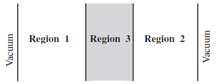

.. _section_fsc:

源收敛诊断与加速
======================

蒙卡临界计算采用裂变源迭代法，裂变源分布的收敛速度取决于系统占优比。对于高占优比
的系统（如全堆、乏燃料池），裂变源收敛可能需要数百代甚至上千代，从而导致大量计算
时间耗费在对统计结果无直接贡献的非活跃代。

.. _section_fsc_semesh:

香农熵和渐进相对熵统计
------------------------

RMC源收敛模块提供香农熵（Shannon Entropy）统计功能，定性地反映裂变源分布的收敛
趋势，帮助用户选择合理的非活跃代中子数。

香农熵的定义为：

.. math::

    H(S) = - \sum_{i} S(i) \log _2 \left( S(i) \right)

其中，:math:`S(i)` 为第 :math:`i` 个网格的裂变源份额。

RMC源收敛模块也提供渐进相对熵（Progressive Relative Entropy, PRE）统计功能。与香农熵功能类似，
PRE可以定性地反映裂变源分布的收敛趋势，帮助用户选择合理的非活跃代中子数。

相对熵的定义为：

.. math::

    D(S||Y) = \sum_{i=1}^B S(i) \log _2 \left( \frac{S(i)}{Y(i)} \right)

其中， :math:`S` 和 :math:`Y` 都是裂变源分布，:math:`S(i)` 和 :math:`Y(i)` 是第 :math:`i` 个网格的裂变源份额。
:math:`D(S||Y)` 始终非负， 且当 :math:`S = Y` 时， :math:`D(S||Y) = 0` 。

香农熵能够表征源分布的无序程度，相对熵则表征两个源分布之间的偏离程度。相对熵越大，偏离程度越大，两个源分布间的相似度越小。
相对熵可能出现无穷大的情况，因此更好地表征两个源分布之间偏离程度的量是渐进相对熵PRE。PRE的定义为：

.. math::

    PRE(j) = D(S^{(1)} || 0.5 \times (S^{(1)} + S^{(j)})) + D(S^{(j)} || 0.5 \times (S^{(1)} + S^{(j)}))

其中，:math:`S^{(j)}` 为第 :math:`j` 个迭代步的裂变源分布。

香农熵或渐进相对熵通过以下输入卡定义：

.. code-block:: none

  SeMesh [Scope = < xNum yNum zNum >]
  [Bound = <xMin xMax yMin yMax zMin zMax>]
  [PRE = <flag>]
  [Output = <flag>]

其中，

-  **SeMesh**\ 为香农熵网格输入卡的关键词。

-  **Scope**\ 选项卡指定香农熵网格在x、y、z方向的网格划分数量。\ **xNum**\ 、
   \ **yNum**\ 、\ **zNum**\ 为正整数。

-  **Bound**\ 选项卡指定香农熵网格在x、y、z方向的边界范围。若在\ **Scope**\ 选项
   卡中指定某个方向的网格划分数量为-1，则默认网格边界为（-∞，+∞），此时
   \ **Bound**\ 选项卡中相应方向的边界不产生实际意义。\ *注意，用户应保证网格范
   围能够覆盖中子跟踪区域，否则会造成香农熵的统计结果错误。*

-  **PRE**\ 选项卡指定是否计算渐进相对熵。当\ **PRE = 1**\ 时，计算渐进相对熵；
   当\ **PRE = 0**\ 时，不计算渐进相对熵（默认值）。\ *注意，
   程序只能计算香农熵或渐进相对熵，不能同时既计算香浓熵，也计算渐进相对熵。*

-  **Output**\ 选项卡指定是否输出网格中的中子源份额。
   当\ **Output = 0**\ （默认值）时，不输出中子源份额；
   当\ **Output = 1**\ 时，输出每代的中子源份额到\ **.Info.h5**\ 文件中的
   \ **convergence/source**\ 数据组中，每代数据集以代数命名。

.. _section_fsc_fet:

裂变源分布泛函展开系数统计
----------------------------

RMC源收敛模块提供统计泛函展开系数以表征裂变源分布形状的功能，
定性地反映裂变源分布形状随迭代步的变化情况，
帮助用户选择合理的非活跃代中子数。

该功能通过以下输入卡定义：

.. code-block:: none

  FET [Axis = <x y z>]
  [Bound = <x_boundary_min x_boundary_max y_boundary_min y_boundary_max z_boundary_min z_boundary_max>]

其中，

-  **FET**\ 为该功能输入卡的关键词。

-  **Axis**\ 指定裂变源分布形状的坐标轴。程序只允许从笛卡尔坐标系的x、y、z
   三种坐标轴方向上分别使用泛函展开系数表征裂变源分布形状。
   例如，若需要x和z方向的泛函展开系数以表征裂变源分布形状，
   需要指定\ **Axis = 1 0 1**\ 。

-  **Bound**\ 选项卡指定裂变源分布形状在三个方向的边界范围。
   该边界范围需要大于所有中子可能发生裂变反应的位置，
   在此基础上越小越好。
   注意，\ **boundary_min < boundary_max**\ 。
   当不需要统计某个方向时，相关的数值可以任意。
   例如，若需要x和z方向的泛函展开系数以表征裂变源分布形状，
   可以指定\ **Bound = -300 300 0 0 0 300**\ 。

需要说明的是，该选项不兼容裂变源收敛加速方法（渐进维兰德、渐进超历史方法）。

.. _section_fsc_fmmesh:

裂变矩阵统计
----------------

RMC源收敛模块还提供裂变矩阵（Fission Matrix）统计功能。基于裂变矩阵，可以诊断蒙
卡低抽样（undersampling），并计算占优比。除了使用裂变矩阵计算占优比以外，RMC还支
持基于误差传递矩阵的占优比计算方法，目前版本暂不提供。

裂变矩阵的定义为：裂变矩阵\ *F*\ 中的每个元素 :math:`F_{ij}` 表示区域 :math:`j`
中出生的中子在区域 :math:`i` 中产生裂变中子的几率。

.. math::

    F_{ij} = \frac {\int _{Vi} dr \int _{Vj} dr' f(r'\rightarrow r) s_0 (r') }
    {\int _{Vj} dr' s_0 (r')}

裂变矩阵统计卡的输入方式与香农熵统计卡类似：

.. code-block:: none

  FmMesh [Scope = < xNum yNum zNum >]
  [Bound = <xMin xMax yMin yMax zMin zMax>]

其中，

-  **FmMesh**\ 为裂变矩阵网格输入卡的关键词。

-  **Scope**\ 选项卡指定香农熵网格在x、y、z方向的网格划分数量。\ **xNum**\ 、
   \ **yNum**\ 、\ **zNum**\ 为正整数。裂变矩阵规模为
   (**xNum**\ \*\ **yNum\*zNum**)\ :sup:`2`\ ，过细的网格划分可能降低计算效率。

-  **Bound**\ 选项卡指定香农熵网格在x、y、z方向的边界范围。若在\ **Scope**\ 选项
   卡中指定某个方向的网格划分数量为-1，则默认网格边界为（-∞，+∞），此时
   \ **Bound**\ 选项卡中相应方向的边界不产生实际意义。\ *注意，用户应保证网格
   范围能够覆盖中子跟踪区域，否则会造成裂变矩阵的统计结果错误。*

.. _section_fsc_accefsc:

源收敛加速
--------------

RMC使用渐近超历史方法和渐近维兰德方法加速源收敛，减少非活跃代代数。目前版
本只提供渐近超历史加速方法。

源收敛加速功能的输入卡为：

.. code-block:: none

  AcceFsc [Factor = <f(1) p(1) f(2) p(2) …f(n) p(n)>]
          [AutoFactor = <inactive_cycle>]

其中，

-  **AcceFsc**\ 为香农熵网格输入卡的关键词。

-  **Factor**\ 选项卡和\ **AutoFactor**\ 选项卡用来指定渐近超历史加速方法的参数，
   后面将单独予以讨论。

Factor选项卡
~~~~~~~~~~~~~~~~~~

**Factor**\ 选项卡用于自定义加速参数。输入卡中的f(i)称为加速因子，p(i)称为加速周期，
其含义是：在最初的p(1)代，使用加速因子f(1)；在接下来的p(2)代，使用加速因子
f(2)；依此类推。这里不详细介绍渐近超历史加速方法的原理，仅对加速因子和加速周期
这两个参数介绍如下：

加速因子f(i)越大，加速效果越明显，但统计涨落也可能越大。用户需要定义的是一组
渐近递减的加速因子{f(i)}，譬如“16 → 8 → 4 → 2”。\ *注意，加速因子不宜过大
（建议小于20），否则可能造成不稳定。*

加速周期p(i >1)一般设置为5-10代。第一个加速周期p(1)通常设置得较大，因为它所对
应的加速因子最大，起主要的加速效果。

渐近超历史加速方法作用于最初的个非活跃代，它所产生的加速效果大致相当于未使用加速
时的个非活跃代。例如，某个全堆临界计算在未使用加速时需要大约200个非活跃代，通过
使用“factor = 16 10 8 5 4 5 2 5”加速最初的10+5+5+5=25个非活跃代，即可达到基本相
当的收敛效果。

AutoFactor选项卡
~~~~~~~~~~~~~~~~~~~~~~

作为\ **Factor**\ 选项卡的替代功能，RMC程序提供了自动生成源收敛加速参数的
\ **AutoFactor**\ 选项卡。对于普通用户，推荐使用\ **AutoFactor**\ 选项卡来代替
\ **Factor**\ 选项卡中的自定义输入。在该选项卡中，用户指定未使用加速方法时的非
活跃代代数\ **inactive_cycle**\ ，程序内部将自动生成渐近超历史方法的参数序列。
假设未使用加速方法时的非活跃代代数为N，那么使用\ **AutoFactor**\ 选项卡后的所需
非活跃代数约为：

.. math::

    N' = \frac {N}{16} + 15

例如，某全堆计算需要300代收敛，那么使用自动源收敛加速之后，所需的非活跃代可设
置为：:math:`N' = \frac {300}{16} + 15 \approx 35`。若\ **AutoFactor**\ 选项卡中
指定的非活跃代代数N小于30，程序将关闭源收敛加速功能。

源收敛加速的注意事项
~~~~~~~~~~~~~~~~~~~~~~~~~~

使用源收敛加速方法，应当在临界计算模块的PowerIter输入卡中使用合理的配套参数，包括：

1）在\ **Keff0**\ 选项卡中指定合理的初始有效增殖系数，使其接近真实Keff。

2）在\ **Population**\ 选项卡中指定足够大的每代粒子数。对于全堆临界计算，建议每
代粒子数大于100,000。

3）在\ **Population**\ 选项卡中指定合理的非活跃代代数。非活跃代代数应当大于等于
源收敛加速代数。

.. _section_fsc_example:

源收敛模块输入示例
----------------------

OECD基准题源收敛加速
~~~~~~~~~~~~~~~~~~~~~~~~~~

   OECD蒙卡源收敛基准题

:numref:`source_convergence_fig` 描述的是OECD蒙卡源收敛问题研究的一个基准题。
该基准题是由3块1维平板组成的弱
耦合系统，两侧为20cm厚的燃料区，中间为30cm水层。初始源位置位于左侧燃料区中心，
常规源迭代收敛所需的非活跃代约为1000代。通过RMC源收敛加速方法，非活跃代可减少
至100代以内。在 :numref:`source_convergence_input` 的源收敛模块中，
指定了香农熵网格数量为70，宽度为1.0cm。
该算例需要模拟的粒子数较多，推荐使用并行机完成计算。

|

.. code-block:: c
  :caption: OECD蒙卡源收敛输入
  :name: source_convergence_input

  ///// OECD MC convergence benchmark 3 . SHE Ding 2012-09-12 /////
  UNIVERSE 0
  cell 1 1 & -2 mat = 1
  cell 2 2 & -3 mat = 2
  cell 3 3 & -4 mat = 1
  cell 4 -1 : 4 void = 1

  SURFACE
  surf 1 px 0
  surf 2 px 20
  surf 3 px 50
  surf 4 px 70

  MATERIAL
  mat 1 9.9487E-02
        92235.30c 7.6864E-05
        92238.30c 6.8303E-04
        8016.30c 3.7258E-02
        1001.30c 5.9347E-02
        7014.30c 2.1220E-03
  mat 2 1.0006E-01
        1001.30c 6.6706E-02
        8016.30c 3.3353E-02

  CRITICALITY
  PowerIter population = 500000 100 1000
  InitSrc point = 10 0 0

  Tally
  Celltally 1 type = 1 cell = 1 3

  CONVERGENCE
  SeMesh Scope = 70 -1 -1 Bound = 0 70 0 1 0 1
  FmMesh Scope = 70 -1 -1 Bound = 0 70 0 1 0 1
  AcceFsc Autofactor = 1000

Hoogenboom全堆基准题源收敛加速
~~~~~~~~~~~~~~~~~~~~~~~~~~~~~~~~~~~~

:numref:`fsc_hoogenboom_input` 描述的是Hoogenboom蒙卡全堆基准题。常规源迭代收敛所需的非活跃代约为250代，
通过使用自动源收敛加速参数，非活跃代代数设置为35代。在源收敛输入模块中，定义了
建立在组件上的香农熵网格（21×21），用于帮助用户诊断源收敛趋势。该算例需要模拟的
粒子数较多，推荐使用并行机完成计算。

|

.. code-block:: c
  :caption: Hoogenboom蒙卡全堆基准题输入
  :name: fsc_hoogenboom_input

  // same model as previous

  CONVERGENCE
  SeMesh Scope = 21 21 1 Bound = -224.91 224.91 -224.91 224.91 -229 223
  AcceFsc Autofactor = 250

