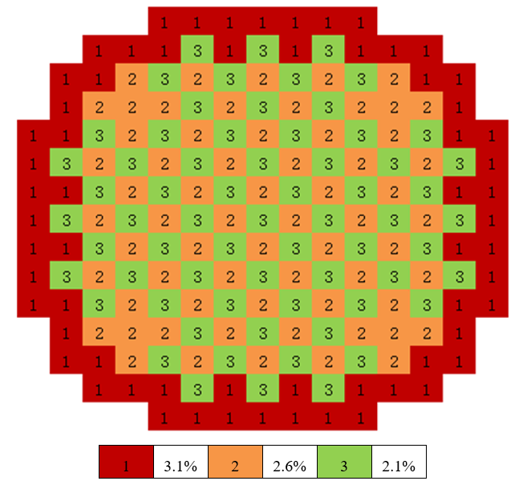

.. _section_burnup:

燃耗计算
==============

.. _section_burn_intro:

蒙卡燃耗计算概述
--------------------

蒙卡燃耗计算是蒙卡临界计算和点燃耗计算的相互耦合。传统的蒙卡燃耗程序（如MCBurn、
MCODE）一般采用第三方接口，通过外耦合的方式，循环调用蒙卡输运程序（如MCNP）和点
燃耗程序（如ORIGEN-2）。

在RMC程序当中，内嵌有自主开发的点燃耗计算模块DEPTH。DEPTH采用矩阵指数法，能够精
确、高效地处理含约1500种核素的精细燃耗链。RMC燃耗计算的基本流程是，首先通过临界
计算（连续能量）模块，得到中子通量、单群反应截面等数据，传递给点燃耗模块DEPTH；
DEPTH完成点燃耗计算，得到新的核素密度，传递给RMC临界计算模块。通过数据的往返传
递，从而完成燃耗计算的全过程。

与传统的蒙卡燃耗程序（如MCBurn，MCODE）相比，RMC燃耗计算功能的基本特点包括：

（1）含内耦合燃耗计算模块，能够处理含约1500种核素的精细燃耗链；整合了ORIGEN-S和
ORIGEN-2的最新点燃耗数据库。

（2）支持含重复结构的燃耗计算，无需用户为每个燃耗区指定不同的初始材料，大大减
少了用户输入。

（3）支持对大规模燃耗区的“并行临界+并行点燃耗”计算。在并行点燃耗计算模式中，燃耗
区被平均分配到各个进程，各自独立地完成点燃耗计算。

.. _section_burn_cards:

燃耗模块输入卡
------------------

燃耗模块的输入卡包括：

.. code-block:: none

    BURNUP
    BurnCell < cell_1 cell_2 cell_3 … >
    TimeStep <time_1 time_2 … time_n>
    BurnupStep <burnup_1 burnup_2 … burnup_n>
    Power <power_1 power_2 … power_n>
    PowerDen <powerden_1 powerden_2 … powerden_n>
    SubStep <sub_num>
    Inherent <fraction>
    AceLib <lib_type>
    Strategy [type=<flag>] [substep=<flag>]
    Solver <flag>
    Parallel <flag>
    Xeequilibrium [Skip = <params>] [Batchsize = <params>] [Powermode = <params>] [Minratio = <params>]
    OutputCell <cell_vector>
    VaryMat <step = s1 mat = m1_1 m1_2 ... m1_n newmat = new1_1 new1_2 ... new1_n
             step = s2 mat = m2_1 m2_2 ... m2_n newmat = new2_1 new2_2 ... new2_n
             ...>
    VarySurf <step = s1 surf = s1_1 s1_2 ... s1_n newsurf = news1_1 news1_2 ... news1_n
             step = s2 surf = s2_1 s2_2 ... s2_n newsurf = news2_1 news2_2 ... news2_n
             ...>
    MERGE <level=l> <univ=u_1 u_2 ...>
    SUCCESSION [Singlestep = <flag>] [ReadNuc = <flag>] [WriteNuc = <flag>]
               [FMF = <param>] [CumulativeTime = <param>] [CumulativeBurnup = <param>]
               [CellCmltvBurnup = <flag>]
    NAECF <energy>
    IMPNUC < nuc_1 nuc_2 ... nuc_n>
    FIXEDNUC <nuc_num>

其中，

-  **BURNUP**\ 为燃耗计算模块的关键词。

-  **BurnCell**\ 输入卡指定可燃耗的栅元，
   \ *输入的参数为简单栅元编号cell_i（而非层级栅元的向量形式）*\ 。程序将自动
   搜索所有底层栅元为cell_i的栅元向量，将它们视为独立的燃耗区。即每个燃耗栅元
   将自动展开生成独立的填充材料，即使它们的初始材料相同。自动展开独立燃耗区的
   功能，对于含重复结构的燃耗计算十分重要，大大减少了用户的输入负担。

-  **TimeStep**\ 输入卡指定各个燃耗步的时间步长（天）。注意这里输入的是分步时间
   ，而非累积时间。

-  **BurnupStep**\ 输入卡指定各个燃耗步的燃耗深度（MWd/tU）。注意这里输入的是
   每个燃耗步的燃耗深度而非累积燃耗深度。注意燃耗深度步长选项与时间步长选项卡不能
   同时使用。

-  **Power**\ 输入卡指定各个燃耗步的总功率（MW）。注意Power选项卡不能与PowerDen
   选项卡同时使用。

-  **PowerDen**\ 输入卡指定各个燃耗步的总功率密度（W/gHM）。程序将根据初始重金属的
   总质量得到实际总功率，并在每个燃耗步当中根据各燃耗区的功率分布得到每个燃耗区的实际功
   率。为计算初始重金属总质量和功率分布，用户应为燃耗栅元指定正确的体积。

-  **SubStep**\ 输入卡指定点燃耗计算的步数（范围1 - 9999），缺省值为10步。对
   于一般用户，不推荐使用该输入卡修改默认参数。

-  **Inherent**\ 输入卡指定用于继承重要核素的吸收份额和质量份额，缺省值分别为
   0.9999和0.999。点燃耗计算需要处理约1500种核素，临界计算显然只能（也只需）
   继承其中的一部分重要核素。继承的方式是：首先，材料卡中输入的核素始终被继承；
   然后根据其余核素在总吸收率和总质量当中所占的份额，从高到低继承，直至继承核
   素的总份额达到用户指定的份额。若用户需要特别关注某些重要核素，建议将其写在
   材料卡中，保证这些核素始终被继承。继承的核素越多，计算结果越准确，但时间和内
   存消耗也越大。注意，若只输入了一个数字，则认为输入的是吸收份额。输入值应当处于
   0.9和1.0之间。

-  **AceLib**\ 输入卡指定继承的核素所采用的数据库，例如“AceLib = .30c”。对于在材
   料卡中输入的核素，继承其原来的数据库。为保证燃耗计算的精度，用户应当根据栅
   元温度指定与之匹配的ACE数据库，且该温度点的数据库应尽量包含完整的核素清单。
   在实际的计算中，只有当燃耗生成的新的核素在ACE数据库中有相应的数据，核素才会
   被添加到栅元材料中并进行下一步的输运计算，否则会被筛选掉。在含多个温度值的燃耗计算中，
   RMC能够根据栅元温度自动匹配数据库，但目前版本暂不提供该功能。

-  **Strategy**\ 输入卡指定燃耗步策略关键词。

   -  **Type**\ 输入卡指定开始更新氙浓度的代数。\ **type = 0**\ （默认值）表示使用起点近似
      燃耗策略，\ **type = 1**\ 表示使用预估-修正燃耗步策略，该预估-修正策略基于燃耗计算中的核素
      密度，\ **type = 2**\ 表示使用预估-修正燃耗步策略，该预估-修正策略基于燃耗计算中统计的反应率，
      及单个燃耗区的单群中子通量和各核素的单群等效截面，该方法的效果与1相同，但修正思路有差异，
      \ **type = 6**\ 表示使用高阶子步预估-修正燃耗策略。该策略是高阶方法和子步方法的结合，
      通常使用较大燃耗步长就可以提供良好的计算精度，可以显著提高燃耗计算效率。

   -  **Substep**\ 输入卡指定是否使用子步方法，\ **type = 0**\ （默认值）表示不使用子步方法，
      \ **type = 1**\ （默认值）表示使用子步方法。需要注意的是，子步方法目前仅限于\ **type = 2**\ 
      和 \ **type = 6**\ 两种燃耗策略。

-  **Solver**\ 输入卡指定点燃耗方程求解方法。\ **Solver =
   1**\ 表示线性子链法，\ **Solver =
   2**\ （默认值）表示切比雪夫有理近似法，\ **Solver =
   3**\ 表示样条有理近似法，\ **Solver =
   4**\ 表示拉盖尔多项式近似法。对于一般用户，建议使用缺省参数。

-  **Parallel**\ 输入卡指定在并行临界计算时是否使用并行燃耗计算，该选项仅对RMC并
   行版本生效。\ **Parallel = 0**\ （默认值）表示不使用并行燃耗计算，
   \ **Parallel = 1**\ 表示使用并行燃耗计算。在并行燃耗计算模式下，
   燃耗区被平均分配到各个进程，各自独立地完成点燃耗计算。对于大规模燃耗
   （含大量燃耗区）计算，使用并行燃耗计算能显著减少计算时间。

-  **Xeequilibrium**\ 为氙平衡输入卡的关键词。

   -  **Skip**\ 输入卡指定开始更新氙浓度的代数。

   -  **Batchsize**\ 输入卡指定更新氙浓度的代数周期\ *L*\，即每隔\ *L*\ 代更新一次氙浓度，
      默认值是1，目前程序内可以自动调节。

   -  **Powermode**\ 输入卡指定功率模式。\ **Powermode = 1**\ （默认值）表示是
      常功率，\ **Powermode = 2**\ 表示是变功率。

   -  **Minratio**\ 输入卡指定平衡氙计算中平衡氙相关计数器非0计数的最低比例,
      根据该比例自动调整平衡氙batchsize,默认值是0.96（0.96是根据经验设置的）。

-  **Outputcell**\ 卡用于输出指定栅元的核素密度，存于后缀名为“.den”的文件中。
   此外，程序还将默认输出总原子密度，存于后缀名为“.den_tot”的文件中。

-  **VaryMat**\ 卡用于在燃耗计算中替换指定燃耗步的材料。
   
   -  **step**\ 选项指定要替换材料的燃耗步编号，从0开始。

   -  **mat**\ 选项指定被替换的材料编号。用户可以输入多个材料编号。

   -  **newmat**\ 选项指定替换成的新材料的编号。用户可以输入多个材料编号，
      新材料的数量需要与\ **mat**\ 选项中输入的材料数量一致。
   
   用户可按照上述选项，输入多组数据，从而实现指定多个燃耗步需要替换的材料。例如，

   .. code-block:: c
      
       VaryMat step = 1 mat = 4 5 newmat = 21 31
               step = 2 mat = 4 5 newmat = 22 32
               step = 3 mat = 4 5 newmat = 23 33
               step = 4 mat = 4 5 newmat = 24 34

   表示在第一步（燃耗步从0开始）将4、5号材料分别替换成21、31号材料，
   在第二步将4、5号材料分别替换成22、32号材料，
   在第三步将4、5号材料分别替换成23、33号材料，
   在第四步将4、5号材料分别替换成23、33号材料。
   注意，被替换后，原有材料的信息将完全丢失。

-  **VarySurf**\ 卡用于在燃耗计算中在指定燃耗步计算之前替换面。
    如step=1, 程序会在第一次燃耗计算结束后变换面。需要注意的是，需要谨慎使用变表面功能，
    用户需要确认更换的新的面仍然在所在模型内，避免出现模型表面不闭合导致粒子缺失的情况。
   
   -  **step**\ 选项指定要替换面的燃耗步编号，从0开始。

   -  **surf**\ 选项指定被替换的面编号。用户可以输入多个面编号。

   -  **newsurf**\ 选项指定替换成的新面的编号。用户可以输入多个面编号，
      新面的数量需要与\ **surf**\ 选项中输入的面数量一致。同时，需要注意
      的是，新面和被替换的面的类型等参数需要保持一致。
   
   用户可按照上述选项，输入多组数据，从而实现指定多个燃耗步需要替换的面。例如，

   .. code-block:: c
      
       VarySurf step = 1 surf = 4 5 newsurf = 21 31
               step = 2 surf = 4 5 newsurf = 22 32
               step = 3 surf = 4 5 newsurf = 23 33
               step = 4 surf = 4 5 newsurf = 24 34

   表示在第一步（燃耗步从0开始）将4、5号面分别替换成21、31号面，
   在第二步将4、5号面分别替换成22、32号面，
   在第三步将4、5号面分别替换成23、33号面，
   在第四步将4、5号面分别替换成23、33号面。
   注意，被替换后，原有面的信息将完全丢失。

-  **MERGE**\ 卡用于指定进行燃耗区合并的空间<universe>的几何层级<level>，
   以及指定进行燃耗区合并的空间号<univ>。
   注意：“Universe 0” 空间对应的几何层级level = 0，以此类推。燃耗区合并功能可以
   针对普通压水堆和随机介质模型。MERGE功能只能合并同一层级的多个Universe。

-  **SUCCESSION**\ 此关键词下的所有选项全部为控制燃耗接续计算的高级选项，由RMC程序自动生成，
   或由脚本自动处理，不建议用户手动输入。

   - **Singlestep**\ 表示是否仅完成一次\ **临界+燃耗**\ 计算。该选项用于燃耗
     接续计算中，开启后，即便用户输入了多个燃耗步，RMC也仅完成第0步的临界和点燃耗计算。

   - **ReadNuc**\ 用于读取上个燃耗步计算所生成的点燃耗计算的核素密度。
     0表示不读取（默认值），1表示读取。在当前版本中，只有上个燃耗步的点燃耗计算向
     **.State.h5**\ 文件输出了点燃耗计算的核素密度后（通过\ **Print**\ 
     中\ **inpfile**\ 开启）即上一步开启了**WriteNuc**功能，当前燃耗步才可以
     读取相关信息。

   - **WriteNuc**\ 用于输出当前燃耗步计算所生成的的核素（燃耗数据库中所有的核素）密度
     到.State.h5文件中。0表示不输出（默认值），1表示输出。该功能仅在用户需要使用燃耗接
     续计算功能，同时需要读取所有燃耗核素时建议开启。需要注意的是，目前的点燃耗核素接续功
     能与换料计算不兼容。

   - **FMF**\ 通量（功率）倍增因子，等于实际功率/蒙卡统计释热。用于开启氙平衡模型时的燃耗接续计算，
     该值由RMC程序在生成接续计算输入卡时计算得到。

   - **CUMULATIVETIME**\ 用于开启氙平衡模型时的燃耗接续计算，表示当前燃耗步之前已经燃耗的总时间。
     该值由RMC程序在生成接续计算输入卡时计算得到。

   - **CUMULATIVEBURNUP**\ 用于单步燃耗接续计算，表示当前燃耗步之前已经燃耗的燃耗深度。
     该值由RMC程序在生成接续计算输入卡时计算得到。

   - **CELLCMLTVBURNUP**\ 用于单步燃耗接续计算，控制读取inp.State.h5文件中前一个燃耗步输出的
     栅元燃耗信息。0（默认值）表示不读取，1（表示读取）。在单循环接续计算中，该功能由程序自动控制。
     需要注意的是，栅元燃耗深度接续与换料计算存在兼容性问题，用户在换料计算中，需要手动将接续文件中的
     该选项卡置0。

-  **NAECF**\ 卡用于指定所有燃耗栅元的中子平均能量。0(默认值)表示所有燃耗栅元的中子平均能量采用
   临界计算tally的结果。-1表示所有燃耗栅元中子平均能量强制为0.0253eV，-2表示所有燃耗栅元中子平均
   能量强制为2MeV,-3表示所有燃耗栅元中子平均能量为14MeV。如果用户输入的值大于0,表示所有燃耗栅元的
   中子平均能量为用户指定的输入。注：中子平均能量主要用于调整裂变产物产额。

-  **IMPNUC**\ 卡用于在点燃耗计算和临界计算耦合过程中对于燃耗计算的核素进行筛选，核素ID为燃耗计算
   中的核素ID，如922350。位于该卡中的所有核素将被强制筛选至临界计算的材料中去。

-  **FIXEDNUC**\ 卡用于在点燃耗计算和临界计算耦合过程中控制被筛选进入临界计算的栅元核素的数目。在
   筛选过程中，程序会根据吸收反应率或核素密度（参考**Inherent**卡）对核素进行筛选，该卡会在达到
   指定数量后，抛弃剩下的核素，用于提高临界计算的速度。

RMC燃耗计算时间项支持燃耗深度步长、时间步长输入，功率项支持总功率、功率密度输入各两种方式，
时间项和功率项可以互相配合使用（但燃耗深度和时间步长，总功率和功率密度不能同时使用）。从
实际的应用上来说，燃耗深度+总功率的输入方式更适用于反应堆全堆多循环计算。

需要指出的是，对于燃耗计算，蒙卡临界计算过程中统计大量的反应率，耗时较长；对于
大规模燃耗计算（燃耗区多达上千甚至上万），点燃耗计算本身的耗时也很长。因此，
推荐用户采用并行版本RMC计算燃耗问题，并在必要时开启并行燃耗模式
（\ **Parallel = 1**\ ）。

理论上，RMC燃耗计算支持任意数量的燃耗区，但实际上受限于计算机硬件。实测表明，
含10000个燃耗区的燃耗计算大约需要耗费1.5G内存，在此基础上每增加10000个燃耗区约
增加1G内存。

.. _section_burn_example:

燃耗模块输入示例
--------------------

PWR栅元燃耗算例
~~~~~~~~~~~~~~~~~~~~~

PWR栅元燃耗算例只包含一个燃耗区，即栅元3，温度为293.6K。燃耗历史总计包括72个燃
耗步，每个燃耗步的功率密度为30W/gHM，燃耗步长分别
为“3.333333 13.333333 16.666667 33.333333\*69”天，对应的累积燃耗深度
为“0.1 0.5 1.0 2.0 … 70.0”MWD/KgHM。

|

.. code-block:: c
  :caption: PWR栅元燃耗输入
  :name: pwrpin_burn_input

  ////// Burnup calculation of PWR pin. SHE Ding 2012-07-01 //////
  UNIVERSE 0
  cell 3 -1 mat = 1 vol = 1.0        // Fuel
  cell 4 1 & -2 mat = 3              // Air
  cell 5 2 & -3 mat = 4              // Zr
  cell 6 3 & 4 & -5 & 6 & -7 mat = 5 // water

  SURFACE
  surf 1 cz 0.4096
  surf 2 cz 0.4178
  surf 3 cz 0.4750
  surf 4 px -0.63 bc = 1
  surf 5 px 0.63  bc = 1
  surf 6 py -0.63 bc = 1
  surf 7 py 0.63  bc = 1

  MATERIAL
  mat 1 -10.196
      92235.30c 6.9100E-03
      92238.30c 2.2062E-01
      8016.30c 4.5510E-01
      34079.30c 1.0E-25 36083.30c 1.0E-25 36085.30c 1.0E-25
      38089.30c 1.0E-25 38090.30c 1.0E-25 39091.30c 1.0E-25
      40093.30c 1.0E-25 40094.30c 1.0E-25 40095.30c 1.0E-25
      40096.30c 1.0E-25 42095.30c 1.0E-25 42098.30c 1.0E-25
      42099.30c 1.0E-25 42100.30c 1.0E-25 43099.30c 1.0E-25
      44101.30c 1.0E-25 44102.30c 1.0E-25 44103.30c 1.0E-25
      44105.30c 1.0E-25 44106.30c 1.0E-25 45103.30c 1.0E-25
      45105.30c 1.0E-25 47109.30c 1.0E-25 47510.30c 1.0E-25
      47111.30c 1.0E-25 50126.30c 1.0E-25 51125.30c 1.0E-25
      51126.30c 1.0E-25 52527.30c 1.0E-25 52529.30c 1.0E-25
      53127.30c 1.0E-25 53129.30c 1.0E-25 53131.30c 1.0E-25
      53135.30c 1.0E-25 54131.30c 1.0E-25 54133.30c 1.0E-25
      54134.30c 1.0E-25 54135.30c 1.0E-25 54136.30c 1.0E-25
      55133.30c 1.0E-25 55134.30c 1.0E-25 55135.30c 1.0E-25
      55136.30c 1.0E-25 55137.30c 1.0E-25 56138.30c 1.0E-25
      56140.30c 1.0E-25 57139.30c 1.0E-25 57140.30c 1.0E-25
      58141.30c 1.0E-25 58142.30c 1.0E-25 58143.30c 1.0E-25
      58144.30c 1.0E-25 59143.30c 1.0E-25 60143.30c 1.0E-25
      60144.30c 1.0E-25 60145.30c 1.0E-25 60147.30c 1.0E-25
      60148.30c 1.0E-25 61147.30c 1.0E-25 61148.30c 1.0E-25
      61548.30c 1.0E-25 61149.30c 1.0E-25 62147.30c 1.0E-25
      62148.30c 1.0E-25 62149.30c 1.0E-25 62150.30c 1.0E-25
      62151.30c 1.0E-25 62152.30c 1.0E-25 63153.30c 1.0E-25
      63154.30c 1.0E-25 63155.30c 1.0E-25 63156.30c 1.0E-25
      64155.30c 1.0E-25 64157.30c 1.0E-25 92234.30c 1.0E-25
      92236.30c 1.0E-25 92237.30c 1.0E-25 92239.30c 1.0E-25
      92240.30c 1.0E-25 93236.30c 1.0E-25 93237.30c 1.0E-25
      93238.30c 1.0E-25 93239.30c 1.0E-25 94238.30c 1.0E-25
      94239.30c 1.0E-25 94240.30c 1.0E-25 94241.30c 1.0E-25
      94242.30c 1.0E-25 94243.30c 1.0E-25 94244.30c 1.0E-25
      95241.30c 1.0E-25 95242.30c 1.0E-25 95642.30c 1.0E-25
      95243.30c 1.0E-25 95244.30c 1.0E-25 96242.30c 1.0E-25
      96243.30c 1.0E-25 96244.30c 1.0E-25 96245.30c 1.0E-25
      96246.30c 1.0E-25 96247.30c 1.0E-25 96248.30c 1.0E-25
      96249.30c 1.0E-25 97249.30c 1.0E-25 97250.30c 1.0E-25
      98249.30c 1.0E-25 98250.30c 1.0E-25 98251.30c 1.0E-25
  mat 3 -0.001
      8016.30c 3.76622E-5
  mat 4 -6.550
      40000.60c -98.2
      50000.42c -1.5
      26000.55c -0.12
      24000.50c -0.1
      28000.50c -0.05
      8016.30c -0.13
  mat 5 9.9977E-02
      1001.30c 6.6643E-02
      8016.30c 3.3334E-02
  sab 5 lwtr.60t

  CRITICALITY
  PowerIter population = 5000 30 230 // keff0 = 1.0
  InitSrc point = 0 0 0

  BURNUP
  BurnCell 3
  TimeStep 3.333333 13.333333 16.666667 33.333333*69
  PowerDen 30*72
  Substep 10
  Inherent 0.9999
  AceLib .30c
  outputcell 3

PWR组件燃耗算例
~~~~~~~~~~~~~~~~~~~~~

:numref:`pwrassem_burn_input` 是PWR17×17组件燃耗算例，包含264个燃耗区，
采用并行燃耗计算模式（在并行调用
情况下生效）。输出四个角点位置的燃料栅元内的核素密度。该算例需要的计算量较大，推
荐使用并行机完成计算。

|

.. code-block:: c
  :caption: PWR组件燃耗输入
  :name: pwrassem_burn_input

  ////// Burnup calculation of PWR 17\*17 assembly. SHE Ding 2012-07-01 //////
  UNIVERSE 0
  CELL 1 6 & -7 & 8 & -9 mat = 0 Fill = 8 // Assembly inside
  CELL 2 -6 : 7 : -8 : 9 mat = 0 void = 1 // Assembly outside

  UNIVERSE 8 lat = 1 pitch = 1.26 1.26 1 scope = 17 17 1 fill =
             1 1 1 1 1 1 1 1 1 1 1 1 1 1 1 1 1
             1 1 1 1 1 1 1 1 1 1 1 1 1 1 1 1 1
             1 1 1 1 1 5 1 1 5 1 1 5 1 1 1 1 1
             1 1 1 5 1 1 1 1 1 1 1 1 1 5 1 1 1
             1 1 1 1 1 1 1 1 1 1 1 1 1 1 1 1 1
             1 1 5 1 1 5 1 1 5 1 1 5 1 1 5 1 1
             1 1 1 1 1 1 1 1 1 1 1 1 1 1 1 1 1
             1 1 1 1 1 1 1 1 1 1 1 1 1 1 1 1 1
             1 1 5 1 1 5 1 1 5 1 1 5 1 1 5 1 1
             1 1 1 1 1 1 1 1 1 1 1 1 1 1 1 1 1
             1 1 1 1 1 1 1 1 1 1 1 1 1 1 1 1 1
             1 1 5 1 1 5 1 1 5 1 1 5 1 1 5 1 1
             1 1 1 1 1 1 1 1 1 1 1 1 1 1 1 1 1
             1 1 1 5 1 1 1 1 1 1 1 1 1 5 1 1 1
             1 1 1 1 1 5 1 1 5 1 1 5 1 1 1 1 1
             1 1 1 1 1 1 1 1 1 1 1 1 1 1 1 1 1
             1 1 1 1 1 1 1 1 1 1 1 1 1 1 1 1 1

  UNIVERSE 1 move = 0.63 0.63 0 // Fuel rod
  cell 3 -1 mat = 1 inner = 1 tmp = 300 // Fuel
  cell 4 1 & -2 mat = 3 inner = 1 // Air
  cell 5 2 & -3 mat = 4 inner = 1 // Zr
  cell 6 3 mat = 5 // water

  UNIVERSE 5 move = 0.63 0.63 0 // Guide tube
  cell 7 -4 mat = 5 inner = 1 // water
  cell 8 4 & -5 mat = 4 inner = 1 // Air
  cell 9 5 mat = 5 // water

  SURFACE
  surf 1 cz 0.4096
  surf 2 cz 0.4178
  surf 3 cz 0.4750
  surf 4 cz 0.5690
  surf 5 cz 0.6147
  surf 6 px 0 bc = 1
  surf 7 px 21.42 bc = 1
  surf 8 py 0 bc = 1
  surf 9 py 21.42 bc = 1

  MATERIAL
  mat 1 -10.196
      92235.30c 6.9100E-03
      92238.30c 2.2062E-01
      8016.30c 4.5510E-01
      34079.30c 1.0E-25 36083.30c 1.0E-25 36085.30c 1.0E-25
      38089.30c 1.0E-25 38090.30c 1.0E-25 39091.30c 1.0E-25
      40093.30c 1.0E-25 40094.30c 1.0E-25 40095.30c 1.0E-25
      40096.30c 1.0E-25 42095.30c 1.0E-25 42098.30c 1.0E-25
      42099.30c 1.0E-25 42100.30c 1.0E-25 43099.30c 1.0E-25
      44101.30c 1.0E-25 44102.30c 1.0E-25 44103.30c 1.0E-25
      44105.30c 1.0E-25 44106.30c 1.0E-25 45103.30c 1.0E-25
      45105.30c 1.0E-25 47109.30c 1.0E-25 47510.30c 1.0E-25
      47111.30c 1.0E-25 50126.30c 1.0E-25 51125.30c 1.0E-25
      51126.30c 1.0E-25 52527.30c 1.0E-25 52529.30c 1.0E-25
      53127.30c 1.0E-25 53129.30c 1.0E-25 53131.30c 1.0E-25
      53135.30c 1.0E-25 54131.30c 1.0E-25 54133.30c 1.0E-25
      54134.30c 1.0E-25 54135.30c 1.0E-25 54136.30c 1.0E-25
      55133.30c 1.0E-25 55134.30c 1.0E-25 55135.30c 1.0E-25
      55136.30c 1.0E-25 55137.30c 1.0E-25 56138.30c 1.0E-25
      56140.30c 1.0E-25 57139.30c 1.0E-25 57140.30c 1.0E-25
      58141.30c 1.0E-25 58142.30c 1.0E-25 58143.30c 1.0E-25
      58144.30c 1.0E-25 59143.30c 1.0E-25 60143.30c 1.0E-25
      60144.30c 1.0E-25 60145.30c 1.0E-25 60147.30c 1.0E-25
      60148.30c 1.0E-25 61147.30c 1.0E-25 61148.30c 1.0E-25
      61548.30c 1.0E-25 61149.30c 1.0E-25 62147.30c 1.0E-25
      62148.30c 1.0E-25 62149.30c 1.0E-25 62150.30c 1.0E-25
      62151.30c 1.0E-25 62152.30c 1.0E-25 63153.30c 1.0E-25
      63154.30c 1.0E-25 63155.30c 1.0E-25 63156.30c 1.0E-25
      64155.30c 1.0E-25 64157.30c 1.0E-25 92234.30c 1.0E-25
      92236.30c 1.0E-25 92237.30c 1.0E-25 92239.30c 1.0E-25
      92240.30c 1.0E-25 93236.30c 1.0E-25 93237.30c 1.0E-25
      93238.30c 1.0E-25 93239.30c 1.0E-25 94238.30c 1.0E-25
      94239.30c 1.0E-25 94240.30c 1.0E-25 94241.30c 1.0E-25
      94242.30c 1.0E-25 94243.30c 1.0E-25 94244.30c 1.0E-25
      95241.30c 1.0E-25 95242.30c 1.0E-25 95642.30c 1.0E-25
      95243.30c 1.0E-25 95244.30c 1.0E-25 96242.30c 1.0E-25
      96243.30c 1.0E-25 96244.30c 1.0E-25 96245.30c 1.0E-25
      96246.30c 1.0E-25 96247.30c 1.0E-25 96248.30c 1.0E-25
      96249.30c 1.0E-25 97249.30c 1.0E-25 97250.30c 1.0E-25
      98249.30c 1.0E-25 98250.30c 1.0E-25 98251.30c 1.0E-25
  mat 3 -0.001
      8016.30c 3.76622E-5
  mat 4 -6.550
      40000.60c -98.2
  mat 5 9.9977E-02
      1001.30c 6.6643E-02
      8016.30c 3.3334E-02
  sab 5 lwtr.60t

  CRITICALITY
  PowerIter population = 2000 50 300 // keff0 = 1.0
  InitSrc point = 0.63 0.63 0

  BURNUP
  BurnCell 3
  TimeStep 3.333333 13.333333 16.666667 33.333333*69
  PowerDen 30*72
  Substep 10
  Inherent 0.9999
  AceLib .30c
  Strategy type=0
  Parallel 1
  Solver 2
  outputcell 1 > 1 > 3
             1 > 17 > 3
             1 > 273 > 3
             1 > 289 > 3

  PRINT
  mat 0
  csTally 0

PWR堆芯燃耗算例
~~~~~~~~~~~~~~~~~~~~~

   PWR堆芯布置图

压水堆二维堆芯包括193个燃料组件，组件外围为水反射层，堆芯半径（含反射层）为187.6
cm。燃料组件为17×17结构，含264根燃料棒和25个水通道。根据UO\ :sub:`2`\ 燃料富集度
的不同，燃料组件分为3.1%、2.6%和2.1%三种不同类型。堆芯内的燃料组件按照
对称方式布置，如 :numref:`burnup_core_fig` 所示。燃耗历史总计包括41个燃耗步，
每个燃耗步的功率密度
为30W/gHM，累积燃耗深度为20 MWD/KgHM。

|

.. code-block:: c
  :caption: PWR堆芯燃耗输入
  :name: pwr_core_burn_input

  /////// PWR core burnup calculation SHE Ding 2013-07-01 /////////////
  Universe 0
  cell 1 -9 fill = 11 //core inside
  cell 2 9 mat=0 void = 1 //core outside

  UNIVERSE 11 move= -224.91 -224.91 0 lat=1 pitch=21.42 21.42 1 scope=21 21 1 fill=
      8 8 8 8 8 8 8 8 8 8 8 8 8 8 8 8 8 8 8 8 8
      8 8 8 8 8 8 8 8 8 8 8 8 8 8 8 8 8 8 8 8 8
      8 8 8 8 8 8 8 8 8 8 8 8 8 8 8 8 8 8 8 8 8
      8 8 8 8 8 8 8 1 1 1 1 1 1 1 8 8 8 8 8 8 8
      8 8 8 8 8 1 1 1 3 1 3 1 3 1 1 1 8 8 8 8 8
      8 8 8 8 1 1 2 3 2 3 2 3 2 3 2 1 1 8 8 8 8
      8 8 8 8 1 2 2 2 3 2 3 2 3 2 2 2 1 8 8 8 8
      8 8 8 1 1 3 2 3 2 3 2 3 2 3 2 3 1 1 8 8 8
      8 8 8 1 3 2 3 2 3 2 3 2 3 2 3 2 3 1 8 8 8
      8 8 8 1 1 3 2 3 2 3 2 3 2 3 2 3 1 1 8 8 8
      8 8 8 1 3 2 3 2 3 2 3 2 3 2 3 2 3 1 8 8 8
      8 8 8 1 1 3 2 3 2 3 2 3 2 3 2 3 1 1 8 8 8
      8 8 8 1 3 2 3 2 3 2 3 2 3 2 3 2 3 1 8 8 8
      8 8 8 1 1 3 2 3 2 3 2 3 2 3 2 3 1 1 8 8 8
      8 8 8 8 1 2 2 2 3 2 3 2 3 2 2 2 1 8 8 8 8
      8 8 8 8 1 1 2 3 2 3 2 3 2 3 2 1 1 8 8 8 8
      8 8 8 8 8 1 1 1 3 1 3 1 3 1 1 1 8 8 8 8 8
      8 8 8 8 8 8 8 1 1 1 1 1 1 1 8 8 8 8 8 8 8
      8 8 8 8 8 8 8 8 8 8 8 8 8 8 8 8 8 8 8 8 8
      8 8 8 8 8 8 8 8 8 8 8 8 8 8 8 8 8 8 8 8 8
      8 8 8 8 8 8 8 8 8 8 8 8 8 8 8 8 8 8 8 8 8

  UNIVERSE 1 lat=1 pitch=1.26 1.26 1 scope=17 17 1 fill=
      10 10 10 10 10 10 10 10 10 10 10 10 10 10 10 10 10
      10 10 10 10 10 10 10 10 10 10 10 10 10 10 10 10 10
      10 10 10 10 10 40 10 10 40 10 10 40 10 10 10 10 10
      10 10 10 40 10 10 10 10 10 10 10 10 10 40 10 10 10
      10 10 10 10 10 10 10 10 10 10 10 10 10 10 10 10 10
      10 10 40 10 10 40 10 10 40 10 10 40 10 10 40 10 10
      10 10 10 10 10 10 10 10 10 10 10 10 10 10 10 10 10
      10 10 10 10 10 10 10 10 10 10 10 10 10 10 10 10 10
      10 10 40 10 10 40 10 10 40 10 10 40 10 10 40 10 10
      10 10 10 10 10 10 10 10 10 10 10 10 10 10 10 10 10
      10 10 10 10 10 10 10 10 10 10 10 10 10 10 10 10 10
      10 10 40 10 10 40 10 10 40 10 10 40 10 10 40 10 10
      10 10 10 10 10 10 10 10 10 10 10 10 10 10 10 10 10
      10 10 10 40 10 10 10 10 10 10 10 10 10 40 10 10 10
      10 10 10 10 10 40 10 10 40 10 10 40 10 10 10 10 10
      10 10 10 10 10 10 10 10 10 10 10 10 10 10 10 10 10
      10 10 10 10 10 10 10 10 10 10 10 10 10 10 10 10 10

  UNIVERSE 2 lat=1 pitch=1.26 1.26 1 scope=17 17 1 fill=
      20 20 20 20 20 20 20 20 20 20 20 20 20 20 20 20 20
      20 20 20 20 20 20 20 20 20 20 20 20 20 20 20 20 20
      20 20 20 20 20 40 20 20 40 20 20 40 20 20 20 20 20
      20 20 20 40 20 20 20 20 20 20 20 20 20 40 20 20 20
      20 20 20 20 20 20 20 20 20 20 20 20 20 20 20 20 20
      20 20 40 20 20 40 20 20 40 20 20 40 20 20 40 20 20
      20 20 20 20 20 20 20 20 20 20 20 20 20 20 20 20 20
      20 20 20 20 20 20 20 20 20 20 20 20 20 20 20 20 20
      20 20 40 20 20 40 20 20 40 20 20 40 20 20 40 20 20
      20 20 20 20 20 20 20 20 20 20 20 20 20 20 20 20 20
      20 20 20 20 20 20 20 20 20 20 20 20 20 20 20 20 20
      20 20 40 20 20 40 20 20 40 20 20 40 20 20 40 20 20
      20 20 20 20 20 20 20 20 20 20 20 20 20 20 20 20 20
      20 20 20 40 20 20 20 20 20 20 20 20 20 40 20 20 20
      20 20 20 20 20 40 20 20 40 20 20 40 20 20 20 20 20
      20 20 20 20 20 20 20 20 20 20 20 20 20 20 20 20 20
      20 20 20 20 20 20 20 20 20 20 20 20 20 20 20 20 20

  UNIVERSE 3 lat=1 pitch=1.26 1.26 1 scope=17 17 1 fill=
      30 30 30 30 30 30 30 30 30 30 30 30 30 30 30 30 30
      30 30 30 30 30 30 30 30 30 30 30 30 30 30 30 30 30
      30 30 30 30 30 40 30 30 40 30 30 40 30 30 30 30 30
      30 30 30 40 30 30 30 30 30 30 30 30 30 40 30 30 30
      30 30 30 30 30 30 30 30 30 30 30 30 30 30 30 30 30
      30 30 40 30 30 40 30 30 40 30 30 40 30 30 40 30 30
      30 30 30 30 30 30 30 30 30 30 30 30 30 30 30 30 30
      30 30 30 30 30 30 30 30 30 30 30 30 30 30 30 30 30
      30 30 40 30 30 40 30 30 40 30 30 40 30 30 40 30 30
      30 30 30 30 30 30 30 30 30 30 30 30 30 30 30 30 30
      30 30 30 30 30 30 30 30 30 30 30 30 30 30 30 30 30
      30 30 40 30 30 40 30 30 40 30 30 40 30 30 40 30 30
      30 30 30 30 30 30 30 30 30 30 30 30 30 30 30 30 30
      30 30 30 40 30 30 30 30 30 30 30 30 30 40 30 30 30
      30 30 30 30 30 40 30 30 40 30 30 40 30 30 30 30 30
      30 30 30 30 30 30 30 30 30 30 30 30 30 30 30 30 30
      30 30 30 30 30 30 30 30 30 30 30 30 30 30 30 30 30

  UNIVERSE 8
  cell 3 -6 mat = 5 tmp = 300
  cell 4 6 mat = 5 tmp = 300

  UNIVERSE 10 move = 0.63 0.63 0          // 3.1% Fuel rod
  cell 13 -1 mat = 10 inner = 1 tmp = 300 // Fuel
  cell 14 1 & -2 mat = 3 inner = 1        // Air
  cell 15 2 & -3 mat = 4 inner = 1        // Zr
  cell 16 3 mat = 5 tmp = 300             // water

  UNIVERSE 20 move = 0.63 0.63 0          // 2.6% Fuel rod
  cell 23 -1 mat = 20 inner = 1 tmp = 300 // Fuel
  cell 24 1 & -2 mat = 3 inner = 1        // Air
  cell 25 2 & -3 mat = 4 inner = 1        // Zr
  cell 26 3 mat = 5 tmp = 300             // water

  UNIVERSE 30 move = 0.63 0.63 0          // 2.1% Fuel rod
  cell 33 -1 mat = 30 inner = 1 tmp = 300 // Fuel
  cell 34 1 & -2 mat = 3 inner = 1        // Air
  cell 35 2 & -3 mat = 4 inner = 1        // Zr
  cell 36 3 mat = 5 tmp = 300             // water

  UNIVERSE 40 move = 0.63 0.63 0          // Guide tube
  cell 7 -4 mat = 5 inner = 1 tmp = 300   // water
  cell 8 4 & -5 mat = 4 inner = 1         // Air
  cell 9 5 mat = 5 tmp = 300              // water

  Surface
  surf 1 cz 0.4096
  surf 2 cz 0.4178
  surf 3 cz 0.4750
  surf 4 cz 0.5690
  surf 5 cz 0.6147
  surf 6 cz 900
  surf 9 cz 187.6 bc = 1

  Material
  mat 10 -10.2                            // 3.1%
      92235.30c 7.1421E-04
      92238.30c 2.2044E-02
      8016.30c 4.5515E-02
      54134.30c 1.0E-25
      54135.30c 1.0E-25
      54136.30c 1.0E-25
  mat 20 -10.2                            // 2.6%
      92235.30c 5.9902E-04
      92238.30c 2.2157E-02
      8016.30c 4.5513E-02
      54134.30c 1.0E-25
      54135.30c 1.0E-25
      54136.30c 1.0E-25
  mat 30 -10.2                            // 2.1 %
      92235.30c 4.8383E-04
      92238.30c 2.2271E-02
      8016.30c 4.5510E-02
      54134.30c 1.0E-25
      54135.30c 1.0E-25
      54136.30c 1.0E-25
  mat 3 -0.001
      8016.30c 3.76622E-5
  mat 4 -6.550
      40000.60c -98.2
  mat 5 -1.0034
      1001.30c 6.66E-02
      8016.30c 3.33E-02
  sab 5 lwtr.60t

  Criticality
  poweriter keff0=1.0 population = 500000 200 500 batch = 10
  initsrc cyl/z = 0 0 166 -1 1

  BURNUP
  BurnCell 13 23 33
  TimeStep 3.333333 13.333333 16.666667*39
  PowerDen 30 *41
  Substep 2
  Inherent 0.999 0.999
  AceLib .30c
  Strategy type=1
  Parallel 1
  Solver 2

  PRINT
  cstally 0
  mat 0

|

随机介质栅元燃耗算例
~~~~~~~~~~~~~~~~~~~~~~~~~~~

随机介质栅元燃耗算例是在 :numref:`explicit_model` 的基础上进一步计算燃耗。
需要添加的燃耗部分输入卡如下：

.. code-block:: c
  :caption: 随机介质栅元燃耗算例
  :name: implicit_model

    ///////////// Array15 Implicit Model PF=0.32 /////////////
    BURNUP
    BurnCell    60
    TimeStep    1 4 5 10*4 30*5 50*4 150*6
    PowerDen       31.9713*22
    Substep     10
    Inherent    0.9999
    AceLib      .30c
    Strategy    type=0
    Parallel    1
    Solver      2
    MERGE       2 5

