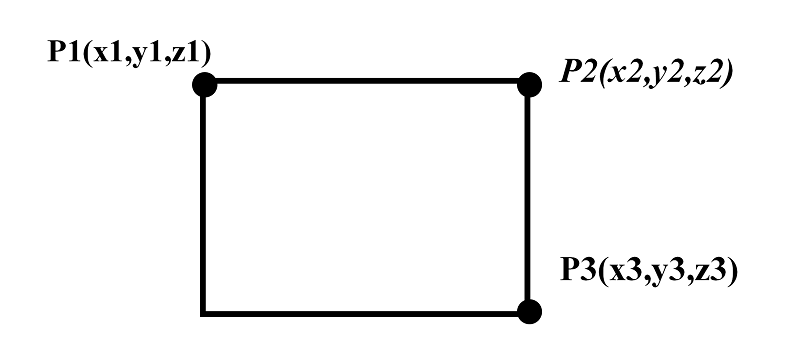
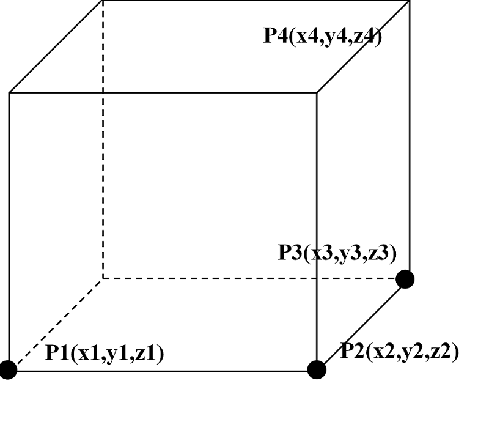

.. _section_plot:

画图
===========

RMC支持模型的二维及三维可视化显示——画图功能。二维画图指显示模型某一个切面的几何
/材料信息，程序根据用户指定的矩形位置/范围和图像尺寸，生成显示几何/材料信息的图
像（png格式，可由常用图像软件可以查看）。三维画图指显示指定长方体范围内的模型信
息（vti格式文件，可由VTK、ParaView、VisIt等三维可视化软件查看）。

两种画图模式均采用像素格式，将画图区域划分为均匀像素网格，每个网格的颜色由所在几
何位置的材料/栅元涂色。用户指定图像的像素尺寸，如二维图像包括长度和高度两个方向
的像素值，三维图像包括长、宽和高三个方向的像素值。像素尺寸越大，图像越精细，但图
像文件也越大。

对画图区域的指定采用顶点法，即由顶点确定画图范围。对于二维画图，指定左上角（P1）
、右上角（P2）及右下角（P3）顶点来确定矩形画图范围（\ **若图像垂直于坐标轴，可只
输入P1和P3两个顶点**\ ），如 :numref:`plot_2d_fig` 所示；而对于三维画图，由4个顶点确定
长方体画图范围，如 :numref:`plot_3d_fig` 所示，其中P1为参考点，P2、P3、P4分别
为沿长、宽、高三个向量方向延伸的顶点。

   二维画图-三个顶点（P1、P2、P3，或两个顶点P1、P3）确定矩形画图范围

   三维画图-四个顶点（P1、P2、P3、P4）确定长方体画图范围

.. _section_plot_cards:

画图模块输入卡
-------------------

画图模块的输入方式为：

.. code-block:: none

  PLOT
  [ColorScheme = <scheme number>] [Continue-calculation = <flag>]
  PlotID <id> Type=<type> Color=<color> Pixels= <pixel_sizes> Vertexes= <vertexes>

其中，

-  **PLOT** 画图模块的关键词。

-  **ColorScheme**\ 选项卡设置画图颜色方案（对彩色填充材料有效），\ **scheme
   number**\ 可为任意正整数，数值不同，则图像材料-色彩搭配随机变化。通过此卡可
   以调整图像颜色对比度。缺省值为\ **1**\ 。

-  **Continue-calculation**\ 选项卡用来控制画图后是否继续执行计算。\ **0**\ 表
   示跳过计算，画图后程序退出；\ **1**\ 表示画图后继续执行计算。缺省值为\ **0**\ 。

-  **PlotID**\ 选项卡指定画图参数，\ **<id>**\ 选项卡指定画图编号，用于图像标识，
   对应的输出图像文件名为\ *inputfilename*\ _plot_\ *id*\ （png或vti格式）。

-  **Type**\ 选项卡指定图像类型，可选值为\ **Slice**\ 、\ **Box**\ ，其中
   \ **Slice**\ 表示输出二维图像；\ **Box**\ 表示输出三维图像。该选项与
   \ **ColorType**\ 、**Pixels、Vertexes**\ 的一致性见 :numref:`plot_types_table` 。

-  **Color**\ 设置画图色彩样式，指对模型信息的涂色方式，包括对材料涂色及栅元涂色，
   以及根据是否画出栅元边界组合形成共五种样式：材料色彩样式（\ **Mat**\ ）、栅元
   色彩样式（\ **Cell**\ ）、边界面样式（\ **Surf**\ ）以及材料色彩栅元边界样式
   （\ **MatSurf**\ ）和栅元色彩栅元边界样式（\ **CellSurf**\ ）。其中材料/栅元色
   彩指同样栅元/材料填充相同颜色（色彩方案由\ **ColorScheme**\ 确定），
   \ **Surf**\ 指用黑色线条（1个像素宽度）画出栅元边界。

-  **Pixels**\ 指定图像像素尺寸，即对画图区域显示的分辨率。二维图
   像（\ **Slice**\ ）由长×宽两个像素值确定，三维图像（\ **Box**\ ）由长×宽×高
   三个像素值确定，像素值为正整数。像素尺寸越大，图像越精细，但同时占用内存越大。
   建议图像尺寸与画图矩形尺寸相对应，以免图像变形。

-  **Vertexes**\ 指定画图区域的顶点。每个顶点均由x/y/z三个浮点数值表示。对于二维
   图像（\ **Slice**\ ），需要两个顶点（\ **P1**\ 和\ **P3**\ ，所在面垂直于坐标
   轴，即\ **x1与x2、y1与y2、z1与z2**\ 必须有一组相同）或三个顶点（\ **P1**\ 、
   \ **P2**\ 、\ **P3**\ ，\ **P1→P2**\ 与\ **P2→P3**\ 垂直）。比
   如\ **Vertexes**\ = -15 70 20 65 10
   20表示矩形为垂直于z轴（在z=20平面上）。注意画图平面不应与用户定义的曲面重合，
   因为在平面处无法判断几何特征（程序具有一定的自动调整位置以避免与面重合的功能，
   但对于重复结构交界面等虚拟面无法判断，不能处理可能会出错）。

    对于三维图像（\ **Box**\ ），需要四个顶点（\ **P1**\ 、\ **P2**\ 、
    \ **P3、P4**\ ）确定画图区域，其中向量\ **P1→P2**\ 、\ **P2→P3、P3→P4**\ 必
    须两两垂直。如\ **Vertexes** = 0 0 0 10 0 0 10 5 0 10 5 8。

.. table:: 画图参数一致性关系
  :name: plot_types_table

  +---------+----------------------------------------+------------+--------------+
  |**Type** | **Color**                              | **Pixels** | **Vertexes** |
  +=========+========================================+============+==============+
  |**Slice**| Mat / Cell / Surf / MatSurf / CellSurf | 2 (int)    | 6 / 9 double |
  +---------+----------------------------------------+------------+--------------+
  |**Box**  | Mat / Cell / Surf*/ MatSurf*/ CellSurf*| 3 (int)    | 12 double    |
  +---------+----------------------------------------+------------+--------------+

\*注：暂不支持。

.. _section_plot_example:

画图模块输入示例
---------------------

一次运行可以画多幅图像，与图像一同输出的\ *inputfilename*.plot文件保存图像尺寸及
色彩等相关信息。

.. code-block:: c

  PLOT ColorScheme=9
  PlotID 1 Type = slice Color = Mat Pixels=900 900 Vertexes=0 20 0 20 0 0
  PlotID 2 Type = Slice Color = Cell Pixels= 1800 1265 Vertexes= 0 0 20 90 0 20 90 60 0
  PlotID 6 type = box color = Mat Pixels=100 100 200 vertexes = 0 0 0 10 0 0 10 10 0 10 10 20

